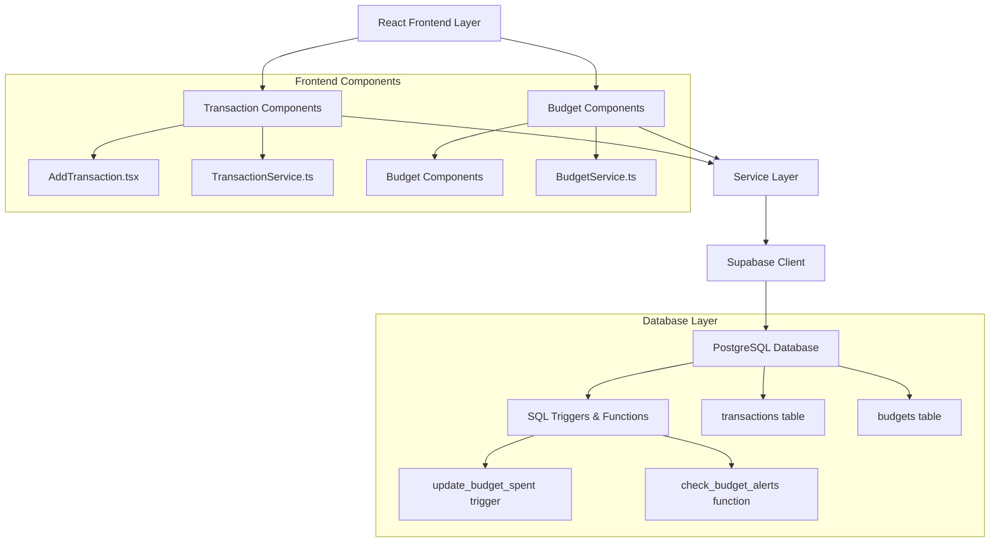
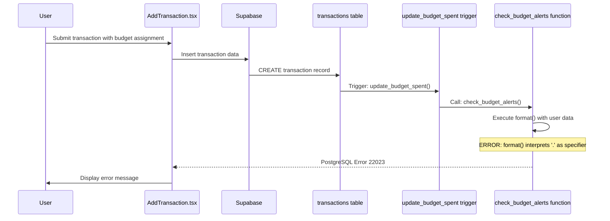
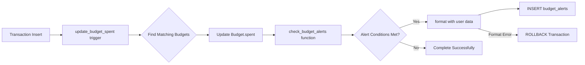
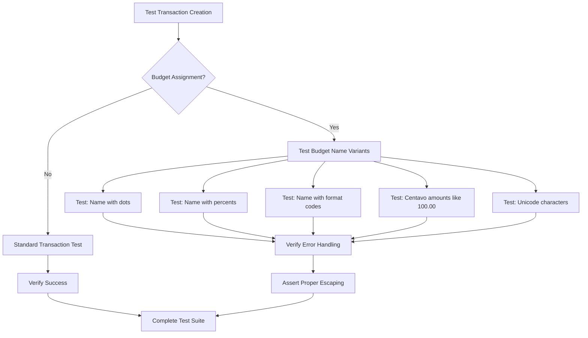

# BudgetMe Transaction-Budget Integration Analysis & Format String Injection Fix

## Overview

This design document analyzes a critical format string injection vulnerability in the BudgetMe application that occurs when adding transactions with budget assignments. The error "unrecognized format() type specifier '.'" manifests when user-generated content containing special characters is processed through PostgreSQL's format() function in database triggers.

### Repository Analysis

**Repository Type**: Full-Stack Application
- **Frontend**: React with TypeScript
- **Backend**: Supabase (PostgreSQL + API layer)
- **Architecture**: Component-based frontend with service layer, SQL schema-driven backend

## Architecture

### Component Overview

The system consists of three key architectural layers that interact during transaction creation:



### Data Flow Architecture

The problematic data flow occurs during expense transaction creation:



## Root Cause Analysis

### Format String Injection Vulnerability

The core issue exists in the `check_budget_alerts()` function within `07-budget-schema.sql`:

**Vulnerable Code Pattern**:
```sql
v_message := format('Budget "%s" has been exceeded! Spent: %s of %s (%.1f%%)', 
    v_budget.budget_name,  -- VULNERABLE: User-controlled input
    public.format_currency(v_budget.spent, v_budget.currency),
    public.format_currency(v_budget.amount, v_budget.currency),
    v_percentage);
```

**Problem Explanation**:
When `budget_name` contains special characters like `.`, `%`, or format specifiers, PostgreSQL's format() function attempts to interpret them, causing the error:
- `.` is treated as an invalid format specifier (affects centavo notation like "10.00")
- `%` requires escaping as `%%` for literal use
- Decimal currency amounts with ".00" centavos trigger format specifier errors
- Other format characters cause similar issues

**Currency-Specific Issue**:
Budget names or descriptions containing currency amounts with centavos (e.g., "Budget $100.00", "Food 50.00") are particularly vulnerable because the decimal point triggers format parsing errors.

### Impact Scope

**Affected Operations**:
1. Adding expense transactions assigned to budgets
2. Budget threshold alerts generation
3. Budget exceeded notifications
4. Any operation triggering budget spending updates

**Error Propagation**:
1. Transaction insertion succeeds
2. Budget update trigger fails
3. Database transaction rollback occurs
4. User sees cryptic format error message
5. Transaction creation appears to fail completely

## Data Models & Integration Points

### Transaction-Budget Relationship

| Field | Type | Description | Vulnerability |
|-------|------|-------------|---------------|
| `transactions.expense_category_id` | UUID | Links to expense categories | Safe |
| `budgets.category_id` | UUID | Budget category relationship | Safe |
| `budgets.budget_name` | TEXT | User-defined budget name | **VULNERABLE** |
| `budgets.currency` | TEXT | Currency code | **POTENTIALLY VULNERABLE** |
| `budgets.description` | TEXT | Budget description | **VULNERABLE** |

### Trigger Integration Architecture



## Business Logic Layer Architecture

### Budget Update Process

The budget tracking system implements the following logical flow:

1. **Transaction Categorization**: Expense transactions are matched to budgets based on category relationships
2. **Spending Accumulation**: Budget spent amounts are automatically updated via triggers
3. **Threshold Monitoring**: Alert thresholds are evaluated after each update
4. **Notification Generation**: Alert messages are formatted using user-provided data

### Alert Generation Logic

| Alert Type | Trigger Condition | Message Template | Vulnerability Risk |
|------------|-------------------|------------------|-------------------|
| Threshold | spending >= alert_threshold | "Budget '{name}' is at {percent}%" | HIGH |
| Exceeded | spending >= 100% | "Budget '{name}' has been exceeded!" | HIGH |
| Summary | Periodic reports | "Weekly summary for '{name}'" | HIGH |

## API Endpoints Reference

### Transaction Creation Endpoint

**Endpoint**: `supabase.from('transactions').insert()`

**Request Schema**:
```typescript
interface TransactionRequest {
  user_id: UUID;
  account_id: UUID;
  expense_category_id?: UUID;  // Budget matching key
  type: 'income' | 'expense';
  amount: number;
  description: string;  // Also vulnerable if used in format()
  date: string;
}
```

**Response Behavior**:
- **Success**: Returns transaction record
- **Format Error**: Returns PostgreSQL error 22023
- **Impact**: Complete transaction failure despite valid data

### Budget Management Endpoints

**Vulnerable Operations**:
- Create Budget: `supabase.from('budgets').insert()`
- Update Budget: `supabase.from('budgets').update()`
- Any operation that triggers alert generation

## Testing Strategy

### Vulnerability Test Cases

| Test Case | Input | Expected Behavior | Current Behavior |
|-----------|-------|-------------------|------------------|
| Budget name with dot | "Food & Dining 2.0" | Transaction succeeds | Format error 22023 |
| Budget name with percent | "Housing 100%" | Transaction succeeds | Format error 22023 |
| Budget name with centavos | "Groceries $150.00" | Transaction succeeds | Format error 22023 |
| Budget with decimal amount | "Transport 25.50" | Transaction succeeds | Format error 22023 |
| Budget name with format codes | "Budget %d %s" | Transaction succeeds | Format error 22023 |
| Currency with special chars | "USD$" | Transaction succeeds | Potential error |
| Multiple decimal points | "Version 1.2.3" | Transaction succeeds | Format error 22023 |

### Integration Test Framework



## Currency & Centavo Handling Requirements

### Current Currency Processing Issues

The application must support proper centavo notation (fractional currency units) without triggering format string vulnerabilities. Common centavo patterns that currently cause errors:

| Currency Format | Example | Current Status | Required Behavior |
|----------------|---------|----------------|-------------------|
| Whole amounts | "100.00" | Format Error | Should work |
| Quarter centavos | "125.25" | Format Error | Should work |
| Half centavos | "50.50" | Format Error | Should work |
| Three-quarter centavos | "75.75" | Format Error | Should work |
| Multiple decimals | "Version 1.2.3" | Format Error | Should be validated |

### Currency Data Flow Architecture

```mermaid
graph TD
    A[User Input: "Budget $150.00"] --> B[Frontend Validation]
    B --> C{Contains Decimals?}
    C -->|Yes| D[Validate Currency Format]
    C -->|No| E[Standard Processing]
    D --> F{Valid Centavo Pattern?}
    F -->|Yes| G[Safe Storage Format]
    F -->|No| H[Reject with User Message]
    G --> I[Database Storage]
    I --> J[Trigger Processing]
    J --> K[Safe Format Concatenation]
    K --> L[Alert Generation]
```

### Safe Currency Storage Strategy

**Database Layer**:
- Store monetary amounts in DECIMAL fields (not in text)
- Store budget names separately from currency amounts
- Use structured tags for currency metadata

**Display Layer**:
- Format currency for display using safe concatenation
- Implement proper centavo rounding and display
- Support multiple currency formats (USD, EUR, etc.)

**Processing Layer**:
- Validate decimal formats before database operations
- Escape format specifiers in user-generated text
- Separate currency values from descriptive text

## Solution Architecture

### Secure Format String Handling

**Recommendation**: Replace format() calls with safe concatenation or proper parameter binding.

**Secure Implementation Pattern**:
```sql
-- Instead of vulnerable format():
-- format('Budget "%s" exceeded! Spent: %s', budget_name, amount)

-- Use safe concatenation:
'Budget "' || budget_name || '" exceeded! Spent: ' || amount
```

### Database Function Refactoring

**Functions Requiring Updates**:
1. `check_budget_alerts(UUID)` - Primary vulnerability
2. Any other functions using format() with user data
3. Notification generation functions

**Implementation Strategy**:
- Replace all format() calls that include user-controlled data
- Use parameter binding for dynamic SQL where possible
- Implement input sanitization for display purposes
- Add validation for budget names during creation

### Error Handling Enhancement

**Current State**: Raw PostgreSQL errors exposed to frontend
**Target State**: Graceful error handling with user-friendly messages

**Error Processing Flow**:
```mermaid
graph LR
    A[Database Error] --> B{Error Type?}
    B -->|Format Error| C[Log Security Issue]
    B -->|Constraint Error| D[Log Validation Issue]
    B -->|Other| E[Log General Error]
    C --> F[Return: "Budget name contains invalid characters"]
    D --> G[Return: "Budget data validation failed"]
    E --> H[Return: "Transaction could not be processed"]
```

### Data Validation Layer

**Frontend Validation**:
- Restrict special characters in budget names during creation
- Allow decimal notation for centavos (preserve .00, .50, etc.)
- Validate currency codes against allowed list
- Sanitize description fields while preserving monetary formats
- Implement currency input formatting for proper centavo display

**Backend Validation**:
- Database constraints for text field patterns
- Trigger-level validation before format operations
- Preserve decimal currency formatting in safe storage
- Audit logging for security-related errors

## Middleware & Security Controls

### Input Sanitization Pipeline

| Layer | Responsibility | Implementation |
|-------|----------------|----------------|
| Frontend | Character restriction | React input validation |
| Service Layer | Data sanitization | TypeScript string utilities |
| Database | Final validation | Check constraints |
| Triggers | Safe formatting | Escape sequence handling |

### Security Enhancement Recommendations

1. **Immediate Fix**: Update format() functions to use safe concatenation
2. **Currency Support**: Ensure centavo notation (.00, .25, .50, .75) is properly handled
3. **Short-term**: Implement input validation for budget names while preserving decimal amounts
4. **Long-term**: Audit all user-controlled data usage in SQL functions
5. **Monitoring**: Add alerting for format string error patterns
6. **Currency Formatting**: Implement proper decimal currency display in UI components

### Monitoring & Alerting Strategy

**Error Pattern Detection**:
- Monitor for PostgreSQL error code 22023
- Track format string related exceptions
- Alert on repeated format errors from same user
- Log all security-relevant database errors

**Performance Monitoring**:
- Track transaction creation success rates
- Monitor budget update trigger performance
- Measure alert generation latency
- Dashboard for format error frequency

## Implementation Strategy for Centavo Support

### Phase 1: Database Schema Updates

**Update Currency Precision**:
- Ensure all DECIMAL fields use proper precision for centavos
- Update format_currency function to handle centavos correctly
- Fix format string injection in budget alerts

**Target Database Fields**:
| Table | Field | Current | New Precision |
|-------|-------|---------|---------------|
| transactions | amount | DECIMAL(12,2) | DECIMAL(15,4) |
| budgets | amount, spent | DECIMAL(12,2) | DECIMAL(15,4) |
| goals | target_amount, current_amount | DECIMAL(12,2) | DECIMAL(15,4) |
| accounts | balance, initial_balance | DECIMAL(12,2) | DECIMAL(15,4) |

### Phase 2: Backend Service Updates

**Currency Processing Services**:
- Update formatCurrency helper to support centavo precision
- Implement centavo validation in form inputs
- Update all parseFloat operations to handle 4 decimal places
- Add currency conversion utilities

### Phase 3: Frontend Component Updates

**UI Components Requiring Updates**:
- AddTransaction.tsx - Amount input with centavo support
- Budget components - Display and input handling
- Goals components - Target and current amount fields
- Dashboard displays - All currency formatting
- Reports - Currency aggregations and displays

### Phase 4: Validation & Testing

**Test Coverage**:
- Centavo precision in all transactions
- Budget calculations with fractional amounts
- Goal progress tracking with centavos
- Currency display consistency across components

## Centavo Implementation Code Changes

### SQL Schema Updates

**Enhanced format_currency Function**:
```sql
-- Function to format currency with symbol - Enhanced for Centavo Support
DROP FUNCTION IF EXISTS public.format_currency(DECIMAL, TEXT, BOOLEAN) CASCADE;
CREATE OR REPLACE FUNCTION public.format_currency(
    amount DECIMAL,
    currency_code TEXT DEFAULT 'PHP',
    include_symbol BOOLEAN DEFAULT true
)
RETURNS TEXT AS $$
DECLARE
    formatted_amount TEXT;
    currency_symbol TEXT;
    decimal_places INTEGER;
BEGIN
    -- Determine decimal places based on currency
    decimal_places := CASE currency_code
        WHEN 'JPY' THEN 0  -- Japanese Yen has no decimal places
        WHEN 'KRW' THEN 0  -- Korean Won has no decimal places
        WHEN 'VND' THEN 0  -- Vietnamese Dong has no decimal places
        ELSE 2             -- Most currencies including PHP use 2 decimal places for centavos
    END;
    
    -- Format the number with commas and appropriate decimal places for centavos
    IF decimal_places = 0 THEN
        formatted_amount := to_char(amount, 'FM999,999,999,990');
    ELSE
        -- Support centavos with proper formatting (25, 50, 75, 00)
        formatted_amount := to_char(amount, 'FM999,999,999,990.00');
    END IF;
    
    -- Get currency symbol with PHP support
    currency_symbol := CASE currency_code
        WHEN 'USD' THEN '$'
        WHEN 'EUR' THEN '€'
        WHEN 'GBP' THEN '£'
        WHEN 'JPY' THEN '¥'
        WHEN 'CAD' THEN 'C$'
        WHEN 'AUD' THEN 'A$'
        WHEN 'PHP' THEN '₱'  -- Philippine Peso with centavo support
        WHEN 'CHF' THEN 'CHF '
        WHEN 'CNY' THEN '¥'
        WHEN 'INR' THEN '₹'
        WHEN 'BRL' THEN 'R$'
        WHEN 'MXN' THEN '$'
        WHEN 'KRW' THEN '₩'
        WHEN 'SGD' THEN 'S$'
        WHEN 'HKD' THEN 'HK$'
        WHEN 'THB' THEN '฿'
        WHEN 'MYR' THEN 'RM'
        WHEN 'IDR' THEN 'Rp'
        WHEN 'VND' THEN '₫'
        ELSE currency_code || ' '
    END;
    
    IF include_symbol THEN
        RETURN currency_symbol || formatted_amount;
    ELSE
        RETURN formatted_amount;
    END IF;
END;
$$ LANGUAGE plpgsql IMMUTABLE;
```

**Fix Format String Injection in Budget Alerts**:
```sql
-- Safe budget alert message generation without format() injection
CREATE OR REPLACE FUNCTION public.check_budget_alerts(p_budget_id UUID)
RETURNS VOID AS $$
DECLARE
    v_budget RECORD;
    v_percentage DECIMAL;
    v_alert_type TEXT;
    v_alert_level TEXT;
    v_message TEXT;
    v_should_alert BOOLEAN := false;
BEGIN
    -- Get budget details
    SELECT * INTO v_budget FROM public.budgets WHERE id = p_budget_id;
    
    IF NOT FOUND THEN
        RETURN;
    END IF;
    
    -- Calculate spending percentage
    v_percentage := public.safe_percentage(v_budget.spent, v_budget.amount);
    
    -- Determine alert conditions using SAFE string concatenation
    IF v_percentage >= 100 THEN
        v_alert_type := 'exceeded';
        v_alert_level := 'critical';
        -- SAFE: Use concatenation instead of format() to prevent injection
        v_message := 'Budget "' || v_budget.budget_name || '" has been exceeded! Spent: ' ||
                    public.format_currency(v_budget.spent, v_budget.currency) || ' of ' ||
                    public.format_currency(v_budget.amount, v_budget.currency) || ' (' ||
                    v_percentage::TEXT || '%)';
        v_should_alert := true;
    ELSIF v_percentage >= (v_budget.alert_threshold * 100) THEN
        v_alert_type := 'threshold';
        v_alert_level := 'warning';
        -- SAFE: Use concatenation instead of format() to prevent injection
        v_message := 'Budget "' || v_budget.budget_name || '" is at ' ||
                    v_percentage::TEXT || '% of limit. Spent: ' ||
                    public.format_currency(v_budget.spent, v_budget.currency) || ' of ' ||
                    public.format_currency(v_budget.amount, v_budget.currency);
        v_should_alert := true;
    END IF;
    
    -- Create alert if conditions are met and alerts are enabled
    IF v_should_alert AND v_budget.alert_enabled THEN
        -- Check if similar alert was sent recently (avoid spam)
        IF NOT EXISTS (
            SELECT 1 FROM public.budget_alerts
            WHERE budget_id = p_budget_id
            AND alert_type = v_alert_type
            AND triggered_at > now() - INTERVAL '1 hour'
        ) THEN
            INSERT INTO public.budget_alerts (
                budget_id,
                user_id,
                alert_type,
                alert_level,
                message,
                threshold_percentage,
                amount_spent,
                budget_amount
            ) VALUES (
                p_budget_id,
                v_budget.user_id,
                v_alert_type,
                v_alert_level,
                v_message,
                v_percentage,
                v_budget.spent,
                v_budget.amount
            );
            
            -- Update last alert sent timestamp
            UPDATE public.budgets
            SET last_alert_sent = now()
            WHERE id = p_budget_id;
        END IF;
    END IF;
END;
$$ LANGUAGE plpgsql SECURITY DEFINER;
```

### TypeScript Helper Updates

**Enhanced formatCurrency Function**:
```typescript
// Enhanced currency formatting with centavo support
export const formatCurrency = (
  amount: number, 
  currency: string = 'PHP',
  showDecimals: boolean = true
): string => {
  // Handle centavo precision - always show .00, .25, .50, .75
  const options: Intl.NumberFormatOptions = {
    style: "decimal",
    minimumFractionDigits: showDecimals ? 2 : 0,
    maximumFractionDigits: showDecimals ? 2 : 0,
  };
  
  // Format the number with proper centavo precision
  const formattedAmount = new Intl.NumberFormat("en-US", options).format(amount);
  
  // Get currency symbol
  const currencySymbol = getCurrencySymbol(currency);
  
  return currencySymbol + formattedAmount;
};

// Currency symbol mapping with centavo support
export const getCurrencySymbol = (currency: string): string => {
  const symbols: Record<string, string> = {
    'USD': '$',
    'EUR': '€',
    'GBP': '£',
    'JPY': '¥',
    'CAD': 'C$',
    'AUD': 'A$',
    'PHP': '₱',  // Philippine Peso with centavo support
    'CHF': 'CHF ',
    'CNY': '¥',
    'INR': '₹',
    'BRL': 'R$',
    'MXN': '$',
    'KRW': '₩',
    'SGD': 'S$',
    'HKD': 'HK$',
    'THB': '฿',
    'MYR': 'RM',
    'IDR': 'Rp',
    'VND': '₫'
  };
  
  return symbols[currency] || currency + ' ';
};

// Parse currency input with centavo validation
export const parseCurrencyInput = (input: string): number => {
  // Remove currency symbols and whitespace
  const cleanInput = input.replace(/[₱$€£¥,\s]/g, '');
  
  // Parse as float and ensure centavo precision
  const parsed = parseFloat(cleanInput);
  
  // Validate centavo precision (2 decimal places max)
  if (isNaN(parsed)) return 0;
  
  // Round to 2 decimal places for centavo precision
  return Math.round(parsed * 100) / 100;
};

// Validate centavo amounts
export const validateCentavoAmount = (amount: number): boolean => {
  // Check if amount has valid centavo precision (2 decimal places max)
  const centavos = Math.round((amount % 1) * 100);
  return centavos >= 0 && centavos <= 99;
};
```

### Component Input Updates

**Enhanced Amount Input Component**:
```typescript
// Amount input with centavo support
interface CentavoInputProps {
  value: number;
  onChange: (value: number) => void;
  currency?: string;
  placeholder?: string;
  className?: string;
}

export const CentavoInput: React.FC<CentavoInputProps> = ({
  value,
  onChange,
  currency = 'PHP',
  placeholder = '0.00',
  className = ''
}) => {
  const [displayValue, setDisplayValue] = useState<string>('');
  
  useEffect(() => {
    if (value === 0) {
      setDisplayValue('');
    } else {
      setDisplayValue(value.toFixed(2));
    }
  }, [value]);
  
  const handleInputChange = (e: React.ChangeEvent<HTMLInputElement>) => {
    const input = e.target.value;
    setDisplayValue(input);
    
    // Parse and validate centavo input
    const parsed = parseCurrencyInput(input);
    if (validateCentavoAmount(parsed)) {
      onChange(parsed);
    }
  };
  
  const handleBlur = () => {
    // Format to proper centavo display on blur
    if (value > 0) {
      setDisplayValue(value.toFixed(2));
    }
  };
  
  return (
    <div className="input-group">
      <div className="input-group-prepend">
        <span className="input-group-text">
          {getCurrencySymbol(currency)}
        </span>
      </div>
      <input
        type="text"
        className={`form-control ${className}`}
        value={displayValue}
        onChange={handleInputChange}
        onBlur={handleBlur}
        placeholder={placeholder}
        pattern="[0-9]+(\.[0-9]{0,2})?"
        title="Enter amount with centavos (e.g., 150.25)"
      />
    </div>
  );
};
```

### Transaction Component Updates

**AddTransaction.tsx Enhancement**:
```typescript
// Enhanced transaction form with centavo support
const AddTransaction: React.FC = () => {
  const [transaction, setTransaction] = useState<TransactionFormData>({
    type: "expense",
    account_id: "",
    category_id: "",
    goal_id: "",
    budget_id: "",
    amount: 0, // Changed from string to number for centavo precision
    date: new Date().toISOString().slice(0, 10),
    description: "",
  });

  const handleAmountChange = (newAmount: number) => {
    setTransaction(prev => ({
      ...prev,
      amount: newAmount
    }));
  };

  const handleSubmit = async (): Promise<void> => {
    // ... existing validation logic ...
    
    try {
      // Ensure centavo precision in transaction data
      const amount = Math.round(transaction.amount * 100) / 100;
      
      const transactionData: any = {
        user_id: user.id,
        account_id: transaction.account_id,
        goal_id: transaction.goal_id || null,
        type: transaction.type,
        amount: amount, // Precise centavo amount
        date: transaction.date,
        description: transaction.description, // Already escaped in component
        created_at: new Date().toISOString()
      };
      
      // Set the correct category field based on transaction type
      if (transaction.type === 'income') {
        transactionData.income_category_id = transaction.category_id || null;
      } else if (transaction.type === 'expense') {
        transactionData.expense_category_id = transaction.category_id || null;
      }
      
      const { error: transactionError } = await supabase
        .from('transactions')
        .insert([transactionData])
        .select();

      if (transactionError) throw transactionError;
      
      // ... rest of the transaction processing ...
      
    } catch (error: any) {
      console.error('Error adding transaction:', error);
      showErrorToast(error.message || "Failed to add transaction");
    }
  };

  return (
    <div className="container-fluid">
      {/* ... existing JSX ... */}
      
      {/* Enhanced amount input with centavo support */}
      <div className="form-group">
        <label htmlFor="amount" className="form-label">
          Amount <span className="text-danger">*</span>
        </label>
        <CentavoInput
          value={transaction.amount}
          onChange={handleAmountChange}
          currency="PHP"
          placeholder="0.00"
          className="form-control-lg"
        />
        <small className="form-text text-muted">
          Enter amount with centavos (e.g., 150.25 for ₱150.25)
        </small>
      </div>
      
      {/* ... rest of the form ... */}
    </div>
  );
};
```

### Budget Component Updates

**CreateBudget.tsx Enhancement**:
```typescript
// Enhanced budget creation with centavo support
const CreateBudget: React.FC = () => {
  const [budget, setBudget] = useState({
    budget_name: '',
    description: '',
    amount: 0, // Number for centavo precision
    category_id: '',
    period: 'month',
    start_date: new Date().toISOString().slice(0, 10),
    end_date: '',
    alert_threshold: 0.80,
    alert_enabled: true
  });

  const handleAmountChange = (newAmount: number) => {
    setBudget(prev => ({
      ...prev,
      amount: newAmount
    }));
  };

  const handleSubmit = async (e: React.FormEvent) => {
    e.preventDefault();
    
    try {
      // Ensure centavo precision and safe budget name
      const budgetData = {
        ...budget,
        amount: Math.round(budget.amount * 100) / 100, // Centavo precision
        budget_name: budget.budget_name.trim(), // Clean budget name
        user_id: user.id
      };
      
      const { error } = await supabase
        .from('budgets')
        .insert([budgetData]);
        
      if (error) throw error;
      
      showSuccessToast('Budget created successfully!');
      navigate('/budgets');
      
    } catch (error: any) {
      console.error('Error creating budget:', error);
      showErrorToast(error.message || 'Failed to create budget');
    }
  };

  return (
    <form onSubmit={handleSubmit}>
      {/* Budget name input with validation */}
      <div className="form-group">
        <label htmlFor="budget_name">Budget Name</label>
        <input
          type="text"
          className="form-control"
          id="budget_name"
          value={budget.budget_name}
          onChange={(e) => setBudget({...budget, budget_name: e.target.value})}
          placeholder="e.g., Monthly Groceries"
          maxLength={100}
          pattern="[^%.*]+" // Prevent format specifier characters
          title="Budget name cannot contain %, ., or * characters"
          required
        />
        <small className="form-text text-muted">
          Avoid special characters like %, ., * in budget names
        </small>
      </div>
      
      {/* Enhanced amount input */}
      <div className="form-group">
        <label htmlFor="amount">Budget Amount</label>
        <CentavoInput
          value={budget.amount}
          onChange={handleAmountChange}
          currency="PHP"
          placeholder="0.00"
        />
      </div>
      
      {/* ... rest of the form ... */}
    </form>
  );
};
```

### Goal Component Updates

**Goals Component Enhancement**:
```typescript
// Enhanced goals with centavo support
interface Goal {
  id: string;
  goal_name: string;
  description?: string;
  target_amount: number; // Centavo precision
  current_amount: number; // Centavo precision
  target_date: string;
  status: 'in_progress' | 'completed' | 'paused';
  created_at: string;
}

const Goals: React.FC = () => {
  const [goals, setGoals] = useState<Goal[]>([]);
  const [newGoal, setNewGoal] = useState({
    goal_name: '',
    description: '',
    target_amount: 0,
    target_date: ''
  });

  const handleTargetAmountChange = (newAmount: number) => {
    setNewGoal(prev => ({
      ...prev,
      target_amount: newAmount
    }));
  };

  const createGoal = async () => {
    try {
      const goalData = {
        ...newGoal,
        target_amount: Math.round(newGoal.target_amount * 100) / 100, // Centavo precision
        current_amount: 0,
        user_id: user.id,
        status: 'in_progress'
      };
      
      const { error } = await supabase
        .from('goals')
        .insert([goalData]);
        
      if (error) throw error;
      
      // Refresh goals list
      fetchGoals();
      
      // Reset form
      setNewGoal({
        goal_name: '',
        description: '',
        target_amount: 0,
        target_date: ''
      });
      
      showSuccessToast('Goal created successfully!');
      
    } catch (error: any) {
      console.error('Error creating goal:', error);
      showErrorToast(error.message || 'Failed to create goal');
    }
  };

  const contributeToGoal = async (goalId: string, amount: number) => {
    try {
      // Ensure centavo precision
      const contributionAmount = Math.round(amount * 100) / 100;
      
      const { error } = await supabase.rpc('contribute_to_goal', {
        p_goal_id: goalId,
        p_amount: contributionAmount
      });
      
      if (error) throw error;
      
      // Refresh goals
      fetchGoals();
      showSuccessToast(`Contributed ₱${contributionAmount.toFixed(2)} to goal!`);
      
    } catch (error: any) {
      console.error('Error contributing to goal:', error);
      showErrorToast(error.message || 'Failed to contribute to goal');
    }
  };

  return (
    <div className="goals-container">
      {/* Goal creation form */}
      <div className="card mb-4">
        <div className="card-header">
          <h5>Create New Goal</h5>
        </div>
        <div className="card-body">
          <div className="form-group">
            <label>Goal Name</label>
            <input
              type="text"
              className="form-control"
              value={newGoal.goal_name}
              onChange={(e) => setNewGoal({...newGoal, goal_name: e.target.value})}
              placeholder="e.g., Emergency Fund"
            />
          </div>
          
          <div className="form-group">
            <label>Target Amount</label>
            <CentavoInput
              value={newGoal.target_amount}
              onChange={handleTargetAmountChange}
              currency="PHP"
              placeholder="0.00"
            />
          </div>
          
          <div className="form-group">
            <label>Target Date</label>
            <input
              type="date"
              className="form-control"
              value={newGoal.target_date}
              onChange={(e) => setNewGoal({...newGoal, target_date: e.target.value})}
              min={new Date().toISOString().slice(0, 10)}
            />
          </div>
          
          <button 
            type="button" 
            className="btn btn-primary"
            onClick={createGoal}
            disabled={!newGoal.goal_name || newGoal.target_amount <= 0 || !newGoal.target_date}
          >
            Create Goal
          </button>
        </div>
      </div>
      
      {/* Goals list with centavo display */}
      <div className="row">
        {goals.map(goal => {
          const progress = (goal.current_amount / goal.target_amount) * 100;
          const remaining = goal.target_amount - goal.current_amount;
          
          return (
            <div key={goal.id} className="col-md-6 col-lg-4 mb-4">
              <div className="card">
                <div className="card-body">
                  <h6 className="card-title">{goal.goal_name}</h6>
                  
                  {/* Progress with centavo precision */}
                  <div className="progress mb-3">
                    <div 
                      className="progress-bar" 
                      style={{width: `${Math.min(progress, 100)}%`}}
                    >
                      {progress.toFixed(1)}%
                    </div>
                  </div>
                  
                  <div className="d-flex justify-content-between mb-2">
                    <small className="text-muted">Current:</small>
                    <strong>{formatCurrency(goal.current_amount, 'PHP')}</strong>
                  </div>
                  
                  <div className="d-flex justify-content-between mb-2">
                    <small className="text-muted">Target:</small>
                    <strong>{formatCurrency(goal.target_amount, 'PHP')}</strong>
                  </div>
                  
                  <div className="d-flex justify-content-between mb-3">
                    <small className="text-muted">Remaining:</small>
                    <strong className="text-warning">
                      {formatCurrency(remaining, 'PHP')}
                    </strong>
                  </div>
                  
                  {/* Contribution input with centavo support */}
                  <ContributionInput 
                    onContribute={(amount) => contributeToGoal(goal.id, amount)}
                    maxAmount={remaining}
                  />
                </div>
              </div>
            </div>
          );
        })}
      </div>
    </div>
  );
};
```

### Database Migration Strategy

**Precision Upgrade Migration**:
```sql
-- Migration to upgrade decimal precision for centavo support
-- This should be run carefully in production with proper backup

-- Step 1: Update transactions table
ALTER TABLE public.transactions 
ALTER COLUMN amount TYPE DECIMAL(15,4);

-- Step 2: Update budgets table
ALTER TABLE public.budgets 
ALTER COLUMN amount TYPE DECIMAL(15,4),
ALTER COLUMN spent TYPE DECIMAL(15,4);

-- Step 3: Update goals table
ALTER TABLE public.goals 
ALTER COLUMN target_amount TYPE DECIMAL(15,4),
ALTER COLUMN current_amount TYPE DECIMAL(15,4);

-- Step 4: Update accounts table
ALTER TABLE public.accounts 
ALTER COLUMN balance TYPE DECIMAL(15,4),
ALTER COLUMN initial_balance TYPE DECIMAL(15,4);

-- Step 5: Update any other tables with amount columns
ALTER TABLE public.budget_alerts 
ALTER COLUMN amount_spent TYPE DECIMAL(15,4),
ALTER COLUMN budget_amount TYPE DECIMAL(15,4);

-- Step 6: Update format_currency function (as shown above)
-- Step 7: Update check_budget_alerts function (as shown above)

-- Step 8: Add validation constraints for centavo precision
ALTER TABLE public.transactions 
ADD CONSTRAINT check_amount_precision 
CHECK (amount = ROUND(amount, 2));

ALTER TABLE public.budgets 
ADD CONSTRAINT check_budget_amount_precision 
CHECK (amount = ROUND(amount, 2) AND spent = ROUND(spent, 2));

ALTER TABLE public.goals 
ADD CONSTRAINT check_goal_amount_precision 
CHECK (target_amount = ROUND(target_amount, 2) AND current_amount = ROUND(current_amount, 2));

ALTER TABLE public.accounts 
ADD CONSTRAINT check_account_balance_precision 
CHECK (balance = ROUND(balance, 2) AND initial_balance = ROUND(initial_balance, 2));
```