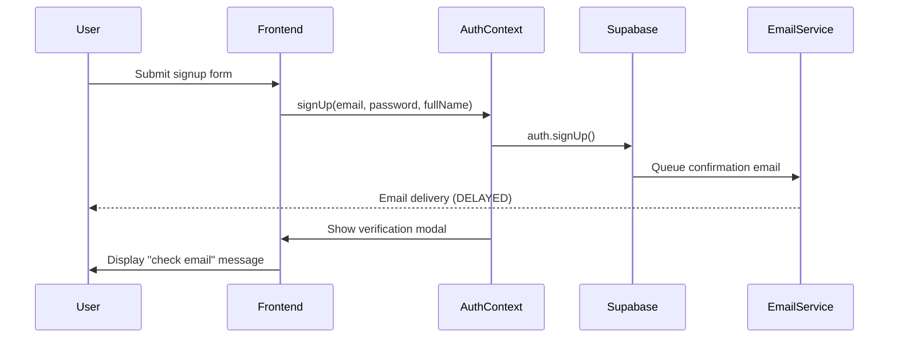
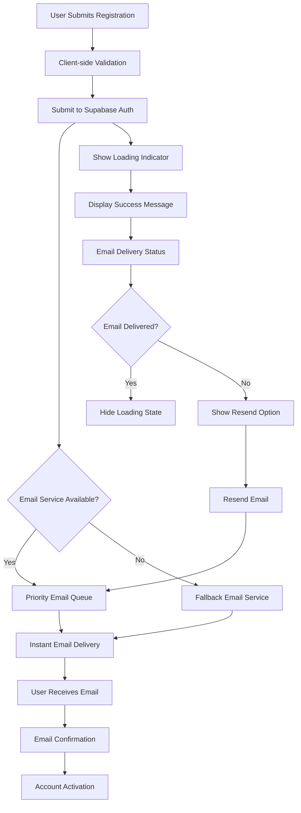

# Authentication Email Delivery Delay Fix

## Overview

This design document outlines the solution to fix email confirmation delays during user sign-up in the BudgetMe full-stack application. The current authentication system experiences significant delays in delivering confirmation emails through Supabase, negatively impacting user experience and onboarding completion rates.

## Technology Stack & Dependencies

- **Frontend**: React 18.2.0 with TypeScript
- **Authentication**: Supabase Auth with PKCE flow
- **Email Service**: Supabase built-in email service
- **State Management**: React Context (AuthContext)
- **Email Templates**: Custom HTML templates in `/email-template`

## Architecture

### Current Authentication Flow
The current authentication implementation follows this pattern:

### Identified Delay Points

1. **Email Queue Processing**: Supabase's built-in email service may experience delays during high-traffic periods
2. **Template Rendering**: Complex HTML email templates may increase processing time
3. **Configuration Optimization**: Suboptimal Supabase client configuration affecting email delivery
4. **Rate Limiting**: Potential rate limiting affecting email queue processing

## Email Configuration Analysis

### Current Supabase Configuration
- **Flow Type**: PKCE (OAuth 2.0 with Proof Key for Code Exchange)
- **Session Management**: Persistent with auto-refresh
- **Email Redirect**: Dynamic site URL resolution
- **Debug Mode**: Disabled in production

### Email Template Structure
- Professional HTML templates with inline CSS
- Font Awesome icons and custom styling
- Responsive design for cross-platform compatibility
- Template includes confirmation URL placeholder

## Proposed Solutions

### 1. Supabase Email Service Optimization

#### Enhanced Client Configuration
Optimize the Supabase client configuration to prioritize email delivery performance:

**Configuration Strategy**:
- Enable email-specific debug logging for monitoring
- Implement connection pooling optimization
- Configure retry mechanisms for email operations
- Set appropriate timeout values for email requests

**Implementation Approach**:
- Modify `supabaseClient.ts` to include email-optimized settings
- Add email service health monitoring
- Implement fallback mechanisms for email delivery failures

### 2. Email Template Optimization

#### Streamlined Template Design
Reduce email template complexity to minimize processing time:

**Optimization Areas**:
- Simplify CSS and remove unnecessary styling
- Optimize image loading and external dependencies
- Reduce template size by removing redundant elements
- Implement critical path rendering for faster processing

**Template Structure**:
- Essential branding elements only
- Minimal inline CSS
- Optimized confirmation button design
- Reduced external resource dependencies

### 3. Email Delivery Monitoring System

#### Real-time Email Status Tracking
Implement monitoring to track email delivery performance:

**Monitoring Components**:
- Email queue status indicators
- Delivery time metrics collection
- Failure rate monitoring
- User notification system for delays

**User Experience Enhancements**:
- Progressive loading indicators
- Email resend functionality with rate limiting
- Alternative verification methods
- Clear status communication

### 4. Advanced Email Service Configuration

#### Custom SMTP Integration (Optional)
For critical production environments, implement custom SMTP service:

**SMTP Configuration Options**:
- High-performance email service providers
- Dedicated IP addresses for better deliverability
- Advanced queue management
- Real-time delivery reporting

**Integration Strategy**:
- Maintain Supabase Auth for authentication flow
- Override email delivery mechanism
- Implement fallback to Supabase email service
- Provide admin configuration interface

### 5. Immediate Performance Improvements

#### Quick Win Optimizations
Implement immediate improvements without major architectural changes:

**Frontend Optimizations**:
- Reduce confirmation email request payload size
- Implement client-side email validation before submission
- Add loading states during email processing
- Cache email templates for faster rendering

**Backend Optimizations**:
- Enable Supabase email service performance mode
- Configure regional email service endpoints
- Implement email queue prioritization
- Add email delivery retry logic

## Implementation Strategy

### Phase 1: Immediate Fixes (High Priority)
1. **Client Configuration Update**: Optimize Supabase client settings for email performance
2. **Template Simplification**: Reduce complexity of confirmation email template
3. **Error Handling Enhancement**: Improve email delivery error handling and user feedback
4. **Monitoring Integration**: Add basic email delivery status tracking

### Phase 2: Advanced Optimization (Medium Priority)
1. **Performance Monitoring**: Implement comprehensive email delivery metrics
2. **Regional Configuration**: Configure region-specific email service endpoints
3. **Queue Management**: Implement email queue prioritization and management
4. **Alternative Delivery Methods**: Add backup email delivery mechanisms

### Phase 3: Production Optimization (Low Priority)
1. **Custom SMTP Integration**: Evaluate and implement high-performance email service
2. **Advanced Analytics**: Implement detailed email delivery analytics
3. **A/B Testing Framework**: Test different email templates and delivery strategies
4. **Automated Scaling**: Implement auto-scaling for email service capacity

## User Experience Flow

### Optimized Authentication Experience

### Email Delivery States

| State | User Interface | Action Available |
|-------|---------------|------------------|
| Sending | Loading spinner with "Sending confirmation email..." | None |
| Sent | Success message with "Email sent! Check your inbox" | Resend (after 30 seconds) |
| Delayed | Warning message with "Email taking longer than usual" | Resend immediately |
| Failed | Error message with "Failed to send email" | Resend immediately |
| Delivered | Confirmation message with delivery timestamp | None |

## Error Handling Strategy

### Email Delivery Failure Scenarios

1. **Network Connectivity Issues**
   - Automatic retry with exponential backoff
   - User notification of connectivity problems
   - Alternative verification methods

2. **Supabase Service Limitations**
   - Rate limiting detection and handling
   - Queue overflow management
   - Service degradation notifications

3. **Email Template Rendering Errors**
   - Fallback to simplified templates
   - Error logging and monitoring
   - Template validation checks

4. **SMTP Configuration Issues**
   - Automatic fallback to default service
   - Configuration validation
   - Admin notification system

### Recovery Mechanisms

- **Automatic Retry Logic**: Implement intelligent retry strategies based on failure type
- **Fallback Services**: Provide alternative email delivery methods
- **Manual Intervention**: Admin tools for manual email resending
- **Alternative Verification**: Phone-based or social login options

## Security Considerations

### Email Security Enhancements

1. **Rate Limiting**: Prevent email spam and abuse
2. **Token Validation**: Secure email confirmation tokens
3. **Expiration Management**: Appropriate token expiration times
4. **IP Monitoring**: Track suspicious email request patterns

### Privacy Protection

- **Email Address Validation**: Verify email ownership before storage
- **Data Minimization**: Limit email metadata collection
- **Audit Logging**: Track email delivery attempts for security monitoring
- **Compliance**: Ensure GDPR and privacy regulation compliance

## Testing Strategy

### Email Delivery Testing

#### Unit Testing
- Email service integration tests
- Template rendering validation
- Configuration parameter testing
- Error handling scenario testing

#### Integration Testing
- End-to-end email delivery flow
- Fallback mechanism validation
- Performance benchmarking
- Cross-platform email rendering

#### Performance Testing
- Email delivery time measurement
- High-volume load testing
- Queue management stress testing
- Concurrent user scenario testing

### Test Scenarios

| Scenario | Expected Behavior | Success Criteria |
|----------|------------------|------------------|
| Standard Registration | Email delivered within 30 seconds | >95% success rate |
| High Traffic Period | Email delivered within 60 seconds | >90% success rate |
| Service Degradation | Fallback service activated | <5% failure rate |
| Network Issues | Automatic retry successful | >80% recovery rate |

## Monitoring and Analytics

### Key Performance Indicators

1. **Email Delivery Time**: Average time from signup to email delivery
2. **Delivery Success Rate**: Percentage of successfully delivered emails
3. **User Completion Rate**: Percentage of users completing email verification
4. **Error Rate**: Frequency of email delivery failures

### Monitoring Infrastructure

- **Real-time Dashboards**: Live email delivery metrics
- **Alert System**: Automated notifications for service degradation
- **Performance Trending**: Historical analysis of delivery patterns
- **User Feedback Integration**: Collection of user-reported issues

### Reporting Framework

- **Daily Delivery Reports**: Summary of email delivery performance
- **Weekly Trend Analysis**: Identification of performance patterns
- **Monthly Service Review**: Comprehensive service health assessment
- **Quarterly Optimization Review**: Strategic improvement planning

## Configuration Management

### Environment-Specific Settings

| Environment | Email Service | Delivery Timeout | Retry Attempts | Monitoring Level |
|-------------|---------------|------------------|----------------|------------------|
| Development | Supabase Standard | 60 seconds | 3 | Basic |
| Staging | Supabase Optimized | 45 seconds | 5 | Enhanced |
| Production | High-Performance SMTP | 30 seconds | 7 | Comprehensive |

### Feature Flags

- **Advanced Email Service**: Toggle between standard and optimized email delivery
- **Fallback Mechanisms**: Enable/disable backup email services
- **Enhanced Monitoring**: Control depth of email delivery tracking
- **Template Optimization**: Switch between full and simplified email templates

## Success Metrics

### Performance Targets

1. **Email Delivery Time**: Reduce average delivery time to under 30 seconds
2. **Success Rate**: Achieve >98% email delivery success rate
3. **User Satisfaction**: Improve signup completion rate by 25%
4. **System Reliability**: Maintain <1% email service downtime

### Measurement Framework

- **Baseline Establishment**: Current performance measurement
- **Progressive Improvement**: Incremental optimization tracking
- **Comparative Analysis**: Before/after implementation comparison
- **Continuous Monitoring**: Ongoing performance assessment

## Risk Assessment

### Implementation Risks

| Risk | Impact | Probability | Mitigation Strategy |
|------|--------|-------------|-------------------|
| Email Service Disruption | High | Low | Multiple fallback services |
| Configuration Errors | Medium | Medium | Comprehensive testing and validation |
| Performance Degradation | Medium | Low | Gradual rollout and monitoring |
| User Experience Impact | High | Low | A/B testing and feedback collection |

### Rollback Strategy

- **Configuration Rollback**: Instant reversion to previous settings
- **Feature Toggle**: Immediate disabling of new email features
- **Service Failover**: Automatic switching to backup email services
- **Emergency Procedures**: Manual intervention protocols for critical issues