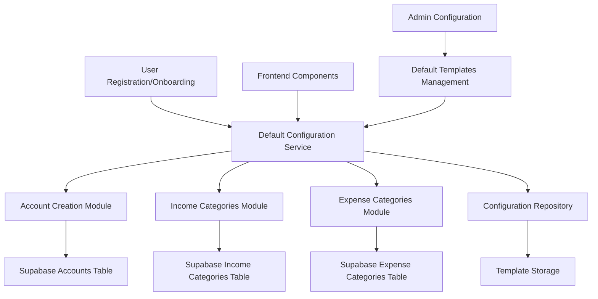
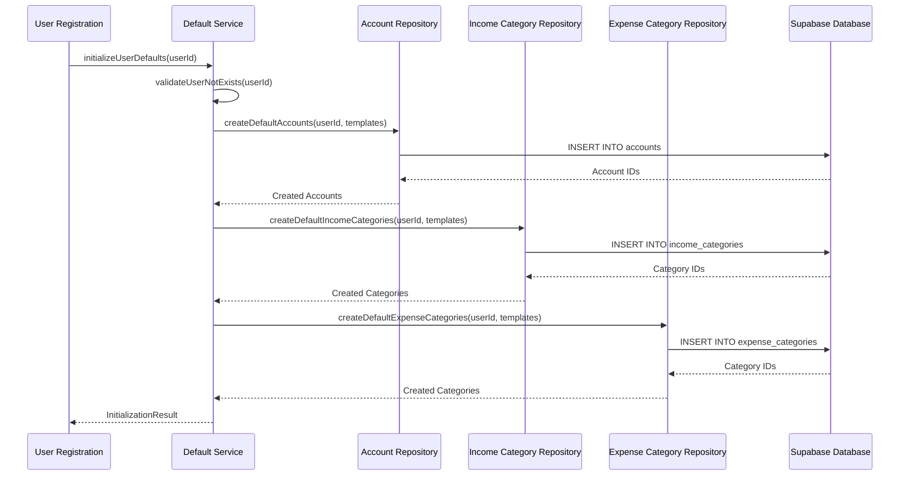
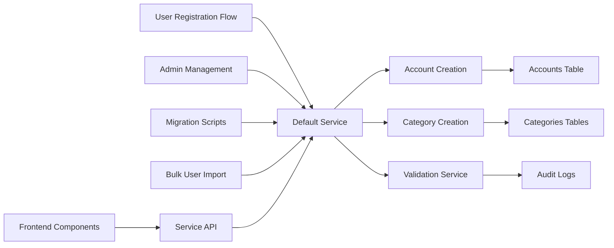
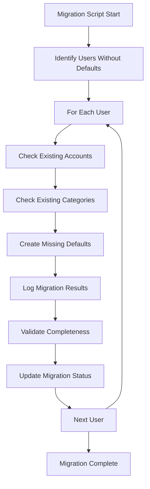

# Backend Default Configuration Service Design

## Overview

This design defines a centralized Backend Default Configuration Service that replaces SQL-based default account and category creation with a TypeScript service-based approach. Instead of requiring SQL functions and triggers to populate default data for each user account, the system will provide defaults through a dedicated backend service that can be called during user onboarding and account initialization.

The service will manage three primary default configurations:
- Default Financial Accounts (Primary Checking, Savings Account, Credit Card)
- Default Income Categories (Salary, Freelance, Investments, etc.)
- Default Expense Categories (Housing, Utilities, Groceries, etc.)

## Architecture

### Service Layer Architecture

The Default Configuration Service will be implemented as a standalone service module within the existing backend services structure, following the established pattern of other services like `transactionService.ts`, `userService.ts`, etc.



### Component Integration

The service will integrate with existing frontend components and replace hardcoded defaults currently scattered across:
- SQL schema functions (`create_default_categories`)
- Frontend mock data (`mockData.js`)
- Component default values (`Settings.tsx`, `AccountForm.tsx`)
- Database setup scripts (`setupDatabase.js`)

## Default Configuration Definitions

### Default Accounts Template

| Name | Type | Initial Balance | Status | Is Default |
|------|------|----------------|---------|-----------|
| Primary Checking | checking | 0.00 | active | true |
| Savings Account | savings | 0.00 | active | false |
| Credit Card | credit | 0.00 | active | false |

### Default Income Categories Template

| Name | Icon | Is Active | Is Default | Color |
|------|------|-----------|-----------|-------|
| Salary | cash | TRUE | TRUE | #4CAF50 |
| Freelance | briefcase | TRUE | TRUE | #4CAF50 |
| Investments | trending-up | TRUE | TRUE | #4CAF50 |
| Gifts | gift | TRUE | TRUE | #4CAF50 |
| Other Income | plus-circle | TRUE | TRUE | #4CAF50 |

### Default Expense Categories Template

| Name | Icon | Is Active | Is Default | Color |
|------|------|-----------|-----------|-------|
| Housing | home | TRUE | TRUE | #F44336 |
| Utilities | zap | TRUE | TRUE | #F44336 |
| Groceries | shopping-cart | TRUE | TRUE | #F44336 |
| Transportation | truck | TRUE | TRUE | #F44336 |
| Dining Out | coffee | TRUE | TRUE | #F44336 |
| Entertainment | film | TRUE | TRUE | #F44336 |
| Healthcare | activity | TRUE | TRUE | #F44336 |
| Education | book | TRUE | TRUE | #F44336 |
| Shopping | shopping-bag | TRUE | TRUE | #F44336 |
| Personal Care | user | TRUE | TRUE | #F44336 |
| Travel | map | TRUE | TRUE | #F44336 |
| Subscriptions | repeat | TRUE | TRUE | #F44336 |
| Other Expenses | more-horizontal | TRUE | TRUE | #F44336 |

## Service Interface Design

### Primary Service Interface

The Default Configuration Service will expose the following interface methods:

#### User Initialization Methods
- `initializeUserDefaults(userId: string): Promise<InitializationResult>`
- `createDefaultAccounts(userId: string): Promise<Account[]>`
- `createDefaultIncomeCategories(userId: string): Promise<IncomeCategory[]>`
- `createDefaultExpenseCategories(userId: string): Promise<ExpenseCategory[]>`

#### Template Management Methods
- `getAccountTemplate(): AccountTemplate[]`
- `getIncomeCategoryTemplate(): IncomeCategoryTemplate[]`
- `getExpenseCategoryTemplate(): ExpenseCategoryTemplate[]`
- `updateTemplate(templateType: TemplateType, template: Template[]): Promise<void>`

#### Validation and Utility Methods
- `validateUserHasDefaults(userId: string): Promise<ValidationResult>`
- `resetUserDefaults(userId: string): Promise<ResetResult>`
- `migrateExistingUser(userId: string): Promise<MigrationResult>`

### Data Transfer Objects

#### Configuration Templates
```typescript
interface AccountTemplate {
  account_name: string;
  account_type: 'checking' | 'savings' | 'credit' | 'investment' | 'cash' | 'other';
  initial_balance: number;
  status: 'active' | 'inactive' | 'closed';
  is_default: boolean;
  description?: string;
}

interface IncomeCategoryTemplate {
  category_name: string;
  icon: string;
  color: string;
  is_default: boolean;
  is_active: boolean;
  description?: string;
}

interface ExpenseCategoryTemplate {
  category_name: string;
  icon: string;
  color: string;
  is_default: boolean;
  is_active: boolean;
  description?: string;
  monthly_budget?: number;
}
```

#### Service Response Types
```typescript
interface InitializationResult {
  success: boolean;
  accounts_created: number;
  income_categories_created: number;
  expense_categories_created: number;
  errors?: string[];
}

interface ValidationResult {
  has_accounts: boolean;
  has_income_categories: boolean;
  has_expense_categories: boolean;
  missing_defaults: string[];
}
```

## Business Logic Layer

### Default Creation Workflow



### Error Handling Strategy

The service will implement comprehensive error handling:

- **Validation Errors**: Prevent duplicate default creation for existing users
- **Database Errors**: Handle constraint violations and connection issues
- **Partial Failures**: Track which defaults were created successfully
- **Rollback Capability**: Ability to undo partial default creation
- **Audit Logging**: Record all default creation activities

### Configuration Management

#### Template Storage Strategy
- Templates will be stored as TypeScript constants within the service module
- Future enhancement: Move templates to database table for runtime configuration
- Templates will be versioned to support migration scenarios

#### Customization Support
- Admin users can modify default templates through admin interface
- Per-organization default templates (future enhancement)
- User-specific template overrides (future enhancement)

## Data Flow Architecture

### Service Integration Points



### Database Transaction Management

The service will use database transactions to ensure atomicity:
- All default creation operations within a single transaction
- Rollback capability if any step fails
- Consistent state regardless of partial failures
- Optimistic concurrency control for template updates

## Integration with Existing Components

### Frontend Component Updates

#### Settings Components
- Remove hardcoded default account definitions
- Replace with service calls to fetch user-specific defaults
- Update account creation to use service-provided templates

#### Transaction Components
- Remove dependencies on SQL-based default categories
- Use service-provided category lists for dropdowns
- Update category creation workflows

#### Admin Components
- Add interface for managing default templates
- Provide bulk user default initialization
- Template versioning and rollback capabilities

### SQL Schema Modifications

#### Removal Strategy
The following SQL elements will be removed from `04-transactions-schema.sql`:

1. **Function Removal**
   - `create_default_categories(p_user_id UUID)` function
   - Related trigger calls to this function
   - Hardcoded INSERT statements in user creation triggers

2. **Trigger Updates**
   - Modify `handle_new_user()` trigger to call backend service instead
   - Remove embedded default creation logic
   - Maintain user profile creation functionality

3. **Table Structure Preservation**
   - Keep all existing table structures unchanged
   - Maintain all existing indexes and constraints
   - Preserve RLS policies and permissions

## Migration Strategy

### Existing User Migration



### Migration Implementation
- Batch processing for large user bases
- Progress tracking and resumable migration
- Validation of migration completeness
- Rollback capability for failed migrations
- Performance optimization for bulk operations

## Testing Strategy

### Unit Testing Requirements

#### Service Method Testing
- Template retrieval and validation
- User default creation scenarios
- Error handling and rollback scenarios
- Duplicate prevention logic
- Template customization functionality

#### Integration Testing
- Database transaction integrity
- Frontend component integration
- End-to-end user onboarding flow
- Migration script validation
- Performance under load

#### Test Data Management
- Isolated test environments
- Repeatable test scenarios
- Mock data for different user types
- Edge case validation

### Performance Testing
- Concurrent user initialization
- Bulk migration performance
- Template modification impact
- Database query optimization
- Service response times

## Security Considerations

### Access Control
- User-level access to own defaults only
- Admin-level access to template management
- Service-to-service authentication
- Audit trail for all modifications

### Data Validation
- Input sanitization for template data
- SQL injection prevention
- XSS protection for icon and description fields
- Business rule validation

### Privacy Protection
- No sensitive data in default templates
- User consent for default creation
- Data retention policies
- GDPR compliance for user data

## Performance Optimization

### Service Performance
- Connection pooling for database operations
- Caching of frequently accessed templates
- Bulk operation optimization
- Lazy loading of non-critical defaults

### Database Optimization
- Optimized indexes for default queries
- Batch insert operations
- Connection reuse strategies
- Query performance monitoring

## Monitoring and Observability

### Service Metrics
- Default creation success rates
- Template modification frequency
- Service response times
- Error occurrence tracking

### Business Metrics
- User onboarding completion rates
- Default usage patterns
- Template effectiveness analysis
- Migration success metrics

### Alerting Strategy
- Failed default creation alerts
- High error rate notifications
- Performance degradation warnings
- Template inconsistency detection