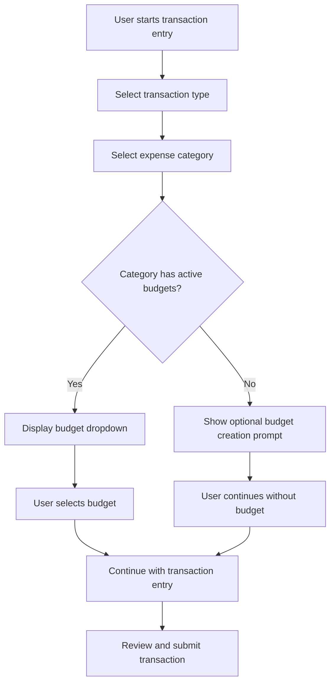
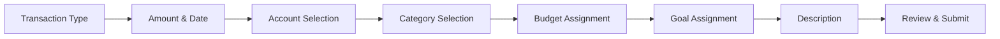
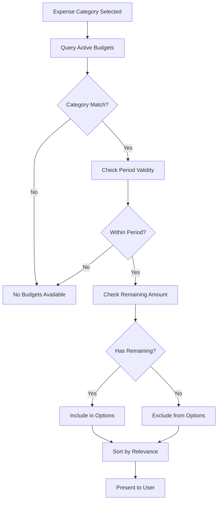

# Budget Assignment Feature Design

## Overview

This design document outlines the implementation of a budget assignment feature for the AddTransaction component, enabling users to associate transactions with specific budgets by budget name during transaction creation. This feature enhances budget tracking accuracy and provides users with better visibility into their spending against defined budgets.

## Architecture

### System Context
The budget assignment feature operates within the existing transaction management system, integrating with both the budget management module and the transaction creation workflow. This feature bridges the gap between transaction recording and budget tracking by allowing direct budget selection during transaction entry.

### Component Integration
The feature extends the AddTransaction component with budget selection capabilities while maintaining backward compatibility with existing transaction workflows. It leverages the established budget data structure and expense category relationships.

## Budget Selection Interface

### Budget Dropdown Component
The budget assignment interface consists of a dropdown selection component integrated into the transaction form between the category selection and goal selection fields.

#### Budget Data Structure
| Field | Type | Description |
|-------|------|-------------|
| budget_id | UUID | Unique identifier for the budget |
| budget_name | TEXT | User-defined budget name for display |
| amount | DECIMAL | Total budget allocation |
| spent | DECIMAL | Current amount spent against budget |
| remaining | DECIMAL | Calculated remaining budget amount |
| category_id | UUID | Associated expense category |
| category_name | TEXT | Category name for context |
| period | TEXT | Budget period (month/quarter/year) |
| status | TEXT | Budget status (active/paused/completed) |

#### Selection Criteria
The budget dropdown displays only budgets that meet the following criteria:
- Budget status is 'active'
- Current date falls within budget period (start_date ≤ current_date ≤ end_date)
- Budget belongs to the authenticated user
- For expense transactions: budget category matches selected expense category
- Budget has remaining allocation (amount - spent > 0)

### User Experience Flow

#### Budget Selection Process

#### Budget Information Display
When a budget is selected, the interface displays:
- Budget name and current utilization
- Remaining budget amount
- Percentage of budget used
- Visual indicator of budget health (green/yellow/red)

## Data Integration

### Budget Retrieval Logic
The component fetches available budgets using the following service integration approach:

#### Primary Data Source
Utilize the existing BudgetService to retrieve user budgets with enhanced filtering for transaction-relevant budgets.

#### Fallback Strategy
Implement a cascading fallback mechanism:
1. Budget details view (primary)
2. Budget table with category join
3. Budget table only (minimal data)
4. Error state with graceful degradation

### Transaction-Budget Relationship

#### Database Schema Enhancement
The existing transactions table includes a budget relationship through category mapping. The feature leverages this indirect relationship while providing explicit budget tracking.

#### Budget Impact Tracking
When a transaction is assigned to a budget:
- Automatic budget spent amount update via existing triggers
- Budget threshold alert evaluation
- Budget progress recalculation
- Family budget impact (if applicable)

## Form Integration

### Enhanced Transaction Form Structure

### Validation Rules
| Field | Validation Rule | Error Message |
|-------|----------------|---------------|
| Budget Selection | Must be active and within period | "Selected budget is not currently active" |
| Amount vs Budget | Transaction amount ≤ remaining budget | "Transaction exceeds remaining budget" |
| Category Match | Budget category must match expense category | "Budget category does not match transaction category" |

### Warning System
The interface provides contextual warnings:
- **Budget Threshold Warning**: Display when transaction would exceed 80% of budget
- **Budget Overrun Alert**: Show when transaction would exceed total budget
- **Period Expiry Notice**: Indicate when budget period is ending soon

## API Integration

### Budget Retrieval Endpoint
The component integrates with existing budget service methods:

#### Service Method Enhancement
Extend BudgetService with transaction-specific budget retrieval:
- Filter by category compatibility
- Include budget utilization calculations
- Sort by relevance (remaining amount, proximity to threshold)

### Transaction Creation Enhancement
Modify transaction creation to include budget context:
- Include budget reference in transaction metadata
- Trigger budget update calculations
- Generate budget impact notifications

## User Interface Elements

### Budget Selector Design
The budget dropdown interface includes:

#### Visual Elements
- Budget name as primary text
- Category name as secondary text
- Progress bar showing budget utilization
- Remaining amount display
- Status indicator icon

#### Interaction States
- Default: "Select Budget (Optional)"
- Loading: "Loading budgets..."
- Empty: "No active budgets for this category"
- Error: "Unable to load budgets"

### Budget Information Panel
A collapsible information panel displays:
- Selected budget details
- Current spending progress
- Projected impact of current transaction
- Related budget performance metrics

## Error Handling

### Error Scenarios
| Scenario | Response | User Action |
|----------|----------|-------------|
| No budgets available | Show optional creation prompt | Continue without budget |
| Budget loading failure | Display error with retry option | Retry or continue |
| Budget assignment failure | Show warning, allow override | Proceed with fallback |
| Budget overrun | Display confirmation dialog | Confirm or modify amount |

### Graceful Degradation
- Budget assignment remains optional
- Transaction creation succeeds without budget
- Error states do not block transaction flow
- Offline capability with sync on reconnection

## Business Logic

### Budget Matching Algorithm

### Budget Impact Calculation
Real-time calculation of budget impact:
- Immediate: Remaining amount after transaction
- Percentage: Updated utilization percentage
- Status: New budget health status
- Alerts: Threshold crossing notifications

## Testing Strategy

### Component Testing
- Budget dropdown rendering with various data states
- Category-budget filtering logic
- Form validation with budget constraints
- Error state handling and recovery

### Integration Testing
- Budget service integration
- Transaction creation with budget assignment
- Budget update trigger verification
- Cross-module communication validation

### User Acceptance Testing
- Transaction creation workflow with budget selection
- Budget impact visibility and accuracy
- Error scenarios and user guidance
- Performance with large budget datasets
