# Budget Setup Modal Data Persistence Fix

## Overview

The BudgetSetupModal component currently lacks proper data persistence implementation. After users complete budget or transaction setup, the data is not being saved to the database. This design document outlines the systematic approach to implement proper data persistence by analyzing and replicating the successful patterns used in AddTransaction and CreateBudget components.

## Architecture

### Current Data Flow Problem

```mermaid
graph TD
    A[User Completes Setup] --> B[handleSubmit Called]
    B --> C[handleSubmitWrapper Called]
    C --> D[onBudgetCreated Callback]
    D --> E[Modal Closes]
    E --> F[No Data Persisted ❌]
```



### Target Data Flow Solution


## Core Issues Identified

### 1. Missing Database Persistence Logic
The modal currently relies on callback functions (`onBudgetCreated`, `onSubmit`) without implementing actual database operations. The `handleSubmitWrapper` only triggers callbacks but doesn't persist data to Supabase.

### 2. Service Layer Integration Gaps
Unlike AddTransaction and CreateBudget components that use direct Supabase calls and service methods, BudgetSetupModal lacks integration with:
- BudgetService for budget creation
- TransactionService for transaction creation
- Account balance updates
- Goal progress updates

### 3. Validation and Error Handling
The modal lacks comprehensive server-side validation and error handling that exists in the working components.

## Data Models & Database Schema

### Budget Data Structure
| Field | Type | Description | Required |
|-------|------|-------------|----------|
| budget_name | string | Budget identifier | Yes |
| category_id | string | Expense category reference | Yes |
| amount | number | Budget allocation amount | Yes |
| period | string | month/quarter/year | Yes |
| start_date | string | YYYY-MM format | Yes |
| end_date | string | Calculated from period | Auto |
| user_id | string | User reference | Auto |
| spent | number | Initial spent amount | Default: 0 |
| currency | string | Currency code | Default: PHP |
| alert_enabled | boolean | Alert notifications | Default: true |
| alert_threshold | number | Warning threshold | Default: 0.8 |

### Transaction Data Structure
| Field | Type | Description | Required |
|-------|------|-------------|----------|
| type | string | income/expense/contribution | Yes |
| amount | number | Transaction amount | Yes |
| account_id | string | Account reference | Yes |
| category_id | string | Category reference | Yes |
| date | string | Transaction date | Yes |
| description | string | Transaction description | Yes |
| goal_id | string | Goal reference | Optional |
| user_id | string | User reference | Auto |

## Business Logic Layer

### Workflow-Based Persistence Strategy

#### Budget-First Workflow
1. **Primary Operation**: Create budget using BudgetService.createBudget
2. **Secondary Operation**: If transaction data exists and is valid, create transaction
3. **Account Updates**: Update account balance for transactions
4. **Goal Updates**: Update goal progress if transaction targets a goal

#### Transaction-First Workflow  
1. **Primary Operation**: Create transaction using TransactionService.createTransaction
2. **Account Updates**: Update account balance immediately
3. **Goal Updates**: Update goal progress if applicable
4. **Budget Generation**: Optionally suggest or create budget based on transaction category

### Validation Rules

#### Budget Validation
- Budget name must be non-empty and sanitized (no format string characters)
- Category must exist and belong to user
- Amount must be positive number within DECIMAL(15,4) limits
- Period must be valid (month/quarter/year)
- Start date must be valid YYYY-MM format

#### Transaction Validation
- Type must match category type (income categories for income, expense categories for expense/contribution)
- Amount must be positive and within safe precision limits
- Account must exist and belong to user
- Account must have sufficient balance for expense/contribution transactions
- Goal reference must be valid if provided

### Error Handling Strategy

#### Database Operation Errors
- Wrap all Supabase operations in try-catch blocks
- Provide user-friendly error messages via toast notifications
- Log detailed error information for debugging
- Implement graceful degradation for non-critical operations

#### Validation Errors
- Client-side validation before submission
- Server-side validation as backup
- Clear error messaging with field-specific guidance
- Prevention of form submission with invalid data

## API Integration Layer

### Service Method Integration

#### BudgetService Integration
```typescript
// Budget creation with comprehensive error handling
const budgetResult = await BudgetService.getInstance().createBudget({
  budget_name: sanitizeBudgetName(budgetData.budget_name),
  category_id: budgetData.category_id,
  amount: roundToCentavo(budgetData.amount),
  period: budgetData.period,
  start_date: budgetData.start_date,
  end_date: calculateEndDate(budgetData.start_date, budgetData.period),
  alert_threshold: budgetData.alert_threshold || 0.8
}, user.id);
```

#### TransactionService Integration
```typescript
// Transaction creation with goal validation
const transactionResult = await TransactionService.createTransaction({
  user_id: user.id,
  type: transactionData.type,
  amount: roundToCentavo(transactionData.amount),
  account_id: transactionData.account_id,
  date: transactionData.date,
  description: sanitizeBudgetName(transactionData.description),
  [transactionData.type === 'income' ? 'income_category_id' : 'expense_category_id']: transactionData.category_id,
  goal_id: transactionData.goal_id || null
});
```

### Account Balance Management
Following AddTransaction pattern for account balance updates:
- Use RPC functions where available (`update_account_balance`)
- Implement fallback to direct table updates
- Handle income (positive) vs expense/contribution (negative) balance changes
- Validate sufficient funds before expense transactions

### Goal Progress Updates
Following AddTransaction pattern for goal progress:
- Use RPC functions where available (`update_goal_progress`)  
- Implement fallback to direct table updates
- Update goal status when target is reached
- Handle goal completion notifications

## Data Persistence Implementation Strategy

### Phase 1: Core Database Operations
1. Replace callback-based submission with direct database persistence
2. Implement BudgetService.createBudget integration
3. Implement TransactionService.createTransaction integration
4. Add proper error handling and user feedback

### Phase 2: Account and Goal Integration
1. Implement account balance updates for transactions
2. Implement goal progress updates for contribution transactions
3. Add transaction validation against account balances
4. Add goal validation and progress tracking

### Phase 3: Advanced Features
1. Implement budget impact calculation for transactions
2. Add budget threshold warnings during transaction creation
3. Implement real-time data updates after persistence
4. Add comprehensive logging and analytics

### Persistence Workflow Logic

#### Budget-First Workflow Implementation


#### Transaction-First Workflow Implementation


## Testing Strategy

### Unit Testing Requirements
- Test budget creation with valid and invalid data
- Test transaction creation with various scenarios
- Test account balance calculation accuracy
- Test goal progress updates
- Test error handling for database failures
- Test validation logic for all input combinations

### Integration Testing Requirements  
- Test complete budget-first workflow end-to-end
- Test complete transaction-first workflow end-to-end
- Test error recovery and rollback scenarios
- Test concurrent user operations
- Test modal state management during persistence operations

### User Acceptance Testing Criteria
- Users can successfully create budgets that persist in database
- Users can successfully create transactions that update account balances
- Users receive appropriate feedback for successful and failed operations
- Users cannot create invalid budgets or transactions
- Modal behavior matches CreateBudget and AddTransaction components

## Implementation Validation

### Success Criteria
1. **Data Persistence**: All budget and transaction data successfully saves to database
2. **Account Updates**: Account balances accurately reflect transaction impacts  
3. **Goal Tracking**: Goal progress updates correctly for contribution transactions
4. **Error Handling**: Users receive clear feedback for all error conditions
5. **Consistency**: Modal behavior matches existing component patterns
6. **Performance**: Database operations complete within acceptable time limits

### Rollback Strategy
If implementation issues arise:
1. Maintain existing callback-based interface as fallback
2. Add feature flags to control new persistence logic
3. Implement graceful degradation for service failures
4. Provide clear migration path for existing integrations

This design provides a comprehensive framework for implementing robust data persistence in the BudgetSetupModal while maintaining consistency with the existing application architecture and user experience patterns.