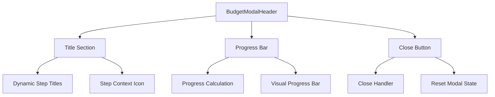
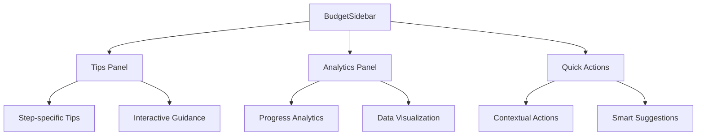
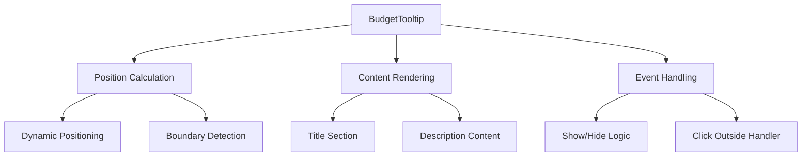
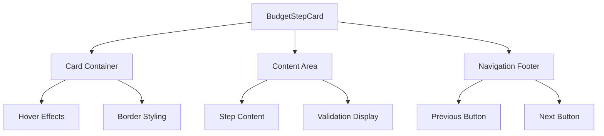
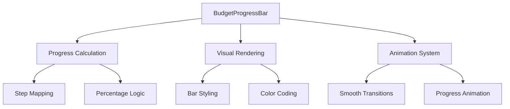
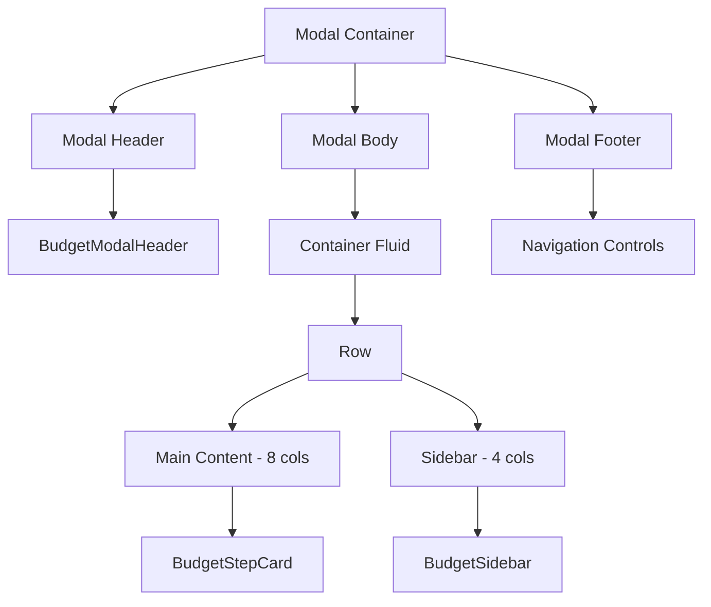
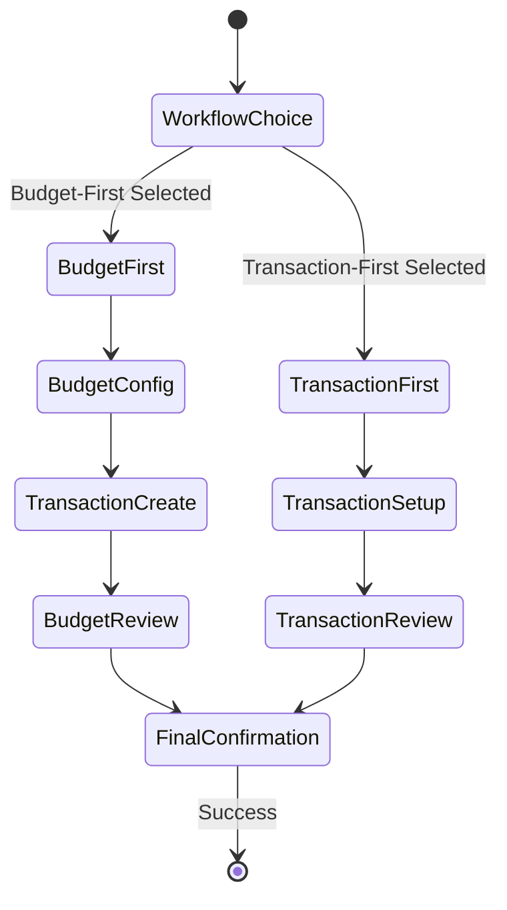
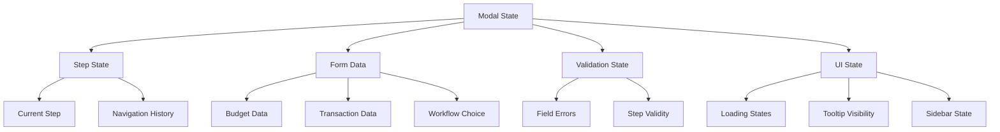

# Budget Modal Refactor Design

## Overview

This design document outlines the comprehensive refactoring of the BudgetSetupModal component to replicate the design elements, layout structure, styling patterns, and interactive behaviors from the ContributionModal while maintaining all existing functionality and breaking the monolithic component into smaller, reusable components.

## Architecture

### Component Decomposition Strategy

The current monolithic BudgetSetupModal will be decomposed into the following reusable components:

| Component | Responsibility | Location |
|-----------|----------------|----------|
| BudgetModalHeader | Modal title, progress tracking, close functionality | `src/components/budget/components/BudgetModalHeader.tsx` |
| BudgetSidebar | Tips panel, analytics, guidance content | `src/components/budget/components/BudgetSidebar.tsx` |
| BudgetTooltip | Interactive help tooltips with positioning | `src/components/budget/components/BudgetTooltip.tsx` |
| BudgetStepCard | Individual step content containers | `src/components/budget/components/BudgetStepCard.tsx` |
| BudgetProgressBar | Visual progress indication | `src/components/budget/components/BudgetProgressBar.tsx` |

### Design Pattern Alignment

The refactored components will adopt the ContributionModal's proven design patterns:

1. **Multi-step Layout Structure**: Left content area (8 columns) with right sidebar (4 columns)
2. **Interactive Visual Elements**: Hover effects, animations, and state indicators
3. **Color-coded Progress System**: Visual cues for different states and priorities
4. **Contextual Help System**: Integrated tooltips and guidance panels
5. **Responsive Card-based Design**: Consistent spacing and elevation principles

## Component Architecture

### BudgetModalHeader Component

**Purpose**: Manages the modal header section with dynamic titles, progress tracking, and close functionality

**Key Features**:
- Dynamic title generation based on current step
- Integrated progress bar with smooth transitions
- Consistent close button positioning and behavior
- Step-specific iconography
- Progress percentage calculation and display

**Props Interface**:
| Prop | Type | Description |
|------|------|-------------|
| currentStep | ModalStep | Current active step identifier |
| progressPercentage | number | Progress completion percentage |
| onClose | () => void | Modal close handler function |
| workflowType | WorkflowType | Current workflow selection |

### BudgetSidebar Component

**Purpose**: Provides contextual guidance, analytics, and tips throughout the budget setup process

**Key Features**:
- Dynamic tip content based on current step
- Real-time analytics and progress tracking
- Interactive help cards with hover effects
- Smart suggestions and recommendations
- Responsive layout adaptation

**Content Sections**:
| Section | Content Type | Purpose |
|---------|-------------|---------|
| Smart Tips | Interactive cards | Step-specific guidance |
| Budget Analytics | Data visualization | Progress and insights |
| Quick Actions | Action buttons | Contextual shortcuts |
| Workflow Guide | Process overview | Step navigation |

### BudgetTooltip Component

**Purpose**: Provides interactive contextual help with smart positioning

**Key Features**:
- Dynamic positioning based on trigger element
- Boundary detection and adjustment
- Fade-in/fade-out animations
- Click outside to close functionality
- Accessible keyboard navigation

**Tooltip Categories**:
| Category | Usage | Content Focus |
|----------|-------|---------------|
| Workflow Selection | Step guidance | Decision assistance |
| Form Validation | Input help | Error prevention |
| Process Flow | Navigation aid | Step understanding |
| Data Insights | Analytics help | Information clarity |

### BudgetStepCard Component

**Purpose**: Standardizes step content presentation with consistent styling and navigation

**Key Features**:
- Consistent card-based layout
- Interactive hover effects
- Integrated validation display
- Standardized navigation controls
- Responsive design adaptation

**Card Types**:
| Type | Visual Style | Use Case |
|------|-------------|----------|
| Selection Card | Clickable with hover lift | Choice selection steps |
| Form Card | Input-focused layout | Data collection steps |
| Review Card | Summary presentation | Confirmation steps |
| Analytics Card | Data visualization | Progress display |

### BudgetProgressBar Component

**Purpose**: Provides visual progress indication with smooth animations

**Key Features**:
- Dynamic progress calculation based on step and workflow
- Smooth transition animations
- Color-coded progress states
- Accessibility compliance
- Mobile-responsive design

**Progress Mapping**:
| Step | Budget First | Transaction First | Visual Indicator |
|------|-------------|------------------|------------------|
| Workflow Choice | 25% | 25% | Primary blue |
| Configuration | 50% | 25% | Primary blue |
| Creation/Setup | 75% | 50% | Warning orange |
| Review | 75% | 75% | Warning orange |
| Confirmation | 100% | 100% | Success green |

## Visual Design System

### Color Scheme Replication

The refactored components will adopt the ContributionModal's color palette:

| Color Usage | Hex Code | Bootstrap Class | Application |
|-------------|----------|-----------------|-------------|
| Primary | #4e73df | .text-primary, .bg-primary | Main actions, headers |
| Success | #1cc88a | .text-success, .bg-success | Completion states |
| Warning | #f6c23e | .text-warning, .bg-warning | Attention items |
| Info | #36b9cc | .text-info, .bg-info | Information display |
| Light Gray | #f8f9fc | .bg-light | Background panels |
| Dark Gray | #5a5c69 | .text-gray-800 | Primary text |

### Interactive Elements

**Hover Effects**:
- Card lift transformation: `translateY(-2px)`
- Shadow enhancement: `0 0.15rem 1.75rem 0 rgba(58, 59, 69, 0.25)`
- Smooth transitions: `all 0.3s ease`

**Icon Circles**:
- Consistent sizing: `2.5rem` diameter
- Centered content alignment
- Color-coded backgrounds based on context
- Subtle shadow effects

### Typography System

| Element | Font Weight | Size | Color | Usage |
|---------|------------|------|-------|-------|
| Modal Title | 500 | 1.25rem | #5a5c69 | Main headers |
| Card Titles | 600 | 1rem | #5a5c69 | Section headers |
| Body Text | 400 | 0.875rem | #858796 | Content text |
| Help Text | 400 | 0.75rem | #858796 | Guidance text |
| Labels | 600 | 0.75rem | #5a5c69 | Form labels |

## Layout Structure

### Main Modal Layout

### Responsive Breakpoints

| Breakpoint | Layout Adaptation | Component Behavior |
|------------|------------------|-------------------|
| Desktop (≥992px) | Two-column layout | Full sidebar visible |
| Tablet (768-991px) | Stacked layout | Collapsible sidebar |
| Mobile (≤767px) | Single column | Sidebar as modal overlay |

## Interactive Behaviors

### Step Navigation Flow

### Tooltip Interaction System

**Trigger Behaviors**:
- Click to show/hide tooltip
- Automatic positioning calculation
- Boundary detection and adjustment
- Smooth fade animations

**Content Strategy**:
- Context-sensitive help content
- Step-specific guidance
- Process explanation
- Best practice recommendations

### Form Validation Integration

**Real-time Validation**:
- Field-level validation feedback
- Visual state indicators
- Error message display
- Progress enablement logic

**Validation States**:
| State | Visual Indicator | User Feedback |
|-------|-----------------|---------------|
| Valid | Green border | Success icon |
| Invalid | Red border | Error message |
| Warning | Orange border | Warning icon |
| Pending | Blue border | Loading spinner |

## Data Flow Architecture

### State Management Strategy

### Component Communication

**Props Flow**:
- Parent component manages global state
- Child components receive specific state slices
- Event handlers bubble up through props
- Validation state propagates bidirectionally

**Event Handling**:
- Step navigation events
- Form input changes
- Validation triggers
- Modal lifecycle events

## Testing Strategy

### Component Testing Approach

| Component | Test Focus | Coverage Areas |
|-----------|------------|---------------|
| BudgetModalHeader | Title rendering, progress display | Props handling, event firing |
| BudgetSidebar | Content switching, responsiveness | Dynamic content, layout |
| BudgetTooltip | Positioning, interaction | Event handling, rendering |
| BudgetStepCard | Content display, navigation | State management, styling |
| BudgetProgressBar | Calculation accuracy, animation | Progress logic, visual states |

### Integration Testing

**User Journey Testing**:
- Complete workflow scenarios
- Error handling paths
- Responsive behavior
- Accessibility compliance

**Performance Testing**:
- Component rendering speed
- Animation smoothness
- Memory usage optimization
- Bundle size impact

## Implementation Phases

### Phase 1: Component Extraction
- Extract BudgetModalHeader from existing modal
- Create BudgetProgressBar component
- Implement basic BudgetTooltip functionality
- Establish component communication patterns

### Phase 2: Layout Refactoring
- Implement two-column layout structure
- Create BudgetSidebar with basic content
- Develop BudgetStepCard wrapper component
- Apply ContributionModal styling patterns

### Phase 3: Interactive Features
- Enhanced tooltip positioning system
- Hover effects and animations
- Form validation integration
- Responsive behavior implementation

### Phase 4: Visual Polish
- Color scheme alignment
- Typography consistency
- Icon standardization
- Animation refinement

### Phase 5: Testing & Optimization
- Component unit testing
- Integration testing
- Performance optimization
- Accessibility compliance

## Migration Strategy

### Backward Compatibility

**Existing Props Support**:
- Maintain all current prop interfaces
- Support legacy prop names with deprecation warnings
- Gradual migration path for dependent components

**Functionality Preservation**:
- All existing features remain functional
- No breaking changes to public API
- Enhanced features as additive improvements

### Rollout Plan

**Development Environment**:
- Feature flag controlled rollout
- A/B testing capability
- Gradual user exposure

**Production Deployment**:
- Staged rollout across user segments
- Performance monitoring
- Rollback capability if issues arise
