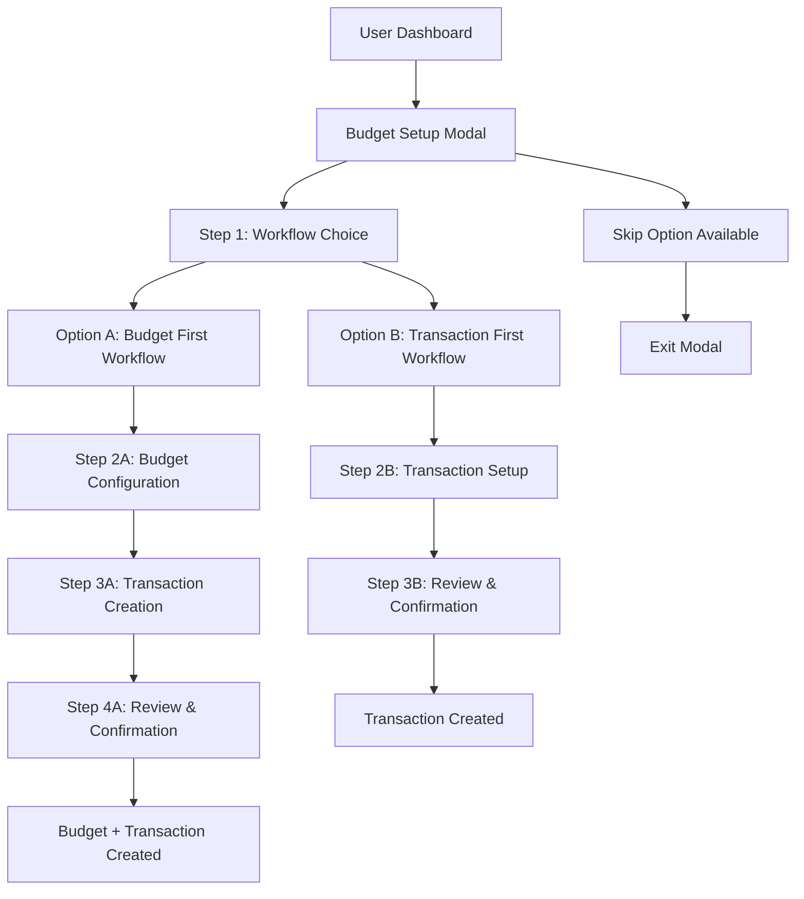

# Budget Setup Modal Enhancement Design

## Overview

This design document outlines the enhancement of the BudgetSetupModal component to provide users with an initial choice between budget-first or transaction-first workflows. The modal will present a decision interface at the start, then guide users through either budget creation followed by transaction, or direct transaction creation, following the design patterns established in the ContributionModal and AddTransaction components.

## System Context

The Budget Setup Modal serves as a critical onboarding component in the BudgetMe application, helping users establish their first budget. This enhancement extends its functionality to include transaction initialization, making the budget setup process more comprehensive and user-friendly.



## Architecture Design

### Component Structure Enhancement

The enhanced BudgetSetupModal will adopt a choice-first approach with branching workflows based on user preference.

``mermaid
classDiagram
    class BudgetSetupModal {
        +ModalStep currentStep
        +WorkflowChoice userChoice
        +BudgetFormData budgetData
        +TransactionFormData transactionData
        +ValidationState validation
        +NavigationHandlers handlers
        +StepRenderer render()
    }
    
    class StepRenderer {
        +renderChoiceStep()
        +renderBudgetStep()
        +renderTransactionStep()
        +renderReviewStep()
        +renderNavigationControls()
    }
    
    class WorkflowHandler {
        +handleBudgetFirstChoice()
        +handleTransactionFirstChoice()
        +renderChoiceInterface()
        +manageWorkflowState()
    }
    
    class ValidationEngine {
        +validateBudgetData()
        +validateTransactionData()
        +crossValidateData()
        +generateValidationErrors()
    }
    
    class CreationService {
        +createBudgetWithTransaction()
        +createTransactionOnly()
        +updateAccountBalance()
        +linkBudgetTransaction()
    }
    
    BudgetSetupModal --> StepRenderer
    BudgetSetupModal --> WorkflowHandler
    BudgetSetupModal --> ValidationEngine
    BudgetSetupModal --> CreationService
```

### Step Flow Architecture

The modal will implement a choice-first workflow with two distinct paths based on user preference:

| Step | Purpose | Required Data | Optional Data |
|------|---------|---------------|---------------|
| 1 | Workflow Choice | user_workflow_choice (budget_first \| transaction_first) | choice_reason |
| 2A | Budget Configuration (Budget First) | budget_name, category_id, amount, period, start_date | description |
| 2B | Transaction Setup (Transaction First) | transaction_amount, account_id, category_id, date | description, goal_assignment |
| 3A | Transaction Creation (Budget First) | transaction_amount, account_id, date | description, goal_assignment |
| 3B | Final Review (Transaction First) | N/A | N/A |
| 4A | Final Review & Confirmation (Budget First) | All previous data | Final adjustments |
| 4B | Final Confirmation (Transaction First) | All previous data | Final adjustments |

### State Management Structure

``mermaid
stateDiagram-v2
    [*] --> WorkflowChoice: Modal Opens
    WorkflowChoice --> BudgetFirst: User Chooses Budget First
    WorkflowChoice --> TransactionFirst: User Chooses Transaction First
    
    BudgetFirst --> BudgetConfig: Budget First Path
    BudgetConfig --> TransactionCreate: Budget Data Valid
    TransactionCreate --> BudgetReview: Transaction Data Valid
    BudgetReview --> Submission: User Confirms All
    
    TransactionFirst --> TransactionSetup: Transaction First Path
    TransactionSetup --> TransactionReview: Transaction Data Valid
    TransactionReview --> Submission: User Confirms Transaction
    
    Submission --> [*]: Success
    
    BudgetConfig --> BudgetConfig: Validation Errors
    TransactionCreate --> TransactionCreate: Validation Errors
    TransactionSetup --> TransactionSetup: Validation Errors
    
    BudgetConfig --> WorkflowChoice: Change Workflow
    TransactionCreate --> BudgetConfig: Edit Budget
    TransactionSetup --> WorkflowChoice: Change Workflow
    BudgetReview --> BudgetConfig: Edit Budget
    BudgetReview --> TransactionCreate: Edit Transaction
    TransactionReview --> TransactionSetup: Edit Transaction
    
    state WorkflowChoice {
        [*] --> ChoicePresentation
        ChoicePresentation --> BudgetFirstSelected: User Selects Budget First
        ChoicePresentation --> TransactionFirstSelected: User Selects Transaction First
    }
    
    state BudgetConfig {
        [*] --> BudgetForm
        BudgetForm --> BudgetValidation
        BudgetValidation --> BudgetComplete: Valid
        BudgetValidation --> BudgetForm: Invalid
    }
    
    state TransactionCreate {
        [*] --> TransactionForm
        TransactionForm --> TransactionValidation
        TransactionValidation --> TransactionComplete: Valid
        TransactionValidation --> TransactionForm: Invalid
    }
    
    state TransactionSetup {
        [*] --> TransactionForm
        TransactionForm --> TransactionValidation
        TransactionValidation --> TransactionComplete: Valid
        TransactionValidation --> TransactionForm: Invalid
    }
```

## Step-by-Step Design Specification

### Step 1: Workflow Choice (Initial Decision)

This step presents users with a clear choice between two workflow approaches, setting the foundation for their experience.

#### Data Structure
```
WorkflowChoiceData {
  workflow_type: 'budget_first' | 'transaction_first' (required)
  choice_reason: string (optional, for analytics)
  user_experience_level: 'beginner' | 'intermediate' | 'advanced' (optional)
}
```

#### Choice Interface Design
- **Option A Card: "Budget First Workflow"**
  - Visual: Budget planning icon with structured approach illustration
  - Benefits: "Structured financial planning", "Better spending control", "Proactive budgeting"
  - Description: "Set up your budget first, then add transactions within that framework"
  - Recommended for: "First-time users, structured planners"
  
- **Option B Card: "Transaction First Workflow"**
  - Visual: Quick transaction icon with immediate action illustration
  - Benefits: "Quick transaction recording", "Flexible approach", "Learn as you go"
  - Description: "Record your transaction now, budget planning is optional"
  - Recommended for: "Experienced users, immediate needs"

#### UI Components
- Large, clear choice cards with visual indicators
- Benefit explanations for each workflow
- "Learn more" links for additional guidance
- Progress indicator showing this is step 1
- Optional user experience level selector for better recommendations

### Step 2A: Budget Configuration (Budget First Workflow)

This step appears for users who choose the budget-first approach, providing comprehensive budget setup.

#### Data Structure
```
BudgetFormData {
  budget_name: string (required, user-defined)
  category_id: string (required, from expense_categories)
  amount: number (required, centavo precision)
  period: 'month' | 'quarter' | 'year' (required)
  start_date: string (required, YYYY-MM format)
  description: string (optional)
  alert_threshold: number (optional, default 0.8)
}
```

#### Validation Rules
- Budget name must be non-empty and contain no format string characters
- Category must exist in user's expense categories
- Amount must be positive and within system limits (₱0.01 - ₱99,999,999,999.99)
- Start date must be valid and not in the past
- Period selection determines end date calculation
- Alert threshold must be between 0.1 and 1.0

#### UI Components
- Interactive budget name input with suggestions
- Category dropdown with icons and descriptions
- Amount input with centavo precision using CentavoInput component
- Period selector with duration examples
- Start date picker with month selection
- Alert threshold slider with visual indicators

### Step 2B: Transaction Setup (Transaction First Workflow)

This step appears for users who choose the transaction-first approach, using patterns from AddTransaction component.

#### Data Structure
```
TransactionFormData {
  type: 'expense' | 'income' | 'contribution' (required)
  amount: number (required, centavo precision)
  account_id: string (required, from user accounts)
  category_id: string (required, based on transaction type)
  date: string (required, defaults to today)
  description: string (required)
  goal_id: string (optional, for goal assignment)
}
```

#### Validation Rules
- Transaction type must be selected (expense/income/contribution)
- Amount must be positive and within system limits (₱0.01 - ₱99,999,999,999.99)
- Account must exist and belong to user
- For expenses/contributions: amount must not exceed account balance
- Category must match transaction type (income/expense categories)
- Date must be valid and not in future
- Description is required and cannot be empty

#### UI Components
- Transaction type selector (income/expense/contribution cards)
- Amount input with centavo precision using CentavoInput component
- Account selector with balance display and validation
- Category selector with auto-selection for contributions
- Date picker with smart defaults
- Description field with validation
- Optional goal selector for contribution tracking

### Step 3A: Transaction Creation (Budget First Workflow)

This step allows users to create a transaction within the context of their newly created budget.

#### Data Structure
```
BudgetTransactionData {
  type: 'expense' (fixed to match budget category)
  amount: number (required, with budget validation)
  account_id: string (required, from user accounts)
  category_id: string (inherited from budget, read-only)
  date: string (required, within budget period)
  description: string (required)
  goal_id: string (optional, for goal assignment)
}
```

#### Smart Defaults
- Transaction type: Fixed to 'expense' to match budget
- Category: Inherited from budget setup (read-only)
- Amount: Suggest portions of budget amount (10%, 25%, 50%)
- Date: Default to budget start date or current date if within period
- Account: Auto-select primary account

#### Validation Rules
- Amount must be positive and not exceed budget amount (warning, not error)
- Account must be valid and belong to user
- Amount must not exceed account balance
- Date must be within budget period
- Description is required

### Step 3B: Final Review (Transaction First Workflow)

Simplified review step for transaction-only creation.

#### Display Elements
- Complete transaction summary with all details
- Account balance impact preview
- Goal assignment display (if applicable)
- "Consider adding a budget later" suggestion
- Option to add budget before finalizing

### Step 4A: Final Review & Confirmation (Budget First Workflow)

Comprehensive review showing both budget and transaction with final confirmation.

#### Display Elements
- Budget summary card with all configuration details
- Transaction summary card with budget relationship
- Budget utilization calculation after transaction
- Goal progress impact (if applicable)
- Account balance impact calculation
- Final action buttons with clear labeling

#### Interaction Capabilities
- "Edit Budget" button returning to Step 2A
- "Edit Transaction" button returning to Step 3A
- "Change Workflow" option to switch approaches
- Final submission with loading state

### Step 4B: Final Confirmation (Transaction First Workflow)

Streamlined confirmation for transaction-only creation.

#### Display Elements
- Transaction confirmation details
- Account balance impact
- Goal assignment confirmation (if applicable)
- Post-creation options (add budget, create another transaction)
- Success indicators and next steps

## Enhanced User Experience Features

### Interactive Tips System

Following ContributionModal's pattern, implement contextual tips for each step:

| Tip Category | Content | Trigger |
|--------------|---------|---------|
| Workflow Decision | Benefits of each approach, personalized recommendations | Step 1 info icon |
| Budget Strategy | 50/30/20 rule, category-based budgeting, alert setup | Step 2A info icon |
| Transaction Best Practices | Accurate categorization, prompt recording, smart descriptions | Step 2B/3A info icon |
| Financial Planning | Long-term benefits, review schedules, integration tips | Step 4A/4B info icon |

### Visual Progress Indicators

``mermaid
graph LR
    A[Step 1: Workflow Choice] --> B[Step 2A: Budget Setup]
    A --> C[Step 2B: Transaction Setup]
    B --> D[Step 3A: Transaction Creation]
    C --> E[Step 3B: Transaction Review]
    D --> F[Step 4A: Complete Review]
    E --> G[Step 4B: Final Confirmation]
    
    A -.-> H[Progress: 25%]
    B -.-> I[Progress: 50%]
    C -.-> J[Progress: 50%]
    D -.-> K[Progress: 75%]
    E -.-> L[Progress: 75%]
    F -.-> M[Progress: 100%]
    G -.-> N[Progress: 100%]
```

### Smart Defaults and Suggestions

- **Workflow Choice**: Show personalized recommendations based on user profile
- **Budget Setup**: Auto-suggest budget names, smart amount recommendations based on category
- **Transaction Creation**: Auto-select appropriate accounts, default to current date
- **Amount Suggestions**: Provide context-aware amount suggestions based on workflow
- **Period Intelligence**: Suggest optimal budget periods based on transaction patterns and user behavior

## Data Flow and Integration

### Transaction Creation Workflow

``mermaid
sequenceDiagram
    participant User
    participant BudgetModal
    participant ValidationEngine
    participant TransactionService
    participant BudgetService
    participant Database
    
    User->>BudgetModal: Configure Transaction (Step 1)
    BudgetModal->>ValidationEngine: Validate Transaction Data
    ValidationEngine-->>BudgetModal: Validation Result
    
    User->>BudgetModal: Choose Budget Option (Step 2)
    
    alt If Create Budget
        User->>BudgetModal: Configure Budget (Step 3A)
        BudgetModal->>ValidationEngine: Validate Budget Data
        ValidationEngine-->>BudgetModal: Validation Result
        
        User->>BudgetModal: Confirm All (Step 4)
        BudgetModal->>BudgetService: Create Budget
        BudgetService->>Database: Insert Budget Record
        BudgetModal->>TransactionService: Create Transaction with Budget
        TransactionService->>Database: Insert Transaction
        TransactionService->>Database: Update Account Balance
        TransactionService->>Database: Update Budget Spent Amount
    else If Skip Budget
        User->>BudgetModal: Review Transaction (Step 3B)
        User->>BudgetModal: Confirm Transaction Only
        BudgetModal->>TransactionService: Create Transaction Only
        TransactionService->>Database: Insert Transaction
        TransactionService->>Database: Update Account Balance
    end
    
    Database-->>BudgetModal: Success Response
    BudgetModal-->>User: Creation Complete
```

### Cross-Component Integration

The enhanced modal integrates with existing components while maintaining separation of concerns:

| Integration Point | Purpose | Implementation |
|-------------------|---------|----------------|
| AccountSelector | Reuse account selection logic | Import and configure for transaction context |
| CentavoInput | Consistent amount handling | Use for transaction amounts primarily |
| CategorySelector | Transaction categorization | Auto-selection for contributions, validation |
| GoalSelector | Optional goal assignment | Import with transaction-specific configuration |
| ValidationEngine | Centralized validation | Extend for transaction-budget validation |
| ToastContext | User feedback | Success/error notifications |

## Technical Implementation Considerations

### Component Reusability

Leverage existing components with budget-specific adaptations:

```
AccountSelector Configuration:
- showBalance: true
- filterByType: null (show all accounts)
- required: true (for transaction step)
- context: "transaction-primary"

CentavoInput Configuration:
- currency: "PHP"
- min: 0.01
- max: 99999999999.99
- suggestBased: false (manual entry focus)

CategorySelector Configuration:
- autoSelectContribution: true
- required: true
- context: "transaction-categorization"
- filterByType: transaction.type

GoalSelector Configuration:
- required: false
- context: "transaction-assignment"
- filterActive: true
```

### State Persistence

Implement robust state management to handle step navigation:

```
Modal State Structure:
{
  currentStep: ModalStep,
  workflowChoice: WorkflowChoiceData,
  budgetData: BudgetFormData,
  transactionData: TransactionFormData,
  validationErrors: ValidationErrors,
  isSubmitting: boolean,
  allowWorkflowChange: boolean
}
```

### Error Handling Strategy

Comprehensive error handling with user-friendly messaging:

- Validation errors displayed inline with specific guidance
- Network errors with retry options
- State corruption recovery mechanisms
- Graceful degradation for partial failures

## Success Metrics and Validation

### User Experience Metrics
- Workflow choice distribution (budget-first vs transaction-first)
- Step completion rates for each workflow path
- Time spent on workflow selection
- User satisfaction with choice-driven approach
- Workflow switching frequency during session

### Functional Validation
- Budget creation success rate (budget-first workflow)
- Transaction creation success rate (both workflows)
- Data consistency between budget and transaction (budget-first)
- Integration with existing financial management features

### Performance Considerations
- Modal load time optimization
- Step transition smoothness
- Form validation responsiveness
- Database operation efficiency

## Integration Testing Strategy

### Component Integration Tests
- Workflow choice selection and routing
- Step navigation flow validation for both paths
- Data persistence across workflow steps
- Validation engine integration for both workflows
- External component integration (AccountSelector, CentavoInput, etc.)

### User Workflow Tests
- Complete budget-first workflow (budget + transaction)
- Complete transaction-first workflow (transaction only)
- Workflow switching scenarios
- Error recovery scenarios for both paths
- Skip and navigation functionality validation

### Data Integrity Tests
- Budget-transaction relationship consistency (budget-first workflow)
- Account balance update accuracy (both workflows)
- Goal assignment validation (both workflows)
- Currency handling precision
- Independent transaction creation (transaction-first workflow)