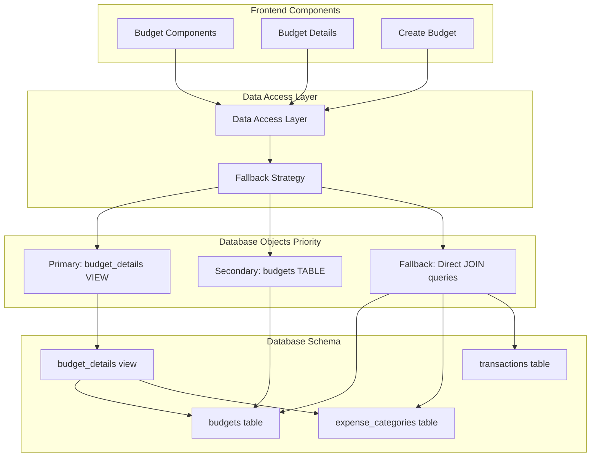
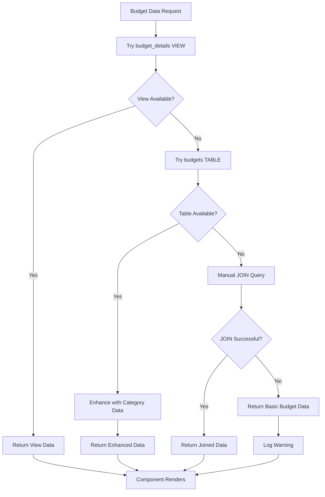
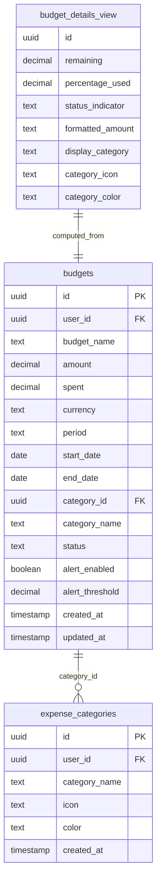
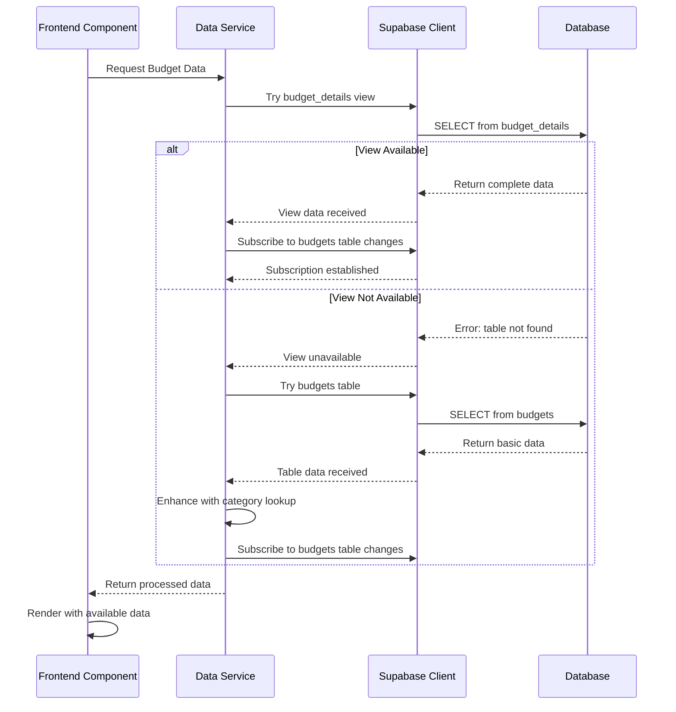
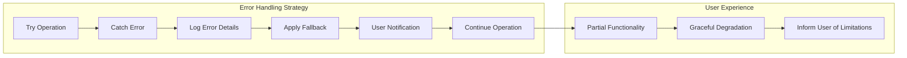
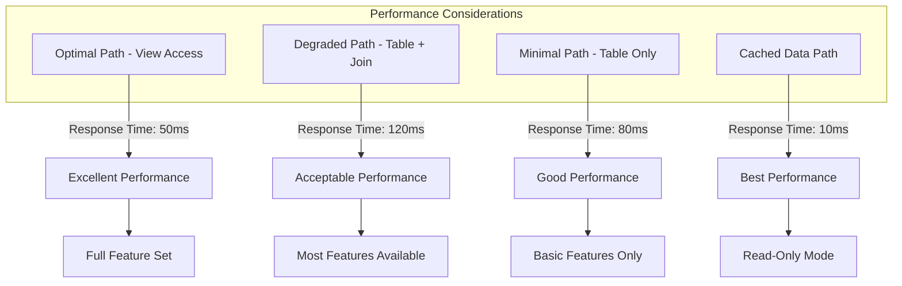

# Budget Table Missing - Database Schema Fallback Design

## Overview

The BudgetMe application is experiencing critical database access failures in the budget components due to missing database views and tables. The error "Could not find the table 'public.budget_details' in the schema cache" indicates that the frontend components are attempting to access database views that may not exist or are not properly deployed in the current environment.

This design addresses the database schema consistency issues and implements a robust fallback strategy to ensure the budget functionality remains operational even when certain database objects are unavailable.

## Architecture

### Current Problem Analysis

The budget components are hardcoded to use the `budget_details` view, which is defined in the SQL schema but appears to be missing from the deployed database instance. This creates several cascading issues:

- Frontend components fail completely when the view is unavailable
- Real-time subscriptions cannot establish connections
- User experience is severely degraded with repeated error messages
- No graceful degradation or fallback mechanisms exist

### Database Layer Architecture

### Fallback Strategy Flow

## Data Models & Database Strategy

### Budget Data Access Patterns

| Priority | Data Source | Availability Check | Data Completeness | Performance |
|----------|-------------|-------------------|-------------------|-------------|
| 1 | `budget_details` view | Schema introspection | Complete with calculations | High |
| 2 | `budgets` table + category join | Table existence check | Good with manual calculations | Medium |
| 3 | `budgets` table only | Basic table check | Basic data only | High |
| 4 | Cached/Mock data | Always available | Limited/stale | Highest |

### Enhanced Data Model Structure

## Component Data Flow Strategy

### Budget Component Data Access Logic

The budget components will implement a cascading data access strategy that progressively falls back to simpler data sources when preferred options are unavailable.

#### Primary Data Access (Preferred)
- Target: `budget_details` view
- Provides: Complete budget information with calculations and category details
- Handles: All computed fields like percentage_used, remaining amounts, status indicators

#### Secondary Data Access (Fallback)
- Target: `budgets` table with `expense_categories` join
- Provides: Core budget data with category information
- Handles: Manual calculation of derived fields in the frontend

#### Tertiary Data Access (Minimal)
- Target: `budgets` table only
- Provides: Basic budget information without category details
- Handles: Minimal functionality with degraded user experience

### Real-time Subscription Strategy

## Data Enhancement Layer

### Client-Side Data Processing

When falling back to the basic `budgets` table, the frontend will implement data enhancement logic to maintain consistent component behavior:

#### Calculated Fields Generation
- `remaining`: Computed as `amount - spent`
- `percentage_used`: Computed as `(spent / amount) * 100`
- `status_indicator`: Derived from percentage thresholds
- `formatted_amount`: Applied currency formatting
- `period_status`: Calculated from date ranges

#### Category Information Enrichment
- Separate lookup for category details when category_id is available
- Fallback to category_name when category relationships are broken
- Default category styling when no category information exists

### Error Boundary Implementation

## Testing Strategy

### Database Availability Testing

| Test Scenario | Expected Behavior | Validation Method |
|---------------|-------------------|-------------------|
| View available | Full functionality | Complete data verification |
| View missing, table available | Degraded functionality | Feature subset validation |
| Table missing | Minimal functionality | Basic operations only |
| Database unavailable | Cached data mode | Offline behavior testing |

### Component Resilience Testing

#### Budget List Component Testing
- Test with complete view data
- Test with table-only data
- Test with no budget data
- Test real-time subscription recovery

#### Budget Details Component Testing  
- Test detailed budget loading with various data sources
- Test chart generation with incomplete data
- Test transaction correlation with fallback data

#### Create Budget Component Testing
- Test category dropdown population with different data sources
- Test budget creation with various backend states
- Test validation with incomplete schema information

## Monitoring & Observability

### Error Tracking Strategy

The system will implement comprehensive logging to track database access patterns and fallback usage:

#### Metrics to Monitor
- Frequency of view access failures
- Fallback strategy activation rates  
- User experience degradation incidents
- Database reconnection success rates

#### Alerting Thresholds
- View unavailability for more than 5 minutes
- Fallback strategy usage exceeding 10% of requests
- User-facing errors exceeding 1% of operations
- Real-time subscription failures exceeding 5% rate

### Performance Impact Assessment

## Implementation Priorities

### Phase 1: Immediate Stability (Critical)
- Implement basic table fallback in existing components
- Add error boundaries to prevent component crashes
- Establish logging for database access patterns
- Deploy basic user notifications for degraded functionality

### Phase 2: Enhanced Resilience (High Priority)
- Implement full cascading fallback strategy
- Add client-side data enhancement calculations
- Improve real-time subscription recovery mechanisms
- Implement comprehensive error handling

### Phase 3: Optimization (Medium Priority)
- Add intelligent caching for frequently accessed data
- Implement predictive fallback based on historical patterns
- Add database health monitoring and auto-recovery
- Optimize performance across all fallback paths

### Phase 4: Advanced Features (Low Priority)
- Implement offline mode with local data persistence
- Add advanced user notifications for system status
- Implement automatic database schema validation
- Add self-healing database connection management