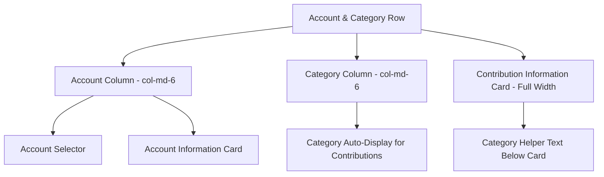
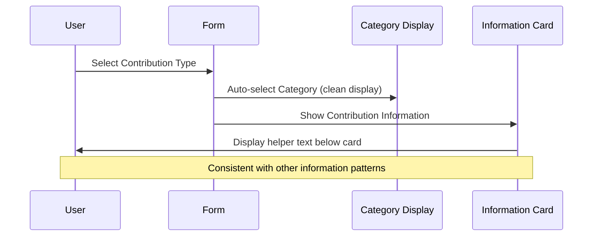

# Category Alignment Update for Contribution Transactions

## Overview

This design addresses the alignment and positioning of category information for contribution transactions in both AddTransaction and EditTransaction components. The goal is to create visual consistency by aligning category information with account information placement while improving the user experience through cleaner information hierarchy.

## Architecture

### Current Layout Structure

The transaction forms currently use a two-column layout (`col-md-6`) where:
- Left column: Account selector with account information card below
- Right column: Category selector or contribution category display

For contribution transactions, the category information appears in the right column with:
- Auto-selected "Contribution" category display
- "Auto-selected" badge within the category field
- Helper text "Category automatically set for contribution transactions"
- Separate contribution information card spanning full width below

### Proposed Layout Structure

The new layout will reorganize information hierarchy for contribution transactions:

#### Information Positioning Strategy



#### Layout Flow for Contribution Transactions

1. **Account Column**: Account selector with account information card
2. **Category Column**: Simplified auto-selected category display without extra badge
3. **Contribution Information Card**: Full-width card with contribution details
4. **Category Helper Text**: Positioned below contribution information card for consistency

## Component Design Changes

### AddTransaction Component

#### Current Category Display Structure
```
<div className="col-md-6">
  {transaction.type !== 'contribution' ? (
    <CategorySelector ... />
  ) : (
    <div className="form-group">
      <label>Category</label>
      <div className="form-control">
        <i className="fas fa-flag mr-2"></i>
        <span>Contribution</span>
        <span className="badge">Auto-selected</span>  <!-- REMOVE -->
      </div>
      <small>Category automatically set...</small>  <!-- MOVE -->
    </div>
  )}
</div>
```

#### Proposed Category Display Structure
```
<div className="col-md-6">
  {transaction.type !== 'contribution' ? (
    <CategorySelector ... />
  ) : (
    <div className="form-group">
      <label>Category</label>
      <div className="form-control">
        <i className="fas fa-flag mr-2"></i>
        <span>Contribution</span>
        <!-- Badge removed for cleaner appearance -->
      </div>
      <!-- Helper text moved below contribution information -->
    </div>
  )}
</div>

<!-- Contribution Information Card -->
{transaction.type === 'contribution' && (
  <div className="card mt-3 border-left-contribute shadow-sm mb-4">
    <!-- Contribution details -->
  </div>
  
  <!-- Category helper text positioned here for consistency -->
  <small className="form-text text-muted">
    Category automatically set for contribution transactions
  </small>
)}
```

### EditTransaction Component

The EditTransaction component will follow identical structural changes:

#### Information Hierarchy Alignment

| Current Structure | Proposed Structure |
|-------------------|-------------------|
| Account Column | Account Column (unchanged) |
| Category Column with badge | Category Column without badge |
| Helper text in category section | Helper text below contribution card |
| Contribution card full-width | Contribution card full-width (unchanged) |

### Visual Consistency Goals

#### Alignment with Account Information
- **Width Consistency**: Category display maintains `col-md-6` width to align with account column
- **Card Positioning**: Contribution information card remains full-width below both columns
- **Text Placement**: Helper text positioned below contribution card similar to account information patterns

#### Badge Removal Rationale
- **Dropdown Indication**: Category selector dropdown already shows "Auto-selected" state
- **Visual Clarity**: Removes redundant visual indicator that clutters the interface
- **Consistency**: Aligns with other auto-selected fields that don't show duplicate badges

## User Experience Improvements

### Information Flow Enhancement



### Layout Consistency Benefits

#### Visual Hierarchy
- **Primary Information**: Account and Category in aligned columns
- **Secondary Information**: Contribution details in dedicated card
- **Helper Text**: Positioned consistently with other form patterns

#### Responsive Design Considerations
- **Mobile View**: Columns stack naturally maintaining information flow
- **Desktop View**: Side-by-side layout preserves visual balance
- **Tablet View**: Intermediate layouts maintain readability

## Implementation Strategy

### Component Modification Approach

#### Phase 1: Category Display Simplification
- Remove redundant "Auto-selected" badge from category field
- Maintain category auto-selection functionality
- Preserve visual styling (colors, icons, borders)

#### Phase 2: Helper Text Repositioning
- Move category helper text from category field to below contribution information card
- Ensure text appears after contribution details for logical flow
- Maintain existing styling and messaging

#### Phase 3: Layout Validation
- Verify alignment consistency across both components
- Test responsive behavior across device sizes
- Validate information hierarchy clarity

### Code Structure Considerations

#### Template Consistency
Both AddTransaction and EditTransaction components should implement identical:
- Category field structure for contribution transactions
- Helper text positioning strategy
- Visual styling approaches

#### Maintainability Features
- **Consistent Patterns**: Aligned information display patterns across transaction types
- **Clear Separation**: Helper text clearly associated with contribution information
- **Reduced Redundancy**: Single source of auto-selection indication in dropdown

## Testing Strategy

### Layout Testing Focus Areas

#### Visual Consistency Validation
- **Column Alignment**: Verify account and category columns maintain equal visual weight
- **Information Flow**: Confirm logical progression from form fields to information cards
- **Text Positioning**: Validate helper text appears in expected location

#### Responsive Behavior Testing
- **Mobile Layout**: Ensure stacked layout maintains information clarity
- **Tablet Layout**: Verify intermediate breakpoint behavior
- **Desktop Layout**: Confirm side-by-side alignment effectiveness

#### User Experience Testing
- **Information Discovery**: Users can easily understand category auto-selection
- **Visual Clarity**: Reduced visual clutter improves form readability
- **Consistency Recognition**: Users recognize pattern similarity with other transaction types

### Functional Testing Requirements

#### Category Auto-Selection Verification
- Category automatically selects "Contribution" for contribution transactions
- Dropdown selector shows auto-selected state appropriately
- Helper text provides clear explanation of automatic behavior

#### Layout Responsiveness
- Information cards maintain proper width relationships
- Text positioning remains consistent across screen sizes
- Form usability preserved across all device types