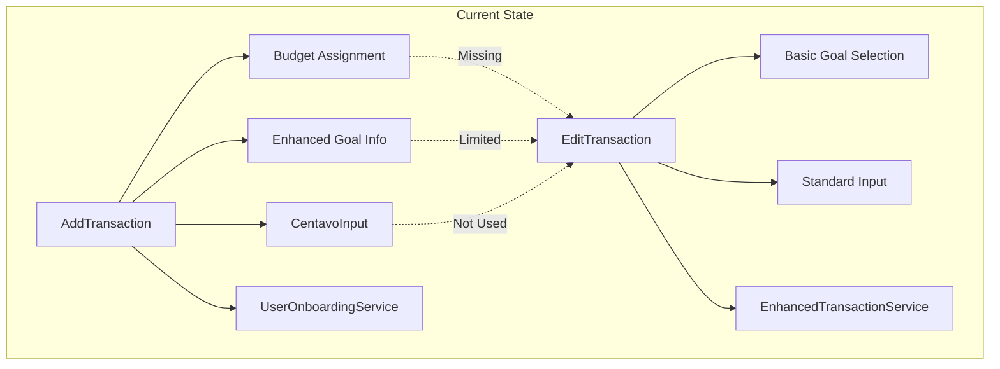
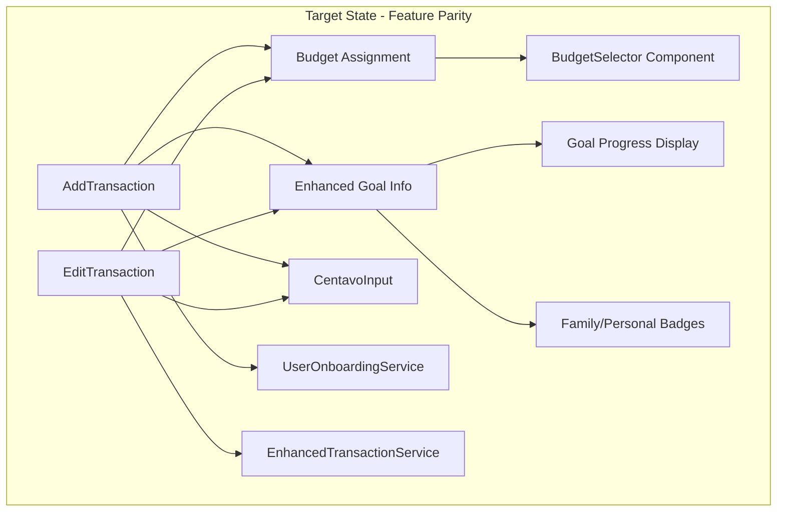
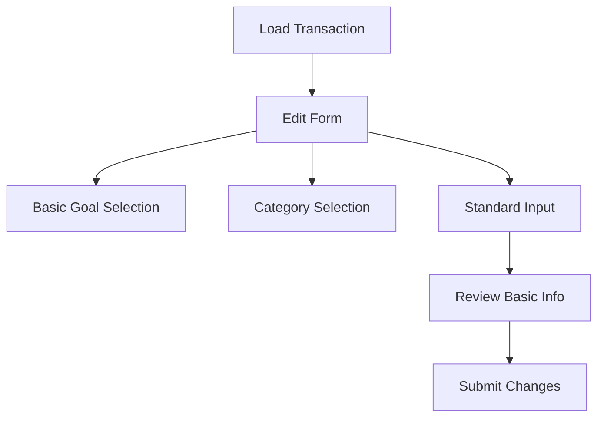
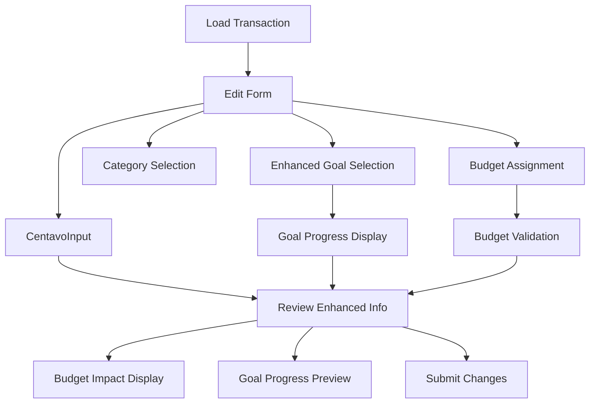
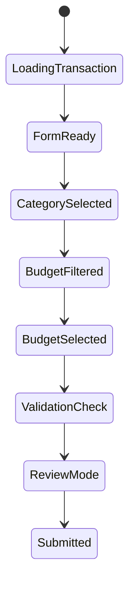

# Transaction Components Parity Design: Edit vs Add Transaction

## Overview

This design addresses the critical inconsistency between the EditTransaction and AddTransaction components in the BudgetMe application. Currently, the EditTransaction component lacks essential features that are present in the AddTransaction component, specifically budget assignment functionality and enhanced goal information display. This design outlines the strategic modifications needed to achieve feature parity and ensure consistent user experience across transaction operations.

## Architecture Analysis

### Current Component Architecture



### Target Architecture



## Component Feature Comparison

### Functional Gaps Identified

| Feature Category | AddTransaction | EditTransaction | Status |
|------------------|----------------|-----------------|---------|
| **Budget Assignment** | ✅ BudgetSelector component | ❌ Not implemented | **Critical Gap** |
| **Enhanced Goal Display** | ✅ Progress bars, badges, details | ❌ Basic dropdown only | **Major Gap** |
| **Amount Input** | ✅ CentavoInput component | ❌ Standard number input | **Medium Gap** |
| **Goal Type Badges** | ✅ Family/Personal indicators | ❌ Not present | **Medium Gap** |
| **Budget Warnings** | ✅ Threshold alerts | ❌ Not applicable | **Missing** |
| **Form Data Structure** | Enhanced with budget_id | Basic structure | **Data Gap** |

### Interface Consistency Analysis

#### AddTransaction Form Data Structure
```typescript
interface TransactionFormData {
  type: "income" | "expense";
  account_id: string;
  category_id: string;
  goal_id: string;
  budget_id: string;        // ✅ Present
  amount: number;           // ✅ Centavo precision
  date: string;
  description: string;
}
```

#### EditTransaction Form Data Structure  
```typescript
interface TransactionFormData {
  type: "income" | "expense";
  account_id: string;
  category_id: string;
  goal_id: string;
  // budget_id: missing      // ❌ Absent
  amount: string;           // ❌ String type
  date: string;
  description: string;
}
```

## Design Modifications Required

### 1. Data Model Enhancement

#### Enhanced Goal Interface
The EditTransaction component must adopt the comprehensive Goal interface from AddTransaction:

| Property | Type | Purpose | Current Status |
|----------|------|---------|----------------|
| `id` | string | Goal identifier | ✅ Present |
| `goal_name` | string | Display name | ✅ Present |
| `target_amount` | number | Goal target | ❌ Missing |
| `current_amount` | number | Progress tracking | ❌ Missing |
| `target_date` | string | Deadline | ❌ Missing |
| `priority` | enum | Goal importance | ❌ Missing |
| `status` | string | Goal state | ❌ Missing |
| `is_family_goal` | boolean | Family vs personal | ❌ Missing |

#### Form Data Structure Alignment
```typescript
interface TransactionFormData {
  type: "income" | "expense";
  account_id: string;
  category_id: string;
  goal_id: string;
  budget_id: string;        // ➕ Add to EditTransaction
  amount: number;           // ➕ Change from string to number
  date: string;
  description: string;
}
```

### 2. Budget Assignment Integration

#### BudgetSelector Component Integration
The EditTransaction component requires the same budget assignment capabilities as AddTransaction:

**Component Integration Strategy:**
- Import BudgetSelector from `../budget/BudgetSelector`
- Add budget state management with `selectedBudget` state
- Implement `handleBudgetSelect` callback function
- Include budget validation during form submission

**State Management Requirements:**
```typescript
const [selectedBudget, setSelectedBudget] = useState<BudgetItem | null>(null);

const handleBudgetSelect = (budget: BudgetItem | null) => {
  setSelectedBudget(budget);
  setTransaction((prev) => ({
    ...prev,
    budget_id: budget?.id || '',
  }));
};
```

### 3. Enhanced Goal Information Display

#### Goal Progress Visualization
The EditTransaction component must include the comprehensive goal display features:

**Required Components:**
- Goal progress bar with percentage calculation
- Family/Personal goal type badges
- Remaining amount display
- Goal status indicators

**Visual Consistency Requirements:**
- Badge styling: `badge badge-info` for family goals with `fas fa-users` icon
- Badge styling: `badge badge-secondary` for personal goals with `fas fa-user` icon
- Progress bar color coding based on completion percentage
- Consistent spacing and layout matching AddTransaction

### 4. Form Input Enhancement

#### CentavoInput Component Integration
Replace the standard number input with the CentavoInput component for precision and consistency:

**Implementation Requirements:**
- Import CentavoInput from `../common/CentavoInput`
- Implement `handleAmountChange` function
- Update amount validation to support centavo precision
- Maintain currency formatting consistency

### 5. Review Mode Consistency

#### Budget Display in Review Mode
The review mode must display budget information when a budget is assigned:

**Display Requirements:**
- Budget name and remaining amount
- Color-coded budget utilization warnings
- Consistent card layout matching AddTransaction pattern

#### Enhanced Goal Display in Review Mode
The review mode must show comprehensive goal information:

**Display Elements:**
- Goal name with type badge (Family/Personal)
- Progress bar with percentage
- Remaining amount calculation
- Consistent styling and layout

## User Experience Flow

### Current EditTransaction Flow


### Enhanced EditTransaction Flow


## Technical Implementation Strategy

### Component State Synchronization

#### Budget State Integration


### Data Flow Enhancement

#### Enhanced Transaction Update Process
The EditTransaction component must handle budget assignment during updates:

**Update Sequence:**
1. Validate budget assignment compatibility
2. Check budget threshold warnings
3. Update transaction with budget reference
4. Maintain budget spending calculations
5. Preserve goal progress tracking

### Error Handling Strategy

#### Budget Assignment Validation
- Validate budget category compatibility with transaction category
- Check budget period validity for transaction date
- Ensure sufficient budget allocation remains
- Handle budget threshold warnings appropriately

#### Goal Assignment Validation
- Verify goal accessibility for the user
- Validate goal status (active vs completed)
- Ensure goal type compatibility with transaction

## Integration Requirements

### Import Dependencies
The EditTransaction component requires additional imports:

```typescript
import BudgetSelector from "../budget/BudgetSelector";
import { BudgetItem } from "../../services/database/budgetService";
import { CentavoInput } from "../common/CentavoInput";
import { formatCurrency, sanitizeBudgetName, roundToCentavo } from "../../utils/currencyUtils";
```

### Service Integration
Enhanced transaction service integration for budget handling:

**Service Methods Required:**
- Budget assignment tracking during transaction updates
- Goal progress recalculation
- Budget spending adjustment logic

## Testing Strategy

### Component Feature Parity Testing

#### Form Functionality Testing
- Verify budget assignment functionality works identically to AddTransaction
- Test goal selection and display features match AddTransaction behavior
- Validate CentavoInput integration provides consistent precision

#### Review Mode Testing  
- Confirm budget information displays correctly in review mode
- Test goal progress visualization matches AddTransaction layout
- Verify consistent styling and user experience

#### Data Persistence Testing
- Validate budget_id is properly saved during transaction updates
- Test goal progress updates correctly when transaction amounts change
- Ensure budget spending calculations remain accurate

### User Experience Testing

#### Navigation Flow Testing
- Test seamless transition between form and review modes
- Verify budget warnings appear at appropriate thresholds
- Validate goal progress updates provide clear feedback

## Success Criteria

### Functional Parity Achieved
1. ✅ Budget assignment functionality fully implemented in EditTransaction
2. ✅ Enhanced goal information display matches AddTransaction
3. ✅ CentavoInput component integrated for amount precision
4. ✅ Form data structure aligned between components
5. ✅ Review mode displays comprehensive transaction details

### User Experience Consistency
1. ✅ Identical interaction patterns between Add and Edit flows
2. ✅ Consistent visual design and component styling
3. ✅ Unified validation and error handling behavior
4. ✅ Seamless budget and goal integration experience

### Technical Quality Metrics
1. ✅ TypeScript interfaces properly aligned
2. ✅ Component state management follows consistent patterns
3. ✅ Error handling provides clear user feedback
4. ✅ Performance remains optimal with enhanced features