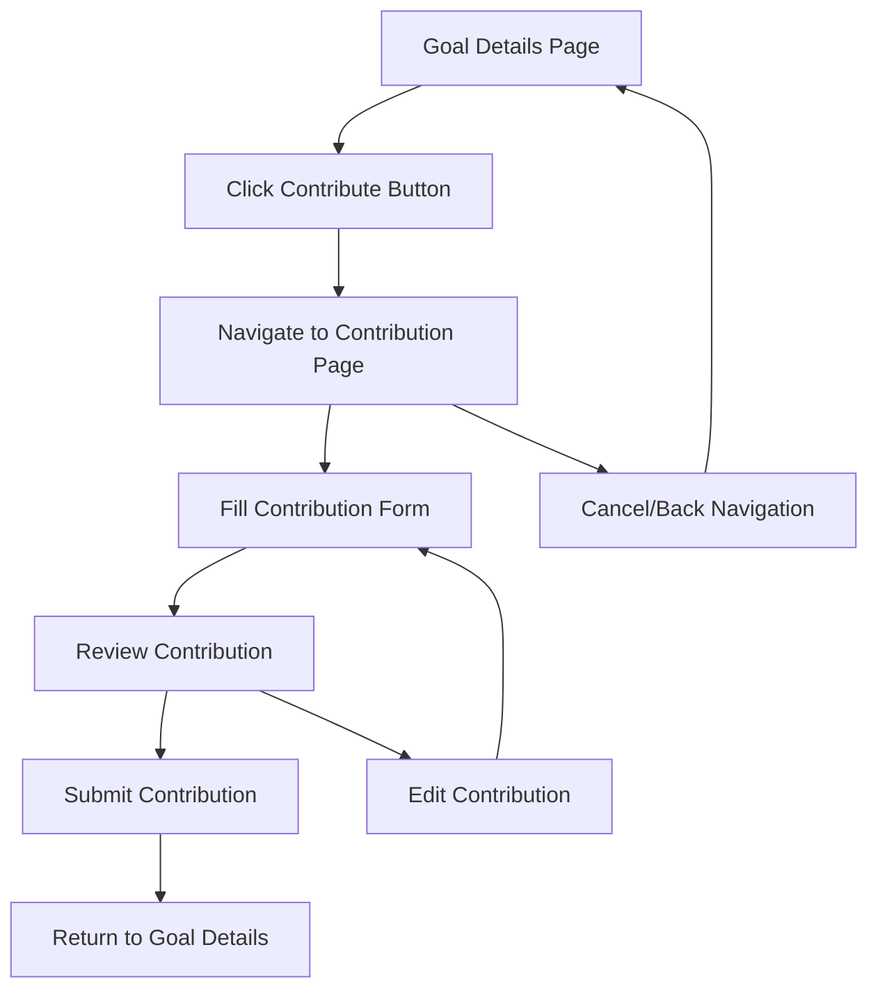

# Contribution Modal Replacement Design

## Overview

This design document outlines the replacement of the inline contribution modal within GoalDetails.tsx with a dedicated contribution page (GoalContribution.tsx). The current implementation uses a modal overlay for quick contributions, but this will be replaced with navigation to a dedicated contribution page for a better user experience and improved code organization.

## Architecture

### Current Implementation Analysis

**GoalDetails.tsx Current Modal Structure:**
- Modal state management (`showContributeModal`, `contributionAmount`, `isContributing`)
- Inline modal rendering with form controls
- Modal-specific event handlers (`openContributeModal`, `closeContributeModal`, `handleContribute`)
- Account selection functionality within modal
- Family goal awareness in modal context

**GoalContribution.tsx Existing Structure:**
- Dedicated page component with full contribution workflow
- Form validation and review process
- Enhanced UX with contribution preview
- Comprehensive error handling
- Account balance validation
- Navigation flow with breadcrumbs

### Target Architecture

The refactored architecture will eliminate modal complexity in GoalDetails.tsx and leverage the existing GoalContribution.tsx component for all contribution operations.

## Component Interaction Design

### GoalDetails.tsx Modifications

**State Removal:**
- Remove modal-related state variables
- Remove contribution form state management
- Remove account fetching logic specific to modal

**Navigation Integration:**
- Replace modal trigger with navigation to contribution page
- Maintain contribution button positioning and styling
- Preserve goal context for navigation

**User Flow Enhancement:**
- Direct navigation to `/goals/{id}/contribute` route
- Maintain goal context through URL parameters
- Preserve return navigation flow

### GoalContribution.tsx Enhancements

**Goal Context Management:**
- Ensure proper goal data loading via route parameters
- Maintain family goal status display
- Preserve real-time updates for goal information

**Navigation Flow:**
- Implement proper return navigation to goal details
- Maintain navigation state for user experience continuity
- Handle edge cases for direct URL access

## User Experience Design

### Navigation Flow

### User Interface Consistency

**Button Behavior:**
- Maintain existing button styling and positioning
- Preserve disabled state logic for completed/cancelled goals
- Keep family goal indicators and permissions

**Page Transition:**
- Smooth navigation transition between pages
- Consistent header and navigation elements
- Preserve goal context during navigation

**Error Handling:**
- Maintain error state management
- Preserve toast notification patterns
- Handle navigation errors gracefully

## Data Flow Architecture

### Goal Data Synchronization

**Data Loading Strategy:**
- GoalContribution.tsx loads goal data independently
- Real-time updates maintained through Supabase subscriptions
- Goal validation on contribution page load

**State Management:**
- Remove modal state from GoalDetails.tsx
- Maintain contribution state within GoalContribution.tsx
- Preserve goal refresh patterns after contribution

### Account Data Management

**Account Selection:**
- Move account fetching logic to GoalContribution.tsx
- Maintain account validation and balance checking
- Preserve account selection persistence

## Implementation Strategy

### Phase 1: Modal Removal
- Remove modal state variables from GoalDetails.tsx
- Remove modal rendering logic
- Remove modal event handlers
- Clean up unused imports and dependencies

### Phase 2: Navigation Implementation
- Replace modal trigger with navigation logic
- Update contribution button click handler
- Implement proper route navigation
- Preserve button styling and positioning

### Phase 3: Flow Optimization
- Ensure proper goal context passing
- Validate navigation state management
- Test user flow continuity
- Optimize page transition performance

### Phase 4: Testing and Validation
- Validate contribution workflow integrity
- Test family goal scenarios
- Verify real-time update functionality
- Ensure error handling consistency

## Technical Considerations

### State Management

**GoalDetails.tsx State Cleanup:**
- Remove contribution modal states
- Maintain goal data and subscription states
- Preserve chart and visualization states
- Keep family status and permission states

**Navigation State:**
- Implement proper navigation history management
- Maintain goal context through route parameters
- Handle browser back/forward navigation

### Performance Optimization

**Code Splitting:**
- Reduce GoalDetails.tsx bundle size by removing modal logic
- Leverage existing GoalContribution.tsx lazy loading
- Optimize component re-rendering patterns

**Memory Management:**
- Clean up modal-related event listeners
- Optimize subscription management
- Reduce component complexity

### Error Handling

**Navigation Errors:**
- Handle failed navigation attempts
- Provide fallback error messaging
- Maintain user context during errors

**Goal Access Validation:**
- Validate goal permissions on contribution page
- Handle family goal access scenarios
- Provide appropriate error feedback

## Security Considerations

### Permission Validation

**Goal Access Control:**
- Maintain existing goal ownership validation
- Preserve family member access controls
- Validate contribution permissions

**Data Security:**
- Ensure secure goal context passing
- Maintain account data protection
- Preserve transaction security patterns

## Testing Strategy

### Unit Testing

**Component Testing:**
- Test GoalDetails.tsx navigation integration
- Validate GoalContribution.tsx goal loading
- Test button behavior and state management

**Integration Testing:**
- Test complete contribution workflow
- Validate navigation flow integrity
- Test family goal scenarios

### User Acceptance Testing

**Workflow Validation:**
- Test contribution process from goal details
- Validate user experience continuity
- Test error scenarios and edge cases

**Performance Testing:**
- Measure page transition performance
- Validate component loading efficiency
- Test real-time update responsiveness