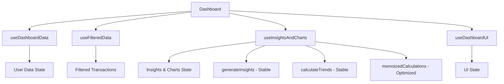
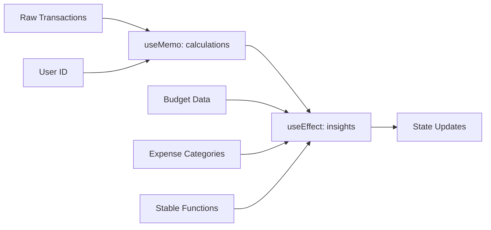
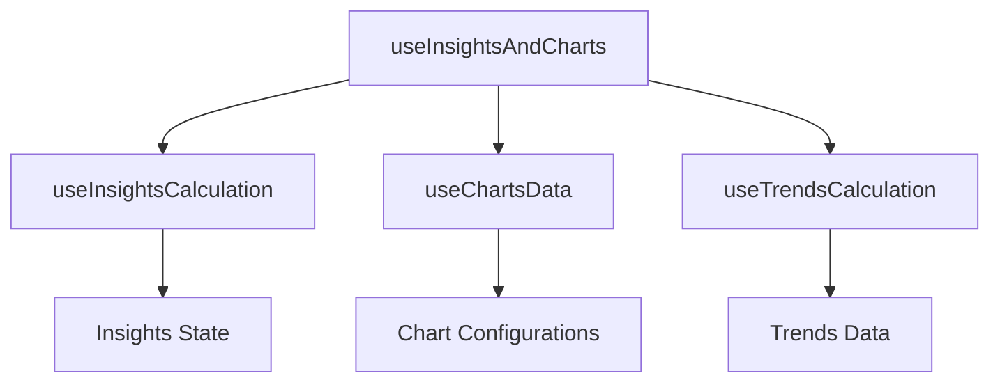
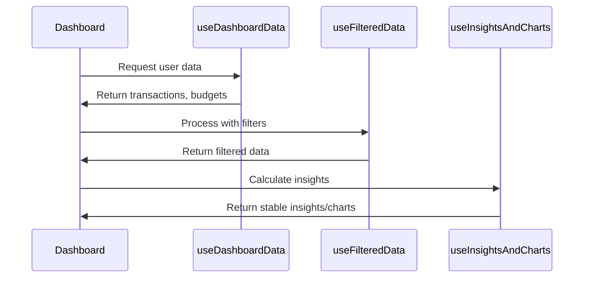
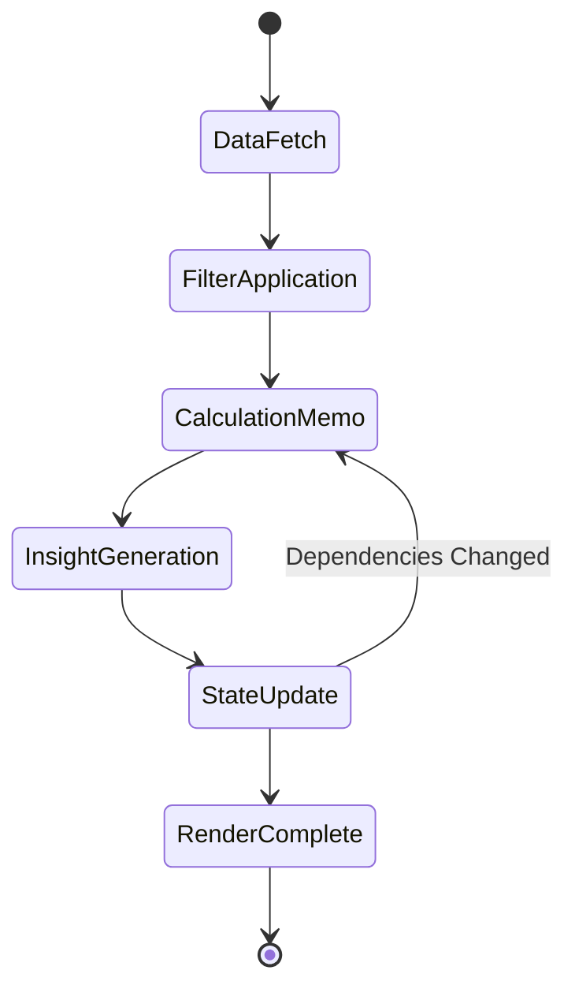
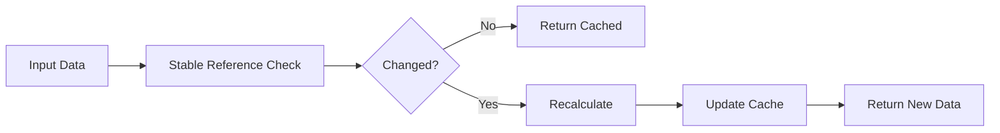
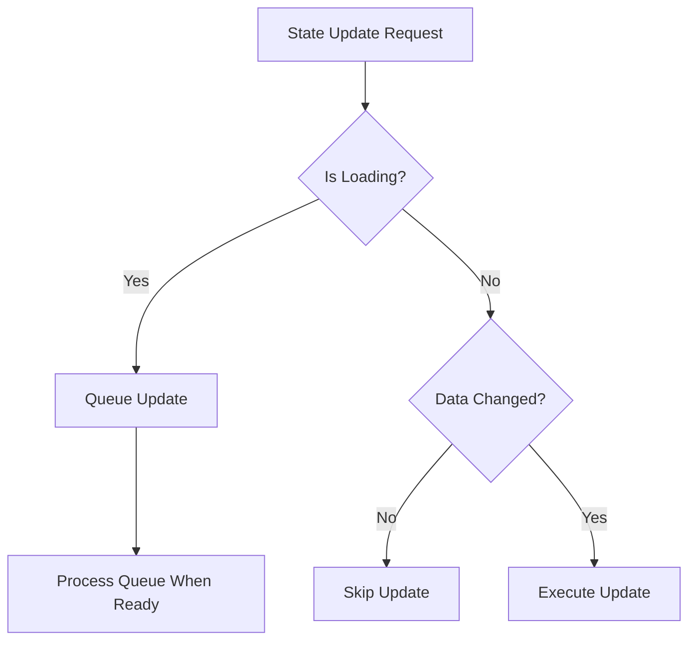

# Dashboard Infinite Render Loop Fix Design

## Overview

The dashboard component is experiencing infinite render loops causing "Maximum update depth exceeded" warnings. The primary issue stems from the `useInsightsAndCharts` hook's dependency management, where the `generateInsightsMemo` and `calculateTransactionTrendsMemo` functions are triggering continuous re-renders due to missing or incorrect dependency arrays in their useEffect hooks.

## Problem Analysis

### Root Cause
The infinite loop is occurring at line 598 in `useInsightsAndCharts.ts` within a useEffect hook that has problematic dependencies:

```
useEffect(() => {
  if (memoizedCalculations.shouldGenerateInsights) {
    generateInsightsMemo(...);
    calculateTransactionTrendsMemo(...);
    setMonthlyData(...);
    setCategoryData(...);
  }
}, [memoizedCalculations, budgetData, generateInsightsMemo, transactions, expenseCategories]);
```

### Dependency Issues
1. **generateInsightsMemo**: Memoized with empty dependency array but depends on external functions like `formatCurrency` and `formatPercentage`
2. **calculateTransactionTrendsMemo**: Similarly memoized with empty dependency array but has external dependencies
3. **memoizedCalculations**: Contains complex calculations that may be changing unexpectedly
4. **budgetData and transactions**: These arrays may be recreated on each render, causing dependency changes

### Secondary Issues
1. Non-memoized callback functions passed to child components
2. Potential prop drilling causing unnecessary re-renders
3. State updates triggering during render cycles

## Architecture Solution

### Component Hierarchy Stabilization


### Hook Dependency Flow


## Implementation Strategy

### Phase 1: Dependency Stabilization

#### 1.1 Function Memoization Strategy
- **generateInsightsMemo**: Include all external dependencies in dependency array
- **calculateTransactionTrendsMemo**: Include all external dependencies in dependency array
- Create stable references for utility functions

#### 1.2 Data Structure Optimization
- Implement deep comparison for complex objects in memoization
- Use React.memo for component optimization where appropriate
- Ensure array and object references remain stable between renders

### Phase 2: State Management Refactoring

#### 2.1 Hook Separation Strategy


#### 2.2 State Update Batching
- Batch related state updates using React's automatic batching
- Implement conditional state updates to prevent unnecessary re-renders
- Use functional state updates where dependencies might change

### Phase 3: Performance Optimization

#### 3.1 Memoization Patterns
| Pattern | Use Case | Implementation |
|---------|----------|----------------|
| useMemo | Heavy calculations | Transactions processing, chart data formatting |
| useCallback | Function props | Event handlers, callback functions |
| React.memo | Component optimization | Child components with stable props |
| Custom comparison | Complex objects | Deep comparison for arrays and objects |

#### 3.2 Render Optimization Strategy
- Implement shouldComponentUpdate equivalent patterns
- Use React DevTools Profiler insights for optimization targets
- Split large hooks into smaller, focused hooks

## Data Flow Architecture

### Input Processing Pipeline


### State Update Lifecycle


## Hook Redesign Specifications

### useInsightsAndCharts Refactoring

#### Current Issues Table
| Issue | Current Behavior | Solution |
|-------|------------------|----------|
| Empty dependencies | Functions recreated on every render | Add proper dependencies |
| Unstable references | memoizedCalculations changes frequently | Implement stable comparison |
| State updates in render | useEffect triggers continuous updates | Move to proper lifecycle |
| Function dependencies | External functions not in deps | Include or stabilize references |

#### New Hook Structure
```
useInsightsAndCharts(
  transactions: Transaction[],
  budgetData: BudgetItem[],
  expenseCategories: Category[],
  userId: string
) -> {
  insights: InsightData[],
  trends: TrendData[],
  monthlyData: HighchartsConfig | null,
  categoryData: PieChartConfig | null
}
```

### Dependency Management Strategy

#### Stable Function References
- Create stable references for utility functions at module level
- Use useCallback for functions that depend on props/state
- Implement custom comparison functions for complex dependencies

#### Data Stability Patterns


## Error Prevention Mechanisms

### Infinite Loop Detection
- Implement development-mode warnings for dependency changes
- Add performance monitoring for hook execution frequency
- Create debugging utilities for dependency tracking

### State Update Guards


### Fallback Strategies
- Implement error boundaries for hook failures
- Provide default values for all calculations
- Create graceful degradation for missing data

## Testing Strategy

### Unit Testing Focus Areas
1. **Hook Behavior**: Test each hook in isolation with various input scenarios
2. **Dependency Tracking**: Verify that dependencies don't change unexpectedly
3. **State Management**: Ensure state updates follow expected patterns
4. **Performance**: Measure render cycles and calculation frequency

### Integration Testing Scenarios
| Scenario | Test Case | Expected Behavior |
|----------|-----------|------------------|
| Data Loading | Dashboard mounts with empty data | No infinite loops, loading state |
| Data Updates | New transactions added | Single calculation cycle |
| Filter Changes | User applies filters | Filtered calculations only |
| Component Unmount | User navigates away | Cleanup prevents memory leaks |

### Performance Benchmarks
- Maximum 3 render cycles on initial load
- Maximum 2 render cycles on data updates
- Calculation time under 100ms for typical datasets
- Memory usage stable over time

## Deployment Considerations

### Rollout Strategy
1. **Development**: Implement fixes in development environment
2. **Testing**: Comprehensive testing with various data scenarios
3. **Staging**: Deploy to staging for integration testing
4. **Production**: Gradual rollout with monitoring

### Monitoring Requirements
- Track render cycle frequency in production
- Monitor dashboard load times
- Alert on infinite loop detection patterns
- Performance metrics for large datasets

### Rollback Plan
- Maintain current version as fallback
- Feature flags for new implementation
- Quick rollback procedure for production issues