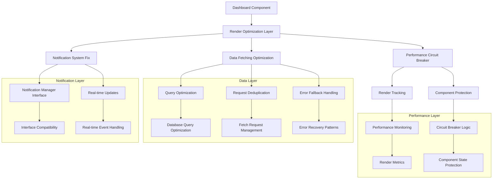
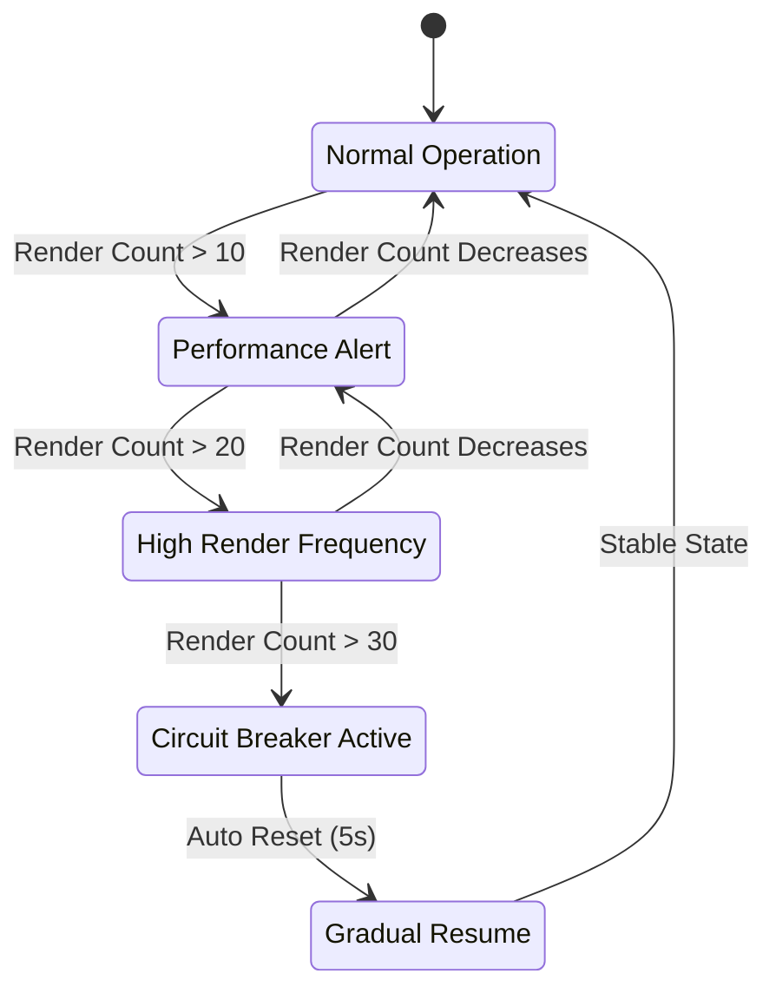
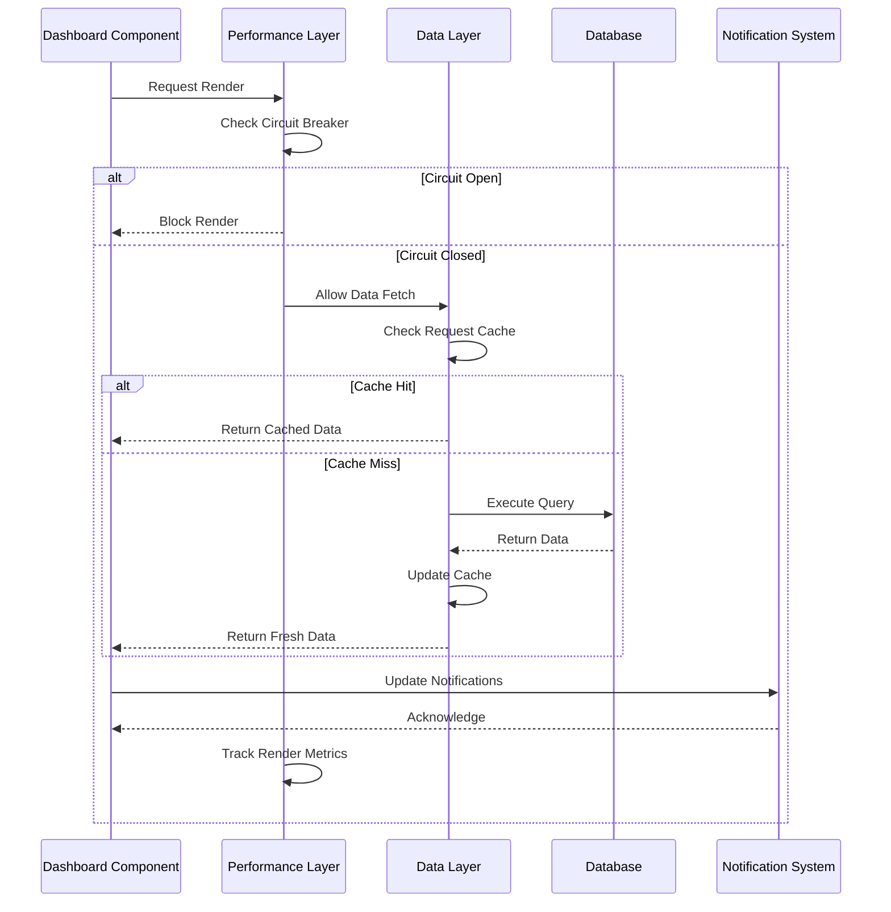
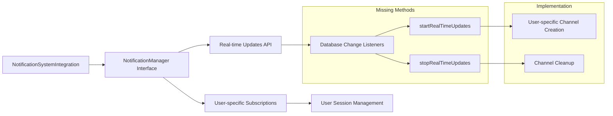
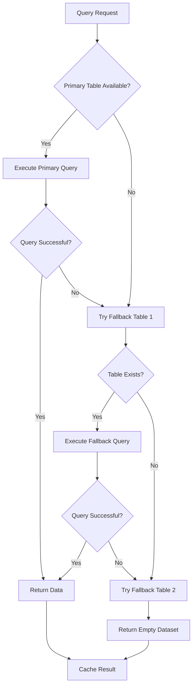
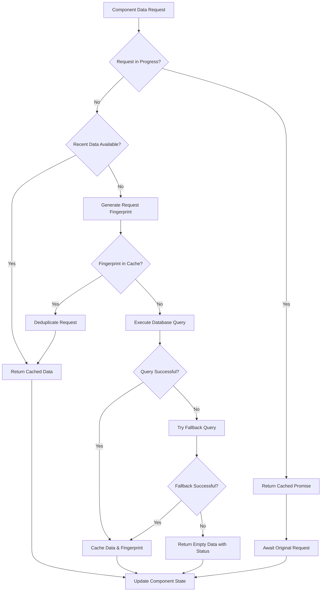
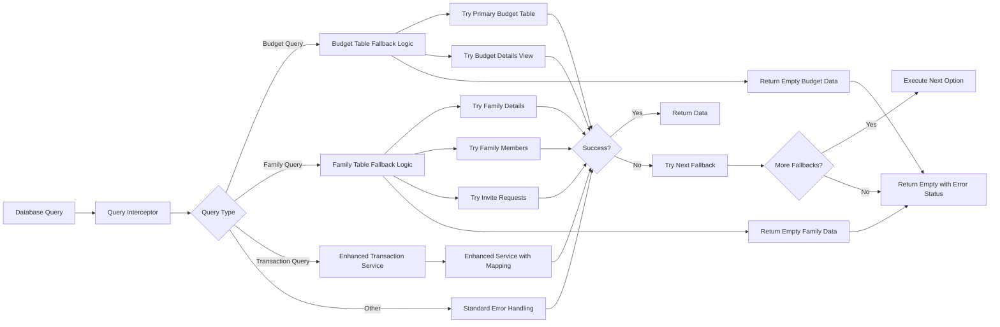
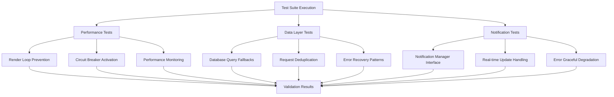

# Dashboard Performance Optimization Design

## Overview

This design addresses critical performance and functionality issues in the BudgetMe dashboard, including excessive re-renders, notification system errors, database query failures, and optimization of real-time data management. The solution focuses on systematic resolution of render loop problems, API error handling, and performance monitoring improvements.

## Architecture

### Problem Analysis

The dashboard is experiencing multiple interconnected issues:

1. **Excessive Re-renders**: Components rendering 11+ times per second causing browser freeze
2. **Notification System Errors**: Missing method implementations causing TypeScript errors
3. **Database Query Failures**: Foreign key relationship errors in budget and family data queries
4. **Performance Monitoring Overhead**: Debug logging creating additional performance burden
5. **Request Deduplication Issues**: Ineffective request throttling causing data fetch spam

### Solution Architecture

## Component Architecture

### Dashboard Render Optimization

| Component | Current Issue | Solution Strategy | Implementation |
|-----------|---------------|-------------------|----------------|
| **Dashboard.tsx** | 11+ renders/sec | Render circuit breaker + dependency stabilization | Implement stable callback refs and condition rendering |
| **useInsightsAndCharts** | Circular dependencies | Dependency isolation + change detection | Split calculations from state updates |
| **useDashboardData** | Request spam | Enhanced deduplication + caching | Implement request fingerprinting |
| **FinancialInsights** | Empty data loops | Fallback data patterns | Provide stable empty states |

### Performance Monitoring Optimization

### Data Flow Architecture

## Performance Optimization Strategy

### Render Loop Prevention

| Pattern | Implementation | Benefit |
|---------|----------------|---------|
| **Stable Callbacks** | `useCallback` with fixed dependencies | Prevents function recreation |
| **Dependency Isolation** | Split data calculations from UI updates | Breaks circular dependencies |
| **Change Detection** | Deep comparison with `useRef` tracking | Avoids unnecessary re-renders |
| **Circuit Breaker** | Automatic protection at 15+ renders/sec | Prevents browser freeze |

### Database Query Optimization

| Issue | Root Cause | Solution |
|-------|------------|----------|
| Budget FK Errors | Incorrect table relationships | Implement fallback query patterns |
| Family Data 400 Errors | Missing table structures | Multi-table compatibility layer |
| Request Duplication | Ineffective throttling | Enhanced request fingerprinting |
| Error Recovery | Hard failures without fallbacks | Graceful degradation patterns |

### Notification System Repair

## Data Models & API Contracts

### Performance Metrics Schema

| Field | Type | Purpose | Calculation |
|-------|------|---------|-------------|
| `component_name` | string | Component identifier | Component display name |
| `render_count` | number | Renders per second | Counter reset every 1000ms |
| `last_render_time` | timestamp | Most recent render | `Date.now()` |
| `circuit_status` | enum | Protection state | `open/closed/half-open` |
| `performance_score` | number | Health indicator | `(max_renders - current_renders) / max_renders * 100` |

### Database Query Fallback Patterns

### Request Deduplication Configuration

| Parameter | Default Value | Purpose | Range |
|-----------|---------------|---------|-------|
| `fetch_cooldown` | 2000ms | Minimum time between requests | 1000-5000ms |
| `request_fingerprint_ttl` | 5000ms | Cache duration for request signatures | 3000-10000ms |
| `max_concurrent_requests` | 3 | Maximum parallel requests per component | 1-5 |
| `retry_backoff_multiplier` | 1.5 | Exponential backoff for failed requests | 1.2-2.0 |

## Business Logic Layer

### Performance Protection Logic

The performance protection system operates on multiple levels to ensure dashboard responsiveness:

**Level 1: Monitoring**
- Track render frequency per component
- Measure data fetch performance
- Monitor notification system health
- Log performance metrics in development

**Level 2: Warning**
- Alert developers when render count exceeds 10/second
- Show user-friendly messages for performance issues
- Implement automatic request throttling
- Activate enhanced monitoring

**Level 3: Protection**
- Circuit breaker activation at 15+ renders/second
- Automatic data caching for 5 seconds
- Disable real-time updates temporarily
- Emergency fallback to static data

**Level 4: Recovery**
- Gradual restoration of functionality
- Reset circuit breaker after 5 seconds
- Resume real-time updates when stable
- Validate system health before full operation

### Data Fetching Optimization Logic

### Notification System Integration Logic

The notification system requires interface compatibility between the integration layer and the manager:

**Interface Requirements:**
- `startRealTimeUpdates(userId: string, callback: Function): void`
- `stopRealTimeUpdates(userId: string): void`
- Error handling for missing methods
- Graceful degradation when notifications unavailable

**Implementation Strategy:**
- Extend NotificationManager with missing methods
- Implement user-specific channel management
- Add callback registration for real-time events
- Provide cleanup mechanisms for user logout

## Middleware & Interceptors

### Performance Monitoring Middleware

| Middleware | Purpose | Trigger Condition | Action |
|------------|---------|------------------|--------|
| **Render Tracker** | Monitor component renders | Every component render | Log metrics, detect loops |
| **Circuit Breaker** | Prevent infinite loops | >15 renders/second | Block rendering, show fallback |
| **Request Deduplicator** | Prevent duplicate API calls | Identical requests within 2s | Return cached promise |
| **Error Recovery** | Handle database failures | Query errors | Attempt fallbacks, cache errors |

### Database Query Interceptor

## Testing Strategy

### Performance Testing

| Test Type | Scope | Success Criteria | Tools |
|-----------|-------|------------------|-------|
| **Render Performance** | Component render cycles | <10 renders/second sustained | Performance monitor, React DevTools |
| **Circuit Breaker** | Protection mechanism | Blocks at 15+ renders, recovers in 5s | Custom test harness |
| **Data Fetching** | Request deduplication | <3 concurrent requests per component | Network monitoring |
| **Error Recovery** | Database fallbacks | Graceful degradation for all query types | Mock database errors |

### Integration Testing

### Unit Testing

| Component | Test Focus | Mock Requirements | Validation |
|-----------|------------|------------------|------------|
| **Dashboard** | Render stability | Performance monitor, data hooks | Stable render count |
| **useInsightsAndCharts** | Dependency management | Transaction data, budget data | No circular dependencies |
| **useDashboardData** | Request optimization | Supabase client, toast service | Effective deduplication |
| **NotificationManager** | Interface compliance | Real-time subscriptions | Method availability |

### Error Boundary Testing

Error boundaries should handle performance-related failures gracefully:

- **Infinite Loop Detection**: Catch and display user-friendly messages
- **Database Connection Failures**: Show offline mode with cached data
- **Notification System Errors**: Disable notifications without breaking dashboard
- **Performance Degradation**: Automatically enable performance mode

## Implementation Priorities

### Phase 1: Critical Performance Fixes (Immediate)

1. **Render Loop Prevention**
   - Implement circuit breaker for Dashboard component
   - Fix useInsightsAndCharts dependency cycles
   - Add stable callback patterns

2. **Database Query Fixes**
   - Implement budget table fallback patterns
   - Fix family data query compatibility
   - Add enhanced error handling

3. **Notification System Repair**
   - Add missing methods to NotificationManager
   - Implement interface compatibility layer
   - Add graceful error handling

### Phase 2: Performance Optimization (Short-term)

1. **Request Optimization**
   - Enhanced request deduplication
   - Implement request fingerprinting
   - Add intelligent caching

2. **Monitoring Improvement**
   - Reduce debug logging overhead
   - Implement performance metrics collection
   - Add user-facing performance indicators

3. **Error Recovery Enhancement**
   - Comprehensive fallback patterns
   - Automatic error recovery
   - Progressive enhancement strategies

### Phase 3: System Resilience (Medium-term)

1. **Advanced Performance Features**
   - Predictive performance monitoring
   - Automatic performance optimization
   - Intelligent resource management

2. **Enhanced User Experience**
   - Performance-aware UI updates
   - Smooth degradation patterns
   - Proactive user notifications

3. **System Health Monitoring**
   - Comprehensive health checks
   - Automated problem detection
   - Self-healing mechanisms

The implementation prioritizes immediate resolution of critical performance issues while establishing a foundation for long-term system resilience and optimal user experience.