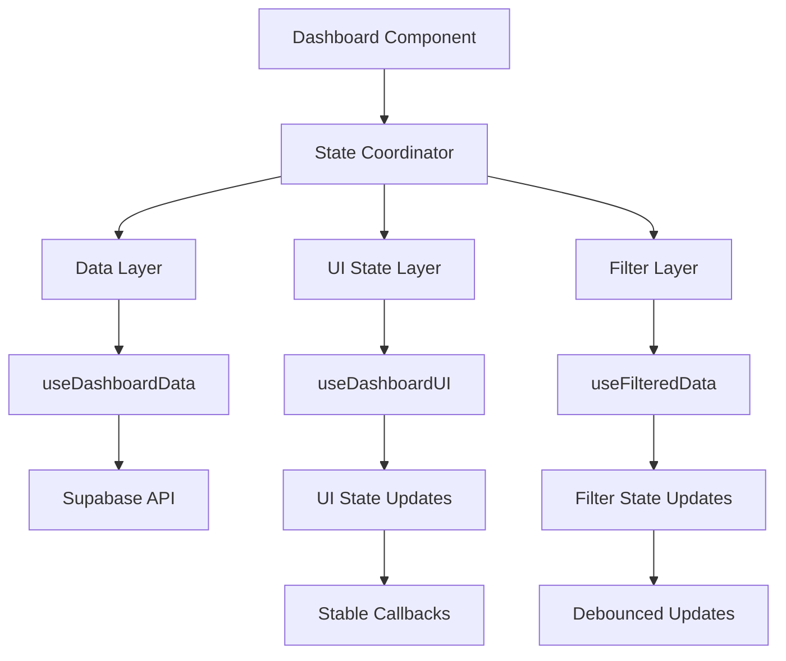
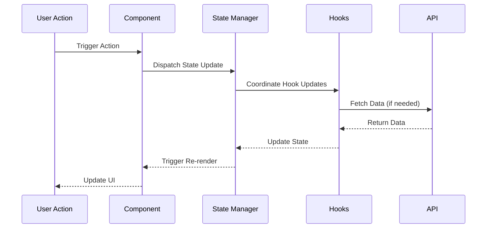
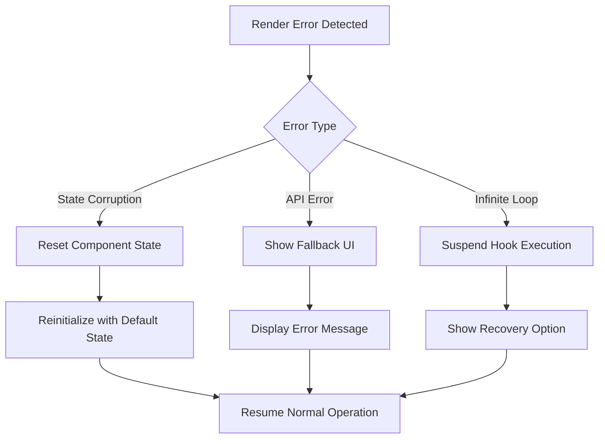

# Dashboard State Management Fix Design

## Overview

The dashboard component is experiencing critical React state management issues causing infinite re-rendering loops and runtime errors. The error "Should have a queue. This is likely a bug in React" indicates that React's internal state management queue is being corrupted due to improper hook usage and unstable dependencies.

## Problem Analysis

### Root Causes Identified

1. **Unstable Hook Dependencies**: The `useInsightsAndCharts` hook has circular dependencies and recreated functions on every render
2. **Circuit Breaker Implementation**: The existing circuit breaker mechanism is causing state corruption rather than preventing it
3. **Nested State Updates**: Multiple custom hooks are triggering simultaneous state updates creating race conditions
4. **Memory Reference Issues**: Object and array dependencies are being recreated unnecessarily

### Impact Assessment

- Dashboard becomes completely unusable
- User experience is severely degraded
- Performance monitoring shows excessive re-renders
- Error boundary activation indicates critical system failure

## Architecture Solution

### State Management Restructure

The solution involves restructuring the dashboard's state management architecture to ensure predictable, stable state updates and eliminate infinite rendering cycles.

#### Core Principles

1. **Stable Dependencies**: All useEffect and useCallback dependencies must be stable across renders
2. **Single Source of Truth**: Centralize state management to prevent conflicting updates
3. **Proper Memoization**: Use React.memo and useMemo strategically to prevent unnecessary re-renders
4. **Dependency Isolation**: Separate data fetching from UI state management

### Hook Refactoring Strategy

#### Phase 1: Dependency Stabilization

| Hook | Issue | Solution |
|------|-------|----------|
| `useDashboardUI` | Recreated functions on every render | Wrap all functions with useCallback with stable dependencies |
| `useInsightsAndCharts` | Circular dependencies and unstable references | Implement proper memoization and dependency isolation |
| `useFilteredData` | State updates causing cascading re-renders | Debounce filter updates and stabilize calculation functions |
| `useDashboardData` | Data fetching triggering multiple re-renders | Implement request deduplication and stable error handling |

#### Phase 2: State Update Coordination

### Implementation Framework

#### Stable Callback Implementation

All callback functions must follow this pattern:
- Use useCallback with stable dependencies
- Avoid object/array dependencies unless memoized
- Implement ref-based state updates for frequently changing values

#### Error Prevention Mechanism

Replace the existing circuit breaker with a more robust error prevention system:

1. **Render Cycle Monitoring**: Track render frequency without affecting state
2. **Dependency Validation**: Validate hook dependencies before state updates
3. **Graceful Degradation**: Provide fallback UI states when errors occur

#### Memory Optimization

| Component | Current Issue | Optimization Strategy |
|-----------|---------------|----------------------|
| Chart Components | Recreated on every data change | Implement shouldComponentUpdate logic |
| Filter Controls | Excessive re-renders on filter changes | Debounce filter updates with 300ms delay |
| Summary Cards | Recalculated on every transaction update | Memoize calculations with stable dependencies |
| Insights Generation | Complex calculations on every render | Move to web worker for heavy computations |

### Data Flow Architecture

#### Unidirectional Data Flow

#### State Synchronization

All state updates must follow this coordination pattern:
1. Single state update per user action
2. Batch related state changes
3. Prevent cascading state updates
4. Implement optimistic UI updates where appropriate

### Hook Redesign Specifications

#### useDashboardUI Stabilization

**Current Problems:**
- Functions recreated on every render
- State updates causing infinite loops
- Tooltip positioning calculations triggering re-renders

**Solution Design:**
- Wrap all functions with useCallback
- Use refs for frequently updated values
- Implement stable event handlers

#### useInsightsAndCharts Optimization

**Current Problems:**
- Complex dependency array causing infinite re-renders
- Heavy calculations on every render
- Circuit breaker causing state corruption

**Solution Design:**
- Split into smaller, focused hooks
- Implement proper memoization strategy
- Move heavy calculations to useMemo with stable dependencies

#### useFilteredData Performance

**Current Problems:**
- Filter changes triggering multiple re-renders
- Date calculations causing unstable dependencies
- URL parameter generation on every render

**Solution Design:**
- Implement debounced filter updates
- Memoize date range calculations
- Cache URL parameter generation

### Error Handling Strategy

#### Graceful Error Recovery

#### Error Prevention Measures

1. **State Validation**: Validate state before updates
2. **Dependency Checking**: Ensure all dependencies are stable
3. **Render Limiting**: Implement render frequency monitoring
4. **Recovery Mechanisms**: Provide user-initiated recovery options

### Performance Monitoring Integration

#### Metrics Collection

| Metric | Threshold | Action |
|--------|-----------|--------|
| Render Frequency | >10 renders/second | Activate performance mode |
| Memory Usage | >100MB dashboard data | Implement data pagination |
| Error Rate | >5% of renders | Show error recovery UI |
| Load Time | >3 seconds initial load | Show loading optimization tips |

#### Real-time Monitoring

Implement non-intrusive performance monitoring that:
- Tracks render cycles without affecting performance
- Monitors memory usage patterns
- Detects potential infinite loops before they occur
- Provides actionable feedback to users

### Testing Strategy

#### Unit Testing Focus

1. **Hook Stability**: Test that hooks don't cause infinite re-renders
2. **State Consistency**: Verify state updates are predictable
3. **Error Handling**: Test error recovery mechanisms
4. **Performance**: Validate render frequency thresholds

#### Integration Testing

1. **User Workflow**: Test complete user interactions
2. **Data Flow**: Verify data consistency across components
3. **Error Scenarios**: Test error handling in realistic scenarios
4. **Performance**: Measure actual performance improvements

### Migration Strategy

#### Phase 1: Critical Fixes (Immediate)
- Fix infinite rendering loops in useDashboardUI
- Stabilize useInsightsAndCharts dependencies
- Implement emergency circuit breaker

#### Phase 2: Optimization (Week 1)
- Refactor all custom hooks for stability
- Implement proper memoization
- Add performance monitoring

#### Phase 3: Enhancement (Week 2)
- Optimize rendering performance
- Implement advanced error recovery
- Add comprehensive testing

### Success Criteria

#### Performance Metrics
- Zero infinite rendering loops
- <3 second initial dashboard load
- <100ms filter update response time
- <50MB memory usage for dashboard

#### User Experience
- Smooth, responsive dashboard interactions
- Graceful error handling with recovery options
- Consistent data display across all components
- Intuitive performance feedback

#### Technical Quality
- 100% hook stability in automated tests
- Zero React queue errors
- Predictable state management patterns
- Maintainable, well-documented code