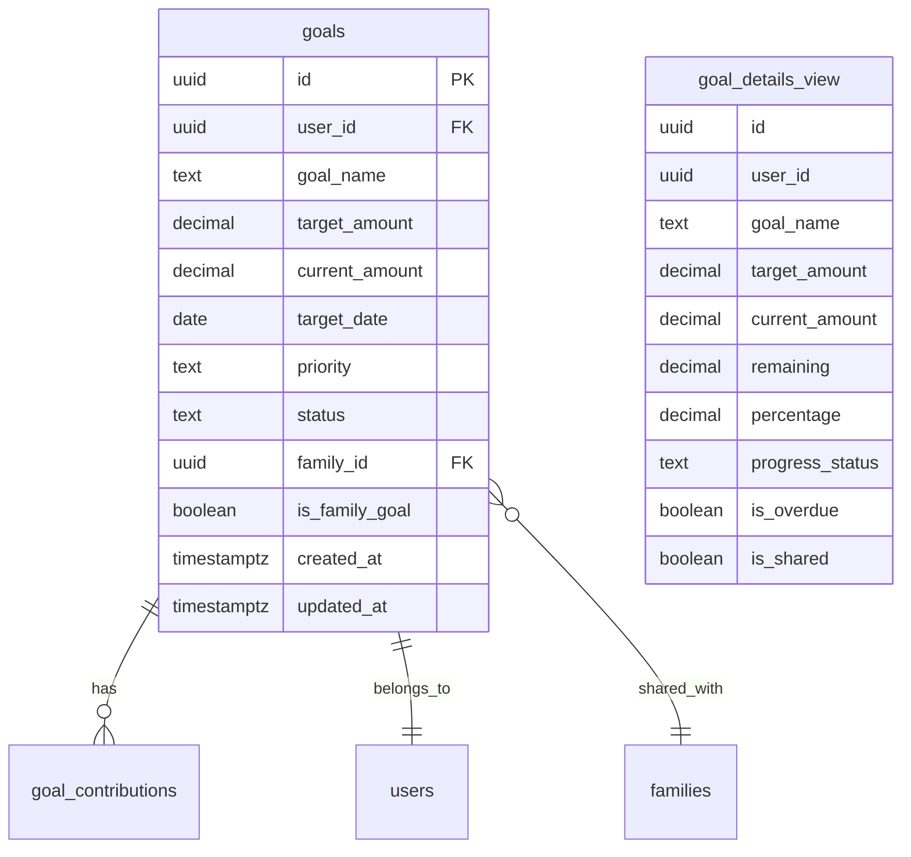
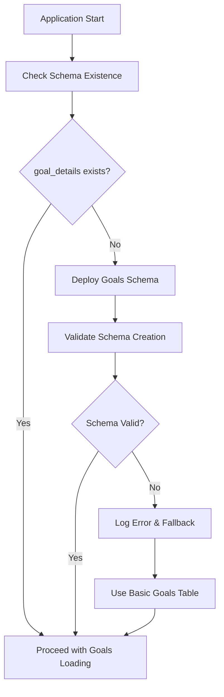
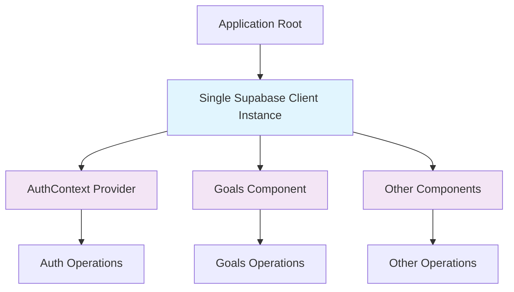
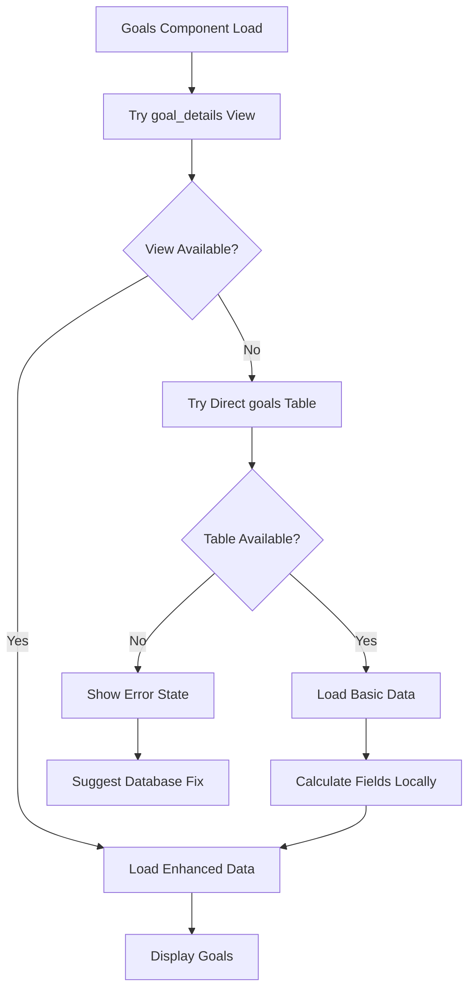

# Database Table Missing Fix Design

## Overview

This design addresses critical issues in the goals component where the application fails to load goals due to missing database tables and multiple Supabase client instances causing undefined behavior. The primary problems are:

1. **Missing goal_details table/view**: Application queries `goal_details` table which doesn't exist in the database schema cache
2. **Multiple GoTrueClient instances**: Creating multiple Supabase clients causing browser context conflicts
3. **Database schema deployment issues**: Goals schema not properly deployed or accessible

## Problem Analysis

### Primary Issues Identified

| Issue | Impact | Root Cause |
|-------|--------|------------|
| Missing `goal_details` table | Goals component fails to load | Database view not created or accessible |
| Multiple Supabase clients | Auth conflicts, undefined behavior | Client creation not following singleton pattern |
| Schema cache errors | API returns 404 for table queries | Database deployment incomplete |
| Subscription failures | Real-time updates don't work | Missing table prevents subscriptions |

### Error Patterns

The console logs show consistent patterns:
- `GET .../goal_details?select=*&user_id=eq... 404 (Not Found)`
- `Could not find the table 'public.goal_details' in the schema cache`
- `Multiple GoTrueClient instances detected in the same browser context`

## Database Schema Solution

### Goal Details View Strategy

The application expects a `goal_details` view that provides calculated fields for goals. The database schema should create this view with:

### Database Deployment Requirements

The goals schema must be properly deployed with these components:

1. **Core Tables**
   - `public.goals` - Main goals table
   - `public.goal_contributions` - Contribution tracking
   
2. **Computed View**
   - `public.goal_details` - Materialized view with calculated fields
   
3. **Access Policies**
   - Row Level Security (RLS) policies for user access
   - Family sharing permissions
   
4. **Indexes**
   - Performance indexes for user queries
   - Date-based indexes for filtering

### Schema Validation Strategy

Before application deployment, validate schema exists:

## Client Instance Management

### Singleton Pattern Implementation

Address multiple client instances by enforcing singleton pattern:

| Component | Current Issue | Solution |
|-----------|---------------|----------|
| supabaseClient.ts | Creates new instances | Implement singleton with cached instance |
| AuthContext | Multiple auth clients | Use single client reference |
| Goals hooks | Independent clients | Import shared client instance |

### Client Architecture

### Client Initialization Strategy

Ensure single client creation with proper configuration:

1. **Environment Validation**: Verify required environment variables
2. **Singleton Creation**: Use lazy initialization with caching
3. **Auth Configuration**: Consistent auth settings across components
4. **Storage Keys**: Unique storage keys to prevent conflicts

## Goals Component Resilience

### Fallback Mechanism

Implement graceful degradation when database issues occur:

### Data Access Layer

Create abstraction layer for goals data access:

| Operation | Primary Method | Fallback Method | Error Handling |
|-----------|----------------|-----------------|----------------|
| Fetch Goals | `goal_details` view | `goals` table + calculations | Show error message |
| Goal Details | Enhanced view query | Basic table + computed fields | Graceful degradation |
| Real-time Updates | Subscribe to goals table | Manual refresh | Continue without real-time |

### Component State Management

Manage loading and error states effectively:

1. **Loading States**: Show appropriate spinners during data fetching
2. **Error Boundaries**: Catch and handle database errors gracefully
3. **Retry Logic**: Implement automatic retry for transient failures
4. **User Feedback**: Clear error messages with actionable guidance

## Implementation Strategy

### Phase 1: Database Schema Validation

1. **Schema Deployment Check**
   - Verify `goals` table exists
   - Ensure `goal_details` view is created
   - Validate RLS policies are active

2. **Migration Script**
   - Deploy missing schema components
   - Create proper indexes and constraints
   - Set up view with calculated fields

### Phase 2: Client Management Fix

1. **Singleton Implementation**
   - Refactor supabaseClient.ts for singleton pattern
   - Update all imports to use shared instance
   - Remove duplicate client creations

2. **Context Optimization**
   - Ensure AuthContext uses single client
   - Optimize re-renders and subscriptions
   - Clean up subscription management

### Phase 3: Component Resilience

1. **Fallback Implementation**
   - Add try-catch blocks for database operations
   - Implement graceful degradation paths
   - Create error boundary components

2. **State Management**
   - Optimize loading states
   - Improve error handling
   - Add retry mechanisms

### Phase 4: Testing and Validation

1. **Database Testing**
   - Verify schema deployment works
   - Test fallback mechanisms
   - Validate data integrity

2. **Component Testing**
   - Test goals loading with and without view
   - Verify subscription cleanup
   - Test error states and recovery

## Success Metrics

### Database Performance

| Metric | Target | Measurement |
|--------|--------|-------------|
| Goals Load Time | < 1 second | API response time |
| Schema Availability | 100% | Health check success |
| Query Success Rate | > 99% | Error rate monitoring |

### Component Reliability

| Metric | Target | Measurement |
|--------|--------|-------------|
| Error Rate | < 1% | Component error tracking |
| Fallback Success | 100% | When schema unavailable |
| Subscription Stability | No disconnects | Real-time update reliability |

### User Experience

| Metric | Target | Measurement |
|--------|--------|-------------|
| Loading Feedback | Immediate | User sees loading state |
| Error Clarity | Clear messages | Error message usability |
| Recovery Time | < 5 seconds | Time to resolve errors |

## Risk Mitigation

### Database Risks

| Risk | Impact | Mitigation |
|------|--------|------------|
| Schema not deployed | High | Automated deployment validation |
| View creation fails | Medium | Fallback to table queries |
| RLS policy issues | High | Comprehensive policy testing |

### Application Risks

| Risk | Impact | Mitigation |
|------|--------|------------|
| Multiple client instances | High | Strict singleton enforcement |
| Memory leaks | Medium | Proper subscription cleanup |
| Infinite re-renders | Medium | Optimized dependency arrays |

### User Impact Risks

| Risk | Impact | Mitigation |
|------|--------|------------|
| Goals not loading | High | Clear error messages and fallbacks |
| Data inconsistency | Medium | Robust error boundaries |
| Poor performance | Low | Optimized queries and caching |