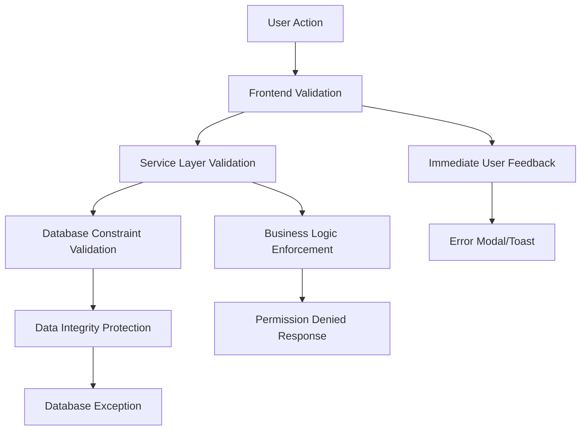
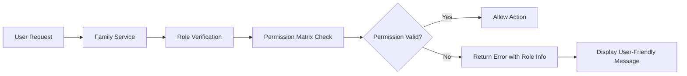

# Error Handling for Goal Contribution - Role-Based Permissions Design

## Overview

This design document outlines the implementation of role-based error handling and validation for goal contributions within the family finance management system. The system enforces different permission levels based on family member roles when creating family goals and making contributions.

## Architecture

### Family Role Permission Matrix

| Role | Create Family Goals | Contribute to Goals | Access Level |
|------|-------------------|-------------------|--------------|
| **Admin** | ✅ Full Permission | ✅ Full Permission | Complete access to all family financial activities |
| **Member** | ❌ Restricted | ✅ Full Permission | Can participate but cannot create family-wide goals |
| **Viewer** | ❌ Restricted | ❌ Restricted | Read-only access to family financial information |

### Error Handling Strategy

The error handling system implements a three-layer validation approach:



## Component Validation Logic

### Family Goal Creation Validation

#### AddTransaction Component Enhancement
**Purpose**: Prevent members and viewers from creating family-type goals during transaction creation

**Validation Flow**:
1. Check user family membership status
2. Validate role permissions for family goal creation
3. Display appropriate error messages based on role

**Implementation Strategy**:
- Add role validation before allowing `is_family_goal` flag to be set
- Implement role-based UI rendering to hide family goal options for restricted users
- Provide clear error messaging explaining permission limitations

#### EditTransaction Component Enhancement
**Purpose**: Prevent unauthorized modification of existing family goals

**Validation Flow**:
1. Verify user has permission to modify family goal associations
2. Check if transaction is linked to family goals
3. Validate role permissions for goal modification

### Goal Contribution Validation

#### GoalContribution Component Enhancement
**Purpose**: Control access to goal contribution functionality based on family role

**Current State Analysis**:
- Component currently allows all authenticated users to contribute
- No role-based restrictions implemented
- Missing family membership validation

**Required Enhancements**:
- Add family role checking before allowing contributions
- Implement viewer role restrictions for contributions
- Validate member permissions for family goals

#### ContributionModal Component Enhancement
**Purpose**: Implement modal-level validation for goal contributions

**Validation Requirements**:
- Check user family membership before displaying eligible goals
- Filter available goals based on user permissions
- Provide role-specific error messages

## Data Flow Architecture

### Permission Checking Service



### Family Membership Validation

The system uses the existing `familyService.checkFamilyMembership()` method to:
- Determine if user belongs to a family
- Retrieve user's family role (admin/member/viewer)
- Validate family status and permissions

## Error Message Design

### Role-Specific Error Messages

#### Member Role Restrictions
**Goal Creation Error**:
```
"Family Goal Creation Restricted"
"As a family member, you can contribute to existing goals but cannot create new family goals. Only family admins can create goals for the entire family."
```

**Alternative Action Guidance**:
```
"You can create personal goals or ask a family admin to create family goals."
```

#### Viewer Role Restrictions
**Contribution Error**:
```
"Contribution Access Denied"
"Viewers have read-only access to family financial information. You cannot make contributions to family goals."
```

**Permission Upgrade Guidance**:
```
"Contact your family admin to upgrade your role if you need contribution access."
```

### Error Presentation Strategy

#### Modal Error Display
- Use warning-styled modals for permission errors
- Include role explanation and alternative actions
- Provide contact information for role upgrades

#### Inline Validation Messages
- Display real-time validation as users interact with forms
- Show preventive messaging before form submission
- Use color-coded indicators for different restriction levels

## Validation Implementation

### Frontend Validation Layer

#### Component State Management
```typescript
interface FamilyPermissionState {
  isFamilyMember: boolean;
  familyRole: 'admin' | 'member' | 'viewer' | null;
  canCreateFamilyGoals: boolean;
  canContributeToGoals: boolean;
}
```

#### Permission Checking Hooks
- Extend existing `useFamilyState` hook for permission validation
- Add real-time permission checking for form interactions
- Implement role-based UI element rendering

### Service Layer Validation

#### Business Logic Enforcement
- Validate permissions before database operations
- Implement role-based access control for API endpoints
- Return detailed error information for frontend handling

#### Family Service Integration
- Utilize existing `familyService.canManageRoles()` for permission checking
- Extend service methods for contribution-specific validations
- Add comprehensive error handling with role context

### Database Constraint Layer

#### Policy-Based Security
- Leverage existing Row Level Security policies
- Ensure database-level enforcement of family permissions
- Maintain data integrity through constraint validation

## User Experience Considerations

### Progressive Disclosure
- Show role limitations clearly without overwhelming users
- Provide contextual help for understanding permission levels
- Offer upgrade paths for users needing additional access

### Feedback Mechanisms
- Immediate validation feedback during form interactions
- Clear explanation of why actions are restricted
- Guidance on how to resolve permission issues

### Accessibility Compliance
- Ensure error messages are screen reader accessible
- Use appropriate ARIA labels for validation states
- Maintain keyboard navigation for error acknowledgment

## Testing Strategy

### Permission Validation Tests
1. **Admin Role Tests**
   - Verify full access to family goal creation
   - Confirm contribution permissions for all goals
   - Test administrative override capabilities

2. **Member Role Tests**
   - Validate restriction on family goal creation
   - Confirm contribution access to existing goals
   - Test error message display for restricted actions

3. **Viewer Role Tests**
   - Verify complete restriction on goal creation
   - Confirm read-only access enforcement
   - Test error handling for all restricted actions

### Integration Tests
- Test role transitions and permission updates
- Validate family membership changes
- Ensure consistent error handling across components

### User Experience Tests
- Verify error message clarity and helpfulness
- Test alternative action guidance effectiveness
- Validate accessibility compliance for error states

## Security Considerations

### Authorization Enforcement
- Implement server-side permission validation
- Prevent client-side bypass of restrictions
- Ensure consistent security across all entry points

### Data Protection
- Maintain family financial data privacy
- Enforce role-based data access controls
- Log permission violations for security monitoring

### Audit Trail
- Track permission changes and violations
- Maintain user action logs for compliance
- Enable administrator oversight of family permissions

## Implementation Phases

### Phase 1: Core Validation Infrastructure
- Implement permission checking services
- Add role-based validation to existing components
- Create error message framework

### Phase 2: Enhanced User Experience
- Add progressive disclosure features
- Implement contextual help and guidance
- Enhance error message design and presentation

### Phase 3: Advanced Features
- Add permission upgrade workflows
- Implement detailed audit logging
- Create administrator oversight tools

## Technical Requirements

### Component Dependencies
- Existing authentication system (`useAuth`)
- Family service layer (`familyService`)
- Toast notification system (`useToast`)
- Modal management systems

### API Integration Points
- Family membership validation endpoints
- Role permission checking services
- Goal creation and contribution APIs

### Database Schema Requirements
- Leverage existing family member permissions columns
- Utilize role-based access control policies
- Maintain referential integrity for family relationships

## Success Metrics

### Security Effectiveness
- Zero unauthorized family goal creations by restricted users
- Complete enforcement of viewer role limitations
- Consistent permission validation across all components

### User Experience Quality
- Clear understanding of role limitations (measured via user feedback)
- Effective guidance for permission upgrades
- Minimal user confusion regarding access restrictions

### System Performance
- Fast permission validation response times
- Efficient role checking without system slowdowns
- Scalable validation architecture for large families