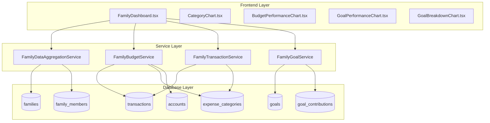

# Family Data Refactor Design Document

## Overview

This design document outlines the comprehensive refactoring of family components to replace mock data with real backend services integration. The refactoring focuses on four critical family dashboard visualizations:

1. **Family Expense Categories** - Category-based spending analysis
2. **Budget vs Actual Spending** - Performance tracking and variance analysis  
3. **Family Goals Progress** - Goal completion and contribution tracking
4. **Goals by Status** - Goal status distribution and health metrics

The refactoring will establish robust data pipelines connecting React frontend components to Supabase backend services, ensuring data consistency and real-time updates across the family collaboration system.

## Architecture

### Current State Analysis

The family dashboard currently operates with mock data and simulation logic embedded within chart components. Key issues identified:

- **CategoryChart.tsx** uses hardcoded expense percentages and artificial subcategory breakdowns
- **BudgetPerformanceChart.tsx** calculates metrics from mock `FamilyInsightData` interface
- **GoalPerformanceChart.tsx** simulates cash flow analysis with static ratios
- **GoalBreakdownChart.tsx** generates synthetic financial health scores

### Target Architecture

The refactored system will implement a three-tier data flow architecture:



### Data Flow Strategy

Each chart component will receive structured data through dedicated service methods:

1. **Real-time Data Aggregation**: Family-scoped queries aggregating member transactions and goals
2. **Contextual Filtering**: Family membership validation and role-based data access
3. **Performance Optimization**: Cached aggregations and efficient query strategies
4. **Error Resilience**: Graceful degradation with fallback data sources

## Data Models & Service Integration

### Family Expense Categories Data Model

The CategoryChart component will transition from mock percentages to real transaction analysis:

| Field | Type | Source | Description |
|-------|------|--------|-------------|
| category_id | UUID | expense_categories.id | Unique category identifier |
| category_name | String | expense_categories.category_name | Category display name |
| total_amount | Decimal | SUM(transactions.amount) | Total family spending in category |
| transaction_count | Integer | COUNT(transactions.id) | Number of transactions |
| percentage_of_total | Decimal | Calculated | Category percentage of total family expenses |
| monthly_budget | Decimal | expense_categories.monthly_budget | Budgeted amount for category |
| variance | Decimal | Calculated | Budget vs actual variance |
| family_member_contributions | Array | Aggregated | Per-member spending breakdown |

**Service Method**: `FamilyDataAggregationService.getFamilyExpenseByCategory(familyId, dateRange)`

**SQL Foundation**:
``sql
-- Aggregates from transactions and expense_categories tables
-- Filters by family_members.family_id with date range
-- Groups by expense_category_id for treemap visualization
```

### Budget Performance Data Model

The BudgetPerformanceChart will derive metrics from actual family financial data:

| Field | Type | Source | Description |
|-------|------|--------|-------------|
| total_family_income | Decimal | SUM(income transactions) | Combined family income |
| total_family_expenses | Decimal | SUM(expense transactions) | Combined family spending |
| budget_utilization | Decimal | Calculated | Percentage of budgets consumed |
| savings_rate | Decimal | Calculated | (Income - Expenses) / Income |
| category_performance | Array | Aggregated | Per-category budget performance |
| family_financial_health | Integer | Calculated | Composite health score (0-100) |
| expense_trend | Array | Time-series | Monthly expense trending |

**Service Method**: `FamilyBudgetService.getFamilyBudgetPerformance(familyId, period)`

### Family Goals Progress Data Model

The goal performance visualization will reflect actual goal contributions and progress:

| Field | Type | Source | Description |
|-------|------|--------|-------------|
| goal_id | UUID | goals.id | Goal identifier |
| goal_name | String | goals.goal_name | Goal display name |
| target_amount | Decimal | goals.target_amount | Goal target value |
| current_amount | Decimal | goals.current_amount | Current progress amount |
| progress_percentage | Decimal | Calculated | (current/target) * 100 |
| family_contributions | Array | goal_contributions | Per-member contribution history |
| days_remaining | Integer | Calculated | Days until target_date |
| status | String | goals.status | Goal status (in_progress, completed, etc.) |
| priority | String | goals.priority | Goal priority level |
| contribution_velocity | Decimal | Calculated | Average daily contribution rate |

**Service Method**: `FamilyGoalService.getFamilyGoalProgress(familyId)`

### Goals by Status Data Model

The status breakdown chart will visualize actual goal distribution with enhanced goal commitment insights:

| Field | Type | Source | Description |
|-------|------|--------|-------------|
| status_category | String | goals.status | Status grouping |
| goal_count | Integer | COUNT(goals) | Number of goals in status |
| total_target_value | Decimal | SUM(target_amount) | Combined target value |
| total_current_value | Decimal | SUM(current_amount) | Combined progress value |
| average_progress | Decimal | Calculated | Average completion percentage |
| status_color | String | UI Config | Chart visualization color |
| goal_commitment_score | Integer | Calculated | Family goal planning discipline (0-100) |
| active_goal_count | Integer | COUNT(active goals) | Number of active goals |
| commitment_level | String | Calculated | Goal planning assessment |
| goal_diversity | Integer | COUNT(DISTINCT category) | Number of different goal categories |
| completion_rate | Decimal | Calculated | Percentage of goals completed |
| average_days_to_completion | Integer | Calculated | Average time to complete goals |

**Service Method**: `FamilyGoalService.getFamilyGoalsByStatus(familyId)`

**Goal Commitment Insights Integration**:
- **Commitment Level Assessment**: 
  - 0 goals: "Set family goals to improve financial planning"
  - 1-2 goals: "Good start - consider adding more goals for better diversification"
  - 3+ goals: "Excellent goal planning and commitment"
- **Goal Diversity Scoring**: Multiple goal categories indicate comprehensive financial planning
- **Completion Rate Analysis**: Historical success rate in achieving goals
- **Planning Discipline**: Consistency in goal creation and maintenance

## Service Layer Architecture

### FamilyDataAggregationService

This service will centralize family-scoped data aggregation with optimized query patterns.

**Core Responsibilities**:
- Family membership validation and authorization
- Cross-table aggregation queries for dashboard metrics
- Real-time data synchronization with WebSocket subscriptions
- Cache management for frequently accessed aggregations

**Key Methods**:

| Method | Parameters | Returns | Description |
|--------|------------|---------|-------------|
| getFamilyExpenseByCategory | familyId, dateRange | CategoryExpenseData[] | Expense categorization analysis |
| getFamilyFinancialSummary | familyId, period | FamilyFinancialSummary | High-level financial overview |
| getFamilyMemberActivity | familyId, limit | MemberActivityData[] | Recent family activity feed |
| subscribeFamilyDataChanges | familyId, callback | Subscription | Real-time data updates |

### FamilyBudgetService

Extends the existing BudgetService with family-specific aggregation capabilities.

**Enhanced Methods**:

| Method | Parameters | Returns | Description |
|--------|------------|---------|-------------|
| getFamilyBudgetPerformance | familyId, period | BudgetPerformanceData | Consolidated budget analysis |
| getFamilyBudgetUtilization | familyId | BudgetUtilizationData | Usage percentage by category |
| getFamilyBudgetTrends | familyId, months | BudgetTrendData[] | Historical budget performance |

### FamilyGoalService

Extends the existing GoalService with family goal collaboration features and goal commitment analysis.

**Enhanced Methods**:

| Method | Parameters | Returns | Description |
|--------|------------|---------|-------------|
| getFamilyGoalProgress | familyId | FamilyGoalData[] | All family goals with progress |
| getFamilyGoalsByStatus | familyId | GoalStatusData[] | Goal distribution by status with commitment insights |
| getFamilyGoalContributions | familyId, goalId | ContributionData[] | Goal contribution history |
| calculateGoalCommitment | familyId | GoalCommitmentData | Goal planning discipline and commitment analysis |
| getFamilyGoalDiversity | familyId | GoalDiversityData | Goal category spread and planning comprehensiveness |

## Component Refactoring Strategy

### CategoryChart.tsx Refactoring

**Current Mock Implementation**:
``typescript
// Hardcoded expense distribution
const expenseCategories = [
  { id: 'housing', name: 'Housing & Utilities', value: totalExpenses * 0.35 },
  { id: 'food', name: 'Food & Groceries', value: totalExpenses * 0.25 }
  // ... more hardcoded categories
];
```

**Target Real Data Implementation**:
``typescript
// Data-driven from actual family expenses
const [categoryData, setCategoryData] = useState<CategoryExpenseData[]>([]);

useEffect(() => {
  async function loadFamilyExpenseCategories() {
    const data = await FamilyDataAggregationService.getFamilyExpenseByCategory(
      familyId, 
      { startDate: monthStart, endDate: monthEnd }
    );
    setCategoryData(data);
  }
  loadFamilyExpenseCategories();
}, [familyId, dateRange]);
```

**Chart Configuration Updates**:
- Treemap data populated from real category totals
- Subcategory drill-down based on transaction details
- Dynamic color coding based on budget variance
- Tooltip enhancement with actual vs budgeted amounts

### BudgetPerformanceChart.tsx Refactoring

**Current Mock Metrics**:
``typescript
// Simulated performance calculations
const savingsRate = ((totalIncome - totalExpenses) / totalIncome) * 100;
const budgetEfficiency = Math.min(100, (100 - Math.abs(budgetUtilization - 80)) * 1.25);
```

**Target Real Metrics**:
``typescript
// Actual family budget performance
const [performanceData, setPerformanceData] = useState<BudgetPerformanceData>();

useEffect(() => {
  async function loadBudgetPerformance() {
    const data = await FamilyBudgetService.getFamilyBudgetPerformance(familyId, 'monthly');
    setPerformanceData(data);
  }
  loadBudgetPerformance();
}, [familyId]);
```

### GoalPerformanceChart.tsx Refactoring

**Current Cash Flow Simulation**:
``typescript
// Artificial expense breakdown
const essentialExpenses = totalExpenses * 0.6;
const discretionaryExpenses = totalExpenses * 0.25;
```

**Target Real Cash Flow**:
``typescript
// Actual family cash flow analysis
const [goalProgressData, setGoalProgressData] = useState<FamilyGoalData[]>([]);

useEffect(() => {
  async function loadGoalProgress() {
    const data = await FamilyGoalService.getFamilyGoalProgress(familyId);
    setGoalProgressData(data);
  }
  loadGoalProgress();
}, [familyId]);
```

### GoalBreakdownChart.tsx Refactoring

**Current Synthetic Health Score**:
``typescript
// Mock health score calculation
let healthScore = 0;
if (savingsRate >= 20) healthScore += 40;
if (budgetUtilization <= 80) healthScore += 30;
```

**Target Real Health Metrics with Goal Commitment**:
``typescript
// Actual family financial health with goal commitment insights
const [healthMetrics, setHealthMetrics] = useState<FamilyHealthMetrics>();
const [goalCommitment, setGoalCommitment] = useState<GoalCommitmentData>();

useEffect(() => {
  async function loadHealthMetrics() {
    const healthData = await FamilyDataAggregationService.getFamilyFinancialSummary(familyId, 'current');
    const commitmentData = await FamilyGoalService.calculateGoalCommitment(familyId);
    
    setHealthMetrics(healthData.healthMetrics);
    setGoalCommitment(commitmentData);
  }
  loadHealthMetrics();
}, [familyId]);
```

**Enhanced Goal Status Visualization**:
- **Goal Commitment Score**: Integrated scoring based on active goals, diversity, and completion rates
- **Planning Discipline Display**: Visual indicators for goal setting consistency
- **Achievement Recognition**: Completion rate badges and historical success metrics
- **Diversification Insights**: Category spread analysis for comprehensive financial planning

## Database Query Patterns

### Family Expense Categories Query

``sql
SELECT 
    ec.id as category_id,
    ec.category_name,
    ec.color,
    ec.icon,
    SUM(t.amount) as total_amount,
    COUNT(t.id) as transaction_count,
    AVG(ec.monthly_budget) as avg_budget,
    ROUND((SUM(t.amount) / total_family_expenses.total) * 100, 2) as percentage_of_total
FROM expense_categories ec
LEFT JOIN transactions t ON t.expense_category_id = ec.id
    AND t.user_id IN (
        SELECT fm.user_id 
        FROM family_members fm 
        WHERE fm.family_id = $1 AND fm.status = 'active'
    )
    AND t.date >= $2 AND t.date <= $3
    AND t.type = 'expense'
CROSS JOIN (
    SELECT SUM(amount) as total
    FROM transactions 
    WHERE user_id IN (
        SELECT user_id FROM family_members 
        WHERE family_id = $1 AND status = 'active'
    )
    AND date >= $2 AND date <= $3
    AND type = 'expense'
) total_family_expenses
WHERE ec.user_id IN (
    SELECT user_id FROM family_members 
    WHERE family_id = $1 AND status = 'active'
)
GROUP BY ec.id, ec.category_name, ec.color, ec.icon, total_family_expenses.total
HAVING SUM(t.amount) > 0
ORDER BY total_amount DESC;
```

### Family Budget Performance Query

``sql
WITH family_transactions AS (
    SELECT 
        t.*,
        CASE WHEN t.type = 'income' THEN t.amount ELSE 0 END as income_amount,
        CASE WHEN t.type = 'expense' THEN t.amount ELSE 0 END as expense_amount
    FROM transactions t
    WHERE t.user_id IN (
        SELECT fm.user_id 
        FROM family_members fm 
        WHERE fm.family_id = $1 AND fm.status = 'active'
    )
    AND t.date >= $2 AND t.date <= $3
),
budget_utilization AS (
    SELECT 
        ec.category_name,
        ec.monthly_budget,
        COALESCE(SUM(ft.expense_amount), 0) as actual_spent,
        CASE 
            WHEN ec.monthly_budget > 0 
            THEN ROUND((COALESCE(SUM(ft.expense_amount), 0) / ec.monthly_budget) * 100, 2)
            ELSE 0 
        END as utilization_percentage
    FROM expense_categories ec
    LEFT JOIN family_transactions ft ON ft.expense_category_id = ec.id
    WHERE ec.user_id IN (
        SELECT user_id FROM family_members 
        WHERE family_id = $1 AND status = 'active'
    )
    GROUP BY ec.id, ec.category_name, ec.monthly_budget
)
SELECT 
    SUM(income_amount) as total_family_income,
    SUM(expense_amount) as total_family_expenses,
    ROUND(AVG(bu.utilization_percentage), 2) as avg_budget_utilization,
    json_agg(
        json_build_object(
            'category', bu.category_name,
            'budget', bu.monthly_budget,
            'actual', bu.actual_spent,
            'utilization', bu.utilization_percentage
        ) ORDER BY bu.actual_spent DESC
    ) as category_performance
FROM family_transactions ft
CROSS JOIN budget_utilization bu
GROUP BY bu.category_name, bu.monthly_budget, bu.actual_spent, bu.utilization_percentage;
```

### Family Goals Progress Query

```sql
WITH family_goals AS (
    SELECT g.*
    FROM goals g
    WHERE (
        -- Personal goals of family members
        g.user_id IN (
            SELECT fm.user_id 
            FROM family_members fm 
            WHERE fm.family_id = $1 AND fm.status = 'active'
        )
        OR 
        -- Family goals
        (g.family_id = $1 AND g.is_family_goal = true)
    )
),
goal_contributions_summary AS (
    SELECT 
        gc.goal_id,
        SUM(gc.amount) as total_contributions,
        COUNT(gc.id) as contribution_count,
        json_agg(
            json_build_object(
                'user_id', gc.user_id,
                'amount', gc.amount,
                'date', gc.contribution_date
            ) ORDER BY gc.contribution_date DESC
        ) as contribution_history
    FROM goal_contributions gc
    WHERE gc.goal_id IN (SELECT id FROM family_goals)
    GROUP BY gc.goal_id
)
SELECT 
    fg.id,
    fg.goal_name,
    fg.target_amount,
    fg.current_amount,
    fg.target_date,
    fg.priority,
    fg.status,
    fg.category,
    ROUND((fg.current_amount / fg.target_amount) * 100, 2) as progress_percentage,
    CASE 
        WHEN fg.target_date IS NOT NULL 
        THEN (fg.target_date - CURRENT_DATE) 
        ELSE NULL 
    END as days_remaining,
    COALESCE(gcs.total_contributions, 0) as total_contributions,
    COALESCE(gcs.contribution_count, 0) as contribution_count,
    gcs.contribution_history
FROM family_goals fg
LEFT JOIN goal_contributions_summary gcs ON fg.id = gcs.goal_id
ORDER BY 
    CASE fg.status 
        WHEN 'in_progress' THEN 1
        WHEN 'not_started' THEN 2
        WHEN 'completed' THEN 3
        ELSE 4
    END,
    fg.priority DESC,
    fg.created_at DESC;
```

### Family Goals by Status with Commitment Analysis Query

```sql
WITH family_goals AS (
    SELECT g.*
    FROM goals g
    WHERE (
        -- Personal goals of family members
        g.user_id IN (
            SELECT fm.user_id 
            FROM family_members fm 
            WHERE fm.family_id = $1 AND fm.status = 'active'
        )
        OR 
        -- Family goals
        (g.family_id = $1 AND g.is_family_goal = true)
    )
),
goal_status_summary AS (
    SELECT 
        fg.status,
        COUNT(*) as goal_count,
        SUM(fg.target_amount) as total_target_value,
        SUM(fg.current_amount) as total_current_value,
        AVG((fg.current_amount / fg.target_amount) * 100) as average_progress,
        COUNT(DISTINCT fg.category) as category_diversity
    FROM family_goals fg
    GROUP BY fg.status
),
goal_commitment_metrics AS (
    SELECT 
        COUNT(*) as total_goals,
        COUNT(CASE WHEN status = 'in_progress' OR status = 'not_started' THEN 1 END) as active_goals,
        COUNT(CASE WHEN status = 'completed' THEN 1 END) as completed_goals,
        COUNT(DISTINCT category) as total_categories,
        AVG(
            CASE WHEN status = 'completed' AND completed_date IS NOT NULL 
            THEN (completed_date - created_date)
            ELSE NULL END
        ) as avg_completion_days
    FROM family_goals
)
SELECT 
    gss.status as status_category,
    gss.goal_count,
    gss.total_target_value,
    gss.total_current_value,
    ROUND(gss.average_progress, 2) as average_progress,
    CASE gss.status
        WHEN 'not_started' THEN '#6c757d'
        WHEN 'in_progress' THEN '#007bff'
        WHEN 'completed' THEN '#28a745'
        WHEN 'cancelled' THEN '#dc3545'
        ELSE '#ffc107'
    END as status_color,
    
    -- Goal commitment insights
    gcm.total_goals,
    gcm.active_goals as active_goal_count,
    CASE 
        WHEN gcm.total_goals = 0 THEN 'Set family goals to improve financial planning'
        WHEN gcm.total_goals <= 2 THEN 'Good start - consider adding more goals for better diversification'
        ELSE 'Excellent goal planning and commitment'
    END as commitment_level,
    
    -- Goal commitment score (0-100)
    LEAST(100, 
        (gcm.active_goals * 20) + 
        (gcm.total_categories * 15) + 
        (CASE WHEN gcm.completed_goals > 0 THEN (gcm.completed_goals::float / gcm.total_goals * 30) ELSE 0 END) +
        (CASE WHEN gss.average_progress > 0 THEN 35 ELSE 0 END)
    ) as goal_commitment_score,
    
    gcm.total_categories as goal_diversity,
    ROUND((gcm.completed_goals::float / NULLIF(gcm.total_goals, 0)) * 100, 2) as completion_rate,
    gcm.avg_completion_days as average_days_to_completion
    
FROM goal_status_summary gss
CROSS JOIN goal_commitment_metrics gcm
ORDER BY 
    CASE gss.status
        WHEN 'in_progress' THEN 1
        WHEN 'not_started' THEN 2
        WHEN 'completed' THEN 3
        ELSE 4
    END;
```

## Real-time Data Synchronization

### WebSocket Integration Pattern

``mermaid
sequenceDiagram
    participant C as Chart Component
    participant S as Service Layer
    participant R as Real-time Service
    participant D as Database
    
    C->>S: Subscribe to family data
    S->>R: Create WebSocket subscription
    R->>D: Listen for table changes
    D-->>R: Transaction inserted
    R-->>S: Data change notification
    S-->>C: Updated chart data
    C->>C: Re-render with new data
```

### Subscription Management

Each chart component will establish real-time subscriptions:

```typescript
// Family expense categories real-time updates
useEffect(() => {
  const subscription = supabase
    .channel(`family-expenses-${familyId}`)
    .on(
      'postgres_changes',
      {
        event: '*',
        schema: 'public',
        table: 'transactions',
        filter: `user_id=in.(${familyMemberIds.join(',')})`
      },
      () => {
        // Refresh category data
        refreshCategoryData();
      }
    )
    .subscribe();
    
  return () => {
    subscription.unsubscribe();
  };
}, [familyId, familyMemberIds]);
```

## Error Handling & Performance

### Graceful Degradation Strategy

1. **Service Unavailability**: Display cached data with staleness indicators
2. **Network Errors**: Show retry mechanisms with exponential backoff
3. **Data Inconsistency**: Validate data integrity with fallback to safe defaults
4. **Permission Errors**: Graceful role-based feature limitation

### Performance Optimization

1. **Query Optimization**: Indexed queries with proper JOIN strategies
2. **Data Caching**: Redis-backed caching for frequently accessed aggregations
3. **Lazy Loading**: Progressive data loading for large family transaction sets
4. **Chart Rendering**: Virtualized rendering for large datasets

### Monitoring & Observability

1. **Service Metrics**: Response times, error rates, cache hit ratios
2. **Data Quality**: Transaction completeness, category mapping accuracy
3. **User Experience**: Chart load times, interaction responsiveness
4. **Family Activity**: Usage patterns, feature adoption rates

## Testing Strategy

### Unit Testing

**Service Layer Testing**:
- Mock Supabase responses for consistent test data
- Validate query parameter construction and SQL generation
- Test error handling scenarios and fallback behaviors
- Confirm data transformation and aggregation logic

**Component Testing**:
- Mock service responses for predictable chart rendering
- Test loading states, error states, and empty data scenarios
- Validate chart configuration updates based on real data
- Confirm real-time subscription lifecycle management

### Integration Testing

**End-to-End Data Flow**:
- Create test family with sample transactions and goals
- Verify chart components reflect actual database changes
- Test real-time updates across multiple family members
- Validate family member role-based data access

**Performance Testing**:
- Large family transaction datasets (1000+ transactions)
- Concurrent family member data access scenarios
- Real-time update performance under load
- Chart rendering performance with complex datasets
