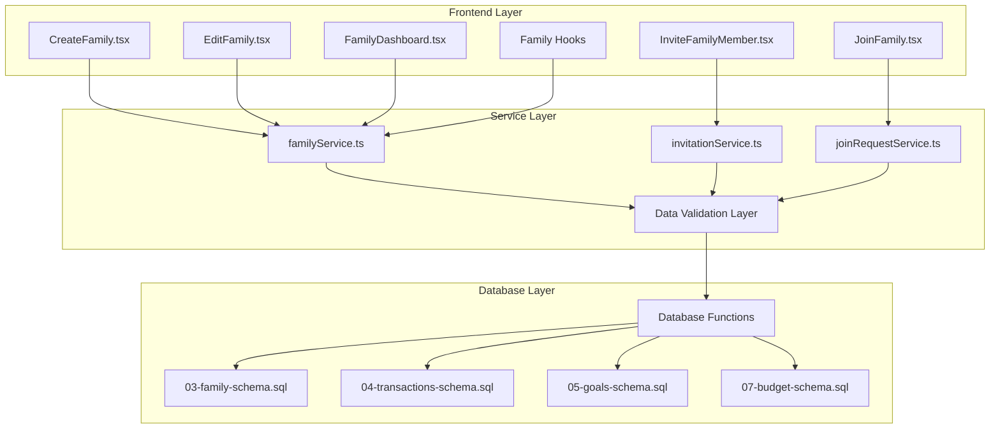

# Family Schema Validation and Component Integration Design

## Overview

This design document outlines the comprehensive validation and mapping strategy for the family management system, addressing critical schema mismatches, database function inconsistencies, and component integration issues. The design focuses on establishing accurate data flow between React components, TypeScript services, and PostgreSQL schemas while ensuring robust error handling and data integrity.

## Architecture

### System Components Integration



### Data Flow Architecture

The family system follows a structured data flow pattern:

1. **Component Validation Layer**: React components validate user input and business rules
2. **Service Abstraction Layer**: TypeScript services handle schema mapping and API calls
3. **Database Function Layer**: PostgreSQL functions ensure atomic operations and data integrity
4. **Schema Integration Layer**: Multiple schemas work together through foreign key relationships

## Critical Schema Validation Issues

### Function Signature Mismatch

**Problem Identified**: The `create_family_with_member` function call in `familyService.ts` has incorrect parameter order and missing parameters.

**Current Implementation**:
- Service calls: `create_family_with_member(p_family_name, p_description, p_currency_pref, p_is_public, p_user_id)`
- Actual function: `create_family_with_member(p_family_name, p_description, p_currency_pref, p_user_id)`

**Validation Strategy**:

| Parameter | Service Expected | Database Function | Status | Action Required |
|-----------|------------------|-------------------|---------|----------------|
| family_name | 1st position | 1st position | ✅ Correct | No change |
| description | 2nd position | 2nd position | ✅ Correct | No change |
| currency_pref | 3rd position | 3rd position | ✅ Correct | No change |
| is_public | 4th position | Not supported | ❌ Missing | Add to function |
| user_id | 5th position | 4th position | ❌ Wrong order | Fix parameter order |

### Schema Relationship Validation

The family system integrates with multiple schemas through these relationships:

**Family-Transaction Integration**:
- Family members can view transactions within shared family context
- Transaction categorization must respect family-wide expense categories
- Goal contributions from family members require proper authorization

**Family-Budget Integration**:
- Family budgets require admin permissions for creation and modification
- Budget categories must align with family-wide expense categories
- Member spending affects family budget calculations

**Family-Goals Integration**:
- Family goals allow collaborative contributions from all active members
- Goal progress tracking must account for contributions from multiple family members
- Achievement notifications should reach all participating family members

## Component Integration Specifications

### CreateFamily Component Validation

**Input Validation Requirements**:

| Field | Type | Validation Rules | Error Handling |
|-------|------|------------------|----------------|
| family_name | string | Min 3 chars, Max 100 chars, No special chars | Display inline error |
| description | string | Max 500 chars, Optional | Display character count |
| currency_pref | string | Always "PHP", Read-only | No user modification |
| is_public | boolean | Default false | Toggle with explanation |

**Database Integration Flow**:
1. Pre-validation: Check user is not already in a family
2. Input sanitization: Clean and validate all user inputs
3. Atomic creation: Use database function for transactional safety
4. Post-creation: Refresh materialized views and update cache
5. Error recovery: Rollback on failure with detailed error messages

### EditFamily Component Validation

**Permission Validation**:
- Only family creators can edit family details
- Validate user ownership before displaying edit form
- Real-time permission checking during form submission

**Change Tracking**:
- Compare current values with original family data
- Highlight modified fields in review mode
- Prevent unnecessary database calls for unchanged data

### Family Service Validation Layer

**Method Signature Standardization**:

```typescript
interface FamilyServiceValidation {
  createFamily(data: FamilyCreateData, userId: string): Promise<ValidationResult<Family>>;
  updateFamily(familyId: string, data: FamilyUpdateData, userId: string): Promise<ValidationResult<Family>>;
  addMember(familyId: string, userId: string, role: FamilyRole): Promise<ValidationResult<FamilyMember>>;
  removeMember(familyId: string, userId: string, adminId: string): Promise<ValidationResult<void>>;
}

interface ValidationResult<T> {
  success: boolean;
  data?: T;
  errors?: ValidationError[];
  warnings?: string[];
}
```

## Database Function Corrections

### Enhanced create_family_with_member Function

The function requires enhancement to support all component requirements:

**Function Parameters**:
- `p_family_name` (TEXT): Family display name
- `p_description` (TEXT): Optional family description  
- `p_currency_pref` (TEXT): Currency preference (default 'PHP')
- `p_is_public` (BOOLEAN): Public visibility setting
- `p_user_id` (UUID): Creator user identifier

**Function Logic Flow**:
1. Validate user is not already in an active family
2. Sanitize and validate input parameters
3. Create family record with proper defaults
4. Add creator as admin member with full permissions
5. Initialize default family settings and permissions
6. Return complete family object with member information

### Family Member Permission Matrix

| Role | Create Goals | Manage Budgets | Invite Members | Edit Family | View Reports |
|------|-------------|----------------|----------------|-------------|--------------|
| Admin | ✅ | ✅ | ✅ | ✅ | ✅ |
| Member | ✅ | ❌ | ❌ | ❌ | ✅ |
| Viewer | ❌ | ❌ | ❌ | ❌ | ✅ |

## Error Handling Strategy

### Component-Level Error Handling

**Form Validation Errors**:
- Display inline validation messages for each field
- Aggregate errors in error summary component
- Prevent form submission until all validations pass
- Provide clear guidance on how to fix validation errors

**Service Communication Errors**:
- Network timeout handling with retry mechanisms
- Database constraint violation mapping to user-friendly messages
- Permission denied errors with explanation and suggested actions
- Graceful degradation when optional features fail

### Database-Level Error Recovery

**Transaction Safety**:
- All family operations wrapped in database transactions
- Automatic rollback on constraint violations or errors
- Compensating actions for partially completed operations
- Audit logging for all family management operations

**Data Integrity Enforcement**:
- Foreign key constraint validation before operations
- Unique constraint checking with meaningful error messages
- Business rule validation at database level
- Trigger-based data consistency maintenance

## Integration Testing Strategy

### Component Integration Tests

**CreateFamily Component**:
- Test successful family creation flow
- Validate error handling for duplicate names
- Verify permission checks work correctly
- Test database rollback on creation failure

**Family Service Tests**:
- Mock database responses for various scenarios
- Test parameter mapping between component and database
- Verify error propagation works correctly
- Test concurrent family operation handling

### Database Integration Tests

**Schema Validation Tests**:
- Verify all foreign key relationships work correctly
- Test cascade delete operations preserve data integrity
- Validate database function parameter matching
- Test materialized view refresh mechanisms

**Performance Validation**:
- Test family operation performance under load
- Validate database index usage for family queries
- Test concurrent family member operations
- Monitor memory usage during family data fetching

## Security Validation Framework

### Input Sanitization

**SQL Injection Prevention**:
- All user inputs passed through parameterized queries
- Input length limits enforced at component and database levels
- Special character filtering for family names and descriptions
- Database function parameter type validation

**Authorization Validation**:
- Role-based access control for all family operations
- Session-based user authentication verification
- Family membership validation before data access
- Admin permission checking for privileged operations

### Data Privacy Protection

**Family Data Access Control**:
- Members can only access their own family data
- Public families have controlled visibility settings
- Invitation system prevents unauthorized family access
- Audit trails for sensitive family operations

## Monitoring and Observability

### Application Metrics

**Family Operation Metrics**:
- Family creation success/failure rates
- Average time for family operations
- Database query performance metrics
- Error frequency by component and operation type

**User Experience Metrics**:
- Form validation error rates
- User abandonment during family creation
- Feature usage patterns within family components
- Performance perceived by users during family operations

### Database Health Monitoring

**Query Performance Tracking**:
- Family-related query execution times
- Database connection pool usage during family operations
- Materialized view refresh performance
- Index usage effectiveness for family queries

**Data Integrity Monitoring**:
- Foreign key constraint violation frequency
- Family member count consistency checks
- Orphaned record detection and cleanup
- Database transaction rollback frequency

## Implementation Phases

### Phase 1: Database Function Correction
- Fix `create_family_with_member` function signature
- Add support for `is_public` parameter
- Implement enhanced error handling in database functions
- Add comprehensive input validation at database level

### Phase 2: Service Layer Enhancement
- Update `familyService.ts` parameter mapping
- Implement standardized error handling patterns
- Add request/response validation schemas
- Enhance logging and debugging capabilities

### Phase 3: Component Integration Validation
- Update component error handling to match service responses
- Implement comprehensive form validation
- Add loading states and user feedback mechanisms
- Integrate real-time validation with database constraints

### Phase 4: Testing and Monitoring
- Implement comprehensive integration test suite
- Add performance monitoring and alerting
- Deploy error tracking and user experience monitoring
- Establish automated database health checks