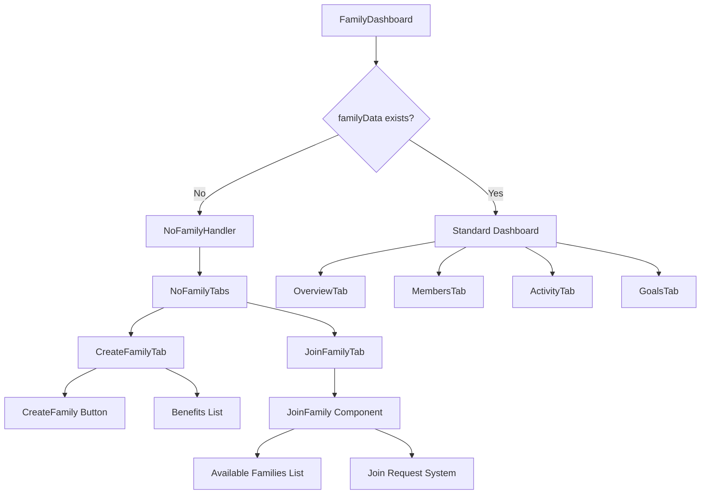
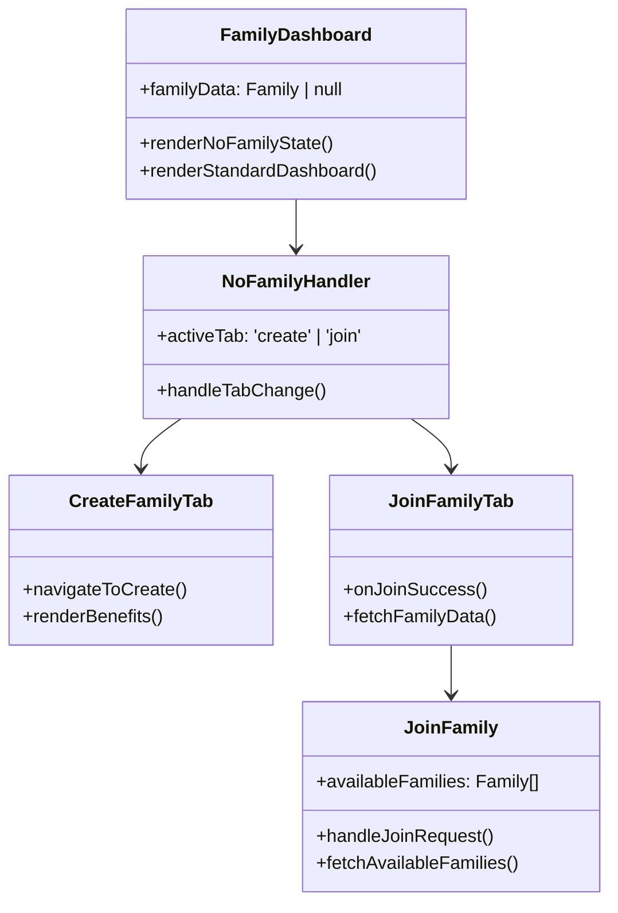
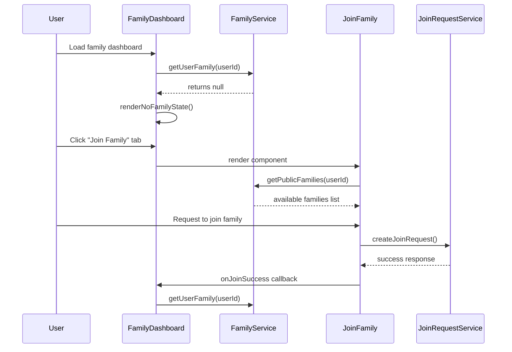
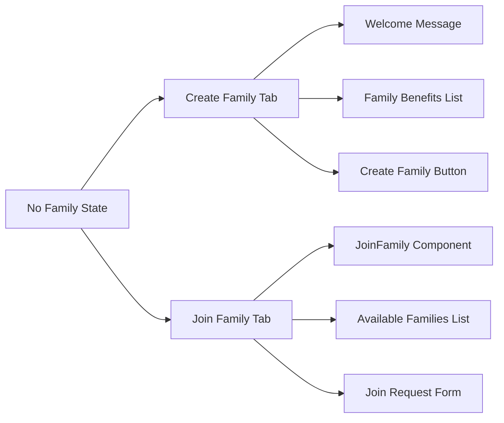

# Family Handling Feature Design

## Overview

This feature enhances the family dashboard user experience by providing proper handling for users who don't have any family membership. When a user doesn't belong to any family, the system will display a dedicated interface with options to either create a new family or join an existing one.

## Technology Stack & Dependencies

- **Frontend Framework**: React 18 with TypeScript
- **UI Components**: Bootstrap, React Bootstrap, Tailwind CSS
- **State Management**: React Context API (useAuth, useToast)
- **Routing**: React Router DOM 6
- **Backend**: Supabase (PostgreSQL + Auth + Realtime)
- **Services**: familyService, joinRequestService
- **Existing Components**: JoinFamily.tsx component

## Component Architecture

### Enhanced FamilyDashboard Component

The FamilyDashboard component will be modified to detect when `familyData` is null and render an appropriate empty state interface instead of the standard dashboard content.



### Component Hierarchy



## API Integration Layer

### Family Service Integration

The component will utilize existing family service methods:

```typescript
interface FamilyServiceMethods {
  getUserFamily(userId: string): Promise<Family | null>
  checkFamilyMembership(userId: string): Promise<FamilyMembershipInfo>
  getPublicFamilies(userId: string): Promise<Family[]>
}
```

### Join Request Service Integration

```typescript
interface JoinRequestServiceMethods {
  createJoinRequest(data: JoinRequestData, userId: string): Promise<JoinRequest>
  getUserJoinRequests(userId: string): Promise<JoinRequest[]>
}
```

## Data Flow Between Layers



## UI Architecture & Navigation

### Empty State Interface Design

When no family data exists, the dashboard will render a tabbed interface:

```typescript
interface NoFamilyState {
  activeTab: 'create' | 'join'
  showCreateFamilyTab: boolean
  showJoinFamilyTab: boolean
}
```

### Tab Structure



### Visual Design Specifications

1. **Header Section**
   - Title: "Family Financial Management"
   - Subtitle: "Start collaborating on your family finances"
   - Icon: Family/users icon

2. **Tab Navigation**
   - Two tabs: "Create Family" and "Join Family"
   - Bootstrap nav-tabs styling
   - Active state indicators

3. **Create Family Tab Content**
   - Hero section with family benefits
   - Call-to-action button to create family
   - Feature highlight cards

4. **Join Family Tab Content**
   - Integration with existing JoinFamily component
   - Available families table
   - Join request status indicators

## Business Logic Layer

### State Management

```typescript
interface FamilyDashboardState {
  familyData: Family | null
  isLoadingFamily: boolean
  noFamilyActiveTab: 'create' | 'join'
  showNoFamilyState: boolean
}
```

### Component Logic Flow

1. **Initial Load**
   - Check user authentication
   - Fetch user's family data via familyService
   - Determine rendering mode based on family existence

2. **No Family State Handling**
   - Display tabbed interface
   - Manage tab switching between create/join options
   - Handle success callbacks for family creation/joining

3. **Success State Transitions**
   - On family creation: redirect to family dashboard
   - On join request: show pending status
   - On join approval: refresh family data and render dashboard

### Event Handling

```typescript
interface NoFamilyEventHandlers {
  handleTabChange: (tab: 'create' | 'join') => void
  handleCreateFamily: () => void
  handleJoinSuccess: () => void
  refreshFamilyData: () => Promise<void>
}
```

## Integration Points

### Existing Component Integration

1. **JoinFamily Component**
   - Reuse existing JoinFamily.tsx component
   - Pass onJoinSuccess callback for state updates
   - Maintain existing functionality for join requests

2. **Family Creation**
   - Integrate with existing family creation flow
   - Navigate to `/family/create` route
   - Handle post-creation redirects

### Service Layer Integration

1. **Family Service**
   - Use existing getUserFamily method
   - Leverage checkFamilyMembership for status checks
   - Utilize getPublicFamilies for join options

2. **Authentication Context**
   - Access current user data
   - Handle authentication state changes
   - Manage user permissions

## Testing Strategy

### Unit Testing Focus Areas

1. **Component Rendering**
   - Test no family state detection
   - Verify tab switching functionality
   - Validate conditional rendering logic

2. **State Management**
   - Test state transitions on family data changes
   - Verify callback handling for join success
   - Test tab persistence across renders

3. **Integration Testing**
   - Test JoinFamily component integration
   - Verify service method calls
   - Test success/error state handling

### Test Cases

```typescript
describe('FamilyDashboard No Family Handling', () => {
  test('renders no family state when familyData is null')
  test('displays create family tab by default')
  test('switches to join family tab correctly')
  test('integrates JoinFamily component properly')
  test('handles join success callback')
  test('refreshes family data after successful join')
})
```

## Implementation Considerations

### Performance Optimizations

1. **Lazy Loading**
   - Load JoinFamily component only when join tab is active
   - Defer family data fetching until needed

2. **Memoization**
   - Memoize tab content to prevent unnecessary re-renders
   - Cache family data to reduce API calls

### Error Handling

1. **Service Errors**
   - Handle family service failures gracefully
   - Display user-friendly error messages
   - Provide retry mechanisms

2. **Network Issues**
   - Implement loading states
   - Handle connection timeouts
   - Show offline indicators when appropriate

### Accessibility Features

1. **Keyboard Navigation**
   - Tab accessibility for keyboard users
   - Focus management between tabs
   - ARIA labels for screen readers

2. **Visual Indicators**
   - Clear active tab states
   - Loading spinners for async operations
   - Error state visual feedback

## Future Enhancements

1. **Improved Onboarding**
   - Step-by-step family setup wizard
   - Interactive tutorials for new users
   - Family invitation workflow improvements

2. **Enhanced Join Experience**
   - Family preview before joining
   - Join request messaging system
   - Real-time join status updates

3. **Social Features**
   - Family discovery improvements
   - Recommendation system for families
   - Family rating and review system