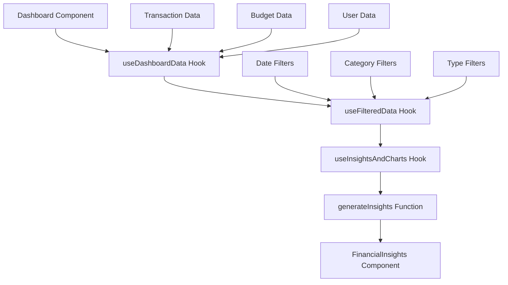

# Financial Insights Fix Design Document

## Overview

The Financial Insights system in the Dashboard component is not displaying insights even though the user has significant expense transactions (negative balance of ₱10,000.00). The issue appears to be related to the insights generation logic and data flow between components.

## Problem Analysis

### Current Issue
- User has monthly expenses of ₱10,000.00 with no income
- Balance is negative ₱10,000.00
- Financial Insights section shows "No Financial Insights Yet" message
- The insights generation system should trigger warning or danger alerts for this financial situation

### Root Cause Investigation
Based on code analysis, the issue stems from:

1. **Insufficient Transaction Data Validation**: The insights generation logic requires specific data structures and may be failing silently
2. **Missing Edge Case Handling**: The system doesn't properly handle scenarios with only expense transactions (no income)
3. **Async Data Flow Issues**: Timing problems between transaction data loading and insights calculation
4. **Filter Dependencies**: The insights calculation depends on filtered transaction data which may not be properly synchronized

## Architecture Analysis

### Current Data Flow


### Insights Generation Logic
The insights generation process involves:

1. **Data Validation**: Check if transactions exist and have valid structure
2. **Financial Calculations**: Calculate income, expenses, and savings rate
3. **Pattern Analysis**: Analyze spending patterns and financial health
4. **Insight Selection**: Prioritize and select relevant insights based on financial situation
5. **Component Rendering**: Display insights in the UI

## Technical Specifications

### Insight Generation Rules

| Financial Situation | Expected Insight Type | Priority | Trigger Condition |
|---|---|---|---|
| No Income, High Expenses | Danger | Critical | expenses > 0 && income = 0 |
| Negative Balance | Warning | High | balance < 0 |
| High Single Expense | Warning | Medium | single expense > 15% of total |
| Spending Growth | Danger | High | 30-day growth > 25% |
| Financial Health Score | Variable | Medium | Based on income/expense ratio |

### Data Validation Requirements

| Validation Check | Purpose | Implementation |
|---|---|---|
| Transaction Array Length | Ensure data exists | transactions.length > 0 |
| Transaction Structure | Validate data integrity | Check required fields (amount, type, date) |
| Numeric Parsing | Handle data type issues | parseFloat validation with fallbacks |
| Date Validation | Ensure proper date filtering | Valid Date object creation |
| Category Mapping | Handle missing categories | Default to 'Uncategorized' |

## Solution Design

### Phase 1: Enhanced Data Validation
- Implement comprehensive input validation for transaction data
- Add debugging logs to track data flow through the insights pipeline
- Create fallback mechanisms for missing or invalid data

### Phase 2: Improved Insights Logic
- Add specific insights for zero-income scenarios
- Implement immediate danger alerts for negative balances
- Create progressive insight triggers based on financial severity

### Phase 3: Synchronization Fixes
- Ensure proper timing between data loading and insights calculation
- Add loading states and error handling
- Implement retry mechanisms for failed insight generation

### Enhanced Insights Rules

#### Critical Financial Alerts
```
Rule: Zero Income with Expenses
Trigger: income = 0 AND expenses > 0
Insight: "Critical: No income recorded"
Type: danger
Description: "You have expenses but no recorded income. Add your income sources to get accurate financial insights."
```

#### Balance-Based Insights
```
Rule: Significant Negative Balance
Trigger: balance < -5000
Insight: "Urgent: Negative balance detected"
Type: danger
Description: "Your expenses exceed income by [amount]. Take immediate action to balance your finances."
```

#### Expense Analysis
```
Rule: Large Single Expense
Trigger: single expense > total_expenses * 0.5
Insight: "Major expense detected"
Type: warning
Description: "A single large expense represents [percentage]% of your total spending."
```

### Component Integration Strategy

#### Data Flow Validation
- Add checkpoints at each data transformation step
- Implement error boundaries for graceful failure handling
- Create debugging utilities for production issue diagnosis

#### Performance Optimization
- Debounce insights calculation to prevent excessive re-renders
- Implement smart caching for recurring calculations
- Add circuit breaker patterns for system stability

## Implementation Strategy

### Immediate Fixes (Priority 1)
1. **Add Zero-Income Handling**: Create specific insights for users with no income records
2. **Implement Negative Balance Alerts**: Trigger danger-level insights for negative balances
3. **Enhanced Debug Logging**: Add comprehensive logging to track insight generation

### Short-term Improvements (Priority 2)
1. **Data Validation Layer**: Implement robust input validation and sanitization
2. **Error Recovery**: Add fallback mechanisms for failed insight generation
3. **User Feedback**: Provide clear messaging when insights cannot be generated

### Long-term Enhancements (Priority 3)
1. **Advanced Analytics**: Implement machine learning-based insight recommendations
2. **Personalization**: Create user-specific insight preferences and customization
3. **Predictive Insights**: Add forecasting capabilities for future financial trends

## Error Handling Strategy

### Input Validation Errors
- Transaction data structure validation
- Numeric value sanitization
- Date format standardization
- Category mapping verification

### Calculation Errors
- Division by zero protection
- NaN and undefined value handling
- Percentage calculation bounds checking
- Currency formatting error recovery

### Rendering Errors
- Component error boundaries
- Graceful degradation for missing insights
- Fallback UI states for data loading failures
- User-friendly error messages

## Testing Strategy

### Unit Testing Focus Areas
- Insights generation logic with various data scenarios
- Edge case handling (zero income, negative balances, empty data)
- Data validation and sanitization functions
- Error recovery mechanisms

### Integration Testing Scenarios
- Full data flow from transaction loading to insight display
- Filter interaction effects on insights
- Real-time data updates and insight refresh
- Performance under various data loads

### User Acceptance Testing Cases
- New user with no transaction history
- User with only expense transactions
- User with mixed income/expense patterns
- User with extreme financial situations (very high/low amounts)

## Performance Considerations

### Calculation Optimization
- Memoization of expensive calculations
- Debounced insight generation
- Smart dependency tracking
- Efficient data structure usage

### Memory Management
- Proper cleanup of event listeners and timers
- Avoiding memory leaks in async operations
- Efficient data caching strategies
- Component unmounting cleanup

### Rendering Performance
- Minimize unnecessary re-renders
- Optimize component update cycles
- Use React.memo for stable components
- Implement virtual scrolling for large datasets