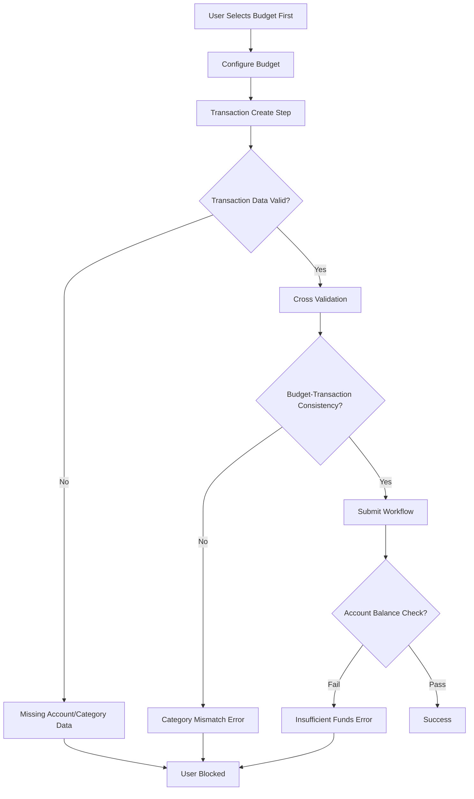
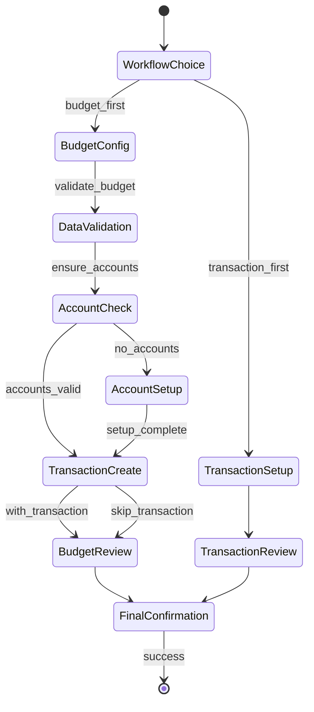
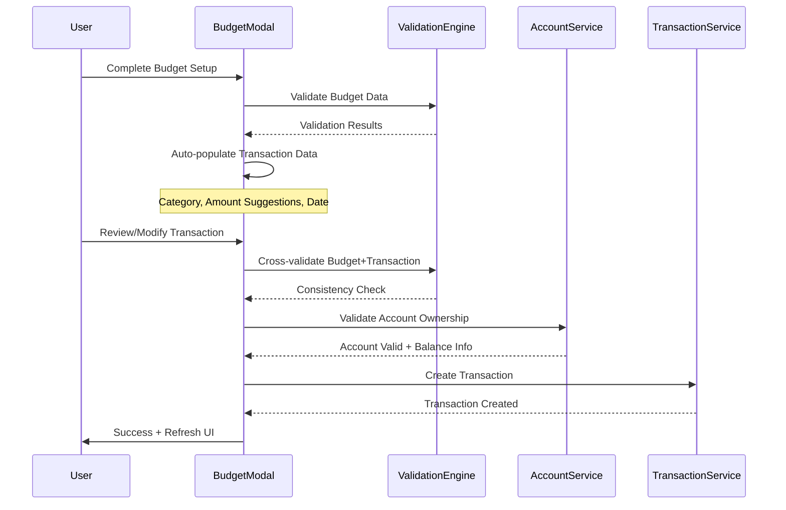
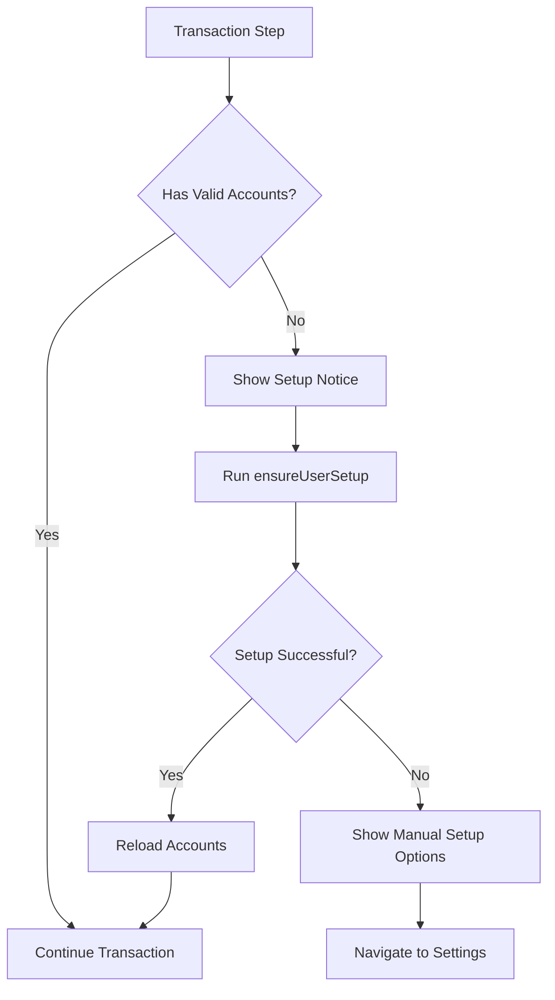

# Fix Budget Setup Transaction Flow

## Overview

This design addresses a critical issue in the budget setup workflow where users who follow the "budget_first" approach cannot properly create initial transactions afterward. The problem stems from incomplete state management, insufficient validation, and missing post-budget transaction creation capabilities.

## Technology Stack & Dependencies

### Core Technologies
- **Frontend Framework**: React with TypeScript
- **State Management**: React hooks and local component state
- **Database**: Supabase (PostgreSQL)
- **Form Validation**: Custom ValidationEngine
- **UI Components**: Custom budget setup modal system

### Key Services
- BudgetService: Budget CRUD operations
- TransactionService: Transaction management
- AccountService: Account validation and balance updates
- UserOnboardingService: Default configuration setup

## Architecture

### Current Budget Setup Flow Issues

The budget setup process involves two workflow types:

1. **Budget First Workflow** (Problematic)
   - Step 1: Choose workflow approach
   - Step 2: Configure budget parameters
   - Step 3: Add initial transaction (Optional)
   - Step 4: Review and confirm
   - **Issue**: Transaction creation fails due to state inconsistencies

2. **Transaction First Workflow** (Working)
   - Step 1: Choose workflow approach  
   - Step 2: Setup transaction
   - Step 3: Review with optional budget creation
   - Step 4: Final confirmation

### Root Cause Analysis



### Problem Areas Identified

1. **State Synchronization Issues**
   - Budget category selection not propagating to transaction form
   - Account data not properly loaded in transaction step
   - Validation errors not properly cleared between steps

2. **Data Validation Gaps**
   - Cross-validation between budget and transaction data incomplete
   - Account ownership validation missing in budget flow
   - Goal assignment validation inconsistent

3. **User Experience Problems**
   - No clear feedback when transaction creation fails
   - Limited guidance for resolving validation errors
   - Missing fallback options when account setup is incomplete

## Component Architecture

### Budget Setup Modal Enhancement

The BudgetSetupModal component requires structural improvements to handle transaction creation properly:

#### State Management Structure

| State Property | Current Issue | Proposed Solution |
|---|---|---|
| `modalState.transactionData` | Not properly initialized from budget data | Auto-populate from budget selection |
| `accounts` | May be empty during budget-first flow | Ensure UserOnboardingService runs first |
| `selectedAccount` | Not validated for sufficient funds | Add balance validation step |
| `categoriesLoading` | Blocks transaction step progression | Add loading state handlers |

#### Step Navigation Flow



### Transaction Creation Enhancement

#### Validation Engine Improvements

The ValidationEngine requires updates to handle budget-first workflow properly:

| Validation Type | Current Behavior | Enhanced Behavior |
|---|---|---|
| Category Matching | Basic category_id check | Enforce budget-transaction category consistency |
| Account Validation | Simple existence check | Ownership + balance + transaction type validation |
| Amount Validation | Static range check | Dynamic validation against budget limits |
| Date Validation | Future date prevention | Budget period alignment verification |

#### Transaction Data Flow



## API Endpoints Reference

### Transaction Creation Endpoint Enhancement

The transaction creation process requires proper error handling and validation:

#### Request Schema Enhancement

| Field | Current Validation | Enhanced Validation |
|---|---|---|
| `account_id` | Exists in accounts table | User ownership + active status |
| `category_id` | Exists in categories table | Matches budget category in budget_first flow |
| `amount` | Range validation | Budget compatibility + account balance check |
| `date` | Not future date | Within budget period range |

#### Response Schema Enhancement

```
Success Response:
{
  success: true,
  data: {
    transaction_id: string,
    updated_account_balance: number,
    budget_utilization?: number
  }
}

Error Response:
{
  success: false,
  error: string,
  validation_details?: {
    field_errors: Record<string, string>,
    suggestions?: string[]
  }
}
```

## Data Models & ORM Mapping

### Enhanced Transaction Model

The transaction creation process needs to account for budget relationships:

| Field | Type | Budget-First Considerations |
|---|---|---|
| `budget_id` | string (optional) | Auto-assign from budget when created via budget_first |
| `category_id` | string | Must match budget category in budget_first workflow |
| `account_id` | string | Validate ownership and sufficient balance |
| `amount` | decimal(15,4) | Warn if exceeds budget amount, validate against account balance |
| `tags` | jsonb | Include budget reference and workflow type |

### Account Balance Validation

Account balance checking must be enhanced for different transaction types:

| Transaction Type | Balance Validation Rule |
|---|---|
| Income | No balance check required |
| Expense | Allow negative balance (user discretion) |
| Contribution (to goals) | Require sufficient balance |

## Business Logic Layer

### Enhanced Budget-First Workflow Logic

#### Pre-Transaction Validation Service

```
interface PreTransactionValidation {
  validateAccountSetup(userId: string): Promise<{
    hasAccounts: boolean,
    defaultAccount?: Account,
    requiresSetup: boolean
  }>
  
  validateBudgetTransactionConsistency(
    budgetData: BudgetFormData,
    transactionData: TransactionFormData
  ): ValidationResult
  
  generateTransactionSuggestions(
    budgetData: BudgetFormData
  ): TransactionSuggestion[]
}
```

#### Account Setup Integration

When users lack accounts during budget setup:

1. **Detection**: Check if user has valid accounts before transaction step
2. **Resolution**: Automatically trigger UserOnboardingService.ensureUserSetup()
3. **Feedback**: Show setup progress to user
4. **Recovery**: Retry transaction step after setup completion

#### Smart Default Population

Automatically populate transaction form based on budget data:

| Budget Field | Auto-populated Transaction Field | Logic |
|---|---|---|
| `category_id` | `category_id` | Direct mapping |
| `amount` | `amount` | Suggest 10%, 25%, 50% of budget amount |
| `start_date` | `date` | Use budget start date or current date |
| `budget_name` | `description` | Generate descriptive text |

### Error Recovery Strategies

#### Account Setup Recovery



#### Validation Error Recovery

| Error Type | Recovery Strategy |
|---|---|
| Category Mismatch | Auto-correct transaction category to match budget |
| Insufficient Funds | Suggest amount adjustment or different account |
| Date Out of Range | Auto-adjust to budget period start date |
| Missing Account | Trigger account setup flow |

## Middleware & Interceptors

### Transaction Creation Middleware

Implement middleware to handle budget-first specific requirements:

#### Budget Context Middleware

```
interface BudgetContextMiddleware {
  attachBudgetContext(transactionData: any): Promise<EnhancedTransactionData>
  validateBudgetCompatibility(transactionData: any): Promise<ValidationResult>
  updateBudgetUtilization(budgetId: string, amount: number): Promise<void>
}
```

#### Account Validation Middleware

Enhanced account validation for budget-first workflows:

1. **Ownership Verification**: Ensure user owns the selected account
2. **Balance Validation**: Check sufficient funds for contribution transactions
3. **Account Status**: Verify account is active and available
4. **Transaction Limits**: Respect any account-specific transaction limits

## Testing Strategy

### Unit Testing Requirements

#### Budget Setup Modal Tests

| Test Category | Test Cases |
|---|---|
| State Management | Auto-population of transaction data from budget |
| Validation Integration | Cross-validation between budget and transaction |
| Error Handling | Account setup failure recovery |
| User Flow | Complete budget-first workflow simulation |

#### Validation Engine Tests

| Test Category | Test Cases |
|---|---|
| Budget-Transaction Consistency | Category matching validation |
| Account Validation | Ownership and balance checking |
| Error Message Generation | User-friendly error descriptions |
| Edge Cases | Missing accounts, invalid categories |

### Integration Testing

#### Budget-First Workflow Integration

```
Test Scenario: Complete Budget-First Flow
1. User selects budget_first workflow
2. Configures budget with specific category and amount
3. System auto-populates transaction form
4. User modifies transaction details
5. System validates consistency
6. Transaction creation succeeds
7. Budget and account balances update correctly
```

#### Account Setup Integration

```
Test Scenario: New User Budget Setup
1. New user without accounts attempts budget setup
2. System detects missing accounts at transaction step
3. UserOnboardingService creates default accounts
4. User can proceed with transaction creation
5. All data persists correctly
```

### Error Scenario Testing

| Error Scenario | Expected Behavior | Success Criteria |
|---|---|---|
| No accounts exist | Trigger automatic setup | User can proceed after setup |
| Category mismatch | Auto-correct or show error | Clear resolution path |
| Insufficient funds | Amount suggestion | User can adjust and proceed |
| Network failure | Retry mechanism | Graceful degradation |


