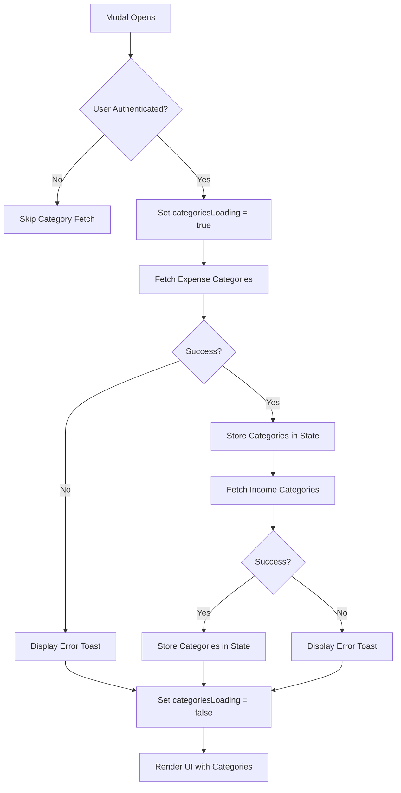

# Fix Category Loading in Budget Setup Modal

## Overview

The Budget Setup Modal is currently experiencing category loading issues where "Loading categories..." text persists indefinitely. This design addresses the problem by replicating the successful category fetching pattern from the CreateBudget component.

## Problem Analysis

### Current Issues

1. **Infinite Loading State**: Categories show "Loading categories..." permanently
2. **Poor State Management**: categoriesLoading state is not properly managed in useEffect dependency array
3. **Recursive Dependencies**: Current useEffect includes categoriesLoading in dependencies, creating potential infinite loops
4. **Inconsistent Pattern**: Different from working implementation in CreateBudget.tsx

### Root Cause

The primary issue is in the useEffect dependency array that includes `categoriesLoading`, causing the effect to re-run continuously:

```
useEffect(() => {
  // ... fetch logic
}, [modalIsOpen, user, categoriesLoading, showErrorToast]);
```

## Architecture Changes

### State Management Restructure

**Before (Problematic)**:
- categoriesLoading included in dependency array
- Potential for infinite re-execution
- Complex dependency management

**After (Fixed)**:
- Remove categoriesLoading from dependencies
- Implement proper loading state management
- Add early return guards for prevent unnecessary fetches

### Category Fetching Pattern

Follow the proven pattern from CreateBudget.tsx:

1. **Initial Loading State**: Set loading to true at function start
2. **User Authentication Check**: Verify user exists before API calls
3. **Sequential Category Fetching**: Fetch expense categories first, then income categories if needed
4. **Proper Error Handling**: Catch and display meaningful error messages
5. **Loading State Cleanup**: Always set loading to false in finally block

## Data Flow Design



## Implementation Strategy

### useEffect Restructure

**Dependency Array Changes**:
- Remove `categoriesLoading` from dependencies
- Keep only `modalIsOpen`, `user`, and `showErrorToast`
- Add early return guard if categories are already loaded

**Loading State Management**:
- Initialize categoriesLoading to false
- Set to true only when starting fetch operation
- Always reset to false in finally block

### Error Handling Enhancement

**User Feedback**:
- Display specific error messages via toast notifications
- Log detailed errors to console for debugging
- Provide fallback empty arrays for categories

**Graceful Degradation**:
- Allow modal to function even if category loading fails
- Show appropriate placeholder text when no categories available
- Enable manual retry mechanism if needed

### Component Rendering Logic

**Loading State Display**:
- Show spinner with "Loading categories..." text only during actual loading
- Replace with category selector once loaded
- Display error state with retry option if fetch fails

**Category Selector Integration**:
- Pass loaded categories to CategorySelector component
- Ensure categoriesLoading prop accurately reflects loading state
- Handle empty category arrays gracefully

## Category State Structure

### Data Models

**Category Interface**:
```
interface Category {
  id: string;
  category_name: string;
  icon?: string;
}
```

**State Variables**:
- `expenseCategories: Category[]` - Expense category list
- `incomeCategories: Category[]` - Income category list
- `categoriesLoading: boolean` - Loading state indicator

### API Integration

**Supabase Query Pattern**:
1. Query expense_categories table with user_id filter
2. Select id, category_name, and optional icon fields
3. Order results by category_name ascending
4. Repeat pattern for income_categories table

**Error Response Handling**:
- Check for Supabase error objects
- Extract meaningful error messages
- Provide user-friendly error descriptions

## Performance Considerations

### Optimization Strategies

**Caching Approach**:
- Consider caching categories to avoid repeated fetches
- Reset cache when modal closes if needed
- Implement stale-while-revalidate pattern for better UX

**Network Efficiency**:
- Fetch categories only when modal opens
- Avoid unnecessary re-fetching during same session
- Implement proper loading indicators

### Memory Management

**Component Cleanup**:
- Reset category states when modal closes
- Prevent memory leaks from unresolved promises
- Clean up any active subscriptions

## Testing Strategy

### Unit Testing Focus

**State Management Tests**:
- Verify loading state transitions correctly
- Test error handling scenarios
- Validate category data structure

**Integration Tests**:
- Test complete category fetching flow
- Verify UI updates correctly based on loading state
- Test error recovery mechanisms

### Manual Testing Scenarios

**Happy Path**:
1. Open modal → categories load successfully
2. Select category → budget creation proceeds
3. Close modal → state resets properly

**Error Scenarios**:
1. Network failure → error message displayed
2. Invalid user session → graceful fallback
3. Empty category response → appropriate UI state

## Migration Path

### Implementation Steps

1. **Update useEffect Dependencies**: Remove categoriesLoading from dependency array
2. **Add Early Return Guards**: Prevent unnecessary fetch operations
3. **Implement Proper Error Handling**: Add try-catch with meaningful messages
4. **Update Loading State Management**: Follow CreateBudget pattern exactly
5. **Test Category Integration**: Verify CategorySelector receives correct props

### Validation Checkpoints

- Modal opens without infinite loading
- Categories appear in dropdown after successful fetch
- Error messages display for network failures
- Loading state resets properly on modal close

## Benefits

### User Experience Improvements

**Immediate Loading Resolution**: Categories load properly without hanging states
**Better Error Communication**: Clear error messages when fetching fails  
**Consistent Behavior**: Matches proven pattern from CreateBudget component

### Developer Experience

**Reliable Pattern**: Uses established, tested category fetching approach
**Maintainable Code**: Consistent patterns across components
**Easier Debugging**: Clear error logging and state management

### System Reliability

**Reduced Bug Surface**: Eliminates infinite loading scenarios
**Better Error Recovery**: Graceful handling of network issues
**Performance Optimization**: Efficient category loading without redundant requests