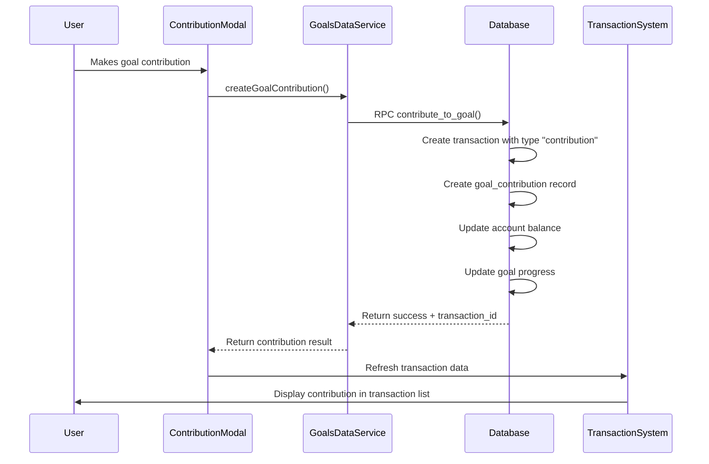
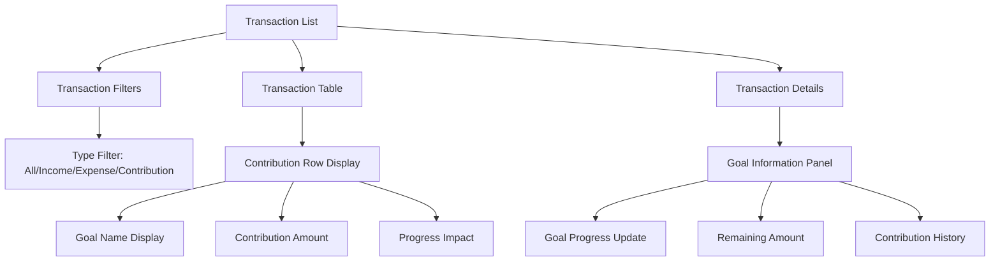
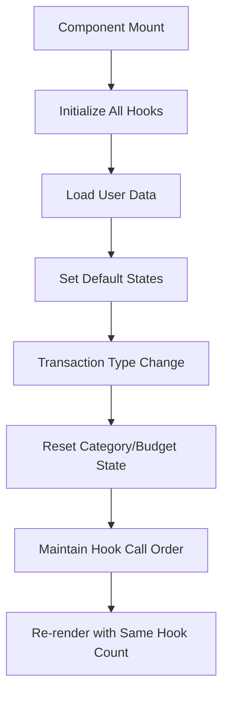

# Fix Contribution Transaction Handling Design Document

## Overview

This design addresses the critical issue where goal contributions are not properly creating transactions with the correct "contribution" type, and are not appearing in the transaction list within the transaction management system. Currently, the `contribute_to_goal` database function creates transactions with type "expense" instead of "contribution", and the frontend transaction components don't properly handle the "contribution" type.

## Technology Stack & Dependencies

- **Backend**: Supabase PostgreSQL with stored procedures (RPC functions)
- **Frontend**: React TypeScript with custom transaction management components
- **Database Schema**: Transactions table with type constraint supporting "contribution"
- **State Management**: React hooks and context for transaction data
- **Integration**: Goal contribution modal and transaction list synchronization

## Architecture

### Current System Issues

| Component | Current Behavior | Expected Behavior |
|-----------|-----------------|-------------------|
| `contribute_to_goal` RPC | Creates transaction with type "expense" | Should create transaction with type "contribution" |
| Transaction Type Definitions | Multiple interfaces missing "contribution" type | All Transaction interfaces should include "contribution" |
| Transaction Components | Don't filter/display contribution transactions | Should recognize and display contribution transactions |
| Transaction Details | May not handle contribution type properly | Should show contribution-specific information |

### Data Flow Architecture



## Core Issues Identification

### 1. Database Function Issue
The `contribute_to_goal` function creates transactions with type "expense" instead of "contribution":

**Current Code Location**: `sql-refactored/05-goals-schema.sql:L248`
**Issue**: Transaction type is hardcoded as 'expense'
**Impact**: Contributions appear as regular expenses in transaction lists

### 2. Frontend Type Definition Inconsistency
Multiple Transaction interface definitions exist with inconsistent type unions:

| File Location | Current Type Union | Missing Type |
|--------------|-------------------|--------------|
| `src/components/transactions/types/index.ts` | "income" \| "expense" | "contribution" |
| `src/components/transactions/EditTransaction.tsx` | "income" \| "expense" | "contribution" |
| `src/components/budget/types.ts` | "income" \| "expense" | "contribution" |
| `src/components/reports/hooks/index.ts` | "income" \| "expense" | "contribution" |

### 3. Transaction Component Handling
Transaction management components don't properly filter, display, or categorize contribution transactions.

## Solution Architecture

### Database Layer Fixes

**Update RPC Function**
Modify the `contribute_to_goal` function to use correct transaction type:

```sql
-- Change from 'expense' to 'contribution'
INSERT INTO public.transactions (
    user_id, date, amount, description, type,
    account_id, goal_id, notes, expense_category_id
) VALUES (
    p_user_id, CURRENT_DATE, p_amount, 
    'Goal contribution: ' || v_goal.goal_name,
    'contribution', p_account_id, p_goal_id, p_notes, v_contribution_category_id
);
```

### Frontend Type System Unification

**Standardize Transaction Interface**
Update all Transaction interfaces to include "contribution" type consistently:

| Component | Required Change |
|-----------|-----------------|
| Transactions Module | Add "contribution" to type union |
| Budget Module | Add "contribution" to type union |
| Reports Module | Add "contribution" to type union |
| Dashboard Module | Verify "contribution" support |
| Family Module | Add "contribution" to type union |

### Transaction Component Enhancements

**Filter and Display Logic**
Enhance transaction components to properly handle contribution transactions:

| Component | Enhancement Required |
|-----------|---------------------|
| Transaction Filters | Add contribution type filtering |
| Transaction Table | Display contribution transactions with goal information |
| Transaction Details | Show contribution-specific metadata |
| Transaction Utils | Update type detection logic |

### Component Architecture Improvements



## Data Models & Integration

### Enhanced Transaction Display Model

| Field | Type | Description |
|-------|------|-------------|
| type | "contribution" | Transaction type for goal contributions |
| goal_id | string | Reference to associated goal |
| goal_name | string | Goal name for display |
| progress_impact | number | Percentage impact on goal progress |
| contribution_category | string | "Contribution" expense category |

### Goal Integration Schema

| Component | Integration Point | Data Flow |
|-----------|------------------|-----------|
| ContributionModal | Creates contribution transaction | goal_id → transaction |
| TransactionList | Displays goal-linked transactions | transaction.goal_id → goal.name |
| GoalDetails | Shows contribution history | goal_id → transactions with type="contribution" |

## API Integration Layer

### Enhanced Transaction Service

**Transaction Data Retrieval**
Ensure transaction services properly fetch and categorize contribution transactions:

```typescript
interface TransactionQuery {
  type?: "all" | "income" | "expense" | "contribution";
  goal_id?: string;
  include_goal_info?: boolean;
}
```

### Goal-Transaction Relationship

**Bidirectional Data Sync**
Maintain consistency between goal contributions and transaction records:

| Operation | Transaction Update | Goal Update |
|-----------|-------------------|-------------|
| Create Contribution | Insert with type="contribution" | Update current_amount |
| Edit Contribution | Update transaction record | Recalculate goal progress |
| Delete Contribution | Remove transaction | Adjust goal current_amount |

## Immediate Implementation Requirements

### Critical React Hook Fix for EditTransaction.tsx

**Missing React Imports**
The EditTransaction component is missing essential React imports causing the "Rendered fewer hooks than expected" error:

```typescript
// REQUIRED: Add this import at the beginning of EditTransaction.tsx
import React, { useState, useEffect, FC, ChangeEvent, FormEvent } from "react";
```

**Current Problem**: The file starts with:
```typescript
import { useNavigate, Link, useParams } from "react-router-dom";
```

**Required Fix**: Should start with:
```typescript
import React, { useState, useEffect, FC, ChangeEvent, FormEvent } from "react";
import { useNavigate, Link, useParams } from "react-router-dom";
```

### Database Function Fix for contribute_to_goal

**Current Issue**: In `sql-refactored/05-goals-schema.sql` line 248:
```sql
'expense', p_account_id, p_goal_id, p_notes, v_contribution_category_id
```

**Required Fix**: Change transaction type to 'contribution':
```sql
'contribution', p_account_id, p_goal_id, p_notes, v_contribution_category_id
```

### Transaction Type Interface Updates

**Files Requiring Type Updates**:

| File | Current Type Union | Required Addition |
|------|-------------------|------------------|
| `src/components/transactions/types/index.ts` | "income" \| "expense" | Add "contribution" |
| `src/components/transactions/EditTransaction.tsx` | "income" \| "expense" | Add "contribution" |
| `src/components/budget/types.ts` | "income" \| "expense" | Add "contribution" |
| `src/components/reports/hooks/index.ts` | "income" \| "expense" | Add "contribution" |
| `src/components/family/types/transaction.types.ts` | "income" \| "expense" | Add "contribution" |

**Example Fix for Transaction Interface**:
```typescript
export interface Transaction {
  id: string;
  date: string;
  amount: number;
  description: string;
  type: "income" | "expense" | "contribution"; // Add "contribution"
  category_id?: string;
  account_id: string;
  created_at: string;
  goal_id?: string;
  user_id: string;
}
```

## React Hook Consistency Issues

### Current Hook Rendering Problems

| Component | Issue | Impact |
|-----------|-------|--------|
| AddTransaction | Conditional hook calls when switching transaction types | "Rendered fewer hooks than expected" error |
| EditTransaction | Missing React imports and FC type definition | TypeScript compilation and runtime errors |
| Transaction Components | Inconsistent hook ordering when state changes | React hook rule violations |

### Hook Architecture Fixes

**Transaction Type Switching Logic**
Ensure all hooks are called unconditionally and consistently:



### Import and Type Safety Requirements

| File | Missing Import | Required Addition |
|------|---------------|------------------|
| EditTransaction.tsx | React, useState, useEffect, FC, ChangeEvent, FormEvent | Complete React imports |
| AddTransaction.tsx | Proper type definitions | Consistent interface definitions |
| Transaction Components | Hook dependency arrays | Proper dependency management |

## Testing Strategy

### Hook Consistency Testing
- Verify consistent hook call count across transaction type changes
- Test component mounting and unmounting without hook errors
- Validate proper cleanup of useEffect hooks

### Database Testing
- Verify `contribute_to_goal` creates transactions with type "contribution"
- Test account balance updates for contribution transactions
- Validate goal progress calculations

### Frontend Component Testing
- Test transaction filtering with contribution type
- Verify contribution transactions display correctly
- Test goal information integration in transaction details
- Test transaction type switching without React errors

### Integration Testing
- End-to-end contribution flow from modal to transaction list
- Test contribution editing and deletion
- Verify consistency between goal and transaction data
- Test transaction type changes across all components

## Business Logic Implementation

### Contribution Transaction Rules

| Rule | Implementation |
|------|----------------|
| Type Classification | All goal contributions must have type="contribution" |
| Category Assignment | Auto-assign to "Contribution" expense category if available |
| Goal Linking | Transaction must include valid goal_id |
| Balance Impact | Contribution reduces account balance (negative impact) |
| Goal Progress | Contribution increases goal current_amount |

### Transaction Display Logic

**Contribution-Specific UI Elements**
- Goal name and progress indicator in transaction rows
- Visual distinction for contribution transactions
- Goal progress impact calculation and display
- Link to goal details from transaction entries

### Error Handling Strategy

| Error Scenario | Handling Approach |
|---------------|------------------|
| Missing goal_id | Display transaction without goal link |
| Invalid goal reference | Show "Unknown Goal" with transaction details |
| Contribution category missing | Create transaction without category_id |
| Transaction-goal inconsistency | Log warning, display available information |