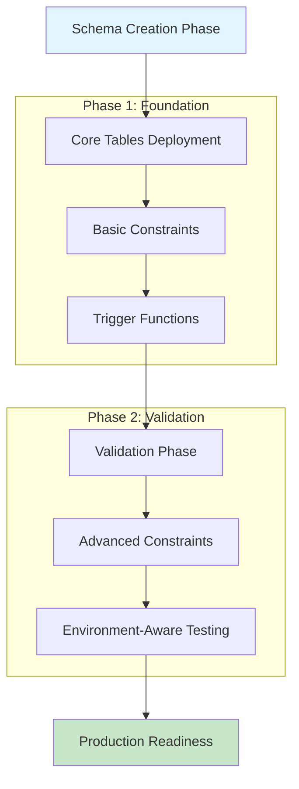
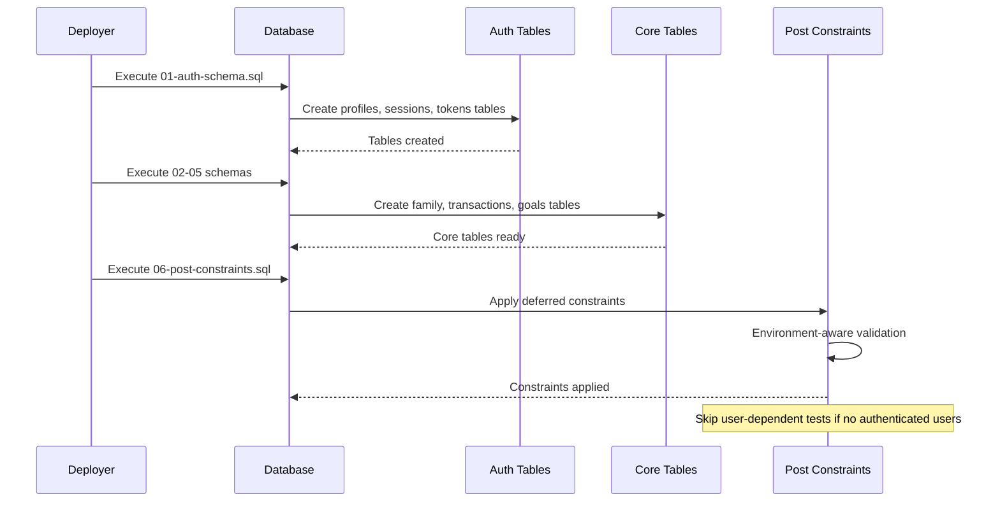
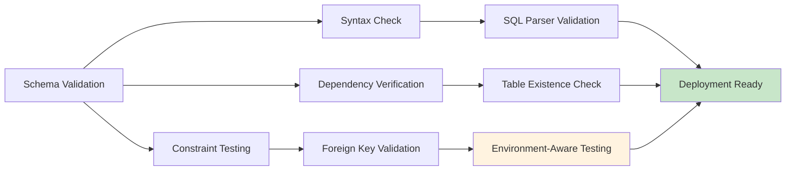

# SQL Schema Fix Design Document

## Overview

This design addresses a critical database schema deployment issue causing user signup failures with the error "AuthApiError: Database error saving new user". The problem stems from constraint validation failures and incomplete schema execution that prevents the authentication trigger functions from working properly.

## Problem Analysis

### Root Cause
The authentication system fails during user signup because:

1. **Schema Execution Dependencies**: Foreign key constraints are being applied before dependent tables exist
2. **Trigger Function Validation**: The `handle_new_user()` trigger attempts to validate references to auth.users during schema deployment when no authenticated session exists
3. **Constraint Validation Logic**: Post-constraint validation tests fail in environments without authenticated users

### Error Manifestation
- **Frontend Error**: "AuthApiError: Database error saving new user"
- **Backend Trigger Failure**: `handle_new_user()` function cannot complete profile creation
- **Schema Deployment**: Constraint validation tests fail during deployment

## Architecture Solution

The solution implements a phased deployment strategy that separates schema creation from constraint validation:

## Data Model Strategy

### Authentication Schema Improvements

The authentication schema requires refinement to handle edge cases during deployment:

| Component | Current Issue | Solution |
|-----------|---------------|----------|
| User Profiles | Direct FK validation during deployment | Conditional validation based on environment |
| Session Management | Assumes auth context exists | Environment-aware session handling |
| Verification Tokens | Rigid constraint validation | Flexible validation with fallbacks |

### Constraint Application Strategy

| Constraint Type | Timing | Validation Method |
|----------------|--------|-------------------|
| Basic FK Constraints | During table creation | Standard SQL validation |
| Cross-Schema References | Post-deployment phase | Environment-aware testing |
| User-Dependent Validations | After user creation | Conditional execution |

## Schema Execution Flow

### Deployment Sequence

The schema deployment follows a strict dependency-aware sequence:

### Environment Detection Logic

The schema implementation includes environment-aware execution:

| Environment | Detection Method | Validation Strategy |
|-------------|------------------|-------------------|
| Development | Check for test users | Full validation suite |
| Staging | Query auth.users table | Conditional validation |
| Production | User count threshold | Conservative validation |

## Trigger Function Architecture

### Enhanced User Creation Handler

The `handle_new_user()` function requires defensive programming:

| Scenario | Current Behavior | Enhanced Behavior |
|----------|------------------|-------------------|
| New User Signup | Direct profile creation | Validation with error handling |
| Concurrent Signups | Potential race conditions | Atomic operations with conflict resolution |
| Validation Failures | Function fails entirely | Graceful degradation with logging |

### Session Management Strategy

| Session Event | Trigger Response | Error Handling |
|---------------|------------------|----------------|
| User Creation | Log initial session | Handle missing device info |
| Login Update | Update last login timestamp | Skip if profile missing |
| Session Cleanup | Remove expired tokens | Batch processing with limits |

## Validation Framework

### Multi-Level Validation Strategy

### Test Execution Strategy

| Test Type | Execution Condition | Failure Response |
|-----------|-------------------|------------------|
| Syntax Validation | Always execute | Stop deployment |
| FK Constraint Tests | Table exists | Log warning, continue |
| User-Dependent Tests | Authenticated users exist | Skip gracefully |

## Error Handling Architecture

### Deployment Error Categories

| Error Type | Detection Method | Recovery Strategy |
|------------|------------------|-------------------|
| Schema Syntax | SQL parser feedback | Fix and redeploy |
| Missing Dependencies | Table existence check | Deploy dependencies first |
| Constraint Violations | FK validation failure | Clean data, reapply constraints |

### Runtime Error Management

| Runtime Scenario | Error Handling | User Experience |
|------------------|----------------|-----------------|
| Trigger Function Failure | Log error, return graceful message | "Account creation delayed, please try again" |
| Constraint Violation | Validate before insert | Prevent invalid data entry |
| Session Management Error | Fallback to basic auth | Limited functionality until resolved |

## Testing Strategy

### Schema Validation Tests

The testing framework includes multiple validation layers:

| Test Category | Scope | Success Criteria |
|---------------|-------|------------------|
| Unit Tests | Individual table creation | Tables exist with correct structure |
| Integration Tests | Cross-table relationships | Foreign keys work correctly |
| Environment Tests | Auth-dependent features | Functions work in live environment |

### User Experience Testing

| Test Scenario | Expected Outcome | Validation Method |
|---------------|------------------|-------------------|
| New User Signup | Profile created successfully | Check profiles table |
| Existing User Login | Session updated correctly | Verify last_login timestamp |
| Error Conditions | Graceful error messages | UI shows helpful feedback |

## Implementation Strategy

### Phase 1: Schema Foundation
- Deploy core authentication tables
- Implement basic constraint validation
- Create defensive trigger functions

### Phase 2: Constraint Application
- Apply deferred foreign key constraints
- Implement environment-aware validation
- Create comprehensive error handling

### Phase 3: Production Optimization
- Performance tuning for constraints
- Monitoring and alerting setup
- User experience validation

## Monitoring and Maintenance

### Deployment Monitoring

| Metric | Monitoring Method | Alert Threshold |
|--------|-------------------|-----------------|
| Schema Deployment Success | Log analysis | Any failure |
| User Creation Success Rate | Database metrics | <95% success |
| Constraint Violation Rate | Error log monitoring | >1% of operations |

### Performance Considerations

| Component | Performance Impact | Optimization Strategy |
|-----------|-------------------|----------------------|
| FK Constraint Validation | Query overhead | Indexed foreign key columns |
| Trigger Function Execution | Insert latency | Optimized validation logic |
| Environment Detection | Deployment time | Cached environment state |

## Risk Mitigation

### Deployment Risks

| Risk | Impact | Mitigation Strategy |
|------|--------|-------------------|
| Schema Corruption | Service outage | Atomic deployment with rollback |
| Data Loss | User data missing | Backup before deployment |
| Performance Degradation | Slow user operations | Constraint optimization |

### User Experience Risks

| Risk | User Impact | Mitigation |
|------|-------------|------------|
| Signup Failures | Cannot create accounts | Enhanced error messages |
| Login Delays | Poor user experience | Optimized session management |
| Data Inconsistency | Confusing application state | Strong validation rules |