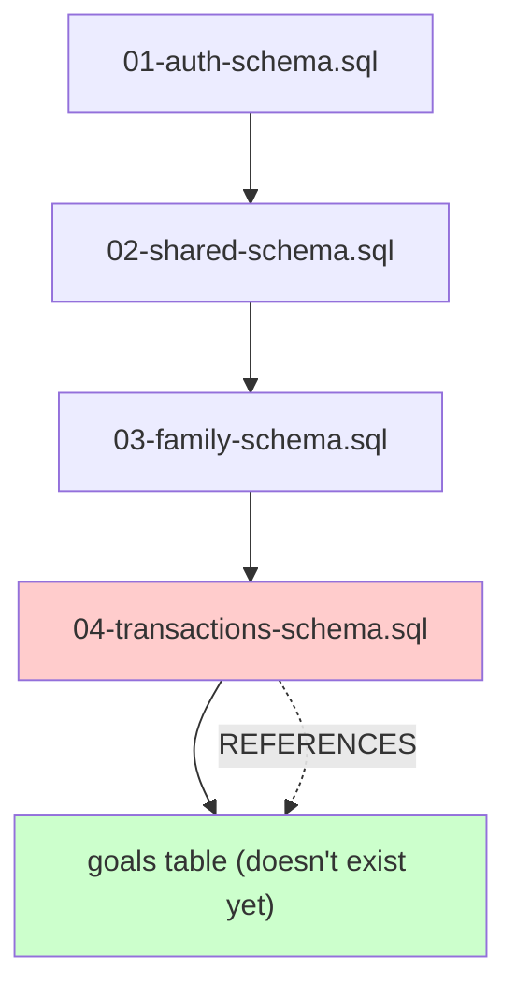
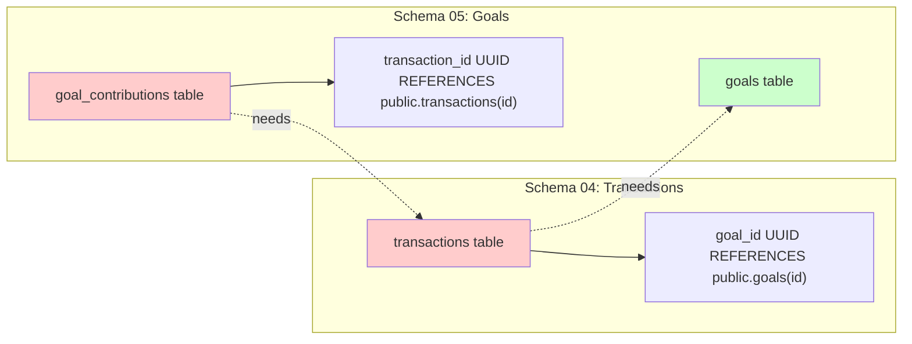
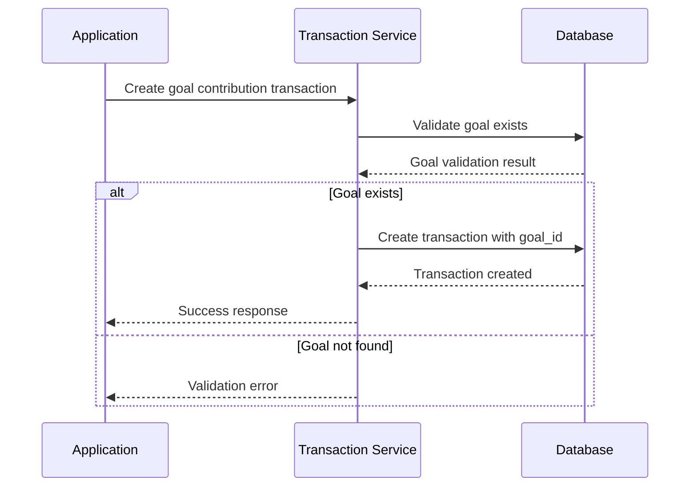
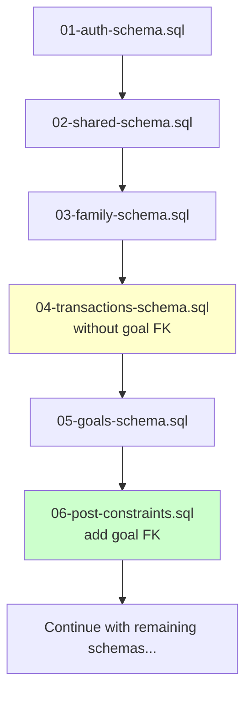

# Fix Transactions Schema Relation Dependencies

## Overview

The transaction schema module contains a circular dependency issue where the `transactions` table references the `goals` table (defined in schema 05) while being executed as schema 04. This creates a "relation does not exist" error during database deployment.

**Problem**: The transactions schema (04-transactions-schema.sql) references `public.goals` table which is defined in the goals schema (05-goals-schema.sql), but the execution order attempts to create this reference before the goals table exists.

**Repository Type**: Full-Stack Application (React + Supabase backend)

## Architecture

### Current Schema Execution Order


### Schema Dependency Analysis

| Schema File | Dependencies | Tables Created | Foreign Key References |
|-------------|--------------|----------------|------------------------|
| 01-auth-schema.sql | None | auth.users (via Supabase) | None |
| 02-shared-schema.sql | 01-auth | utility tables, functions | auth.users |
| 03-family-schema.sql | 01-auth, 02-shared | families, family_members | auth.users |
| 04-transactions-schema.sql | 01-auth, 02-shared, 03-family | accounts, transactions, categories | auth.users, families, **goals** |
| 05-goals-schema.sql | 01-auth, 02-shared, 03-family, **04-transactions** | goals, goal_contributions | auth.users, families, accounts, transactions |

### Circular Dependency Problem



## Solution Strategy

### Option 1: Remove Direct Foreign Key Reference (Recommended)

**Approach**: Modify the transactions table to use a nullable goal reference without enforcing foreign key constraints during schema creation, then add the constraint later.

**Transaction Table Modification**:
- Change `goal_id UUID REFERENCES public.goals(id) ON DELETE SET NULL` to `goal_id UUID`
- Add foreign key constraint after goals table creation
- Maintain data integrity through application-level validation

**Implementation Steps**:
1. Remove direct foreign key reference in transactions schema
2. Create goals schema normally
3. Add foreign key constraint via ALTER TABLE after both schemas exist
4. Update schema documentation to reflect dependency resolution

### Option 2: Schema Reordering (Alternative)

**Approach**: Restructure schema execution order to resolve dependencies naturally.

**New Execution Order**:
1. 01-auth-schema.sql
2. 02-shared-schema.sql  
3. 03-family-schema.sql
4. 04-goals-schema.sql (moved up)
5. 05-transactions-schema.sql (moved down)

**Challenges**: 
- Goals schema references accounts table from transactions schema
- Creates reverse dependency that's equally problematic

### Option 3: Schema Splitting (Complex)

**Approach**: Split schemas into smaller, dependency-aware modules.

**New Structure**:
- 04a-accounts-schema.sql (accounts, categories only)
- 04b-goals-schema.sql (goals table only)
- 04c-transactions-schema.sql (transactions with proper references)
- 04d-goal-contributions-schema.sql (contributions table)

## Recommended Implementation

### Schema Modification Details

**Step 1: Update Transactions Schema (04-transactions-schema.sql)**

Remove direct foreign key constraint:
```sql
-- OLD: Direct foreign key reference
goal_id UUID REFERENCES public.goals(id) ON DELETE SET NULL,

-- NEW: Nullable UUID without constraint
goal_id UUID,
```

**Step 2: Add Constraint in Post-Processing**

Create constraint addition script:
```sql
-- Add after goals schema is created
ALTER TABLE public.transactions 
ADD CONSTRAINT fk_transactions_goal_id 
FOREIGN KEY (goal_id) REFERENCES public.goals(id) ON DELETE SET NULL;
```

**Step 3: Update Validation Logic**

Application-level validation in `transactionService.ts`:
- Verify goal existence before transaction creation
- Handle goal deletion gracefully
- Maintain referential integrity through business logic

### Data Flow Architecture



### Schema Execution Flow



## Data Models

### Updated Transactions Table Structure

| Column | Type | Constraints | Notes |
|--------|------|-------------|-------|
| id | UUID | PRIMARY KEY | Auto-generated |
| user_id | UUID | NOT NULL, FK to auth.users | Required |
| goal_id | UUID | NULL | **No FK constraint initially** |
| account_id | UUID | FK to accounts | Required for most transactions |
| amount | DECIMAL(12,2) | NOT NULL, > 0 | Transaction amount |
| type | TEXT | CHECK constraint | income/expense/transfer/contribution |
| date | DATE | NOT NULL | Transaction date |
| status | TEXT | CHECK constraint | pending/completed/cancelled |

### Constraint Management Strategy

| Phase | Action | Purpose |
|-------|--------|---------|
| Schema Creation | Create tables without cross-schema FKs | Avoid circular dependencies |
| Post-Schema | Add FK constraints via ALTER TABLE | Ensure referential integrity |
| Application Layer | Validate references before operations | Maintain data consistency |
| Testing | Verify constraint enforcement | Ensure integrity is maintained |

## API Integration Layer

### Transaction Service Updates

**Goal Reference Validation**:
- Pre-creation validation of goal existence
- Graceful handling of deleted goals
- Consistent error messaging for invalid references

**Service Method Modifications**:
- `createTransaction()`: Add goal validation step
- `updateTransaction()`: Verify goal reference on updates
- `deleteGoal()`: Handle transaction cleanup appropriately

## Testing Strategy

### Schema Deployment Testing

**Test Scenarios**:
1. Deploy schemas 01-05 in sequence
2. Verify transactions table creation succeeds
3. Confirm goals table creation succeeds
4. Validate constraint addition via ALTER TABLE
5. Test referential integrity enforcement

**Validation Queries**:
```sql
-- Verify transactions table exists without constraint
SELECT constraint_name FROM information_schema.table_constraints 
WHERE table_name = 'transactions' AND constraint_type = 'FOREIGN KEY';

-- Verify constraint added successfully
SELECT constraint_name FROM information_schema.table_constraints 
WHERE table_name = 'transactions' AND constraint_name = 'fk_transactions_goal_id';
```

### Data Integrity Testing

**Test Cases**:
- Create transaction with valid goal_id
- Attempt transaction with invalid goal_id
- Delete goal with associated transactions
- Verify CASCADE/SET NULL behavior

## Migration Strategy

### Deployment Steps

1. **Backup Current State**: Export existing schema and data
2. **Deploy Updated Schema 04**: Remove FK constraint from transactions
3. **Deploy Schema 05**: Create goals table normally
4. **Add Constraints**: Execute ALTER TABLE to add FK constraint
5. **Validate Integrity**: Run validation queries to confirm success
6. **Application Testing**: Verify application functionality

### Rollback Plan

If deployment fails:
1. Restore from backup
2. Revert to original schema files
3. Identify specific failure point
4. Apply targeted fixes based on error analysis

### Monitoring and Validation

**Success Criteria**:
- All schema files execute without errors
- Foreign key constraints exist and function correctly
- Application can create/update/delete transactions and goals
- Referential integrity is maintained
- Performance is not degraded

**Post-Deployment Checks**:
- Verify schema structure matches expectations
- Test transaction and goal operations
- Confirm constraint enforcement
- Monitor for application errors