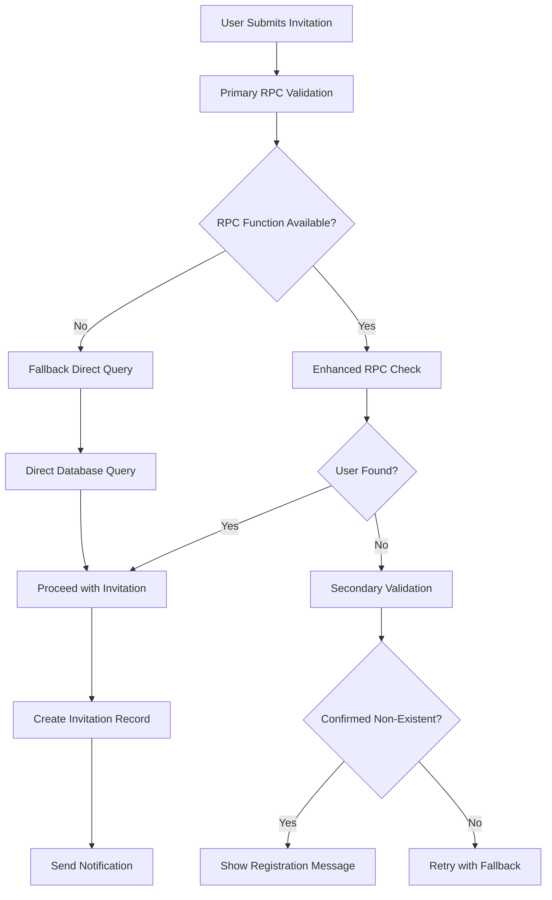
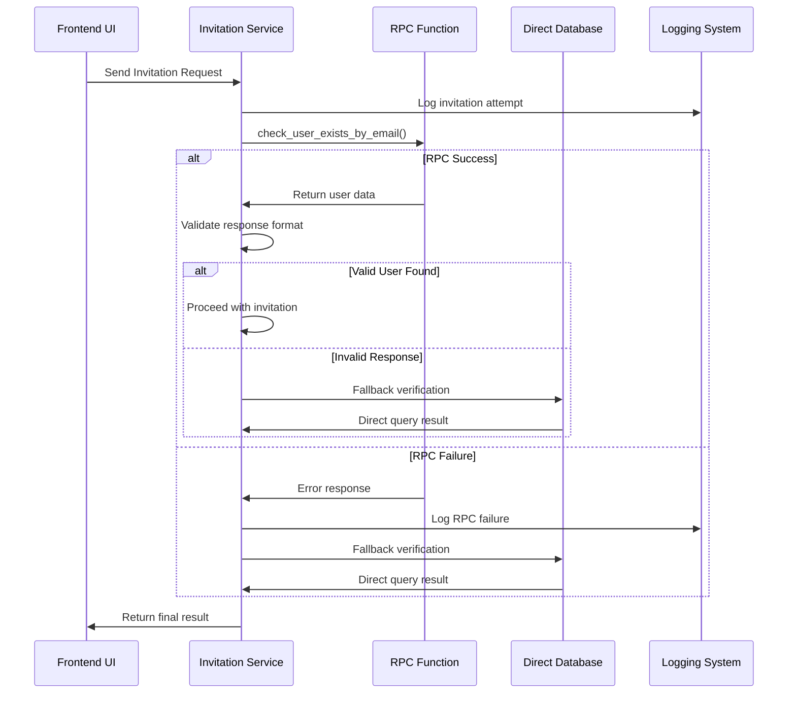
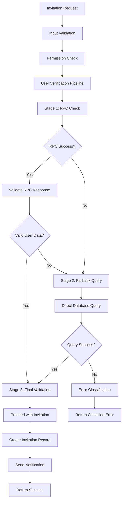

# Fix User Invitation Error - Design Document

## Overview

The family invitation system is experiencing a critical issue where the `check_user_exists_by_email` RPC function incorrectly returns `user_exists: false` for registered users, preventing valid invitations from being sent. This design addresses the root cause and provides a comprehensive solution to ensure reliable user verification for family invitations.

## Architecture

### Current Problem Analysis

The invitation system relies on an RPC function `check_user_exists_by_email` to verify user existence before sending invitations. The function is deployed but returning incorrect results, causing the following error flow:

```
User Input (Valid Email) → RPC Check → FALSE Result → Invitation Rejected
```

### Root Cause Identification

| Issue Category | Problem | Impact |
|----------------|---------|---------|
| **RPC Function Logic** | Function may not be properly querying auth.users table | User verification fails |
| **Database Deployment** | Outdated function version deployed to database | Inconsistent results |
| **Case Sensitivity** | Email normalization issues in function | Case-sensitive email matching fails |
| **Transaction Isolation** | RLS policies interfering with SECURITY DEFINER function | Access denied to auth.users |

### Solution Architecture

The solution implements a multi-layered approach with enhanced validation, fallback mechanisms, and comprehensive error handling:



## Enhanced User Verification System

### Primary Verification Layer

**Enhanced RPC Function Logic**
- Comprehensive email normalization (lowercase, trim)
- Detailed logging for debugging
- Explicit error handling for all scenarios
- Multiple result validation checks

**Function Signature**
```
check_user_exists_by_email(user_email TEXT)
RETURNS TABLE(
    user_exists BOOLEAN,
    user_id UUID,
    email TEXT,
    full_name TEXT,
    email_confirmed BOOLEAN,
    created_at TIMESTAMPTZ
)
```

### Fallback Verification Layer

**Direct Query Mechanism**
When RPC function fails or returns inconsistent results, the system falls back to a direct query approach with proper error handling.

**Validation Criteria**
| Check Type | Validation Rule | Error Handling |
|------------|----------------|----------------|
| **Email Format** | Valid email pattern | Return format error |
| **User Existence** | Record in auth.users table | Check multiple email formats |
| **Email Confirmation** | email_confirmed_at IS NOT NULL | Allow unconfirmed users with warning |
| **Account Status** | No banned/deleted flags | Reject invitation for inactive users |

## Data Flow Enhancement

### Current Flow Issues
1. RPC returns false positive for existing users
2. No fallback verification mechanism
3. Limited error context for debugging
4. No retry logic for temporary failures

### Enhanced Flow Design



## Database Function Improvements

### Enhanced RPC Function Features

**Robust Email Handling**
- Multiple email normalization strategies
- Case-insensitive matching
- Whitespace trimming
- Special character handling

**Comprehensive Logging**
- Input parameter logging
- Query execution logging
- Result validation logging
- Error condition logging

**Error Recovery**
- Graceful exception handling
- Consistent return structure
- Fallback value provision
- Detailed error context

### Function Logic Enhancement

| Enhancement Area | Current State | Improved State |
|------------------|---------------|---------------|
| **Input Validation** | Basic null check | Comprehensive format validation |
| **Query Logic** | Simple WHERE clause | Multiple search strategies |
| **Error Handling** | Basic exception catch | Detailed error categorization |
| **Return Format** | Inconsistent structure | Standardized response object |
| **Logging** | Minimal logging | Comprehensive debug information |

## Frontend Service Layer Improvements

### Enhanced Invitation Service Logic

**Multi-Stage Verification Process**
1. Primary RPC function call with detailed response validation
2. Response format verification and data integrity checks
3. Fallback verification using direct database queries
4. Final validation with user existence confirmation

**Error Classification System**
| Error Type | Classification | User Message | Action |
|------------|---------------|--------------|--------|
| **User Not Found** | Business Logic | "Email not registered, please create account" | Show registration link |
| **RPC Function Error** | System Error | "Verification failed, please try again" | Retry with fallback |
| **Database Error** | Infrastructure | "System temporarily unavailable" | Queue for retry |
| **Permission Error** | Security | "Access denied, contact support" | Log security event |

### Service Architecture Enhancement



## Error Handling Strategy

### Comprehensive Error Management

**Error Detection Layers**
1. **Input Validation Errors** - Invalid email format, missing parameters
2. **RPC Function Errors** - Function not found, permission denied, execution failure
3. **Database Errors** - Connection issues, query timeouts, constraint violations
4. **Business Logic Errors** - User already invited, user in different family

**Error Response Strategy**
| Error Level | Response Strategy | User Experience |
|-------------|------------------|-----------------|
| **Recoverable** | Retry with fallback, log warning | Seamless operation |
| **Temporary** | Queue for retry, show progress | "Processing, please wait" |
| **Permanent** | Clear error message, suggest action | Specific guidance |
| **Critical** | Escalate to support, log incident | "Contact support" |

### Retry Logic Implementation

**Intelligent Retry Mechanism**
- Exponential backoff for temporary failures
- Maximum retry limits to prevent infinite loops
- Different retry strategies for different error types
- User notification for extended processing times

## Testing Strategy

### Unit Testing Requirements

**RPC Function Testing**
- Test with various email formats (uppercase, lowercase, mixed case)
- Test with special characters and international characters
- Test with non-existent emails
- Test error conditions and exception handling

**Service Layer Testing**
- Mock RPC function responses (success, failure, timeout)
- Test fallback mechanism activation
- Test error classification and user messaging
- Test retry logic under various failure scenarios

**Integration Testing**
- End-to-end invitation flow testing
- Database consistency validation
- Performance testing under load
- Error recovery testing

### Test Scenarios

| Test Category | Scenario | Expected Result |
|---------------|----------|-----------------|
| **Happy Path** | Valid registered user email | Invitation sent successfully |
| **User Not Found** | Unregistered email | Clear "create account" message |
| **RPC Failure** | Function unavailable | Fallback mechanism activates |
| **Database Error** | Connection timeout | Appropriate error message |
| **Case Sensitivity** | Mixed case email | Successful case-insensitive match |

## Deployment Plan

### Database Function Deployment

**Step 1: Function Enhancement**
- Deploy improved RPC function with enhanced logging
- Add comprehensive error handling
- Implement multiple email matching strategies

**Step 2: Permission Verification**
- Verify SECURITY DEFINER permissions
- Ensure proper access to auth.users table
- Test function execution under RLS policies

**Step 3: Validation Testing**
- Test function with known user emails
- Verify correct response format
- Validate error handling paths

### Frontend Service Deployment

**Step 1: Service Layer Enhancement**
- Implement enhanced invitation service with fallback logic
- Add comprehensive error handling and classification
- Deploy retry mechanisms

**Step 2: User Interface Updates**
- Update error messaging for better user experience
- Add loading states for retry operations
- Implement progress indicators for extended processing

### Rollback Strategy

**Immediate Rollback Triggers**
- Function returns incorrect results for known users
- Performance degradation beyond acceptable thresholds
- Critical errors affecting system availability

**Rollback Procedure**
1. Revert to previous RPC function version
2. Disable enhanced service features
3. Fall back to simplified verification logic
4. Monitor system stability

## Monitoring and Observability

### Key Metrics

**System Health Metrics**
- RPC function success rate
- Fallback mechanism activation frequency
- Error classification distribution
- User verification accuracy

**Performance Metrics**
- Average invitation processing time
- Database query response times
- Error recovery time
- User experience metrics

### Alerting Strategy

| Alert Type | Trigger Condition | Response Action |
|------------|------------------|-----------------|
| **Critical** | RPC function failure rate > 50% | Immediate investigation |
| **Warning** | Fallback usage > 25% | Function optimization review |
| **Info** | Error rate increase > 10% | Enhanced monitoring |

## Security Considerations

### Access Control Enhancement

**RPC Function Security**
- SECURITY DEFINER with minimal required permissions
- Input sanitization and validation
- SQL injection prevention
- Audit logging for sensitive operations

**Service Layer Security**
- Authentication validation before processing
- Authorization checks for invitation permissions
- Rate limiting for invitation requests
- Suspicious activity detection

### Data Privacy

**Email Handling**
- Secure email normalization without logging
- Temporary data cleanup after processing
- Audit trail for invitation activities
- GDPR compliance for user data handling