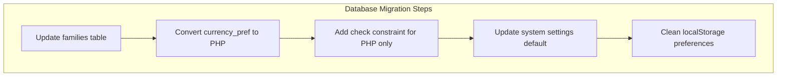
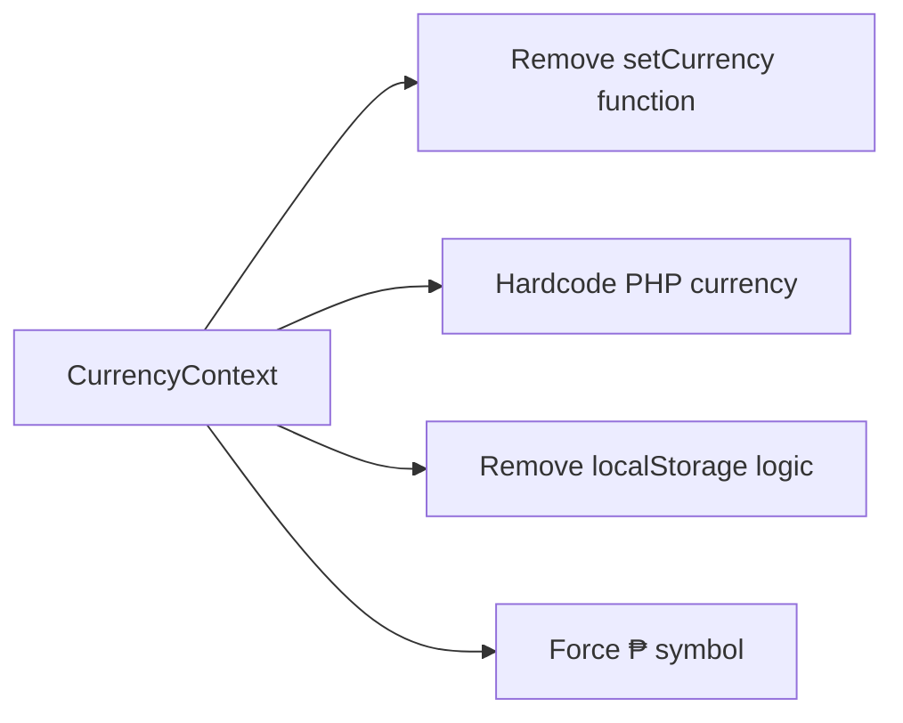

# Force Currency to Philippine Pesos (PHP) Design Document

## Overview

This design document outlines the implementation to force all currencies in the BudgetMe application to Philippine Pesos (PHP), removing all other currency options and converting existing data to PHP. This change will standardize the application to use only PHP as the base currency across all features and user interfaces.

## Architecture

### Current Currency Implementation

The BudgetMe application currently supports multiple currencies through:

1. **CurrencyContext** (`src/utils/CurrencyContext.tsx`) - React context for global currency state
2. **Currency Helper Functions** (`src/utils/helpers.ts`) - Format currency based on user preferences
3. **Family Currency Preferences** (`families.currency_pref` in database) - Family-level currency settings
4. **Admin System Settings** (`defaultCurrency` in admin settings) - System-wide default currency
5. **User Settings** (`localStorage` and settings UI) - Individual user currency preferences

### Target Architecture

The modified architecture will:

1. **Remove Currency Selection Options** from all user interfaces
2. **Force PHP as Default** across all contexts and functions
3. **Convert Existing Data** from other currencies to PHP
4. **Maintain Currency Formatting** but only for PHP (₱ symbol)
5. **Update Database Schema** to enforce PHP-only constraints

## Data Migration Strategy

### Database Schema Changes



### Migration Scripts Required

| Script | Purpose | Target Tables |
|--------|---------|---------------|
| `force-php-currency.sql` | Convert all currency_pref to PHP | `families` |
| `update-system-defaults.sql` | Set system default to PHP | `system_settings` |
| `add-currency-constraints.sql` | Add database constraints | `families` |

## Component Architecture Changes

### Currency Context Modifications



### UI Component Updates

| Component | Change Required | Impact |
|-----------|----------------|---------|
| `CurrencyContext.tsx` | Remove currency switching logic | High |
| `formatCurrency()` | Force PHP formatting only | High |
| `CreateFamily.tsx` | Remove currency dropdown | Medium |
| `EditFamily.tsx` | Remove currency dropdown | Medium |
| `AdminSettings.tsx` | Remove currency options | Medium |
| `PreferencesSettings.tsx` | Remove currency selection | Medium |

## Implementation Details

### Phase 1: Frontend Currency Removal

#### CurrencyContext Updates
- Remove `setCurrency` function
- Hardcode currency to 'PHP'
- Remove localStorage currency persistence
- Force currency symbol to '₱'

#### Helper Function Changes
- Modify `formatCurrency()` to always use PHP
- Remove currency parameter handling
- Ensure consistent ₱ symbol usage

#### UI Component Modifications
- Remove currency dropdown from family forms
- Remove currency selection from user settings
- Remove currency options from admin settings
- Update form validation to exclude currency fields

### Phase 2: Database Schema Enforcement

#### Family Table Constraints
```sql
-- Add check constraint to enforce PHP only
ALTER TABLE families 
ADD CONSTRAINT currency_php_only 
CHECK (currency_pref = 'PHP');

-- Update existing records
UPDATE families 
SET currency_pref = 'PHP' 
WHERE currency_pref != 'PHP';
```

#### System Settings Update
```sql
-- Force system default to PHP
UPDATE system_settings 
SET default_currency = 'PHP';
```

### Phase 3: Data Conversion Strategy

#### Currency Conversion Logic
For existing financial data in non-PHP currencies:
- **Option A**: Convert using static exchange rates (approximate)
- **Option B**: Reset all amounts to zero (data loss but clean start)
- **Option C**: Leave amounts as-is but display in PHP formatting

#### Recommended Approach: Static Conversion
```typescript
const CONVERSION_RATES = {
  'USD': 56.50, // 1 USD = 56.50 PHP (approximate)
  'EUR': 61.75, // 1 EUR = 61.75 PHP (approximate)
  'GBP': 71.25, // 1 GBP = 71.25 PHP (approximate)
  'JPY': 0.38,  // 1 JPY = 0.38 PHP (approximate)
  'CAD': 41.75, // 1 CAD = 41.75 PHP (approximate)
  'AUD': 37.50  // 1 AUD = 37.50 PHP (approximate)
};
```

## Technical Implementation

### Core Function Modifications

#### CurrencyContext.tsx Changes
```typescript
// Remove currency state management
const CurrencyProvider: React.FC<CurrencyProviderProps> = ({ children }) => {
  // Fixed PHP currency - no state needed
  const value = {
    currency: 'PHP',
    currencySymbol: '₱',
    setCurrency: () => {} // No-op function for compatibility
  };

  return (
    <CurrencyContext.Provider value={value}>
      {children}
    </CurrencyContext.Provider>
  );
};
```

#### formatCurrency() Helper
```typescript
export const formatCurrency = (amount: number): string => {
  return '₱' + new Intl.NumberFormat("en-US", {
    style: "decimal",
    minimumFractionDigits: 2,
    maximumFractionDigits: 2,
  }).format(amount);
};
```

### Database Migration Implementation

#### Primary Migration Script
```sql
-- Start transaction for atomicity
BEGIN;

-- Convert all family currency preferences to PHP
UPDATE families SET currency_pref = 'PHP';

-- Add constraint to prevent future non-PHP currencies
ALTER TABLE families 
ADD CONSTRAINT IF NOT EXISTS currency_php_only 
CHECK (currency_pref = 'PHP');

-- Update system default currency
UPDATE system_settings SET default_currency = 'PHP' WHERE id = 1;

-- Remove any cached currency preferences
-- (Application will handle localStorage cleanup)

COMMIT;
```

### Frontend Cleanup Tasks

#### Component Removal Checklist
- [ ] Remove currency dropdowns from family creation/editing
- [ ] Remove currency selection from user preferences
- [ ] Remove currency options from admin system settings
- [ ] Update form validation to exclude currency fields
- [ ] Remove currency-related prop types and interfaces
- [ ] Clean up unused currency constants and mappings

#### State Management Updates
- [ ] Remove currency from global state
- [ ] Remove localStorage currency persistence
- [ ] Remove currency change handlers
- [ ] Update context providers to fixed PHP values

## Testing Strategy

### Unit Testing

| Test Category | Test Cases | Expected Outcome |
|---------------|------------|------------------|
| Currency Formatting | Format various amounts | Always displays ₱ symbol |
| Component Rendering | Family forms without currency dropdown | No currency selection visible |
| Database Constraints | Try to insert non-PHP currency | Constraint violation error |
| Migration Scripts | Run on test data | All currencies converted to PHP |

### Integration Testing

| Integration Point | Test Scenario | Validation |
|------------------|---------------|------------|
| Family Creation | Create new family | Automatically uses PHP |
| User Settings | Access preferences | No currency option shown |
| Admin Panel | Access system settings | Only PHP in defaults |
| Transaction Display | View financial data | All amounts show ₱ symbol |

### User Acceptance Testing

#### Test Scenarios
1. **Existing User Login**: Verify seamless transition to PHP-only interface
2. **New Family Creation**: Confirm no currency selection required
3. **Financial Data Display**: Ensure all amounts show in PHP format
4. **Settings Access**: Verify currency options are removed from all settings

## Deployment Strategy

### Pre-Deployment Checklist
- [ ] Backup all database tables with currency data
- [ ] Test migration scripts on staging environment
- [ ] Verify frontend builds without currency selection components
- [ ] Confirm all tests pass with PHP-only configuration

### Deployment Steps

#### Step 1: Database Migration
1. Execute currency conversion scripts
2. Add database constraints
3. Update system settings
4. Verify data integrity

#### Step 2: Frontend Deployment
1. Deploy updated application code
2. Clear CDN cache for affected components
3. Force browser cache refresh for users

#### Step 3: Post-Deployment Validation
1. Monitor application logs for currency-related errors
2. Verify all financial displays show PHP formatting
3. Confirm no currency selection options are visible
4. Test family and user settings functionality

### Rollback Plan

#### Database Rollback
```sql
-- Remove constraint if rollback needed
ALTER TABLE families DROP CONSTRAINT IF EXISTS currency_php_only;

-- Restore original currency preferences from backup
-- (Requires backup table or exported data)
```

#### Frontend Rollback
- Revert to previous application version
- Restore currency selection components
- Re-enable currency context state management

## Risk Assessment

### High Risk Items
| Risk | Impact | Mitigation |
|------|--------|------------|
| Data conversion errors | Financial data corruption | Comprehensive testing and backup strategy |
| User resistance to change | Reduced user adoption | Clear communication and documentation |
| Currency display bugs | Incorrect financial information | Thorough testing of all currency display components |

### Medium Risk Items
| Risk | Impact | Mitigation |
|------|--------|------------|
| Performance impact | Slower application response | Monitor performance metrics during deployment |
| Third-party integration issues | External service failures | Review all currency-dependent integrations |

### Low Risk Items
| Risk | Impact | Mitigation |
|------|--------|------------|
| UI inconsistencies | Minor visual issues | UI/UX review and testing |
| Documentation gaps | Support difficulties | Update all user and developer documentation |

## Success Metrics

### Technical Metrics
- **Zero currency selection options** visible in any UI component
- **100% PHP formatting** for all financial displays
- **Database constraint enforcement** preventing non-PHP currencies
- **No currency-related errors** in application logs

### User Experience Metrics
- **Seamless transition** for existing users (no disruption to workflow)
- **Consistent financial displays** across all application features
- **Simplified user interface** without currency complexity
- **Maintained data integrity** for all financial information

### Performance Metrics
- **No performance degradation** from currency simplification
- **Reduced complexity** in currency-related code paths
- **Faster rendering** of financial components (fewer conditional checks)

This design ensures a complete transition to PHP-only currency while maintaining data integrity and user experience throughout the BudgetMe application.