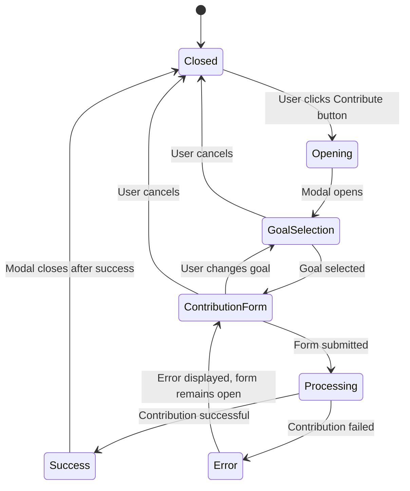

# Goal Contribution Button Modal Design

## Overview

This design outlines the implementation of a goal contribution button within the goals dashboard that will display a modal allowing users to contribute to their goals. The modal will provide functionality similar to the existing `/goals/{id}/contribute` route but accessible directly from the dashboard for improved user experience.

## Architecture

### Component Structure

The implementation follows the existing goals dashboard architecture with the addition of:

- **ContributionModal Component**: Reusable modal for goal contributions
- **Goal Selection Interface**: Dropdown or list interface for goal selection  
- **Contribution State Management**: Modal state and form handling within Goals dashboard
- **Integration with Existing Services**: Utilizes existing `goalsDataService` for contribution logic

### Modal Integration Strategy

The contribution modal will be integrated into the existing Goals dashboard component structure, positioned alongside the Create Goal button in the header actions area, following the consistent button design pattern established in the project.

## Component Architecture

### Enhanced Goals Dashboard Structure

The Goals component will be extended to include:

| Component | Purpose | Location |
|-----------|---------|----------|
| ContributionButton | Trigger button aligned with Create Goal button | Dashboard header |
| GoalContributionModal | Modal container with goal selection and contribution form | Modal overlay |
| GoalSelector | Dropdown or list interface for selecting goals | Within modal |
| ContributionForm | Amount input, account selection, and notes | Within modal |

### Modal State Management



## Data Models

### Modal State Interface

| Field | Type | Description |
|-------|------|-------------|
| isOpen | boolean | Modal visibility state |
| selectedGoalId | string \| null | Currently selected goal ID |
| contributionAmount | string | User input amount |
| selectedAccountId | string | Selected account for contribution |
| contributionNotes | string | Optional contribution notes |
| isSubmitting | boolean | Loading state during submission |
| error | string \| null | Error message display |
| step | 'selection' \| 'contribution' | Current modal step |

### Goal Selection Data

| Field | Type | Description |
|-------|------|-------------|
| id | string | Goal unique identifier |
| goal_name | string | Display name for goal |
| current_amount | number | Current progress amount |
| target_amount | number | Target goal amount |
| percentage | number | Completion percentage |
| status | string | Goal status (active, completed, etc.) |
| remaining_amount | number | Amount remaining to reach target |

## Modal Workflow Design

### User Interaction Flow

```mermaid
flowchart TD
    A[User clicks Contribute button] --> B[Modal opens with goal selection]
    B --> C{Goals available?}
    C -->|Yes| D[Display goal selection interface]
    C -->|No| E[Show "No active goals" message]
    E --> F[Offer to create new goal]
    D --> G[User selects goal]
    G --> H[Show contribution form]
    H --> I[User fills amount and account]
    I --> J[User clicks Contribute]
    J --> K[Validate form data]
    K -->|Valid| L[Process contribution]
    K -->|Invalid| M[Show validation errors]
    M --> H
    L -->|Success| N[Show success message]
    L -->|Error| O[Show error message]
    N --> P[Close modal and refresh goals]
    O --> H
    F --> Q[Navigate to Create Goal page]
```

### Goal Selection Interface

The modal will present goals in a structured format:

| Element | Description |
|---------|-------------|
| Goal Card | Visual representation with progress bar |
| Goal Name | Clear identification |
| Progress Indicator | Current amount / target amount |
| Status Badge | Visual status indicator |
| Selection Action | Radio button or clickable card |

### Contribution Form Interface

Following the existing contribution page design pattern:

| Field | Type | Validation | Description |
|-------|------|------------|-------------|
| Amount Input | Number | Required, > 0, <= remaining | Contribution amount with peso symbol |
| Account Selection | Dropdown | Required | User's available accounts with balances |
| Notes Field | Textarea | Optional | Contribution description |

## Business Logic Layer

### Goal Filtering Logic

Only eligible goals will be displayed in the selection interface:

| Criteria | Rule |
|----------|------|
| Status Filter | Only 'not_started' and 'in_progress' goals |
| Completion Filter | Goals with remaining amount > 0 |
| Access Filter | User-owned goals and accessible family goals |
| Date Filter | Non-expired goals based on target_date |

### Contribution Validation

The system will validate contributions using existing service logic:

| Validation | Rule | Error Message |
|------------|------|---------------|
| Amount Positive | amount > 0 | "Amount must be greater than zero" |
| Sufficient Funds | account.balance >= amount | "Insufficient funds in selected account" |
| Goal Limit | current + amount <= target | "Contribution exceeds goal target" |
| Account Access | account.user_id === user.id | "Invalid account selection" |

### Integration with Existing Services

The modal will utilize the existing `goalsDataService.createGoalContribution()` method:

```
Input Parameters:
- goalId: string
- userId: string  
- contributionData: {
    amount: number
    account_id: string
    notes?: string
  }

Return Value:
- success: boolean
- data?: contribution record
- error?: string
```

## User Interface Design

### Button Placement and Design

The contribution button will be positioned in the Goals dashboard header, adjacent to the Create Goal button, following the established design pattern:

| Element | Specification |
|---------|---------------|
| Button Classes | `btn btn-success shadow-sm mr-2 d-inline-flex align-items-center` |
| Icon | `fas fa-plus-circle mr-2` |
| Text | "Contribute to Goal" |
| Positioning | Right side of header, before Create Goal button |

### Modal Design Specifications

| Component | Design Requirements |
|-----------|-------------------|
| Modal Size | Standard Bootstrap modal-dialog |
| Header | Goal selection or contribution title with close button |
| Body | Two-step interface (selection → contribution) |
| Footer | Action buttons with consistent styling |
| Backdrop | Standard modal backdrop with click-to-close |

### Goal Selection Interface Design

Goals will be presented in a scrollable list format:

| Element | Visual Design |
|---------|---------------|
| Goal Cards | Bootstrap card with border-left color coding |
| Progress Bars | Bootstrap progress component with status colors |
| Selection State | Highlighted border and check icon |
| Empty State | Centered message with Create Goal call-to-action |

### Contribution Form Design

Following the existing GoalContribution component pattern:

| Field | Design Specification |
|-------|---------------------|
| Amount Input | Input group with peso symbol prefix |
| Account Dropdown | Bootstrap select with account name and balance |
| Notes Textarea | Optional field with placeholder text |
| Validation | Inline error messages with red styling |

## Error Handling Strategy

### Modal Error States

| Error Type | Display Strategy | User Action |
|------------|------------------|-------------|
| Network Errors | Toast notification + modal error banner | Retry button |
| Validation Errors | Inline field validation messages | Fix invalid fields |
| Service Errors | Modal error alert with specific message | Close modal or retry |
| Loading Errors | Spinner replacement with error state | Refresh or cancel |

### Fallback Behavior

If the modal experiences critical errors:

| Scenario | Fallback Action |
|----------|-----------------|
| Goal Loading Failure | Close modal, show toast error |
| Account Loading Failure | Disable form, show loading message |
| Contribution Service Unavailable | Redirect to `/goals/{id}/contribute` route |

## Performance Considerations

### Data Loading Strategy

| Data Type | Loading Approach | Caching Strategy |
|-----------|------------------|------------------|
| Goals List | Load on modal open | Cache during session |
| User Accounts | Load on modal open | Cache during session |
| Goal Details | Fetch on selection | Per-goal caching |

### Optimization Techniques

| Technique | Implementation | Benefit |
|-----------|---------------|---------|
| Lazy Loading | Load accounts only when needed | Reduced initial load time |
| Debounced Input | Delay validation on amount input | Reduced API calls |
| Modal Reuse | Single modal instance with state reset | Better performance |

## Integration Points

### Existing Component Integration

| Component | Integration Method | Changes Required |
|-----------|-------------------|------------------|
| Goals.tsx | Add modal state and button | State management addition |
| goalsDataService | Use existing methods | No changes required |
| ToastContext | Error/success notifications | No changes required |
| AuthContext | User authentication | No changes required |

### Navigation Integration

The modal provides an alternative to the existing contribution flow:

| Route | Purpose | Relationship |
|-------|---------|-------------|
| `/goals` | Dashboard with modal | Primary contribution interface |
| `/goals/{id}/contribute` | Dedicated contribution page | Fallback for complex cases |
| `/goals/{id}` | Goal details page | Link to dedicated contribution |

## Testing Strategy

### Unit Testing Requirements

| Component | Test Coverage |
|-----------|---------------|
| ContributionModal | Modal open/close, form validation, submission |
| GoalSelector | Goal filtering, selection state management |
| ContributionForm | Input validation, account selection |
| Modal State Management | State transitions, error handling |

### Integration Testing

| Test Scenario | Expected Behavior |
|---------------|-------------------|
| Modal Opening | Goals load correctly, selection interface displays |
| Goal Selection | Form updates with selected goal information |
| Contribution Submission | Service called correctly, success/error handling |
| Modal Closing | State cleanup, dashboard refresh |

### User Experience Testing

| Test Case | Validation Criteria |
|-----------|-------------------|
| Responsive Design | Modal works on mobile and desktop |
| Accessibility | Keyboard navigation and screen reader support |
| Performance | Modal opens quickly, smooth transitions |
| Error Recovery | Clear error messages, easy recovery paths |