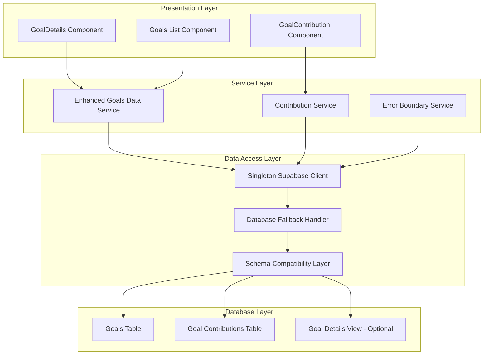
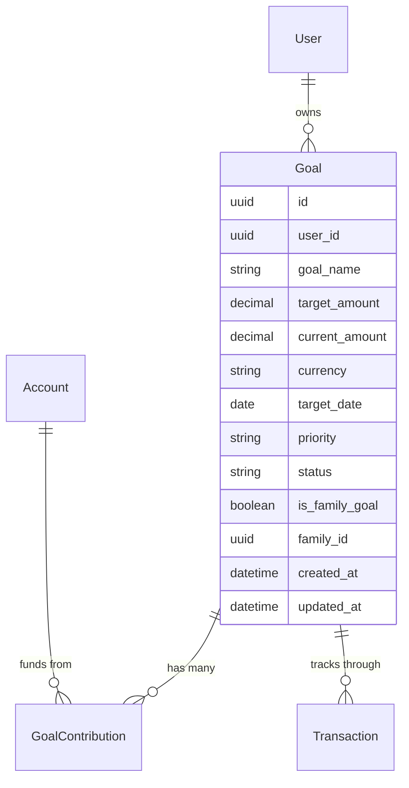
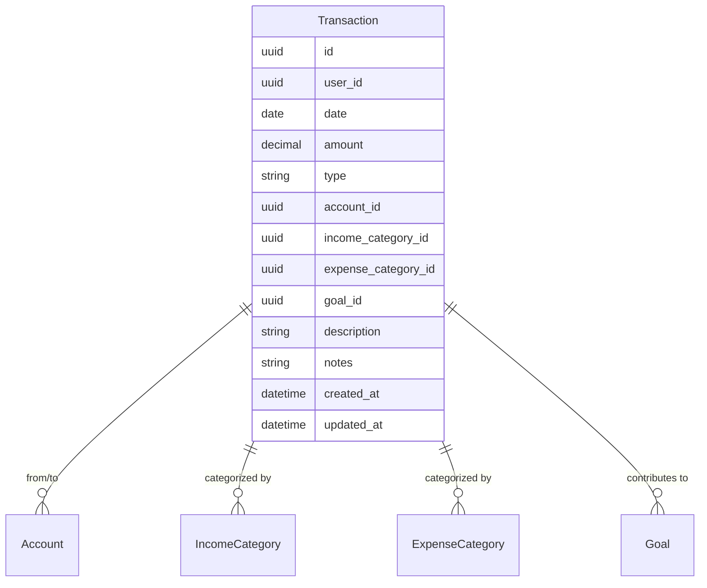
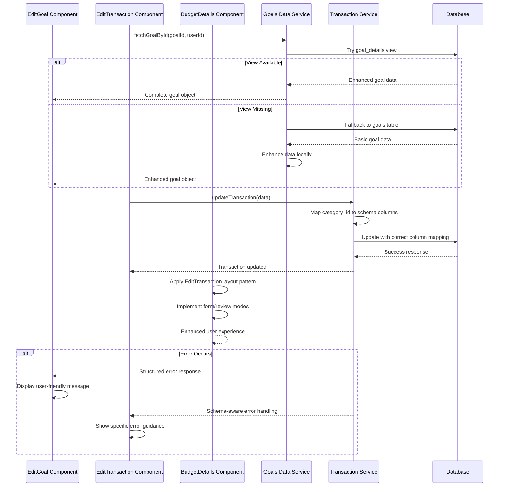
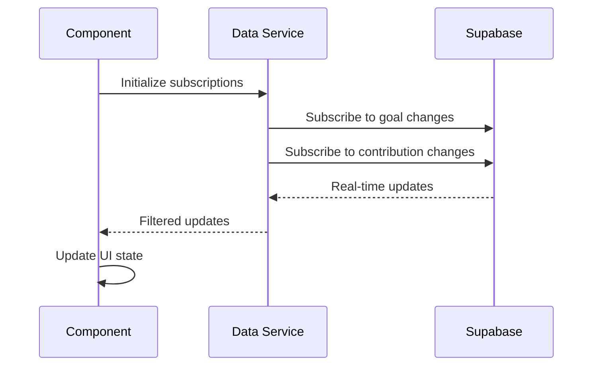

# Goal Data Service Fix Design

## Overview

This design addresses critical issues within the BudgetMe goals components that are causing system failures, including database schema mismatches, Supabase client instance conflicts, and error handling deficiencies. The solution involves implementing robust data access patterns, fixing client initialization, and establishing proper error boundaries.

## Architecture

### Current Issues Analysis

The goals, transactions, and budget component systems are experiencing multiple interconnected failures:

1. **Database Schema Mismatch**: The frontend components expect a `goal_details` view that doesn't exist in the current database deployment
2. **Transaction Schema Mismatch**: EditTransaction component uses non-existent `category_id` column instead of `income_category_id`/`expense_category_id`
3. **Budget Layout Inconsistency**: BudgetDetails component lacks modern form/review layout pattern used in EditTransaction
4. **Multiple Supabase Client Instances**: Creating multiple GoTrueClient instances causing undefined behavior
5. **Weak Error Handling**: Generic "Unknown error" messages during goal contribution failures
6. **Data Service Fragmentation**: Inconsistent data access patterns across goal and transaction components

### Target Architecture

The solution establishes a layered architecture with proper separation of concerns:



## Data Models & Database Compatibility

### Current Schema Structure

The system relies on multiple database objects with varying availability:

**Goals System:**
| Object | Type | Status | Fallback |
|--------|------|--------|----------|
| `goals` | Table | ✅ Available | None needed |
| `goal_contributions` | Table | ✅ Available | None needed |
| `goal_details` | View | ❌ Missing | Enhanced data service |
| `transaction_details` | View | ❌ Missing | Basic transactions table |

**Transactions System:**
| Object | Column | Frontend Expectation | Actual Schema |
|--------|--------|---------------------|---------------|
| `transactions` | `category_id` | ❌ Single category field | ✅ `income_category_id` / `expense_category_id` |
| `transactions` | `type` | ✅ income/expense/transfer | ✅ Matches schema |
| `transactions` | `account_id` | ✅ References accounts | ✅ Matches schema |
| `transactions` | `goal_id` | ✅ Optional goal link | ✅ Matches schema |

### Enhanced Data Model

The enhanced data service will provide consistent data structures regardless of underlying schema availability:

**Goals Data Model:**


**Transactions Data Model:**


## Business Logic Layer

### Enhanced Goals Data Service

The redesigned service implements multiple resilience patterns:

#### Singleton Pattern Implementation
- Eliminates multiple Supabase client instance warnings
- Ensures consistent authentication state across components
- Provides centralized error handling

#### Database Fallback Strategy
1. **Primary Path**: Attempt to query `goal_details` view
2. **Fallback Path**: Query basic `goals` table with client-side enhancement
3. **Error Recovery**: Graceful degradation with user-friendly messaging

#### Single Goal Fetching
The service provides a `fetchGoalById()` method that:
- Attempts to fetch from `goal_details` view first
- Falls back to basic `goals` table if view is unavailable
- Performs permission validation
- Enhances basic data when necessary
- Returns consistent error messages for UI handling

#### Data Enhancement Pipeline
When falling back to basic tables, the service enriches data with calculated fields:
- `remaining_amount`: target_amount - current_amount
- `percentage_complete`: Safe percentage calculation avoiding division by zero
- `progress_status`: Categorized status based on completion percentage
- `formatted_amounts`: Currency-formatted display values

### Contribution Processing Service

#### Transaction Orchestration
The contribution process requires coordinated updates across multiple tables:

1. **Validation Phase**
   - Account balance verification
   - Goal ownership confirmation
   - Amount validation

2. **Transaction Phase**
   - Goal contribution record creation
   - Transaction record creation
   - Account balance update
   - Goal progress update

3. **Notification Phase**
   - Success confirmation
   - Real-time subscription updates
   - Error handling and rollback

#### Error Handling Strategy

| Error Type | User Message | Technical Action |
|------------|--------------|------------------|
| Insufficient Funds | "Insufficient balance in selected account" | Prevent submission |
| Goal Not Found | "Goal no longer exists or permission denied" | Redirect to goals list |
| Database Connection | "Service temporarily unavailable" | Retry mechanism |
| Schema Missing | "System updating, please try again" | Graceful degradation |

## Component Architecture

### Component Architecture

#### EditGoal Component Fix
The EditGoal component currently bypasses the data service and directly queries the database, causing schema mismatch errors. The solution involves:

1. **Replace Direct Database Calls**: Remove direct `supabase.from('goal_details')` calls
2. **Use Enhanced Data Service**: Implement `fetchGoalById()` method with fallback logic
3. **Consistent Error Handling**: Provide user-friendly error messages
4. **Permission Validation**: Centralize access control logic

#### EditTransaction Component Fix
The EditTransaction component attempts to update non-existent `category_id` column. The solution involves:

1. **Schema-Aware Updates**: Map `category_id` to appropriate `income_category_id` or `expense_category_id`
2. **Type-Based Category Selection**: Automatically determine correct category column based on transaction type
3. **Validation Logic**: Ensure category selection matches transaction type
4. **Backward Compatibility**: Maintain existing component interface while fixing backend calls

#### BudgetDetails Component Layout Enhancement
The BudgetDetails component lacks the modern form/review pattern used in EditTransaction. The solution involves:

1. **Consistent Layout Architecture**: Implement card-based layout with proper spacing and animation
2. **Form/Review Mode Pattern**: Add edit modes similar to EditTransaction for budget modifications
3. **Responsive Design**: Ensure mobile-friendly layout with proper grid system
4. **Interactive Elements**: Add tooltips, loading states, and error boundaries
5. **Visual Hierarchy**: Implement consistent typography and color schemes
6. **Animation Integration**: Add smooth transitions and loading animations

#### Component Data Flow


### Error Boundary Implementation

Each goal component will be wrapped with error boundaries providing:
- Graceful error recovery
- User-friendly error messages
- Fallback UI components
- Error reporting for debugging

### State Management Pattern

#### Local State Structure
```typescript
interface GoalComponentState {
  loading: boolean;
  error: string | null;
  goal: Goal | null;
  contributions: GoalContribution[];
  userAccounts: Account[];
  familyStatus: FamilyStatus;
  fallbackMode: boolean;
}

interface TransactionComponentState {
  loading: boolean;
  error: string | null;
  transaction: Transaction | null;
  viewMode: "form" | "review";
  isSubmitting: boolean;
  userData: UserData;
  originalTransaction: Transaction | null;
}

interface BudgetComponentState {
  loading: boolean;
  error: string | null;
  budget: Budget | null;
  viewMode: "view" | "edit" | "review";
  isSubmitting: boolean;
  relatedTransactions: Transaction[];
  chartData: ChartConfig[];
}
```

#### Loading States Management
- Initial loading with skeleton UI components
- Progressive data loading with partial rendering
- Real-time updates through Supabase subscriptions
- Optimistic UI updates for better user experience
- Consistent loading patterns across goals, transactions, and budgets

#### Form/Review Mode Implementation
Standardized pattern for edit components:
1. **Form Mode**: Interactive editing with validation
2. **Review Mode**: Confirmation view before submission
3. **Loading Mode**: Processing states with progress indicators
4. **Error Mode**: User-friendly error display with recovery options

### Real-time Subscription Architecture

#### Subscription Strategy


#### Subscription Lifecycle Management
- Automatic cleanup on component unmount
- Subscription deduplication for performance
- Error recovery for failed subscriptions
- Rate limiting for update frequency

## API Integration Layer

### Enhanced Supabase Client Configuration

#### Singleton Client Implementation
```typescript
interface SupabaseClientConfig {
  auth: {
    autoRefreshToken: boolean;
    persistSession: boolean;
    detectSessionInUrl: boolean;
    flowType: string;
    storageKey: string;
  };
  global: {
    headers: Record<string, string>;
  };
}
```

#### Connection Management
- Centralized client initialization
- Authentication state persistence
- Automatic session refresh
- Connection health monitoring

### Database Query Optimization

#### Query Strategy Matrix

| Operation | Primary Query | Fallback Query | Cache Strategy |
|-----------|---------------|----------------|----------------|
| Goal List | goal_details view | goals + enhancement | Component-level |
| Goal Detail | goal_details + contributions | goals + contributions | Real-time updates |
| Single Goal Edit | goal_details by ID | goals by ID + enhancement | No cache |
| Transaction Edit | transactions with schema mapping | Direct column updates | No cache |
| Contribution | RPC function | Manual transaction | No cache |
| Transaction History | transaction_details | transactions table | Session cache |

#### Performance Considerations
- Query result caching at component level
- Batch operations where possible
- Optimistic updates for better UX
- Lazy loading for large datasets

## Testing Strategy

### Unit Testing Approach

#### Data Service Testing
- Mock database responses for different schema states
- Test fallback mechanisms thoroughly
- Validate data enhancement logic
- Verify error handling paths

#### Component Testing
- Test loading states and transitions
- Verify error boundary functionality
- Test user interaction flows
- Validate real-time update handling

### Integration Testing Scenarios

| Scenario | Test Case | Expected Outcome |
|----------|-----------|------------------|
| Schema Available | Query goal_details view | Enhanced data returned |
| Schema Missing | Query fails, fallback triggered | Basic data with enhancements |
| Network Error | Connection failure | Graceful error display |
| Authentication Error | Session expired | Redirect to login |
| Contribution Success | Complete contribution flow | UI updates, notifications |
| Contribution Failure | Various failure modes | Appropriate error messages |

### Error Recovery Testing
- Database connection failures
- Schema migration scenarios
- Authentication token expiration
- Network connectivity issues
- Invalid data scenarios

## Implementation Phases

### Phase 1: Foundation (Critical Path)
1. **Supabase Client Singleton**: Eliminate multiple instance warnings
2. **Enhanced Data Service**: Implement fallback mechanisms and `fetchGoalById()` method
3. **Fix EditGoal Component**: Replace direct database calls with data service usage
4. **Fix EditTransaction Component**: Implement schema-aware category column mapping
5. **Modernize BudgetDetails Layout**: Apply EditTransaction design patterns to budget components
6. **Error Boundaries**: Wrap components with proper error handling
7. **Basic Contribution Flow**: Fix primary user journey

### Phase 2: Robustness
1. **Real-time Subscriptions**: Implement proper lifecycle management
2. **Advanced Error Handling**: Comprehensive error categorization
3. **Performance Optimization**: Implement caching and query optimization
4. **User Experience**: Loading states and optimistic updates
5. **Layout Consistency**: Standardize form/review patterns across all edit components

### Phase 3: Enhanced Features
1. **Family Goal Support**: Multi-user contribution handling
2. **Advanced Analytics**: Goal progress tracking and insights
3. **Notification System**: Success and milestone notifications
4. **Data Export**: Goal and contribution data export capabilities

## Success Metrics

### Technical Metrics
- Zero "Multiple GoTrueClient instances" warnings
- Sub-200ms response time for goal data loading
- 99%+ success rate for contribution submissions
- Zero unhandled exceptions in goal components
- Successful goal editing without schema cache errors
- Successful transaction editing without category_id column errors
- Consistent layout patterns across all components
- Mobile-responsive design implementation

### User Experience Metrics
- Elimination of "Unknown error" messages for goals, transactions, and budgets
- Consistent data display regardless of schema state
- Real-time updates functioning correctly
- Smooth contribution and transaction editing flow completion
- Unified design language across all financial management components
- Improved accessibility and mobile experience

### System Reliability
- Graceful degradation during database updates
- Proper error recovery and user guidance
- Consistent application state after errors
- Successful handling of edge cases

## Risk Mitigation

### Database Schema Evolution
- Backward compatibility maintenance
- Feature flags for new schema features
- Gradual migration strategies
- Rollback capabilities

### User Data Integrity
- Transaction atomicity for contributions
- Data validation at multiple layers
- Audit trails for financial operations
- Backup and recovery procedures

### Performance Considerations
- Query optimization and indexing
- Connection pooling and management
- Caching strategies implementation
- Monitoring and alerting systems