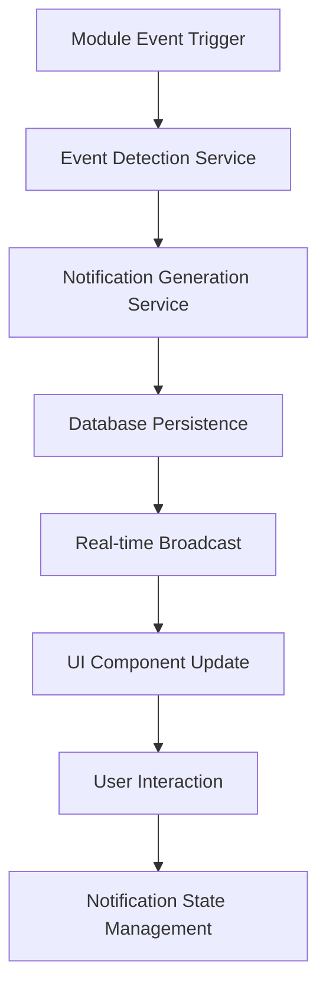

# Notification Data Integration Design

## Overview

This design outlines the transformation of the current mock-based notification system into a comprehensive, real-time notification infrastructure integrated with Supabase backend services. The system will replace static mock data with dynamic, event-driven notifications across Budget, Goals, Family, and Transaction modules.

## Architecture

### System Components

The notification system consists of three primary layers:

**Data Layer**: Utilizes existing Supabase notification tables (`budget_alerts`, `admin_notifications`, `dashboard_insights`) and introduces new user notification tables for comprehensive coverage.

**Service Layer**: Implements `NotificationService` class that aggregates notifications from all modules using existing service patterns found in the codebase.

**Presentation Layer**: Enhances the existing `NotificationDropdown` component with real-time updates and improved user interaction capabilities.

### Notification Flow Architecture



## Data Models & Database Schema

### Core Notification Table Structure

| Field | Type | Description |
|-------|------|-------------|
| id | UUID | Primary identifier |
| user_id | UUID | Target user reference |
| notification_type | TEXT | Type classification (budget, goal, family, transaction) |
| event_type | TEXT | Specific event (threshold_exceeded, milestone_reached, etc.) |
| title | TEXT | Notification headline |
| message | TEXT | Detailed notification content |
| priority | TEXT | Importance level (low, medium, high, urgent) |
| severity | TEXT | Visual indicator (info, warning, error, success) |
| is_read | BOOLEAN | Read status tracking |
| is_actionable | BOOLEAN | Requires user action |
| action_url | TEXT | Navigation target |
| metadata | JSONB | Event-specific data |
| created_at | TIMESTAMPTZ | Generation timestamp |
| expires_at | TIMESTAMPTZ | Auto-cleanup date |

### Module-Specific Notification Types

**Budget Module Notifications**
- Budget threshold warnings (80% utilization)
- Budget exceeded alerts
- Period expiration notices
- Monthly budget summaries

**Goals Module Notifications**
- Milestone achievements (25%, 50%, 75%, completion)
- Goal deadline reminders
- Contribution acknowledgments
- Goal status changes

**Family Module Notifications**
- Family invitation received
- Family invitation accepted/declined
- New family member joined
- Family member role changes
- Family activity updates

**Transaction Module Notifications**
- Large transaction alerts
- Recurring transaction reminders
- Transaction categorization suggestions
- Monthly spending summaries

## API Endpoints Reference

### Notification Retrieval Endpoints

| Method | Endpoint | Description |
|--------|----------|-------------|
| GET | `/api/notifications` | Fetch user notifications with pagination |
| GET | `/api/notifications/unread` | Get unread notification count |
| GET | `/api/notifications/{id}` | Retrieve specific notification |
| PUT | `/api/notifications/{id}/read` | Mark notification as read |
| DELETE | `/api/notifications/{id}` | Remove notification |
| PUT | `/api/notifications/mark-all-read` | Mark all as read |

### Event Trigger Endpoints

| Method | Endpoint | Description |
|--------|----------|-------------|
| POST | `/api/notifications/budget-alert` | Trigger budget-related notification |
| POST | `/api/notifications/goal-milestone` | Trigger goal achievement notification |
| POST | `/api/notifications/family-event` | Trigger family activity notification |
| POST | `/api/notifications/transaction-alert` | Trigger transaction-related notification |

### Authentication Requirements

All notification endpoints require authenticated user context through Supabase Auth. User-specific notifications are filtered based on `user_id` and family membership where applicable.

## Business Logic Layer

### Notification Generation Engine

The system employs event-driven notification generation based on real-time data changes:

**Budget Alert Logic**:
- Monitor transaction insertions affecting budget utilization
- Calculate percentage against budget limits
- Generate threshold warnings at configurable levels
- Track spending velocity for early warning predictions

**Goal Progress Logic**:
- Track contribution transactions linked to goals
- Calculate milestone achievements automatically
- Generate celebration notifications for completions
- Provide deadline proximity warnings

**Family Activity Logic**:
- Monitor family invitation lifecycle events
- Track member activity across shared resources
- Generate collaborative achievement notifications
- Provide administrative notifications for owners

**Transaction Intelligence Logic**:
- Analyze spending patterns for anomaly detection
- Generate categorization suggestions for uncategorized transactions
- Provide budget impact assessments for large transactions
- Track recurring transaction patterns

### Notification Prioritization Strategy

| Priority Level | Criteria | User Impact |
|----------------|----------|-------------|
| Urgent | Budget exceeded, Goal deadline critical | Immediate attention required |
| High | Threshold warnings, Family invitations | Action recommended |
| Medium | Milestone achievements, Activity updates | Informational with moderate importance |
| Low | Summary reports, Tips and suggestions | Background information |

## Component Architecture

### Enhanced NotificationDropdown Component

**Props Interface Enhancement**:
```typescript
interface NotificationDropdownProps {
  userId: string;
  isOpen: boolean;
  onToggle: () => void;
  onNotificationClick?: (notification: Notification) => void;
  onMarkAllRead?: () => void;
  maxDisplayCount?: number;
  enableRealTimeUpdates?: boolean;
  filterByPriority?: string[];
  variant?: "user" | "admin";
}
```

**Real-time Update Integration**:
- Supabase real-time subscription for live notification updates
- Automatic badge count updates
- Sound notifications for high-priority alerts
- Visual indicators for different notification types

### Service Integration Pattern

Following the existing service patterns in the codebase (similar to `BudgetService`, `GoalService`), the `NotificationService` implements:

**Singleton Pattern**: Ensures consistent notification state management across components
**Fallback Strategy**: Graceful degradation when notification features are unavailable
**Caching Layer**: Optimizes performance for frequently accessed notifications
**Event Aggregation**: Consolidates similar notifications to prevent spam

## Module-Specific Implementation Strategy

### Budget Module Integration

**Event Triggers**:
- Transaction creation/update events
- Budget period transitions
- Threshold calculations

**Notification Content Examples**:
- "Food budget has reached 85% (₱4,250 of ₱5,000)"
- "Your monthly grocery budget will expire in 3 days"
- "Budget exceeded: Entertainment spending is ₱200 over limit"

### Goals Module Integration

**Event Triggers**:
- Goal contribution transactions
- Progress milestone calculations
- Deadline proximity assessments

**Notification Content Examples**:
- "Congratulations! Vacation fund reached 50% (₱25,000 of ₱50,000)"
- "Emergency fund goal due in 30 days - 75% complete"
- "New contribution of ₱2,000 added to your car fund"

### Family Module Integration

**Event Triggers**:
- Family invitation lifecycle events
- Member activity in shared resources
- Role and permission changes

**Notification Content Examples**:
- "You have been invited to join 'Smith Family Budget'"
- "Maria contributed ₱1,500 to the family vacation goal"
- "New family member John joined your budget group"

### Transaction Module Integration

**Event Triggers**:
- Large or unusual transaction patterns
- Recurring transaction scheduling
- Category assignment suggestions

**Notification Content Examples**:
- "Large expense detected: ₱15,000 transaction needs categorization"
- "Your monthly salary is due for entry tomorrow"
- "Suggest categorizing 'Starbucks' transactions as 'Coffee & Dining'"

## Testing Strategy

### Unit Testing Approach
- Service method validation for notification generation
- Database interaction testing with mock Supabase clients
- Component rendering tests with various notification states
- Event trigger logic validation

### Integration Testing Scope
- End-to-end notification flow from event to display
- Real-time update functionality verification
- Cross-module notification interaction testing
- Performance testing under high notification volume

### User Experience Testing
- Notification timing and relevance assessment
- User interface responsiveness evaluation
- Mobile and desktop notification display consistency
- Accessibility compliance verification

## Performance Considerations

### Database Optimization
- Indexed queries on user_id and created_at fields
- Automatic cleanup of expired notifications
- Batch processing for bulk notification operations
- Connection pooling for high-concurrency scenarios

### Real-time Update Efficiency
- Selective Supabase subscriptions based on user context
- Debounced update processing to prevent UI thrashing
- Efficient notification batching for similar events
- Memory management for long-running notification sessions

### Scalability Design
- Horizontal scaling capability through stateless service design
- Notification queue management for high-volume periods
- Caching strategies for frequently accessed notification metadata
- Rate limiting for notification generation to prevent abuse