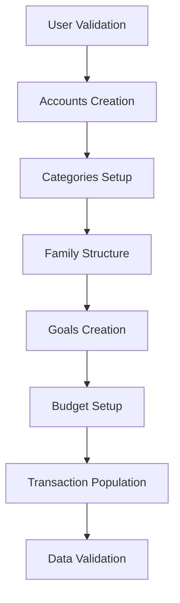
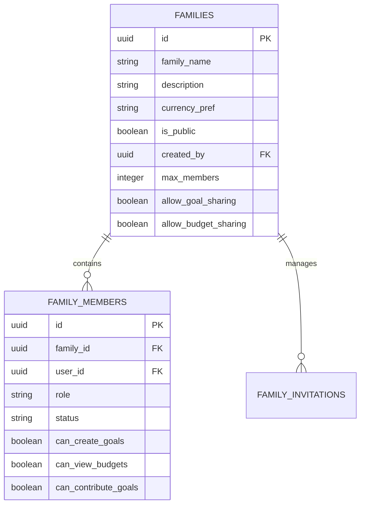
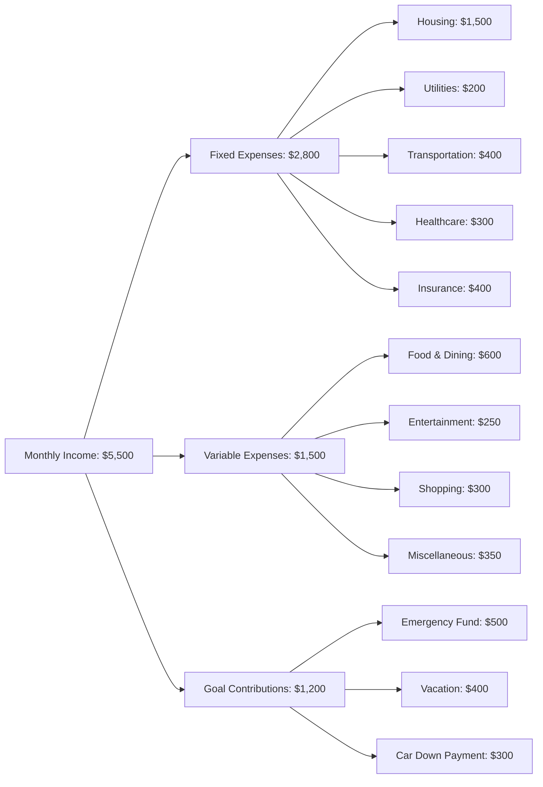
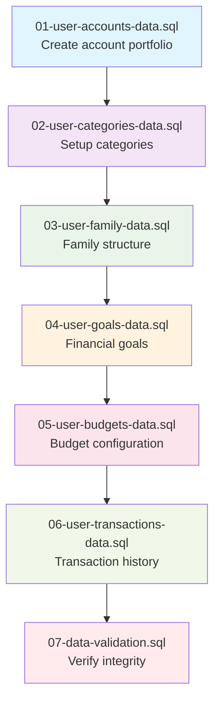

# User Data Population Design

## Overview

This design document outlines the strategic approach for populating comprehensive financial data for a specific user (1742c02b-e916-42f3-bdff-5451fbd9611d) in the BudgetMe application. The data population encompasses transactions, budgets, goals, and family data structures based on the existing database schema design.

## Architecture

### Data Population Strategy

The user data population follows a hierarchical dependency approach that ensures referential integrity and realistic financial data relationships:



### Database Schema Dependencies

The population process respects the following schema dependencies:

| Schema Module | Dependencies | Tables Affected |
|---------------|--------------|-----------------|
| Transactions | Auth, Shared, Family | accounts, income_categories, expense_categories, transactions |
| Budgets | Auth, Shared, Transactions | budgets, budget_alerts, budget_categories |
| Goals | Auth, Shared, Family, Transactions | goals, goal_contributions |
| Family | Auth, Shared | families, family_members, family_invitations |

## Data Model Specifications

### Account Structure

The account creation establishes the foundation for all financial transactions:

| Account Type | Purpose | Initial Balance | Currency |
|--------------|---------|-----------------|----------|
| Checking | Primary spending account | $2,500.00 | USD |
| Savings | Emergency and goal savings | $8,750.00 | USD |
| Credit | Credit card transactions | -$1,245.50 | USD |
| Investment | Long-term investments | $15,000.00 | USD |

### Category Framework

#### Income Categories

| Category Name | Description | Icon | Color |
|---------------|-------------|------|-------|
| Salary | Regular employment income | 💼 | #4CAF50 |
| Freelance | Independent contractor work | 💻 | #8BC34A |
| Investment Returns | Dividends and gains | 📈 | #2E7D32 |
| Other Income | Miscellaneous income | 💰 | #66BB6A |

#### Expense Categories

| Category Name | Monthly Budget | Description | Icon | Color |
|---------------|----------------|-------------|------|-------|
| Housing | $1,500.00 | Rent, utilities, maintenance | 🏠 | #F44336 |
| Food & Dining | $600.00 | Groceries and restaurants | 🍽️ | #FF5722 |
| Transportation | $400.00 | Car payments, gas, public transit | 🚗 | #FF9800 |
| Entertainment | $250.00 | Movies, games, subscriptions | 🎬 | #9C27B0 |
| Healthcare | $300.00 | Medical expenses and insurance | 🏥 | #E91E63 |
| Utilities | $200.00 | Electric, gas, internet, phone | ⚡ | #607D8B |
| Contribution | N/A | Goal contributions | 🎯 | #3F51B5 |

### Family Structure Design

The family setup creates a collaborative financial environment:



### Goals Architecture

Financial goals are structured to support both individual and family objectives:

| Goal Category | Target Amount | Target Date | Priority | Auto-Contribute |
|---------------|---------------|-------------|----------|-----------------|
| Emergency Fund | $10,000.00 | 12 months | High | $500/month |
| Vacation Fund | $3,500.00 | 8 months | Medium | $400/month |
| New Car Down Payment | $5,000.00 | 10 months | High | $500/month |
| Home Renovation | $15,000.00 | 18 months | Medium | $800/month |

### Budget Configuration

Monthly budgets align with expense categories and provide spending control:



## Data Population Workflow

### Phase 1: Foundation Setup

**User Validation**
- Verify user existence in auth.users table
- Validate user ID format and accessibility
- Check existing data to prevent duplication

**Account Creation**
- Create diverse account portfolio (checking, savings, credit, investment)
- Set realistic initial balances reflecting financial profile
- Configure account metadata (colors, descriptions, institution names)

### Phase 2: Category Framework

**Income Categories Setup**
- Create standard income categories with appropriate icons and colors
- Mark primary salary category as default
- Enable all categories for active use

**Expense Categories Setup**
- Establish comprehensive expense category structure
- Set monthly budget allocations for each category
- Configure category colors and icons for UI consistency

### Phase 3: Family Ecosystem

**Family Creation**
- Establish family unit with descriptive name and purpose
- Configure collaboration settings (goal sharing, budget sharing)
- Set family currency preference and member limits

**Member Management**
- Add user as family admin with full permissions
- Configure member capabilities (goal creation, budget viewing, contribution rights)
- Set up invitation system for future family expansion

### Phase 4: Financial Goals

**Goal Establishment**
- Create diversified goal portfolio covering emergency, lifestyle, and investment objectives
- Configure realistic target amounts and timelines
- Set up automatic contribution schedules
- Enable family goal sharing where appropriate

**Goal Contribution Setup**
- Link goals to appropriate source accounts
- Configure automated contribution amounts and frequencies
- Create initial manual contributions to establish progress

### Phase 5: Budget Framework

**Budget Creation**
- Establish monthly budgets aligned with expense categories
- Configure alert thresholds and notification preferences
- Enable rollover for appropriate budget categories
- Set up recurring budget patterns

**Budget Alert Configuration**
- Configure warning thresholds at 80% and 100% levels
- Enable email and in-app notifications
- Set up weekly and monthly budget summary reports

### Phase 6: Transaction History

**Transaction Diversity**
- Create comprehensive transaction history spanning 6 months
- Include various transaction types (income, expense, transfer, contribution)
- Populate realistic amounts and frequencies
- Link transactions to appropriate accounts and categories

**Transaction Patterns**
- Implement regular income deposits (bi-weekly salary, monthly freelance)
- Create recurring expense patterns (monthly subscriptions, weekly groceries)
- Add irregular transactions (one-time purchases, unexpected expenses)
- Include goal contributions and inter-account transfers

## SQL File Organization

### SQL-Populated Directory Structure

All populated SQL files will be organized within the `sql-populated` directory to maintain separation from the schema definition files in `sql-refactored`. This organizational approach provides clear distinction between:

- **Schema Definition Files** (`sql-refactored/`): Database structure and constraints
- **Data Population Files** (`sql-populated/`): INSERT statements for user data

```
sql-populated/
├── 01-user-accounts-data.sql          # Account creation statements
├── 02-user-categories-data.sql        # Income and expense categories
├── 03-user-family-data.sql           # Family structure and membership
├── 04-user-goals-data.sql            # Financial goals and contributions
├── 05-user-budgets-data.sql          # Budget configuration and alerts
├── 06-user-transactions-data.sql     # Transaction history (6 months)
├── 07-data-validation.sql            # Post-population validation queries
└── README.md                         # Documentation for data population files
```

### File Purpose and Dependencies

| File Name | Purpose | Dependencies | Target Tables |
|-----------|---------|--------------|---------------|
| 01-user-accounts-data.sql | Create diverse account portfolio | None | accounts |
| 02-user-categories-data.sql | Setup income/expense categories | 01-user-accounts-data.sql | income_categories, expense_categories |
| 03-user-family-data.sql | Establish family structure | 02-user-categories-data.sql | families, family_members |
| 04-user-goals-data.sql | Create financial goals | 03-user-family-data.sql | goals, goal_contributions |
| 05-user-budgets-data.sql | Configure monthly budgets | 04-user-goals-data.sql | budgets, budget_categories |
| 06-user-transactions-data.sql | Populate transaction history | 05-user-budgets-data.sql | transactions |
| 07-data-validation.sql | Verify data integrity | All previous files | All tables (validation) |

### SQL File Standards

**File Header Template**
Each SQL file will include a standardized header:
```sql
-- =====================================================
-- USER DATA POPULATION: [FILE_PURPOSE]
-- =====================================================
-- Target User: 1742c02b-e916-42f3-bdff-5451fbd9611d
-- Purpose: [Specific data population purpose]
-- Dependencies: [List of prerequisite files]
-- Tables: [Target table names]
-- Execution: Use INSERT INTO ONLY for all statements
-- =====================================================
```

**INSERT Statement Format**
All data insertion will use the `INSERT INTO ONLY` format as specified:
```sql
INSERT INTO ONLY public.accounts (
    id, user_id, account_name, account_type, 
    balance, initial_balance, currency, status
) VALUES (
    uuid_generate_v4(),
    '1742c02b-e916-42f3-bdff-5451fbd9611d',
    'Primary Checking',
    'checking',
    2500.00,
    2500.00,
    'USD',
    'active'
);
```

**Transaction Safety**
Each file will be wrapped in transaction blocks:
```sql
BEGIN;
-- INSERT statements here
COMMIT;
```

## Implementation Strategy

### Execution Order and Dependencies

The SQL files must be executed in sequential order to maintain referential integrity:



### File Content Organization

**Data Volume Distribution**

| File | Estimated Records | Complexity | Execution Time |
|------|------------------|------------|----------------|
| 01-user-accounts-data.sql | 4 accounts | Low | < 1 second |
| 02-user-categories-data.sql | 16 categories | Low | < 1 second |
| 03-user-family-data.sql | 2 records | Medium | < 1 second |
| 04-user-goals-data.sql | 12 records | Medium | < 2 seconds |
| 05-user-budgets-data.sql | 16 records | Medium | < 2 seconds |
| 06-user-transactions-data.sql | 180 records | High | 5-10 seconds |
| 07-data-validation.sql | 0 records (queries) | Low | 2-3 seconds |

**Error Handling Strategy**
Each file includes comprehensive error handling:
```sql
-- Check if user exists before proceeding
DO $$
BEGIN
    IF NOT EXISTS (SELECT 1 FROM auth.users WHERE id = '1742c02b-e916-42f3-bdff-5451fbd9611d') THEN
        RAISE EXCEPTION 'Target user not found: 1742c02b-e916-42f3-bdff-5451fbd9611d';
    END IF;
END $$;
```

### SQL-Populated Directory Documentation

The `sql-populated` directory should contain a comprehensive README.md file documenting the data population process:

**README.md Structure**
```markdown
# SQL Populated Data Files

Target User: 1742c02b-e916-42f3-bdff-5451fbd9611d

## Execution Order
1. 01-user-accounts-data.sql - Account portfolio creation
2. 02-user-categories-data.sql - Income/expense categories
3. 03-user-family-data.sql - Family structure setup
4. 04-user-goals-data.sql - Financial goals and contributions
5. 05-user-budgets-data.sql - Monthly budget configuration
6. 06-user-transactions-data.sql - 6 months transaction history
7. 07-data-validation.sql - Data integrity validation

## Prerequisites
- Schema files from sql-refactored/ deployed
- Target user exists in auth.users table
- Database INSERT permissions available
- RLS policies configured for data creation

## Data Overview
- 4 Accounts (checking $2,500, savings $8,750, credit -$1,245, investment $15,000)
- 16 Categories (4 income, 12 expense with budget allocations)
- 1 Family (Johnson Family Financial Group with admin privileges)
- 4 Goals (Emergency $10K, Vacation $3.5K, Car $5K, Renovation $15K)
- 8 Budgets (monthly allocations totaling $3,400)
- 180+ Transactions (6 months realistic financial activity)

## Execution Commands
psql -f 01-user-accounts-data.sql
psql -f 02-user-categories-data.sql
[... continue in order]

## Validation Queries
- Account balance verification
- Transaction count validation
- Goal progress confirmation
- Budget spending accuracy

## Rollback Procedures
Reverse dependency order deletion for complete data removal
```

**File Organization Principles**
- Clear separation from schema files
- Sequential dependency management
- Comprehensive error handling
- Realistic data volumes
- Validation and rollback capabilities

### Command-Line Management

**Sequential Execution Script**
A bash script for automated execution of all sql-populated files:
```bash
#!/bin/bash
# execute-user-data-population.sh

USER_ID="1742c02b-e916-42f3-bdff-5451fbd9611d"
DB_CONNECTION="-h localhost -d budgetme -U postgres"
SQL_DIR="sql-populated"

echo "Starting user data population for: $USER_ID"
echo "Execution timestamp: $(date)"

# Execute files in dependency order
files=("01-user-accounts-data.sql" "02-user-categories-data.sql" "03-user-family-data.sql" "04-user-goals-data.sql" "05-user-budgets-data.sql" "06-user-transactions-data.sql" "07-data-validation.sql")

for file in "${files[@]}"; do
    echo "Executing: $file"
    if psql $DB_CONNECTION -f "$SQL_DIR/$file"; then
        echo "✓ $file completed successfully"
    else
        echo "✗ $file failed - stopping execution"
        exit 1
    fi
done

echo "User data population completed successfully"
```

**Rollback Script**
A companion script for data removal:
```bash
#!/bin/bash
# rollback-user-data.sh

USER_ID="1742c02b-e916-42f3-bdff-5451fbd9611d"
DB_CONNECTION="-h localhost -d budgetme -U postgres"

echo "Rolling back user data for: $USER_ID"
psql $DB_CONNECTION -c "
BEGIN;
DELETE FROM public.budget_alerts WHERE user_id = '$USER_ID';
DELETE FROM public.budget_categories WHERE budget_id IN 
    (SELECT id FROM public.budgets WHERE user_id = '$USER_ID');
DELETE FROM public.budgets WHERE user_id = '$USER_ID';
DELETE FROM public.goal_contributions WHERE user_id = '$USER_ID';
DELETE FROM public.goals WHERE user_id = '$USER_ID';
DELETE FROM public.transactions WHERE user_id = '$USER_ID';
DELETE FROM public.family_members WHERE user_id = '$USER_ID';
DELETE FROM public.families WHERE created_by = '$USER_ID';
DELETE FROM public.expense_categories WHERE user_id = '$USER_ID';
DELETE FROM public.income_categories WHERE user_id = '$USER_ID';
DELETE FROM public.accounts WHERE user_id = '$USER_ID';
COMMIT;"
echo "Rollback completed"
```

### Data Integrity Constraints


**Referential Integrity**
- All foreign key relationships must be respected
- Account balances must reflect transaction history
- Budget spent amounts must match expense transactions
- Goal current amounts must match contribution totals

**Business Logic Validation**
- Credit account balances should be negative or zero
- Transaction amounts must be positive with proper type classification
- Budget periods must have valid date ranges
- Goal target dates must be in the future or reasonable past

**Financial Accuracy**
- Account balance calculations must be mathematically correct
- Budget spending tracking must update automatically
- Goal progress must reflect all contributions accurately
- Family financial aggregations must be consistent

### Data Volume Specifications

| Data Category | Target Volume | Time Span | Frequency Pattern |
|---------------|---------------|-----------|-------------------|
| Accounts | 4 accounts | Current | One-time setup |
| Categories | 12 expense, 4 income | Current | One-time setup |
| Family Members | 1 admin user | Current | One-time setup |
| Goals | 4 active goals | 6-18 months | Ongoing contributions |
| Budgets | 8 monthly budgets | Current month | Monthly recurring |
| Transactions | 150-200 transactions | 6 months | Daily/weekly patterns |

### Automated Calculations

**Account Balance Reconciliation**
The system maintains account balances through trigger-based automation:
- Income transactions increase account balances
- Expense transactions decrease account balances
- Transfer transactions move money between accounts
- Contribution transactions reduce source account and increase goal progress

**Budget Spending Updates**
Budget spent amounts update automatically through transaction triggers:
- Expense transactions in mapped categories update relevant budgets
- Multi-category budgets distribute spending based on allocation percentages
- Budget alerts trigger when thresholds are exceeded
- Rollover budgets carry forward unused amounts to next period

**Goal Progress Tracking**
Goal current amounts reflect all contributions:
- Manual contributions from account transactions
- Automatic contributions from scheduled transfers
- Family member contributions to shared goals
- Progress percentage calculations for display purposes

## Data Validation Framework

### Pre-Population Validation

**User Verification**
- Confirm user ID exists in auth.users table
- Verify user has no existing financial data
- Check user profile completeness and activation status

**Schema Readiness**
- Validate all required tables exist with proper structure
- Confirm RLS policies are active and properly configured
- Verify trigger functions are operational

### Post-Population Validation

**Data Consistency Checks**
- Account balances match transaction history calculations
- Budget spent amounts align with expense transaction totals
- Goal current amounts equal sum of all contributions
- Family member permissions reflect intended access levels

**Business Rule Compliance**
- All foreign key constraints satisfied
- Check constraints pass for amounts and dates
- Unique constraints maintained for category names and tokens
- Trigger functions execute without errors

**Financial Accuracy Verification**
- Total account balances reflect realistic financial position
- Transaction categorization follows logical business rules
- Budget allocations sum to reasonable percentage of income
- Goal target amounts are achievable within specified timeframes

## Testing Strategy

### Unit Testing Approach

**Individual Component Testing**
- Test each table population independently
- Verify trigger functions operate correctly
- Validate constraint enforcement
- Confirm RLS policy effectiveness

**Integration Testing**
- Test cross-table relationships and dependencies
- Verify calculated fields update correctly
- Confirm notification systems trigger appropriately
- Test family collaboration features

**Data Quality Assurance**
- Verify realistic financial scenarios
- Test edge cases and boundary conditions
- Confirm error handling for invalid data
- Validate performance under normal load

### Rollback Strategy

**Transaction Safety**
- All data population occurs within database transactions
- Automatic rollback on any constraint violation
- Manual rollback capability for testing scenarios
- Backup restoration procedures for production environments

**Incremental Population**
- Phase-based implementation allows partial rollbacks
- Independent table population enables granular control
- Dependency tracking prevents orphaned records
- Audit trail maintains population history