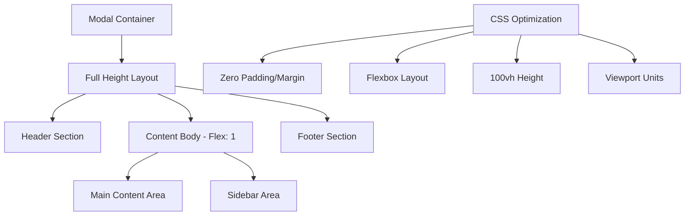

# Remove Bottom Whitespace in Budget Setup Modal

## Overview

This design addresses the complete removal of bottom whitespace in the Budget Setup Modal component to ensure full screen utilization and eliminate any unwanted gaps or padding at the bottom of the modal. The solution focuses on optimizing the modal's layout structure and CSS styling to achieve seamless full-height coverage.

## Repository Type

**Full-Stack Application** - React frontend with TypeScript, featuring a comprehensive budget management system with modular component architecture.

## Architecture

### Current Modal Structure Analysis

The Budget Setup Modal currently implements a multi-step workflow with the following layout hierarchy:

```
modal-dialog (Bootstrap)
└── modal-content
    ├── modal-header (with progress indicator)
    ├── modal-body (contains step content)
    │   └── container-fluid
    │       └── row
    │           ├── col-md-8 (main content)
    │           └── col-md-4 (sidebar)
    └── modal-footer (implicit through step components)
```

### Target Architecture

The optimized structure will eliminate all bottom spacing through:



## Modal Layout Design Strategy

### Container Modifications

| Component | Current State | Target State | Purpose |
|-----------|---------------|--------------|---------|
| modal-dialog | Default Bootstrap sizing | 100vw width, 0 margin | Full viewport coverage |
| modal-content | Standard height | 100vh min-height, flex column | Complete height utilization |
| modal-body | Standard padding | 0 padding, flex: 1 | Eliminate internal spacing |
| container-fluid | Bootstrap defaults | Remove all padding | Edge-to-edge content |

### Flexbox Implementation

The modal will implement a complete flexbox strategy:

**Primary Container (modal-content)**
- Display: flex
- Flex-direction: column  
- Height: 100vh
- Min-height: 100vh
- Max-height: none

**Content Areas (modal-body)**
- Flex: 1
- Padding: 0
- Margin: 0
- Overflow handling for scrollable content

**Internal Grid System**
- Bootstrap row/col system maintained
- Custom padding applied selectively to content areas only
- No container-level padding

## CSS Styling Strategy

### Core Layout Rules

The implementation will apply these fundamental styling principles:

**Modal Base Styles**
- Remove all default Bootstrap modal spacing
- Implement viewport-based sizing (100vw x 100vh)
- Zero border-radius for full coverage
- Eliminate any margin offsets

**Content Flow Management**
- Flexbox for vertical layout control
- Selective padding applied only to inner content
- Maintain responsive grid behavior
- Preserve component hierarchy styling

**Responsive Considerations**
- Maintain mobile responsiveness
- Ensure content accessibility on smaller screens
- Preserve touch interaction areas

### Step-Specific Layout Handling

Each modal step will receive consistent treatment:

| Step | Content Strategy | Sidebar Strategy |
|------|------------------|------------------|
| workflow_choice | Full-width content, minimal padding | Tips panel with selective padding |
| budget_config | Form fields with internal spacing | Review panel with contained padding |
| transaction_setup | Input groups with proper spacing | Analytics with isolated padding |
| review_steps | Summary cards with internal margins | Confirmation panel with focused padding |

## Component Integration Pattern

### Header Component Modifications

The header will maintain its functionality while fitting the zero-margin design:
- Progress indicators remain functional
- Close button positioning preserved
- Title and navigation elements unchanged
- Internal padding maintained for usability

### Body Content Adaptation

Content areas will receive padding only where needed for usability:
- Form fields maintain adequate spacing
- Card components preserve internal structure
- Interactive elements keep touch-friendly sizing
- Text content maintains readability spacing

### Sidebar Integration

The sidebar will adapt to the full-height layout:
- Tips and analytics panels maintain internal padding
- Border-left styling preserved for visual separation
- Content scrolling handled appropriately
- Visual hierarchy maintained through selective spacing

## Implementation Specifications

### CSS Class Modifications

The following styling approach will be implemented:

**Container Level Changes**
- Modal dialog: 100vw width, 0 margin, full viewport height
- Modal content: flexbox layout, 100vh height, 0 border-radius
- Modal body: flex 1, 0 padding/margin

**Content Area Adjustments**
- Internal padding applied to .p-4 classes within content areas
- Form groups maintain standard spacing
- Card components preserve internal structure
- Button areas maintain appropriate spacing

**Responsive Behavior**
- Mobile breakpoints preserve usability
- Content remains accessible across device sizes
- Touch targets maintain minimum sizing requirements

### Bootstrap Integration

The design will work harmoniously with Bootstrap:
- Grid system remains functional
- Component styling preserved where appropriate
- Utility classes maintained for content areas
- Responsive breakpoints honored

## User Experience Considerations

### Visual Continuity

The modal will provide seamless visual experience:
- No visible gaps or unwanted spacing
- Smooth transitions between modal steps
- Consistent content positioning
- Professional appearance across all screen sizes

### Accessibility Maintenance

All accessibility features will be preserved:
- Keyboard navigation functionality
- Screen reader compatibility
- Focus management
- Color contrast requirements

### Performance Impact

The changes will have minimal performance implications:
- CSS optimizations only
- No JavaScript behavioral changes
- Maintained component structure
- Preserved state management

## Testing Strategy

### Visual Validation

Comprehensive testing across:
- Different screen resolutions
- Various browser environments
- Mobile and desktop viewports
- Different modal steps and workflows

### Functional Testing

Verification of:
- Modal opening and closing behavior
- Step navigation functionality
- Form submission processes
- Responsive layout behavior

### Cross-Browser Compatibility

Ensure consistent behavior across:
- Modern browsers (Chrome, Firefox, Safari, Edge)
- Mobile browsers
- Different viewport orientations
- Various screen densities
