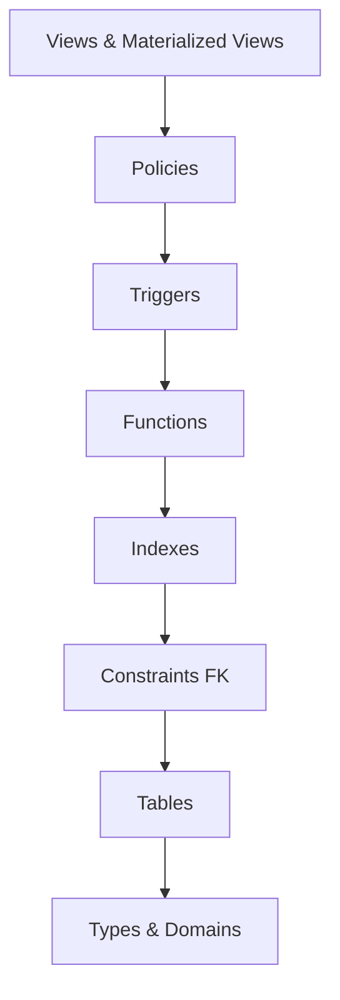

# Database Object Cleanup Design
**Remove Existing Database Objects Implementation Strategy**

## Overview

This design outlines the systematic approach to add DROP statements for all policies, functions, and tables in the specified SQL schema files while preserving all existing functionality. The goal is to ensure clean database deployments by removing existing objects before creating new ones, preventing conflicts and ensuring consistency.

## Target Files

The following SQL schema files require DROP statement implementation:

| File | Primary Objects | Dependencies |
|------|----------------|--------------|
| `05-goals-schema.sql` | Goals tables, functions, policies | Auth, shared, family, transactions |
| `06-post-constraints.sql` | Cross-schema constraints | All previous schemas |
| `07-budget-schema.sql` | Budget tables, functions, policies | Auth, shared, transactions |
| `08-admin-schema.sql` | Admin tables, functions, policies | Auth, shared |
| `09-chatbot-schema.sql` | Chatbot tables, functions, policies | Auth, predictions, shared |
| `10-dashboard-schema.sql` | Dashboard tables, functions, policies | All core modules |
| `11-predictions-schema.sql` | Prediction tables, functions, policies | Auth, transactions |
| `12-reports-schema.sql` | Reports views, functions | All core modules |
| `13-settings-schema.sql` | Settings tables, functions, policies | Auth, shared |
| `14-notifications-schema.sql` | Notification tables, functions, policies | All modules |
| `14-post-admin-constraints.sql` | Admin view updates | All schemas |
| `15-prevent-duplicate-accounts.sql` | Account constraints, functions | Auth, accounts |

## Architecture Strategy

### Drop Order Strategy

The drop operations must follow reverse dependency order to prevent referential integrity violations:



### Safety Framework

#### Conditional Drop Pattern
All DROP statements will use the `IF EXISTS` clause to ensure idempotent execution:

```sql
DROP POLICY IF EXISTS policy_name ON table_name;
DROP FUNCTION IF EXISTS function_name(parameter_types);
DROP TABLE IF EXISTS table_name CASCADE;
```

#### Error Handling Strategy
Implement comprehensive error handling using DO blocks:

```sql
DO $$ 
BEGIN
    DROP POLICY IF EXISTS policy_name ON table_name;
EXCEPTION 
    WHEN OTHERS THEN 
        RAISE NOTICE 'Could not drop policy: %', SQLERRM;
END $$;
```

#### Dependency Management
Use CASCADE where appropriate for tables and functions that have dependents:

```sql
DROP TABLE IF EXISTS table_name CASCADE;  -- For tables with dependent objects
DROP FUNCTION IF EXISTS function_name CASCADE;  -- For functions with dependents
```

## Implementation Design

### File Structure Pattern

Each modified SQL file will follow this structure:

```sql
-- =====================================================
-- CLEANUP: DROP EXISTING OBJECTS
-- =====================================================

-- Drop policies first
DO $$ 
BEGIN
    DROP POLICY IF EXISTS "policy_name" ON schema.table_name;
    -- ... more policies
EXCEPTION WHEN OTHERS THEN NULL;
END $$;

-- Drop triggers
DO $$ 
BEGIN
    DROP TRIGGER IF EXISTS trigger_name ON schema.table_name;
    -- ... more triggers
EXCEPTION WHEN OTHERS THEN NULL;
END $$;

-- Drop functions
DO $$ 
BEGIN
    DROP FUNCTION IF EXISTS schema.function_name(parameter_types);
    -- ... more functions
EXCEPTION WHEN OTHERS THEN NULL;
END $$;

-- Drop views
DROP VIEW IF EXISTS schema.view_name CASCADE;
DROP MATERIALIZED VIEW IF EXISTS schema.materialized_view_name CASCADE;

-- Drop indexes
DROP INDEX IF EXISTS schema.index_name;

-- Drop tables
DROP TABLE IF EXISTS schema.table_name CASCADE;

-- =====================================================
-- EXISTING CONTENT PRESERVED BELOW
-- =====================================================
-- [All existing content remains unchanged]
```

### Object Categories by File

#### Goals Schema (05-goals-schema.sql)
- **Tables**: `goals`, `goal_contributions`
- **Functions**: `update_goal_progress()`, `contribute_to_goal()`, `safe_percentage()`, `format_currency()`
- **Views**: `goal_details`
- **Policies**: Goal and contribution access policies
- **Triggers**: `goals_updated_at`, `update_goal_progress_trigger`
- **Indexes**: Performance optimization indexes

#### Budget Schema (07-budget-schema.sql)
- **Tables**: `budgets`, `budget_alerts`, `budget_categories`
- **Functions**: `update_budget_spent()`, `check_budget_alerts()`, `create_period_budget()`, `rollover_budget()`, `sanitize_budget_name()`, `validate_budget_name()`
- **Views**: `budget_details`, `budget_category_summary`
- **Policies**: Budget and alert access policies
- **Triggers**: Budget validation and update triggers

#### Admin Schema (08-admin-schema.sql)
- **Tables**: `admin_settings`, `system_activity_log`, `user_roles`, `admin_notifications`
- **Functions**: `is_admin_user()`, `add_admin_user()`, `remove_admin_user()`, `log_admin_activity()`, `get_admin_setting()`, `set_admin_setting()`, `manage_user_role()`, `create_admin_notification()`
- **Views**: `admin_dashboard_summary`
- **Policies**: Admin access control policies

#### Predictions Schema (11-predictions-schema.sql)
- **Tables**: `prediction_requests`, `prophet_predictions`, `ai_insights`, `prediction_usage_limits`
- **Functions**: `can_make_prediction_request()`, `increment_prediction_usage()`, `log_prediction_request()`, `update_request_status()`, `store_prophet_prediction()`, `store_ai_insights()`, `get_cached_prophet_prediction()`, `cleanup_expired_predictions()`
- **Views**: `prediction_usage_analytics`, `recent_prediction_activity`
- **Policies**: User prediction access policies

#### Reports Schema (12-reports-schema.sql)
- **Materialized Views**: `user_financial_summary`
- **Views**: `monthly_transaction_summary`, `budget_performance_analysis`, `goal_progress_tracking`, `family_financial_overview`, `spending_insights`
- **Functions**: `refresh_financial_reports()`, `get_user_financial_report()`

### Special Considerations

#### Circular Dependencies
Files like `06-post-constraints.sql` handle circular dependencies between modules. The cleanup must account for:
- Foreign key constraints that reference other schemas
- Views that depend on multiple schemas
- Functions that call functions from other schemas

#### Materialized Views
Special handling for materialized views in reports schema:
```sql
DROP MATERIALIZED VIEW IF EXISTS public.user_financial_summary CASCADE;
```

#### Complex Functions
Functions with multiple signatures require specific parameter type specifications:
```sql
DROP FUNCTION IF EXISTS public.contribute_to_goal(UUID, DECIMAL, UUID, TEXT, UUID);
DROP FUNCTION IF EXISTS public.create_period_budget(UUID, TEXT, DECIMAL, TEXT, UUID, TEXT, DATE);
```

#### RLS Policies
Row Level Security policies must be dropped before tables:
```sql
DO $$ 
BEGIN
    DROP POLICY IF EXISTS "Users can manage their own goals" ON public.goals;
    DROP POLICY IF EXISTS "Family members can view family goals" ON public.goals;
EXCEPTION WHEN OTHERS THEN NULL;
END $$;
```

## Risk Mitigation

### Data Safety
- All DROP statements use `IF EXISTS` to prevent errors on non-existent objects
- CASCADE is used judiciously only where necessary
- No data deletion - only schema object removal

### Rollback Strategy
- Each file maintains complete recreation capability
- All original functionality preserved
- Idempotent execution allows safe re-running

### Validation Framework
Post-cleanup validation ensures:
- All expected objects are recreated
- All permissions are properly restored
- All relationships function correctly
- No orphaned dependencies remain

## Testing Strategy

### Pre-Implementation Testing
1. **Dependency Analysis**: Map all object dependencies within each file
2. **Cross-Schema Impact**: Identify references between different schema files
3. **Dry Run Validation**: Generate DROP statements without execution

### Implementation Testing
1. **Isolated Testing**: Test each file in isolation
2. **Integration Testing**: Test full deployment sequence
3. **Rollback Testing**: Verify cleanup and recreation process

### Post-Implementation Validation
1. **Functional Testing**: Verify all application functionality
2. **Performance Testing**: Ensure no performance degradation
3. **Security Testing**: Validate all RLS policies function correctly

## Deployment Considerations

### Environment Safety
- Development environment testing first
- Staging environment validation
- Production deployment with backup procedures

### Execution Sequence
1. Apply DROP statements to each file in reverse dependency order
2. Maintain original creation order for schema deployment
3. Validate successful object recreation after each file

### Monitoring Requirements
- Log all DROP operations for audit trail
- Monitor for any unexpected cascade effects
- Validate object counts before and after deployment

## Success Criteria

### Technical Success Metrics
- All database objects successfully dropped and recreated
- No orphaned dependencies or broken references
- All application functionality preserved
- Performance characteristics maintained

### Operational Success Metrics
- Clean deployment process without manual intervention
- Reduced deployment conflicts and errors
- Improved schema consistency across environments
- Simplified database maintenance procedures

## Future Enhancements

### Automation Opportunities
- Automated dependency detection and ordering
- Dynamic DROP statement generation
- Comprehensive validation reporting
- Integration with CI/CD pipelines

### Maintenance Improvements
- Standardized DROP patterns across all schema files
- Centralized error handling and logging
- Enhanced rollback and recovery procedures
- Automated testing of schema changes

This design ensures a systematic, safe, and maintainable approach to implementing DROP statements across all specified SQL schema files while preserving complete functionality and maintaining data integrity.