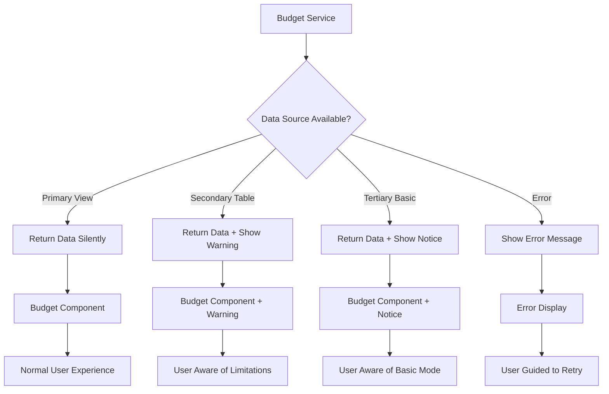

# Remove Full System Access Feature from Budget Module

## Overview

This design document outlines the removal of the "Full System Access" notification feature from the budget module's DataSourceNotification component. The feature currently displays a notification when the budget system is operating at full capacity using the primary database view, but this notification provides no actionable value to users and creates unnecessary UI clutter.

## Current System Analysis

### Existing Architecture

The budget module currently implements a fallback data access strategy with four levels:

1. **Primary Source (view)**: `budget_details` view - Complete data with pre-calculated fields
2. **Secondary Source (table_with_category)**: `budgets` table joined with `expense_categories` 
3. **Tertiary Source (table_only)**: `budgets` table with minimal data
4. **Error State**: Complete failure with user notification

### Current Notification Behavior

The DataSourceNotification component displays different messages based on the data source:

| Data Source | Title | Message | Visibility |
|-------------|-------|---------|------------|
| view | "Full System Access" | "All budget features are available." | Hidden (show: false) |
| table_with_category | "Limited System Access" | "Budget features are available with some calculated fields." | Visible |
| table_only | "Basic System Access" | "Budget data available with limited features." | Visible |
| error | "System Unavailable" | "Budget data cannot be loaded." | Visible |

## Problem Statement

The "Full System Access" notification serves no functional purpose because:

1. **No User Action Required**: When the system operates normally, users don't need to be informed
2. **Visual Clutter**: The notification takes up screen space without providing value
3. **Redundant Information**: Normal functionality should be transparent to users
4. **Inconsistent UX Pattern**: Most applications don't notify users when everything works correctly

## Design Solution

### Architectural Changes

Remove the "Full System Access" case entirely from the budget module while preserving the fallback mechanism for degraded states. The system will maintain its robust fallback strategy but eliminate unnecessary success notifications.

### Component Modifications

#### DataSourceNotification Component

The component will be simplified to handle only degraded states:

| Data Source | Behavior Change |
|-------------|-----------------|
| view | Component returns null (no notification) |
| table_with_category | Unchanged - shows limitation warning |
| table_only | Unchanged - shows basic access warning |
| error | Unchanged - shows error message |

#### Usage Pattern Changes

Components using DataSourceNotification will experience:
- **Normal Operation**: No notification displayed
- **Degraded States**: Appropriate warnings shown
- **Error States**: Clear error messaging maintained

### Data Flow Architecture

### Implementation Strategy

#### Phase 1: Component Logic Update
- Modify DataSourceNotification to return null for 'view' source
- Ensure fallback notifications remain functional
- Preserve all existing data access patterns

#### Phase 2: Testing and Validation
- Verify no visual regression in normal operation
- Confirm degraded state warnings still appear
- Test error handling remains intact

#### Phase 3: Documentation Update
- Update component documentation
- Revise development guides
- Update user-facing help documentation

## Impact Assessment

### User Experience Impact

| Aspect | Before | After | Benefit |
|--------|--------|-------|---------|
| Screen Space | Notification displayed | Clean interface | More content visible |
| Cognitive Load | Users see "success" message | Users see normal interface | Reduced distraction |
| Information Density | Redundant success info | Only actionable info | Improved focus |

### Technical Impact

| Component | Change Type | Risk Level |
|-----------|-------------|------------|
| DataSourceNotification | Logic modification | Low |
| Budget Service | No changes | None |
| Fallback Strategy | Preserved | None |
| Error Handling | Unchanged | None |

### Business Logic Preservation

The removal maintains all critical system behaviors:
- **Fallback Strategy**: Complete preservation of data access reliability
- **Error Handling**: All error states continue to inform users appropriately
- **Performance Monitoring**: Backend logging and metrics remain unchanged
- **System Resilience**: No impact on system's ability to handle database issues

## Testing Strategy

### Functional Testing
- Verify normal budget operations show no notification
- Confirm degraded states display appropriate warnings
- Validate error states provide clear messaging
- Test notification behavior in development vs production modes

### Visual Testing
- Ensure clean interface in normal operation
- Verify warning notifications remain visible and styled correctly
- Confirm error states maintain proper visual hierarchy

### Integration Testing
- Test budget listing page notification behavior
- Test budget details page notification behavior
- Verify consistent behavior across all budget module components

## Migration Considerations

### Backward Compatibility
- Change is purely visual and requires no data migration
- No API changes required
- No configuration updates needed

### Deployment Safety
- Change is non-breaking and can be deployed incrementally
- Rollback capability through code reversion
- No database schema modifications required

## Monitoring and Observability

### Success Metrics
- **User Feedback**: Monitor for any confusion about system status
- **Interface Cleanliness**: Confirm improved visual experience
- **System Reliability**: Ensure fallback warnings still reach users when needed

### Logging Strategy
- Backend data source usage logging remains unchanged
- Component rendering events continue to be tracked
- Error notification delivery monitoring preserved

## Documentation Updates

### Developer Documentation
- Update DataSourceNotification component API documentation
- Revise budget module implementation guide
- Update fallback strategy documentation

### User Documentation
- Remove references to "Full System Access" notifications
- Update troubleshooting guides to focus on warning states
- Clarify when users should expect system notifications