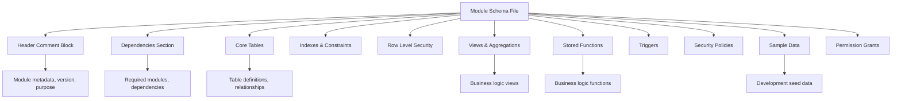
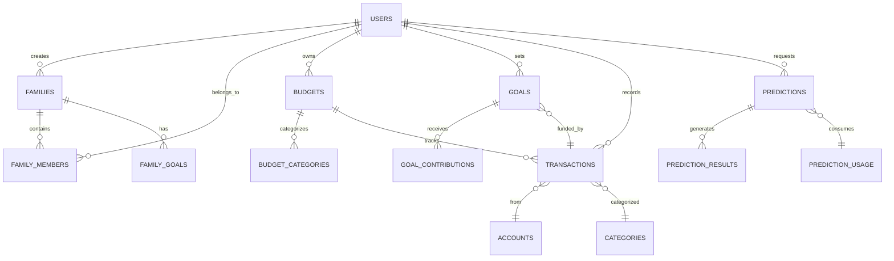
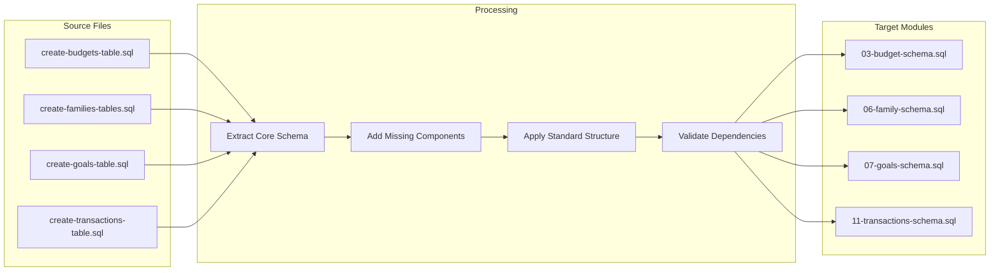
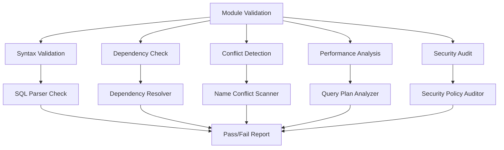
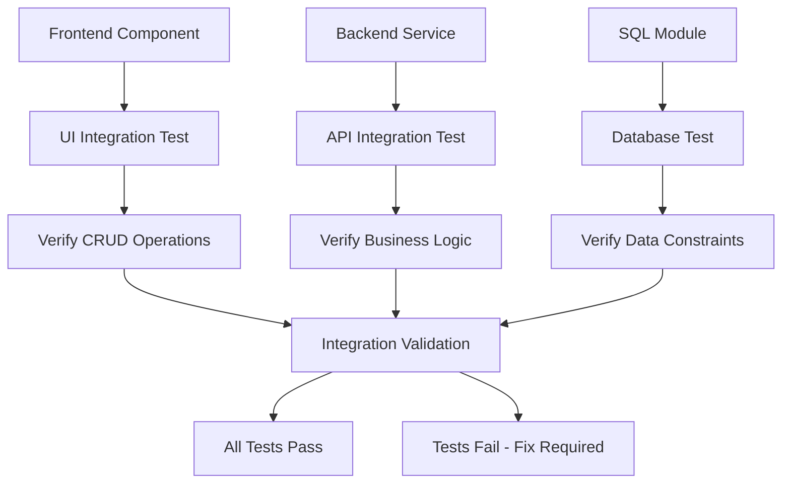

# SQL Refactoring Design: Component-Backend Alignment

## Overview

This design outlines the refactoring strategy for SQL files to establish clear alignment between frontend components in `src/components` and their corresponding backend database schemas. The refactoring will transform the current scattered SQL structure into an organized, modular system with version control and consolidated backups.

## Architecture

### Current State Analysis

| Component Module | Existing SQL Files | Purpose | Backend Service |
|------------------|-------------------|---------|-----------------|
| **Admin** | `admin-query.sql` | User role management | `userService.ts` |
| **Auth** | `fix-user-signup-issue.sql` | Authentication fixes | `authService.ts` |
| **Budget** | `create-budgets-table.sql` | Budget management | `budgetService.ts` |
| **Chatbot** | *(No dedicated SQL)* | AI chat interface | `aiInsightsService.ts` |
| **Dashboard** | `run.sql`, `populate-transaction-data.sql` | Dashboard data aggregation | Multiple services |
| **Family** | `create-families-tables.sql`, `create-family-join-requests.sql`, `add-family-goals.sql`, `add-is-public-to-families.sql` | Family collaboration | `familyService.ts`, `invitationService.ts`, `joinRequestService.ts` |
| **Goals** | `create-goals-table.sql`, `add-family-goals-column.sql` | Goal tracking | `goalService.ts` |
| **Predictions** | `create-prediction-tables.sql` | AI predictions | `predictionService.ts` |
| **Reports** | `fix-materialized-view.sql` | Report generation | Multiple services |
| **Settings** | *(Various table fixes)* | User preferences | `userService.ts` |
| **Transactions** | `create-transactions-table.sql`, `fix-transaction-schema.sql`, `populate-transaction-data.sql` | Transaction management | `transactionService.ts` |

### Refactored SQL Architecture

```mermaid
graph TB
    subgraph "Consolidated Backup"
        BACKUP[sql-backup-consolidated.sql]
    end
    
    subgraph "Component-Aligned SQL Modules"
        ADMIN01[01-admin-schema.sql]
        AUTH02[02-auth-schema.sql]
        BUDGET03[03-budget-schema.sql]
        CHATBOT04[04-chatbot-schema.sql]
        DASHBOARD05[05-dashboard-schema.sql]
        FAMILY06[06-family-schema.sql]
        GOALS07[07-goals-schema.sql]
        PREDICTIONS08[08-predictions-schema.sql]
        REPORTS09[09-reports-schema.sql]
        SETTINGS10[10-settings-schema.sql]
        TRANSACTIONS11[11-transactions-schema.sql]
        SHARED12[12-shared-schema.sql]
    end
    
    subgraph "Backend Services"
        ADMIN_SVC[userService.ts]
        AUTH_SVC[authService.ts]
        BUDGET_SVC[budgetService.ts]
        AI_SVC[aiInsightsService.ts]
        FAMILY_SVC[familyService.ts]
        GOAL_SVC[goalService.ts]
        PRED_SVC[predictionService.ts]
        TRANS_SVC[transactionService.ts]
    end
    
    ADMIN01 -.-> ADMIN_SVC
    AUTH02 -.-> AUTH_SVC
    BUDGET03 -.-> BUDGET_SVC
    CHATBOT04 -.-> AI_SVC
    FAMILY06 -.-> FAMILY_SVC
    GOALS07 -.-> GOAL_SVC
    PREDICTIONS08 -.-> PRED_SVC
    TRANSACTIONS11 -.-> TRANS_SVC
```

## Refactoring Strategy

### File Organization Structure

| Order | Module | New Filename | Source SQL Files |
|-------|--------|--------------|------------------|
| 01 | Admin | `01-admin-schema.sql` | `admin-query.sql` |
| 02 | Auth | `02-auth-schema.sql` | `fix-user-signup-issue.sql` |
| 03 | Budget | `03-budget-schema.sql` | `create-budgets-table.sql` |
| 04 | Chatbot | `04-chatbot-schema.sql` | *(New - AI insights tables)* |
| 05 | Dashboard | `05-dashboard-schema.sql` | `run.sql`, dashboard-related queries |
| 06 | Family | `06-family-schema.sql` | `create-families-tables.sql`, `create-family-join-requests.sql`, `add-family-goals.sql`, `add-is-public-to-families.sql` |
| 07 | Goals | `07-goals-schema.sql` | `create-goals-table.sql`, `add-family-goals-column.sql` |
| 08 | Predictions | `08-predictions-schema.sql` | `create-prediction-tables.sql` |
| 09 | Reports | `09-reports-schema.sql` | `fix-materialized-view.sql` |
| 10 | Settings | `10-settings-schema.sql` | Settings-related table modifications |
| 11 | Transactions | `11-transactions-schema.sql` | `create-transactions-table.sql`, `fix-transaction-schema.sql` |
| 12 | Shared | `12-shared-schema.sql` | `add-helper-functions.sql`, common utilities |

### Module Content Structure

Each refactored SQL module follows this standardized structure:

### Component-Service Mapping

| Frontend Component | Database Schema Module | Backend Service | Key Entities |
|-------------------|------------------------|-----------------|--------------|
| **Admin Components** | `01-admin-schema.sql` | `userService.ts` | `profiles`, `user_roles`, `admin_settings` |
| **Auth Components** | `02-auth-schema.sql` | `authService.ts` | `auth.users`, `user_sessions`, `verification_tokens` |
| **Budget Components** | `03-budget-schema.sql` | `budgetService.ts` | `budgets`, `budget_categories`, `budget_alerts` |
| **Chatbot Components** | `04-chatbot-schema.sql` | `aiInsightsService.ts` | `chat_sessions`, `ai_responses`, `user_preferences` |
| **Dashboard Components** | `05-dashboard-schema.sql` | Multiple Services | `dashboard_widgets`, `summary_views`, `user_metrics` |
| **Family Components** | `06-family-schema.sql` | `familyService.ts`, `invitationService.ts` | `families`, `family_members`, `family_invitations` |
| **Goals Components** | `07-goals-schema.sql` | `goalService.ts` | `goals`, `goal_contributions`, `goal_milestones` |
| **Predictions Components** | `08-predictions-schema.sql` | `predictionService.ts` | `prediction_usage`, `prediction_results`, `model_metadata` |
| **Reports Components** | `09-reports-schema.sql` | Multiple Services | `report_definitions`, `cached_reports`, `materialized_views` |
| **Settings Components** | `10-settings-schema.sql` | `userService.ts` | `user_settings`, `application_config`, `feature_flags` |
| **Transaction Components** | `11-transactions-schema.sql` | `transactionService.ts` | `transactions`, `accounts`, `categories` |

## Data Model Relationships

## Migration Workflow

### Phase 1: Backup Creation

Create consolidated backup containing all existing SQL content:

| Backup Section | Content Source | Purpose |
|----------------|----------------|---------|
| **Schema Definitions** | All `create-*.sql` files | Complete table structures |
| **Data Migrations** | All `populate-*.sql` files | Historical data |
| **Schema Fixes** | All `fix-*.sql` files | Applied patches |
| **Helper Functions** | `add-helper-functions.sql` | Utility functions |
| **Administrative** | `admin-query.sql` | Admin setup |

### Phase 2: Module Creation

Transform existing SQL files into component-aligned modules:

### Phase 3: Dependency Resolution

Establish clear dependency hierarchy:

| Execution Order | Module | Dependencies | Rationale |
|----------------|--------|--------------|-----------|
| 1 | `02-auth-schema.sql` | None | Foundation users table |
| 2 | `12-shared-schema.sql` | Auth | Common functions and utilities |
| 3 | `10-settings-schema.sql` | Auth | User configuration |
| 4 | `01-admin-schema.sql` | Auth, Settings | Administrative functions |
| 5 | `11-transactions-schema.sql` | Auth | Core financial data |
| 6 | `03-budget-schema.sql` | Auth, Transactions | Budget tracking |
| 7 | `07-goals-schema.sql` | Auth, Transactions | Goal management |
| 8 | `06-family-schema.sql` | Auth, Goals | Family collaboration |
| 9 | `08-predictions-schema.sql` | Auth, Transactions | AI predictions |
| 10 | `04-chatbot-schema.sql` | Auth, Predictions | AI interactions |
| 11 | `09-reports-schema.sql` | All above | Reporting aggregations |
| 12 | `05-dashboard-schema.sql` | All above | Dashboard widgets |

## Implementation Strategy

### Module Template Structure

Each refactored SQL module includes:

**Header Section**
- Module identification and version
- Component alignment mapping
- Dependency requirements
- Change log references

**Core Schema Section**
- Table definitions with proper typing
- Foreign key relationships
- Check constraints and validations
- Default values and computed columns

**Security Section**
- Row Level Security policies
- User access permissions
- Data privacy controls
- Audit trail configurations

**Business Logic Section**
- Views for common queries
- Stored procedures for complex operations
- Triggers for data consistency
- Functions for calculations

**Performance Section**
- Strategic indexes
- Query optimization hints
- Materialized views for reporting
- Partitioning strategies

**Development Section**
- Sample data for testing
- Development-specific configurations
- Debugging utilities
- Migration helpers

### Validation Framework

## Testing Strategy

### Module Testing Approach

| Test Type | Scope | Validation Criteria |
|-----------|-------|-------------------|
| **Syntax Testing** | Individual modules | SQL syntax correctness, PostgreSQL compatibility |
| **Dependency Testing** | Module chains | Proper execution order, reference integrity |
| **Integration Testing** | Full system | Component-service alignment, data flow |
| **Performance Testing** | Query execution | Index effectiveness, query optimization |
| **Security Testing** | Access controls | RLS policies, permission boundaries |
| **Regression Testing** | Data consistency | Existing functionality preservation |

### Component Integration Verification

## Benefits and Outcomes

### Organizational Benefits

| Benefit Category | Current State | Target State |
|------------------|---------------|--------------|
| **Maintainability** | Scattered SQL files with unclear ownership | Clear component-module alignment |
| **Version Control** | Ad-hoc file naming and versioning | Systematic numbering and dependency tracking |
| **Developer Experience** | Difficult to locate relevant SQL for components | Direct mapping from component to SQL module |
| **Testing** | Manual verification of SQL changes | Automated testing with component integration |
| **Documentation** | Minimal SQL documentation | Self-documenting modules with clear structure |
| **Backup Strategy** | Individual file backups | Consolidated backup with change tracking |

### Technical Improvements

**Schema Organization**
- Logical grouping by business domain
- Clear dependency relationships
- Standardized naming conventions
- Consistent structure across modules

**Performance Optimization**
- Strategic index placement
- Query optimization opportunities
- Materialized view consolidation
- Partition strategy alignment

**Security Enhancement**
- Consistent RLS policy application
- Centralized permission management
- Audit trail standardization
- Data privacy compliance

**Development Workflow**
- Predictable file organization
- Simplified onboarding process
- Reduced cognitive overhead
- Faster feature development

This refactoring establishes a foundation for scalable database schema management that grows with the application while maintaining clear relationships between frontend components and their underlying data structures.