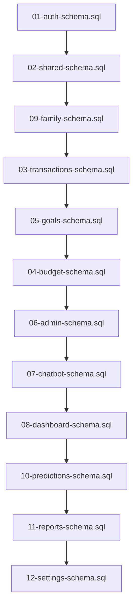
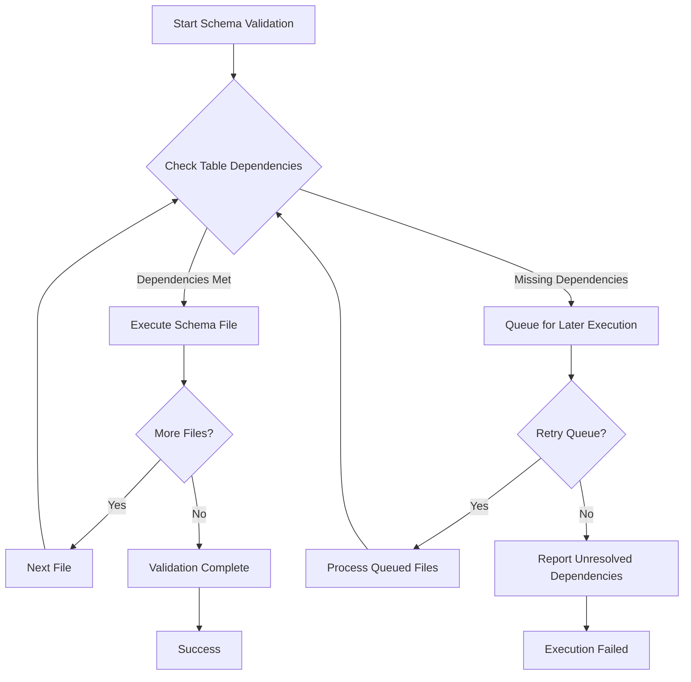

# SQL Schema Validation and Execution Order Fix

## Overview

This design addresses the dependency issues preventing smooth sequential execution of SQL schema files from 01 to 12. The primary problem is that some SQL files reference tables that are created in later files, causing foreign key constraint violations during execution.

## Problem Analysis

### Current Dependency Issues

| File | References To | Actual Creation Order | Issue |
|------|---------------|----------------------|-------|
| `03-transactions-schema.sql` | `public.goals` | Created in `05-goals-schema.sql` | Forward reference |
| `03-transactions-schema.sql` | `public.accounts` | Created in same file | Circular dependency within file |
| `04-budget-schema.sql` | `public.expense_categories` | Created in `03-transactions-schema.sql` | Correct order |
| `05-goals-schema.sql` | `public.families` | Created in `09-family-schema.sql` | Forward reference |
| `05-goals-schema.sql` | `public.accounts` | Created in `03-transactions-schema.sql` | Correct order |

### Root Cause

The error `ERROR: 42P01: relation "public.goals" does not exist` occurs because:

1. **File 03 (transactions)** tries to create foreign key reference to `public.goals(id)`
2. **File 05 (goals)** actually creates the `goals` table
3. Sequential execution fails at File 03 due to missing target table

## Strategic Solution

### Dependency Resolution Strategy

The solution involves restructuring foreign key dependencies using a phased approach:

#### Phase 1: Core Table Creation
- Create all tables without foreign key constraints
- Establish primary tables in correct dependency order

#### Phase 2: Foreign Key Application
- Add foreign key constraints after all referenced tables exist
- Apply constraints in dependency-safe order

### Restructured Execution Plan



## Implementation Approach

### File Restructuring Strategy

#### Option A: Reorder Files (Recommended)
Rename files to reflect proper dependency order:

| Current File | New Order | New Name | Rationale |
|--------------|-----------|----------|-----------|
| `09-family-schema.sql` | 03 | `03-family-schema.sql` | Must exist before goals reference it |
| `03-transactions-schema.sql` | 04 | `04-transactions-schema.sql` | Needs families table for accounts |
| `05-goals-schema.sql` | 05 | `05-goals-schema.sql` | Needs transactions/families |
| `04-budget-schema.sql` | 06 | `06-budget-schema.sql` | Needs expense categories from transactions |

#### Option B: Conditional Foreign Keys
Modify foreign key creation to be conditional on table existence:

```sql
-- Example approach for conditional FK creation
DO $$
BEGIN
    IF EXISTS (SELECT 1 FROM information_schema.tables WHERE table_name = 'goals') THEN
        ALTER TABLE transactions ADD CONSTRAINT fk_transactions_goals 
        FOREIGN KEY (goal_id) REFERENCES public.goals(id) ON DELETE SET NULL;
    END IF;
END $$;
```

### Table Creation Dependencies

#### Core Foundation Tables (Order 1-3)
1. **auth.users** (Supabase managed)
2. **profiles** (01-auth-schema.sql)
3. **families** (currently 09, move to 03)

#### Business Logic Tables (Order 4-6)
4. **accounts, transactions, categories** (currently 03, move to 04)
5. **goals** (05-goals-schema.sql)
6. **budgets** (currently 04, move to 06)

#### Feature Enhancement Tables (Order 7-12)
7. **admin** (06-admin-schema.sql)
8. **chatbot** (07-chatbot-schema.sql)
9. **dashboard** (08-dashboard-schema.sql)
10. **predictions** (10-predictions-schema.sql)
11. **reports** (11-reports-schema.sql)
12. **settings** (12-settings-schema.sql)

## Validation Framework

### Dependency Validation Function



### Pre-execution Checks

The validation system should verify:

1. **Table Existence**: Referenced tables exist before FK creation
2. **Column Compatibility**: FK columns match referenced column types
3. **Constraint Naming**: Avoid duplicate constraint names
4. **Index Dependencies**: Ensure indexed columns exist

### Dependency Mapping

| Table | Direct Dependencies | Indirect Dependencies |
|-------|-------------------|---------------------|
| `profiles` | `auth.users` | None |
| `families` | `auth.users` | `profiles` |
| `accounts` | `auth.users` | `profiles` |
| `goals` | `auth.users`, `families`, `accounts` | `profiles` |
| `transactions` | `auth.users`, `accounts`, `goals` | `profiles`, `families` |
| `budgets` | `auth.users`, `expense_categories` | `profiles`, `accounts` |

## Migration Strategy

### Step 1: File Reordering
Execute the following reordering process:

1. Backup current `sql-refactored` directory
2. Rename files to new execution order
3. Update file header dependencies documentation
4. Update deployment scripts

### Step 2: Cross-Reference Updates
Update file references within SQL files:

1. Update dependency comments in file headers
2. Modify function references between schemas
3. Update view dependencies
4. Adjust trigger creation order

### Step 3: Validation Testing
Implement comprehensive testing:

1. **Clean Database Test**: Execute on empty database
2. **Dependency Resolution Test**: Verify all FK constraints apply correctly  
3. **Data Integrity Test**: Ensure existing data compatibility
4. **Rollback Test**: Verify rollback procedures work

## Testing Strategy

### Automated Validation

Create automated test suite for schema validation:

#### Test Categories

1. **Dependency Tests**
   - Verify table creation order
   - Check foreign key constraint application
   - Validate circular dependency resolution

2. **Integration Tests**
   - Full schema deployment on clean database
   - Schema upgrade/migration testing
   - Cross-schema functionality validation

3. **Performance Tests**
   - Index creation and optimization
   - Query performance validation
   - Large dataset compatibility

### Test Environment Setup

Test environments for validation:

| Environment | Purpose | Database State |
|-------------|---------|----------------|
| **Clean** | New deployment testing | Empty PostgreSQL database |
| **Migration** | Upgrade testing | Existing data with old schema |
| **Performance** | Load testing | Database with sample data |

## Risk Mitigation

### Deployment Risks

| Risk | Impact | Mitigation Strategy |
|------|--------|-------------------|
| **Data Loss** | High | Comprehensive backup before migration |
| **Downtime** | Medium | Blue-green deployment strategy |
| **Rollback Failure** | High | Tested rollback procedures |
| **Dependency Loops** | Medium | Automated dependency cycle detection |

### Rollback Strategy

Implement multi-level rollback capability:

1. **Schema Rollback**: Revert to previous schema version
2. **Data Rollback**: Restore from pre-migration backup  
3. **Application Rollback**: Revert application to compatible version

## Success Criteria

### Validation Metrics

The solution succeeds when:

1. **Sequential Execution**: Files 01-12 execute without dependency errors
2. **Data Integrity**: All foreign key constraints apply correctly
3. **Performance**: No degradation in query performance
4. **Compatibility**: Existing application functionality preserved

### Acceptance Tests

Final validation requires:

- [ ] Clean database deployment (01-12 sequential)
- [ ] All foreign key constraints created successfully
- [ ] All indexes and views functional
- [ ] Application integration tests pass
- [ ] Performance benchmarks maintained

## Implementation Timeline

### Phase 1: Analysis and Planning (Current)
- Dependency mapping complete
- Solution design finalized
- Test strategy defined

### Phase 2: File Restructuring
- Rename and reorder SQL files
- Update cross-references
- Validate syntax and structure

### Phase 3: Testing and Validation  
- Automated test suite implementation
- Comprehensive testing across environments
- Performance validation

### Phase 4: Deployment
- Production migration planning
- Backup and rollback procedures
- Go-live execution

This design provides a comprehensive solution to resolve the SQL schema dependency issues while maintaining data integrity and system functionality.