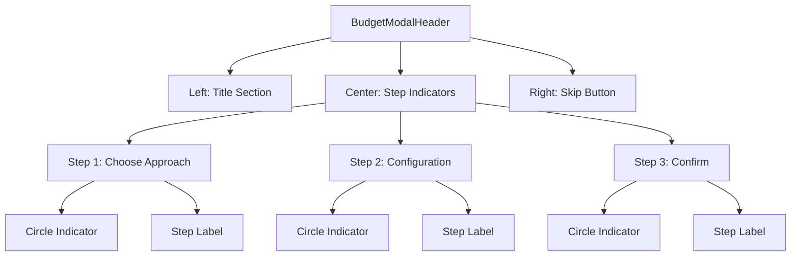

# Budget Setup Modal: Skip Button and Step Indicators Position Swap

## Overview

This design addresses the repositioning of UI elements in the Budget Setup Modal to improve user experience and interface flow. The current design places the "Skip for now" button in the top-right corner of the modal header, while step indicators (Choose Approach, Configuration, Confirm) are positioned below in the progress bar area. The objective is to swap these positions for better visual hierarchy and user interaction patterns.

## Current Architecture Analysis

### Existing Component Structure

The Budget Setup Modal follows a hierarchical component architecture:

- **BudgetSetupModal** (Main container)
  - **BudgetModalHeader** (Header section with title and skip button)
    - **BudgetProgressBar** (Progress tracking with step indicators)
  - **Modal Body** (Step content areas)
  - **BudgetSidebar** (Contextual help)

### Current Element Positioning

| Element | Current Location | Visual Priority |
|---------|-----------------|-----------------|
| Skip for now button | Header right (high prominence) | Primary action |
| Step indicators | Progress bar area (centered below header) | Secondary visual element |
| Modal title | Header left | Primary identification |
| Progress bar | Below step indicators | Tertiary visual element |

## Design Requirements

### Layout Transformation Strategy

The repositioning will restructure the header area to optimize user flow and visual hierarchy.

#### Header Section Redesign

**New Header Layout Structure:**
- **Left Section**: Modal title with contextual icon
- **Center Section**: Step indicators (Choose Approach, Configuration, Confirm)
- **Right Section**: Skip for now button

#### Step Indicators Enhancement

The step indicators will be relocated from the progress bar component to the header center position with the following characteristics:

**Visual Properties:**
- Enhanced size for header prominence (2.5rem diameter)
- Horizontal layout with controlled spacing (2rem gap)
- Consistent styling with current progress indicators
- State-aware coloring (active, completed, upcoming)

**Responsive Behavior:**
- Center-aligned within available header space
- Text wrapping prevention for step titles
- Adaptive spacing for different screen sizes

#### Skip Button Repositioning

The "Skip for now" button will maintain its functionality while being relocated:

**New Position Characteristics:**
- Header right alignment (maintaining familiar placement pattern)
- Consistent button styling with current design
- Same interaction behavior and tooltip functionality
- Preserved accessibility attributes

## Component Architecture Changes

### BudgetModalHeader Component Modifications

The header component will undergo structural changes to accommodate the new layout:

### Layout Responsibility Distribution

| Component | Previous Responsibility | New Responsibility |
|-----------|------------------------|-------------------|
| BudgetModalHeader | Title display, Skip button | Title display, Step indicators, Skip button |
| BudgetProgressBar | Progress bar, Step indicators | Progress bar only |

### Step Indicator Logic Migration

The step indicator functionality will be moved from BudgetProgressBar to BudgetModalHeader:

**Migrated Logic Components:**
- Step mapping generation based on workflow type
- Current step detection and highlighting
- Step completion status tracking
- Visual state management (active, completed, upcoming)

## User Experience Flow

### Visual Hierarchy Enhancement

The new layout establishes a clearer information hierarchy:

1. **Primary Level**: Modal title (user context)
2. **Secondary Level**: Step indicators (progress context)
3. **Tertiary Level**: Skip action (escape option)

### Interaction Pattern Optimization

**User Scan Pattern:**
- Left-to-right reading flow maintained
- Step progress visible at primary scan level
- Skip option available but not competing for attention

**Workflow Benefits:**
- Immediate step awareness upon modal opening
- Reduced cognitive load for progress tracking
- Skip option remains accessible but less prominent

## Implementation Considerations

### State Management

The step indicator state will be managed within the header component:

**Required State Properties:**
- Current step identification
- Workflow type determination
- Step completion tracking
- Progress percentage calculation

### Responsive Design Strategy

The layout will adapt to different screen sizes:

**Desktop Layout:**
- Full three-section header layout
- Generous spacing between step indicators
- Complete step titles displayed

**Mobile Layout:**
- Condensed step indicators
- Abbreviated step titles
- Maintained skip button accessibility

### Accessibility Compliance

The repositioned elements will maintain accessibility standards:

**ARIA Attributes:**
- Step indicators with proper labels
- Skip button with descriptive text
- Progress information for screen readers

**Keyboard Navigation:**
- Tab order preservation
- Focus management for step indicators
- Skip button keyboard accessibility

## Testing Strategy

### Visual Regression Testing
- Header layout verification across screen sizes
- Step indicator positioning accuracy
- Skip button placement consistency

### Interaction Testing
- Step indicator visual state changes
- Skip button functionality preservation
- Modal navigation flow validation

### User Experience Testing
- Information hierarchy effectiveness
- Visual scanning pattern optimization
- Task completion flow improvement