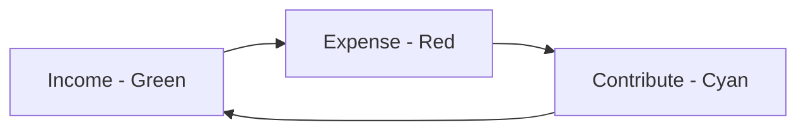
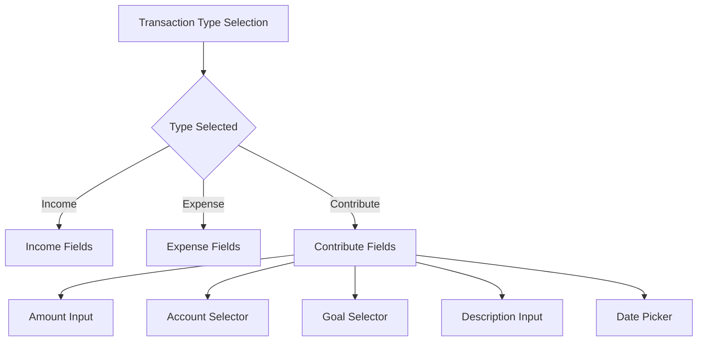
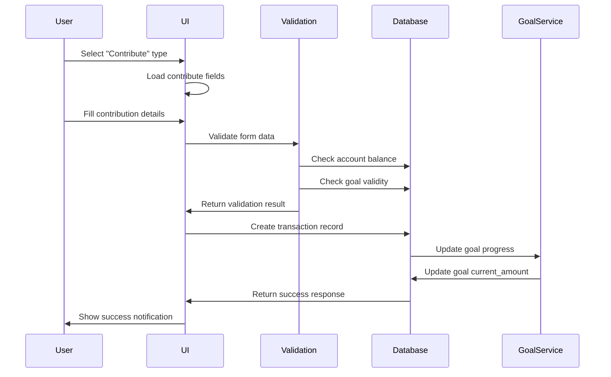
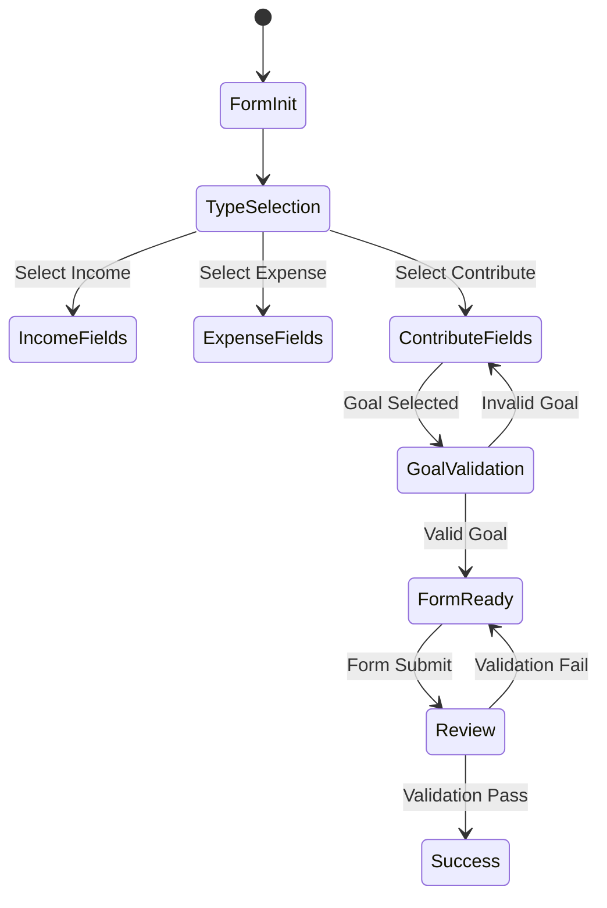

# Transaction Contribute Feature Design

## Overview

This design document outlines the enhancement of the transaction system to include a new "Contribute" transaction type with cyan color styling. The feature integrates goal contribution functionality directly into the standard transaction add/edit workflows, providing users with a unified interface for managing both regular transactions and goal contributions.

## Architecture

### Current System State

The BudgetMe application currently supports:
- **Transaction Types**: `income`, `expense`, `contribution`
- **Database Schema**: Transactions table already supports the `contribution` type
- **Frontend Components**: Existing transaction forms (AddTransaction.tsx, EditTransaction.tsx)
- **Goal System**: Separate ContributionModal.tsx for goal contributions

### System Integration Points

The contribute feature will integrate with:

| Component | Integration Type | Purpose |
|-----------|-----------------|---------|
| AddTransaction.tsx | UI Enhancement | Add contribute type selection with cyan styling |
| EditTransaction.tsx | UI Enhancement | Enable editing of contribute transactions |
| ContributionModal.tsx | Field Mapping | Source field definitions and validation logic |
| Transaction Database | Schema Utilization | Leverage existing contribution type support |
| Goal System | Data Binding | Connect contributions to specific goals |

## UI Component Design

### Transaction Type Selection Enhancement

The transaction type selection will be expanded from two options (Income/Expense) to three options:



#### Visual Design Specifications

| Element | Income | Expense | Contribute |
|---------|--------|---------|------------|
| Background Color | `bg-success` (#1cc88a) | `bg-danger` (#e74a3b) | `bg-info` (#17a2b8) |
| Text Color | `text-white` | `text-white` | `text-white` |
| Icon | `fas fa-plus-circle` | `fas fa-minus-circle` | `fas fa-flag` |
| Badge Class | `badge-success` | `badge-danger` | `badge-info` |
| Border Class | `border-left-success` | `border-left-danger` | `border-left-info` |

### Field Configuration Matrix

The contribute transaction type will utilize fields from the ContributionModal.tsx component:

| Field Name | Source Component | Data Type | Validation | Required |
|------------|------------------|-----------|------------|----------|
| amount | ContributionModal | DECIMAL(15,4) | > 0, <= account balance | Yes |
| account_id | ContributionModal | UUID | Valid account reference | Yes |
| goal_id | ContributionModal | UUID | Valid goal reference | Yes |
| notes/description | ContributionModal | TEXT | Max 500 characters | No |
| date | Standard Transaction | DATE | Valid date format | Yes |

### Form Field Layout



## Field Specifications

### Goal Assignment Field

**Component Type**: Dropdown Selector
**Data Source**: Active goals for the current user
**Display Format**: 
- Goal Name
- Current Progress (₱X / ₱Y)
- Progress Percentage
- Remaining Amount

**Validation Rules**:
- Must select an active goal (status: 'in_progress' or 'not_started')
- Goal must have remaining amount > 0
- Contribution amount cannot exceed goal remaining amount

### Amount Field Integration

**Component**: CentavoInput (existing)
**Additional Validation for Contribute Type**:
- Amount must not exceed account balance
- Amount must not exceed goal remaining amount
- Display warning if contribution would complete the goal

### Account Field Integration

**Component**: AccountSelector (existing)
**Enhanced Display for Contribute Type**:
- Show available balance prominently
- Highlight if balance is insufficient
- Auto-select default account if available

## Data Flow Architecture

### Transaction Creation Flow



### Data Validation Layer

| Validation Type | Rule | Error Message |
|----------------|------|---------------|
| Amount | > 0 | "Please enter a valid amount greater than zero" |
| Account Balance | amount <= balance | "Insufficient funds in selected account" |
| Goal Selection | goal_id exists and active | "Please select a valid active goal" |
| Goal Capacity | amount <= remaining_amount | "Contribution exceeds goal target" |
| Date | Valid date format | "Please select a valid date" |

## UI Component Modifications

### AddTransaction.tsx Enhancements

**Transaction Type Cards**:
```
[Income - Green]  [Expense - Red]  [Contribute - Cyan]
```

**Conditional Field Rendering Logic**:
- Show goal selector only when type === 'contribute'
- Hide budget selector when type === 'contribute'
- Auto-populate category with goal contribution context

### EditTransaction.tsx Enhancements

**Maintain Current Functionality**:
- Support editing existing contribute transactions
- Preserve goal associations
- Validate changes against goal constraints

**Enhanced Display**:
- Show goal progress information
- Display contribution impact on goal completion

## State Management

### Form State Structure

| State Variable | Type | Purpose |
|---------------|------|---------|
| transaction.type | 'income' \| 'expense' \| 'contribute' | Controls field visibility |
| selectedGoal | Goal \| null | Stores selected goal information |
| goalProgress | object | Caches goal progress calculations |
| validationErrors | object | Stores field-specific validation errors |

### State Transitions



## Integration with Existing Systems

### ContributionModal.tsx Field Mapping

The contribute transaction type will reuse the field structure and validation logic from ContributionModal.tsx:

| ContributionModal Field | Transaction Form Field | Mapping Notes |
|------------------------|------------------------|---------------|
| contributionData.amount | transaction.amount | Direct mapping |
| contributionData.account_id | transaction.account_id | Direct mapping |
| contributionData.goalId | transaction.goal_id | Direct mapping |
| contributionData.notes | transaction.description | Field name difference |

### Database Schema Compatibility

The existing transaction table schema already supports the contribute type:

**Existing Schema Support**:
- `type` field accepts 'contribution' value
- `goal_id` field exists for goal association
- Trigger functions handle contribution balance updates
- RLS policies support contribution transactions

### Goal Progress Updates

**Automatic Updates**: 
- Transaction creation triggers goal progress recalculation
- Account balance adjustments handled by existing triggers
- Goal status updates (completed/in_progress) managed by database functions

## Visual Design Specifications

### Color Scheme Implementation

**CSS Class Extensions**:
```
.bg-contribute { background-color: #17a2b8; }
.text-contribute { color: #17a2b8; }
.border-left-contribute { border-left-color: #17a2b8; }
.badge-contribute { background-color: #17a2b8; color: white; }
```

**Component Styling Pattern**:
- Follow existing income/expense styling patterns
- Use cyan (#17a2b8) as primary contribute color
- Maintain consistency with existing badge and card designs

### Responsive Design

**Mobile Considerations**:
- Three-column layout may need stacking on small screens
- Goal selector dropdown should be touch-friendly
- Amount input should support mobile number keyboards

## Testing Strategy

### Unit Testing Requirements

| Component | Test Category | Test Cases |
|-----------|---------------|------------|
| Form Validation | Field Validation | Amount, goal selection, account balance |
| State Management | State Transitions | Type changes, goal selection, form reset |
| Data Integration | API Calls | Transaction creation, goal updates |
| UI Rendering | Component Display | Conditional field rendering, styling |

### Integration Testing

**End-to-End Scenarios**:
1. Create new contribute transaction with valid goal
2. Edit existing contribute transaction
3. Handle insufficient account balance
4. Complete goal through contribution
5. Validate goal progress updates

### User Acceptance Testing

**Test Scenarios**:
- User can easily distinguish contribute type from income/expense
- Goal selection is intuitive and informative
- Form validation provides clear feedback
- Transaction creation successfully updates goal progress

## Performance Considerations

### Data Loading Optimization

**Lazy Loading Strategy**:
- Load goals only when contribute type is selected
- Cache goal data to prevent repeated API calls
- Pre-load account balances for validation

### Real-time Updates

**Goal Progress Synchronization**:
- Update goal progress indicators in real-time
- Refresh goal completion status after transaction creation
- Maintain data consistency across concurrent users

## Error Handling

### Validation Error Messages

| Error Condition | User Message | Technical Action |
|-----------------|--------------|------------------|
| Insufficient Balance | "Insufficient funds in [Account Name]. Available: ₱X.XX" | Prevent form submission |
| Goal Overfunding | "Contribution exceeds goal target by ₱X.XX" | Show warning, allow override |
| Invalid Goal | "Selected goal is no longer active" | Clear goal selection |
| Network Error | "Unable to save transaction. Please try again." | Retry mechanism |

### Fallback Scenarios

**Goal Service Unavailable**:
- Disable contribute type temporarily
- Show informational message to user
- Allow fallback to expense type with manual goal assignment

**Account Balance Check Failure**:
- Proceed with transaction creation
- Log warning for manual verification
- Send notification to user about pending verification

## Deployment Considerations

### Database Migrations

**Schema Validation**:
- Verify contribution type is already supported
- Confirm goal_id foreign key constraints exist
- Validate trigger functions handle contribution transactions

### Frontend Deployment

**Backward Compatibility**:
- Existing contribute transactions should display correctly
- No breaking changes to current transaction workflows
- Graceful degradation if goal service is unavailable

### Configuration Updates

**Feature Flags** (if applicable):
- Enable/disable contribute type per user or globally
- A/B testing support for UI variations
- Performance monitoring for new workflows

## Maintenance and Monitoring

### Analytics Tracking

**User Behavior Metrics**:
- Contribute type usage frequency
- Goal completion rates via transactions
- Form abandonment rates for contribute type

**System Performance Metrics**:
- Transaction creation response times
- Goal update processing duration
- Database query performance for goal-related operations

### Support Documentation

**User Guide Updates**:
- Document new contribute transaction type
- Explain goal assignment workflow
- Provide troubleshooting guide for common issues

**Technical Documentation**:
- API endpoint documentation updates
- Database schema documentation
- Component integration guidelines