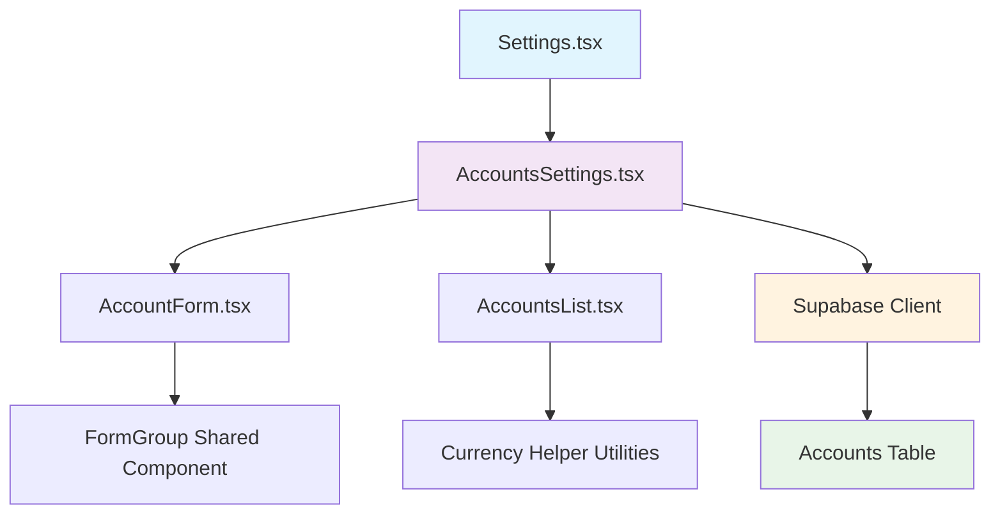
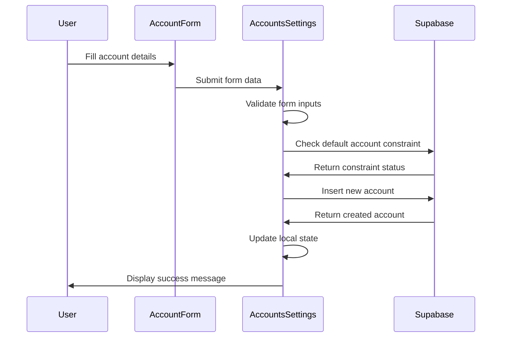
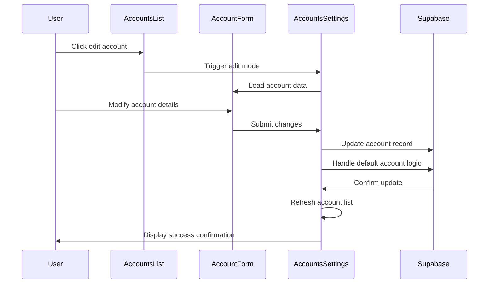
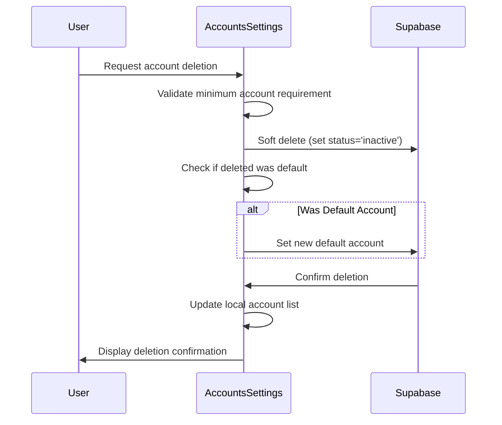
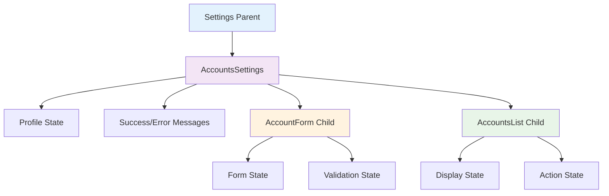
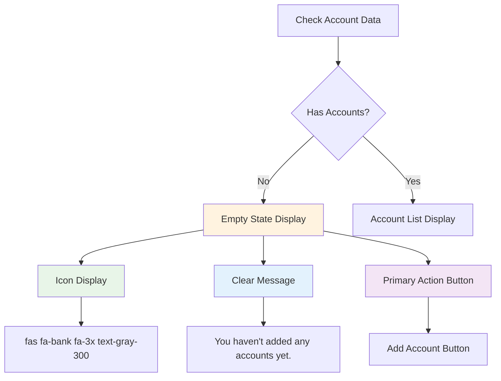
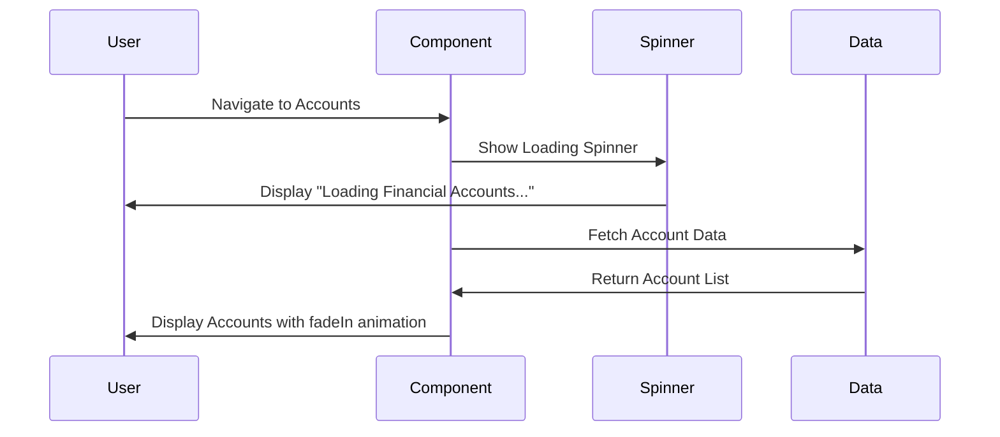

# Account Settings Enhancement Design

## Overview

This design outlines the enhancement of the account settings functionality within the Settings module, focusing on improving the integration with Supabase backend services and aligning with the updated database schema. The enhancement will ensure robust account management capabilities with proper validation, error handling, and seamless database operations.

## Technology Stack & Dependencies

### Frontend Components
- React TypeScript components in `/src/components/settings/components/accounts/`
- Custom form handling with validation
- Bootstrap UI framework for styling
- Animate.css for user interface animations

### Backend Integration
- Supabase client for database operations
- Real-time data synchronization
- Row Level Security (RLS) for data protection
- PostgreSQL database with accounts table

### State Management
- React Context (AuthContext) for user authentication
- Local component state for form management
- Parent-child component communication for data flow

## Component Architecture

### Component Hierarchy



### Component Definitions

#### AccountsSettings Component
- **Purpose**: Main orchestrator for account management operations
- **Responsibilities**:
  - Account CRUD operations coordination
  - Form state management
  - Error and success message handling
  - Database transaction management
  - Default account logic enforcement

#### AccountForm Component
- **Purpose**: Account creation and editing interface
- **Responsibilities**:
  - Form validation and input handling
  - Account type selection
  - Balance input with currency formatting
  - Default account designation
  - Color picker for account visualization

#### AccountsList Component
- **Purpose**: Display and manage existing accounts
- **Responsibilities**:
  - Tabular account presentation
  - Edit and delete action triggers
  - Account status indication
  - Visual account identification through colors

## Data Models & Database Integration

### Account Entity Schema

| Field | Type | Constraints | Description |
|-------|------|-------------|-------------|
| id | UUID | PRIMARY KEY, auto-generated | Unique account identifier |
| user_id | UUID | FOREIGN KEY, NOT NULL | Reference to authenticated user |
| account_name | TEXT | NOT NULL | User-defined account name |
| account_type | TEXT | CHECK constraint with enum values | Account categorization |
| balance | DECIMAL(15,4) | NOT NULL, DEFAULT 0.00 | Current account balance |
| initial_balance | DECIMAL(15,4) | NOT NULL, DEFAULT 0.00 | Starting balance for tracking |
| currency | TEXT | NOT NULL, DEFAULT 'USD' | Account currency designation |
| status | TEXT | CHECK constraint, DEFAULT 'active' | Account operational status |
| is_default | BOOLEAN | DEFAULT false | Primary account designation |
| description | TEXT | OPTIONAL | Additional account details |
| institution_name | TEXT | OPTIONAL | Banking institution reference |
| account_number_masked | TEXT | OPTIONAL | Partial account number for identification |
| created_at | TIMESTAMPTZ | DEFAULT now() | Record creation timestamp |
| updated_at | TIMESTAMPTZ | DEFAULT now() | Last modification timestamp |

### Database Constraints & Validation

#### Balance Validation Logic
- Credit accounts: Balance must be less than or equal to zero
- Other account types: No upper limit restrictions
- All accounts: Precision to 4 decimal places for currency accuracy

#### Default Account Management
- Exactly one default account must exist per user
- When setting new default, previous default is automatically unset
- New users receive first account as default automatically

## Business Logic Layer

### Account Management Operations

#### Create Account Flow


#### Update Account Flow


#### Delete Account Flow


### Validation Rules & Constraints

#### Form Validation Logic
- **Account Name**: Required, non-empty string, trimmed whitespace
- **Account Type**: Must match predefined enum values
- **Balance**: Valid numeric input, 4 decimal precision
- **Currency**: Fixed to system default (currently PHP)
- **Default Assignment**: Only one default per user validation

#### Business Rule Enforcement
- **Minimum Account Requirement**: Users must maintain at least one active account
- **Default Account Logic**: Automatic default assignment for first account
- **Currency Consistency**: All accounts use PHP currency for system uniformity
- **Soft Deletion**: Accounts marked inactive rather than permanently deleted

## API Integration Layer

### Supabase Database Operations

#### Account Creation Service
```typescript
// Pseudocode for account creation
interface CreateAccountOperation {
  validateInputs(): ValidationResult
  checkDefaultConstraint(): Promise<boolean>
  insertAccount(): Promise<Account>
  updateDefaultStatus(): Promise<void>
  handleRollback(): Promise<void>
}
```

#### Account Retrieval Service
```typescript
// Pseudocode for account fetching
interface AccountRetrievalOperation {
  fetchUserAccounts(): Promise<Account[]>
  applyUserFilters(): Account[]
  sortByPreference(): Account[]
  enrichWithMetadata(): Account[]
}
```

#### Account Update Service
```typescript
// Pseudocode for account updates
interface UpdateAccountOperation {
  validateOwnership(): Promise<boolean>
  processFieldUpdates(): Promise<void>
  manageDefaultTransition(): Promise<void>
  auditTrailLogging(): Promise<void>
}
```

### Error Handling Strategy

#### Database Error Categories
| Error Type | Handling Strategy | User Feedback |
|------------|------------------|---------------|
| Connection Timeout | Retry mechanism with exponential backoff | "Please try again in a moment" |
| Validation Errors | Immediate form feedback | Specific field error messages |
| Permission Denied | Authentication check prompt | "Please log in to continue" |
| Constraint Violations | Business rule explanation | "Account name already exists" |
| Unexpected Errors | Graceful degradation | "Something went wrong, please contact support" |

#### Recovery Mechanisms
- **Auto-save**: Periodic form data persistence in local storage
- **Offline Support**: Queue operations for when connection restored
- **Data Integrity**: Transaction rollback on partial failures
- **User Guidance**: Clear error messages with suggested actions

## State Management Architecture

### Data Flow Patterns

#### Parent-Child Communication


#### State Synchronization Strategy
- **Local State**: Form inputs and temporary UI states
- **Shared State**: User profile and account collections
- **Persistent State**: Database-backed account information
- **Cache Management**: Optimistic updates with rollback capability

### Real-time Data Handling

#### Supabase Integration Patterns
- **Subscription Management**: Real-time account updates across sessions
- **Conflict Resolution**: Last-write-wins with user notification
- **Data Freshness**: Automatic refresh on window focus
- **Bandwidth Optimization**: Selective field updates rather than full record sync

## User Experience Considerations

### Interface Design Patterns

#### Consistent UI Component Design
- **Badge System**: Standardized badge usage following application patterns
  - Primary badges for default accounts: `badge badge-primary`
  - Account type indicators with appropriate color coding
  - Status badges for active/inactive states
- **Card Layout Structure**: Consistent card design matching transactions and goals components
  - Card headers with primary color scheme
  - Standardized spacing and animation delays
  - Icon placement and tooltip integration

#### Form Interaction Flow
- **Progressive Disclosure**: Show advanced options based on account type
- **Inline Validation**: Real-time feedback during form completion
- **Accessibility**: Keyboard navigation and screen reader support
- **Mobile Responsiveness**: Touch-friendly controls and layouts

#### Visual Feedback Systems
- **Loading States**: Skeleton screens following transaction component patterns
- **Success Indicators**: Toast notifications and inline success messages
- **Error Recovery**: Actionable error messages with retry options
- **Data Visualization**: Color-coded account identification with consistent color palette

### No Data State Handling

#### Empty State Design Patterns
Following the consistent approach used in transactions and goals components:



#### Empty State Implementation
- **Icon Consistency**: Use `fas fa-bank fa-3x text-gray-300` for account-related empty states
- **Message Pattern**: Clear, helpful messaging similar to "No transactions to display" pattern
- **Action Button**: Single primary call-to-action following application standards
- **Layout Structure**: Center-aligned content with proper spacing

### Performance Optimization

#### Frontend Optimization
- **Lazy Loading**: Components loaded on demand
- **Memoization**: Prevent unnecessary re-renders using React.memo
- **Bundle Splitting**: Separate account management bundle
- **Animation Optimization**: Consistent animate.css usage with proper delays

#### Backend Optimization
- **Query Optimization**: Efficient database query patterns
- **Connection Pooling**: Managed Supabase connections
- **Caching Strategy**: Local storage for form data persistence
- **Rate Limiting**: API call throttling for abuse prevention

### Styling Consistency

#### Design System Integration

**Color Scheme Adherence**
- Primary color: `#4e73df` (consistent with application theme)
- Success indicators: `#1cc88a` (for positive actions)
- Warning states: `#f6c23e` (for caution messages)
- Danger alerts: `#e74a3b` (for errors and deletions)
- Gray text hierarchy: `text-gray-800`, `text-gray-600`, `text-gray-500`, `text-gray-400`

**Animation Standards**
- Entry animations: `animate__animated animate__fadeIn`
- Staggered delays: `style={{ animationDelay: "0.1s" }}`, `style={{ animationDelay: "0.2s" }}`
- Loading states: Consistent spinner with `text-primary` color
- Card transitions: Smooth hover effects and state changes

**Typography Consistency**
- Headers: `h3 mb-0 text-gray-800` for page titles
- Card titles: `m-0 font-weight-bold text-primary` for card headers
- Helper text: `form-text text-muted` for form guidance
- Labels: `small font-weight-bold` for form labels

#### Component Layout Patterns

**Card Structure Template**
```
.card.shadow.mb-4
  .card-header.py-3
    h6.m-0.font-weight-bold.text-primary + badge
  .card-body
    // Content with consistent spacing
```

**Button Group Patterns**
- Action buttons: `btn btn-primary btn-sm` for primary actions
- Secondary actions: `btn btn-outline-primary btn-sm`
- Danger actions: `btn btn-outline-danger btn-sm`
- Icon spacing: `mr-1` or `mr-2` for icon-text combinations

**Table Design Standards**
- Header styling: `thead-light` for table headers
- Action columns: Consistent button sizing and spacing
- Status indicators: Badge system for account status
- Responsive wrapper: `table-responsive` for mobile compatibility

### Visual Design Standards

#### Account Status Indicators
Following the established badge system used throughout the application:

| Status Type | Badge Class | Icon | Usage Pattern |
|-------------|-------------|------|--------------|
| Default Account | `badge badge-primary` | `fas fa-star` | Primary account designation |
| Active Status | `badge badge-success` | `fas fa-check-circle` | Account operational state |
| Inactive Status | `badge badge-warning` | `fas fa-pause-circle` | Temporarily disabled accounts |
| Credit Account | `badge badge-info` | `fas fa-credit-card` | Credit-type account indicator |
| Savings Account | `badge badge-secondary` | `fas fa-piggy-bank` | Savings-type account indicator |

#### Loading State Patterns
Consistent with transaction and goals components:



**Loading State Implementation**
- Spinner: `spinner-border text-primary` with 3rem dimensions
- Container: `text-center my-5 py-5 animate__animated animate__fadeIn`
- Message: `mt-4 text-gray-600 font-weight-light`
- Subtext: `text-gray-500` for additional context

#### Error State Design
Matching the application's error handling patterns:

**Error Message Structure**
- Icon: `fas fa-exclamation-triangle fa-4x text-warning`
- Title: `h3 mb-3 font-weight-bold text-gray-800`
- Description: Clear, actionable error message
- Action: Primary button for recovery or navigation

**Error Types and Styling**
- Network errors: Warning icon with retry button
- Validation errors: Inline form feedback with `alert alert-danger`
- Permission errors: Lock icon with login prompt
- Data errors: Question mark icon with contact support option

## Testing Strategy

### Unit Testing Approach

#### Component Testing Coverage
- **AccountForm**: Input validation, form submission, error handling, empty state rendering
- **AccountsList**: Data rendering, action triggers, empty states, badge display
- **AccountsSettings**: State management, API integration, business logic, loading states

#### UI Consistency Testing
- **Badge Implementation**: Verify consistent badge usage across components
- **Animation Timing**: Test animation delays and transitions
- **Color Scheme**: Validate color usage matches design system
- **Loading States**: Ensure consistent loading pattern implementation

#### Service Testing Coverage
- **Database Operations**: CRUD operation validation
- **Validation Logic**: Business rule enforcement
- **Error Scenarios**: Failure mode handling with proper UI feedback
- **Integration Points**: Supabase client interaction

### Integration Testing Scenarios

#### End-to-End User Flows
- **Account Creation**: Complete flow from form to database with success feedback
- **Account Modification**: Edit existing account with validation and UI updates
- **Account Deletion**: Soft delete with constraint handling and confirmation
- **Default Management**: Default account transition scenarios with badge updates
- **Empty State Handling**: No accounts scenario with proper empty state display

#### UI/UX Consistency Validation
- **Cross-Component Consistency**: Verify similar patterns match transactions/goals
- **Responsive Behavior**: Test layout adaptation across screen sizes
- **Accessibility Standards**: Keyboard navigation and screen reader compatibility
- **Performance Benchmarks**: Loading time and animation smoothness metrics