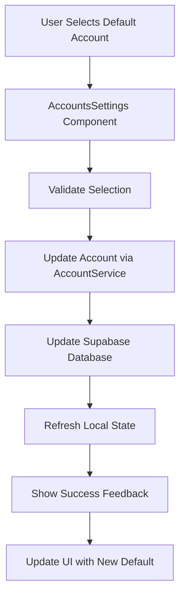
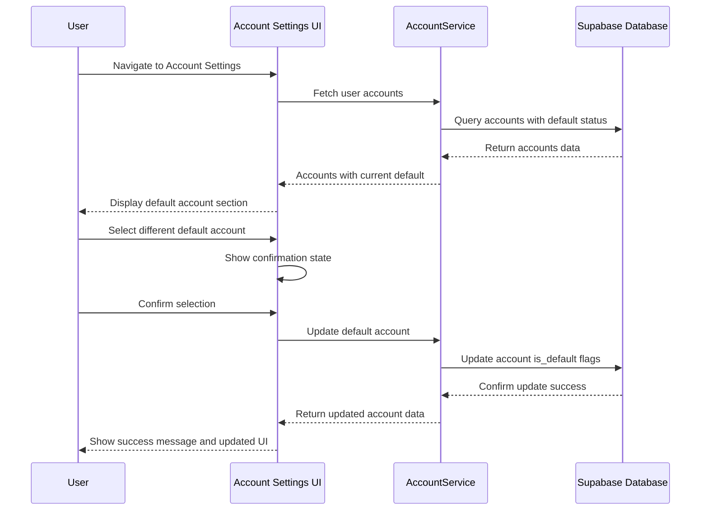

# Update Default Account Design - Account Settings Enhancement

## Overview

This design document outlines the enhancement of the default account selection feature within account settings. The current implementation shows a simple "Default" badge in the accounts list. The proposed enhancement will replicate the intuitive and clear design pattern used in the goal creation feature's family sharing section, making the default account selection more prominent and user-friendly.

**Current State**: Default account status is indicated only by a small "Default" badge in the accounts list table.

**Proposed Enhancement**: Transform the default account selection into a dedicated section with clear explanations, visual emphasis, and improved user experience that matches the family goal sharing design pattern.

## Technology Stack

**Frontend Framework**: React 18.2.0 with TypeScript  
**UI Framework**: Bootstrap 4.6.0 with SB Admin 2 theme  
**Styling**: Animate.css for transitions, Font Awesome icons  
**Backend**: Supabase for database operations  
**State Management**: React Context API with local component state

## Architecture

### Component Hierarchy

The enhancement will be implemented within the existing Account Settings architecture:

```
Settings.tsx
└── AccountsSettings.tsx
    ├── AccountsList.tsx (Enhanced)
    └── DefaultAccountSelection.tsx (New Component)
```

### Data Flow Architecture



## User Interface Enhancement

### Default Account Selection Section

The new design will introduce a dedicated section positioned prominently within the accounts settings, replicating the family goal sharing pattern:

**Section Structure**:
- **Header**: "Set as Default Account" with account icon
- **Current Default Indicator**: Clear display of currently selected default account
- **Description Text**: Explanatory text about default account functionality
- **Selection Interface**: Visual account selector with radio buttons or dropdown
- **Benefits Explanation**: Auto-selection behavior description

### Visual Design Elements

**Card Layout**:
```
┌─────────────────────────────────────────────────────┐
│ 🏦 Set as Default Account                          │
├─────────────────────────────────────────────────────┤
│                                                     │
│ Current Default                                     │
│ [Account Icon] Primary Checking Account             │
│                                                     │
│ ○ Primary Checking Account                          │
│ ○ Savings Account                                   │  
│ ● Secondary Checking (Selected)                     │
│                                                     │
│ ℹ️ Auto-selected for new transactions              │
│ When you create a new transaction, this account    │
│ will be automatically selected as the default      │
│ source or destination.                              │
│                                                     │
│ 🔒 If not set, you'll need to manually select      │
│ an account for each transaction.                    │
│                                                     │
└─────────────────────────────────────────────────────┘
```

### Typography and Color Scheme

**Primary Elements**:
- Section title: Bootstrap `h5` with `text-primary` styling
- Current default display: `font-weight-bold` with `text-success`
- Description text: `text-muted` with appropriate sizing
- Selection options: Standard form controls with proper contrast

**Visual Indicators**:
- Success state: Green checkmark and border (`border-left-success`)
- Info state: Blue info icon and border (`border-left-info`)
- Account icons: FontAwesome account type icons with color coding

## Feature Functionality

### Default Account Management

**Core Behaviors**:

1. **Current Default Display**
   - Shows currently selected default account with visual prominence
   - Displays account name, type, and current balance
   - Uses consistent iconography with account type indicators

2. **Account Selection Interface**
   - Radio button selection for single default account choice
   - Disabled state for accounts marked as inactive
   - Visual feedback during selection changes

3. **Auto-Selection Explanation**
   - Clear description of when and how the default account is used
   - Benefits of having a default account set
   - Consequences of not having a default account

### State Management

**Component State Structure**:
```
DefaultAccountState {
  currentDefaultId: string | null
  availableAccounts: Account[]
  isUpdating: boolean
  showConfirmation: boolean
  selectedAccountId: string | null
}
```

**Account Object Enhancement**:
```
Account {
  id: string
  account_name: string
  account_type: AccountType
  balance: number
  is_default: boolean
  is_active: boolean
  color: string
  // ... existing fields
}
```

### Business Logic Layer

#### Default Account Validation Rules

1. **Single Default Constraint**: Only one account can be marked as default at any time
2. **Active Account Requirement**: Default account must have 'active' status
3. **Existence Validation**: Default account must exist and belong to the authenticated user
4. **Automatic Fallback**: If default account is deleted, system automatically promotes another active account

#### Transaction Integration

The default account selection integrates with the transaction system:

**New Transaction Flow**:
1. User navigates to Add Transaction
2. Account field pre-populates with default account
3. User can override selection if needed
4. Selection preference remembered for session

**Edit Transaction Flow**:
1. Existing transactions maintain their original account selection
2. Default account change does not affect historical transactions
3. Only new transactions utilize the updated default

## API Endpoints Reference

### Update Default Account

**Endpoint**: `PATCH /accounts/{accountId}/set-default`  
**Authentication**: Required (User must own the account)

**Request Schema**:
```
{
  userId: string (from auth context)
  accountId: string (path parameter)
}
```

**Response Schema**:
```
{
  success: boolean
  data: {
    updatedAccount: Account
    previousDefaultId: string | null
  }
  message: string
}
```

**Error Responses**:
- `400`: Invalid account ID or account not found
- `403`: User does not have permission to modify account
- `409`: Account is inactive and cannot be set as default
- `500`: Database operation failed

### Fetch User Accounts with Default Status

**Endpoint**: `GET /accounts/user/{userId}`  
**Enhancement**: Include default account status in response

**Response Enhancement**:
```
{
  success: boolean
  data: {
    accounts: Account[]
    defaultAccountId: string | null
    totalActiveAccounts: number
  }
}
```

## Data Models & Database Schema

### Account Table Enhancement

**Existing Schema** (No changes required):
```sql
CREATE TABLE accounts (
  id UUID PRIMARY KEY,
  user_id UUID NOT NULL,
  account_name VARCHAR(255) NOT NULL,
  account_type account_type_enum NOT NULL,
  balance DECIMAL(15,2) DEFAULT 0,
  is_default BOOLEAN DEFAULT FALSE,
  status account_status_enum DEFAULT 'active',
  -- ... other existing fields
);
```

**Database Constraints**:
- Unique constraint ensures only one default account per user
- Trigger maintains referential integrity when accounts are deleted
- Index on `(user_id, is_default)` for efficient default account queries

### Account Service Enhancement

**New Service Methods**:

```typescript
class AccountService {
  static async setDefaultAccount(
    accountId: string, 
    userId: string
  ): Promise<ServiceResponse<Account>>
  
  static async getDefaultAccount(
    userId: string
  ): Promise<ServiceResponse<Account | null>>
  
  static async ensureDefaultAccount(
    userId: string
  ): Promise<ServiceResponse<Account>>
}
```

### Account Summary Enhancement

The accounts list footer will be simplified to remove the unnecessary "Default Account" metric. The enhanced summary will display only the essential metrics:

**Simplified Footer Metrics**:
- **Total Accounts**: Count of all user accounts
- **Total Assets**: Sum of positive balances from non-credit accounts
- **Total Debt**: Sum of negative balances from credit accounts

**Removed Metric**:
- ~~Default Account count~~ - This metric provided no meaningful value since users can only have one default account

The simplified layout improves clarity and removes redundant information that was visible elsewhere in the interface.

## User Experience Flow

### Primary Use Case: Setting Default Account



### Error Handling Flow

**Account Deletion Scenario**:
1. User attempts to delete current default account
2. System displays warning about default status
3. Upon confirmation, system automatically promotes next active account
4. User receives notification about new default account
5. UI updates to reflect new default selection

**No Active Accounts Scenario**:
1. System detects no active accounts available for default
2. Default account section displays inactive state
3. Instructional message guides user to activate or add accounts
4. Default functionality disabled until active account available

## Testing Strategy

### Unit Testing Requirements

**Component Testing**:
- Default account selection rendering with various account states
- State management during account selection changes
- Error boundary behavior for failed API calls
- Accessibility compliance for screen readers

**Service Testing**:
- Account Service default account operations
- Database constraint validation
- Error handling for edge cases
- Performance testing for users with many accounts

### Integration Testing

**End-to-End Scenarios**:
1. Set default account and verify transaction form pre-population
2. Delete default account and confirm automatic fallback
3. Deactivate default account and verify system behavior
4. Multiple browser tabs consistency during default changes

### Accessibility Testing

**Requirements**:
- Keyboard navigation through account selection
- Screen reader announcements for default account changes
- High contrast mode compatibility
- Focus management during selection changes

## Security Considerations

### Authorization Controls

**Account Ownership Validation**:
- Verify user owns account before allowing default status change
- Prevent cross-user account access through proper filtering
- Audit logging for default account changes

**Data Integrity Protection**:
- Transaction isolation during default account updates
- Rollback capability for failed multi-account updates
- Rate limiting for rapid default account changes

### Privacy Safeguards

**Information Disclosure Prevention**:
- Account balance information only visible to account owner
- Default account status not exposed in public APIs
- Proper session management for account settings access

## Performance Optimization

### Database Query Efficiency

**Optimized Queries**:
- Single query to fetch accounts with default status
- Efficient indexing for user account lookups
- Minimal database round trips during updates

**Caching Strategy**:
- Client-side caching of account data during session
- Invalidation strategy for account updates
- Optimistic UI updates with fallback error handling

### UI Performance

**Rendering Optimization**:
- Lazy loading of account selection component
- Virtualization for users with many accounts
- Debounced search functionality if account search added

## Migration and Deployment

### Existing Data Compatibility

**Current State Assessment**:
- Verify existing accounts have proper default status
- Identify accounts with inconsistent default flags
- Plan for users without any default account set

**Migration Strategy**:
1. Deploy new UI components as feature-flagged enhancement
2. Gradually roll out to user segments
3. Monitor for any performance impacts
4. Full deployment after validation period

### Rollback Plan

**Fallback Capabilities**:
- Feature flag toggle to revert to original badge-only display
- Database rollback scripts for schema changes if needed
- Component version management for quick reversion

## Success Metrics

### User Experience Metrics

**Usability Improvements**:
- Reduced time to locate and change default account
- Decreased support requests about transaction account selection
- Increased user satisfaction scores for account management

**Engagement Metrics**:
- Percentage of users who set a default account after enhancement
- Frequency of default account changes
- User retention in account settings section

### Technical Performance Metrics

**System Performance**:
- API response times for account operations
- Database query execution times
- Client-side rendering performance
- Error rates for default account operations

## Conclusion

This enhancement transforms the default account selection from a passive status indicator into an active, user-friendly interface that clearly communicates the feature's value and functionality. By replicating the successful design pattern from the family goal sharing feature, users will have a more intuitive and engaging experience when managing their default account preferences.

The implementation maintains backward compatibility while providing a significantly improved user experience that aligns with modern UI/UX principles and the application's existing design language.