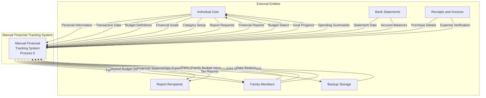

# 2.2.2 ANALYSIS PHASE

During this phase, the researchers studied the data gathered from the requirement phase to understand how the current manual processes work and how they can be improved through automation. This phase includes identifying the system's functions, expected outputs, and input requirements. The researchers also created process models such as Data Flow Diagrams (DFDs) and Use Case Diagrams to visualize how data moves within the system and how users interact with it. These helped in organizing and validating the system's flow before moving to the design phase.

The analysis revealed that BudgetMe requires a comprehensive modular architecture consisting of ten (10) functional modules supported by a forty-five plus (45+) table database schema on Supabase PostgreSQL, with advanced AI/ML capabilities through Facebook Prophet forecasting and Large Language Model integration via OpenRouter API.

## Fig 4. Manual System Context Diagram

The diagram represents the manual process of financial tracking that individuals use before implementing automated systems. In this manual process, individuals engage in several key activities to maintain control of their finances without specialized software.

The user begins by collecting physical financial documents including receipts from purchases and paper statements from financial institutions. They manually record these transactions in paper ledgers, notebooks, or basic spreadsheet files, often creating their own tracking systems with varying levels of detail and organization. Users also manually categorize their expenses by sorting receipts or creating category columns in their records, a time-consuming process prone to inconsistencies.

For budgeting, users create written or spreadsheet-based budget plans, manually comparing their actual spending with these planned amounts through many calculations. Financial institutions provide periodic statements that users must manually reconcile with their personal records to ensure accuracy. When discrepancies are found, the user must investigate and correct their records accordingly.

Family members who share household expenses must coordinate manually, often through verbal communication or shared spreadsheets, leading to potential conflicts and incomplete tracking of shared financial responsibilities. Goal tracking requires users to manually calculate progress toward savings targets without predictive insights or automated contribution tracking.

The manual outputs include hand-calculated spending reports, often limited to basic totals by category, manual budget comparisons that require significant effort to maintain regularly, and balance calculations that depend on the individual's mathematical accuracy. Physical storage of receipts, ledgers, and files serves as the primary data repository, supplemented by basic computer storage for those using spreadsheets.

This manual process suffers from significant inefficiencies including time consumption where hours are spent on data entry and calculations, calculation errors due to human mistakes in arithmetic and categorization, delayed insights where financial awareness comes days or weeks after transactions, inconsistent records making it difficult to maintain standardized tracking over time, no predictive capability to forecast future financial trends, and limited collaboration making family financial coordination challenging. All these challenges are what automated systems like BudgetMe are designed to address through intelligent automation, AI-powered predictions, and collaborative family features.

## Fig 5. Automated System Level 0 Context Diagram

```mermaid
graph TB
    subgraph "External Entities"
        A[Individual Users]
        B[Family Members]
        C[System Administrators]
        D[Bank/Financial Institutions]
        E[Email Service Provider]
        F[AI Service Providers]
        G[Mobile Devices]
        H[Web Browsers]
    end
    
    subgraph "BudgetMe Financial Management System"
        SYSTEM[BudgetMe System<br/>Process 0]
    end
    
    A -->|User Registration/Login| SYSTEM
    A -->|Transaction Data| SYSTEM
    A -->|Budget Information| SYSTEM
    A -->|Financial Goals| SYSTEM
    A -->|Settings and Preferences| SYSTEM
    A -->|Chat Messages| SYSTEM
    
    B -->|Family Join Requests| SYSTEM
    B -->|Shared Transaction Data| SYSTEM
    B -->|Family Budget Contributions| SYSTEM
    B -->|Shared Goals Data| SYSTEM
    
    C -->|Administrative Commands| SYSTEM
    C -->|System Configuration| SYSTEM
    C -->|User Management Requests| SYSTEM
    
    D -->|Bank Transaction Data| SYSTEM
    D -->|Account Balance Information| SYSTEM
    
    F -->|AI Model Responses| SYSTEM
    F -->|Prediction Model Data| SYSTEM
    
    G -->|Mobile App Requests| SYSTEM
    H -->|Web Application Requests| SYSTEM
    
    SYSTEM -->|Financial Reports| A
    SYSTEM -->|Budget Alerts| A
    SYSTEM -->|Goal Progress Updates| A
    SYSTEM -->|AI Predictions| A
    SYSTEM -->|Spending Insights| A
    SYSTEM -->|Chatbot Responses| A
    
    SYSTEM -->|Family Dashboard Data| B
    SYSTEM -->|Shared Reports| B
    SYSTEM -->|Family Notifications| B
    
    SYSTEM -->|System Status Reports| C
    SYSTEM -->|User Analytics| C
    SYSTEM -->|Administrative Dashboards| C
    
    SYSTEM -->|Email Notifications| E
    SYSTEM -->|Verification Emails| E
    
    SYSTEM -->|AI Analysis Requests| F
    SYSTEM -->|Prediction Requests| F
    
    SYSTEM -->|Mobile App Responses| G
    SYSTEM -->|Web Application Responses| H
```

The diagram illustrates the complete context of the BudgetMe: A Web-Based Financial Management System. The system serves as the central hub where users manage their personal finances and administrators oversee system operations.

Users interact with the system through several key processes which include authentication to access their accounts, create and manage budgets to plan their spending, record financial transactions to track actual expenses and income, set financial goals to work toward savings targets, and can invite family members to create shared financial management. In return, the system provides users with account information, detailed budget reports, complete transaction history, progress updates on their financial goals, and AI-powered financial predictions to help with future planning.

Family Members represent a specialized user role with collaborative capabilities. They can join family groups through invitation links, contribute to shared family budgets and goals, view family financial dashboards, and receive notifications about family financial activities. The system enables permission-based access where family administrators can control what members can view or modify.

Administrators interact with the system primarily for management purposes, including user account administration, system configuration settings, feature flag management for gradual feature rollouts, and comprehensive backup management. The system provides administrators with comprehensive reports and user statistics to monitor system usage and performance.

AI Service Providers through the OpenRouter API enable multiple AI capabilities including the BudgetSense chatbot powered by GPT-4, Claude, and Llama models, and the AI Insights module that generates personalized financial recommendations, risk assessments, and opportunity identification based on user data.

All data, including financial records, user information, transaction history, and AI prediction models, is stored in and retrieved from the financial database. This central repository ensures data consistency and enables the system to generate accurate reports and meaningful financial insights for both users and administrators.

## Fig 6. Automated System Level 1 Data Flow Diagram

```mermaid
graph TB
    subgraph "External Entities"
        USER[Users]
        FAMILY[Family Members]
        ADMIN[Administrators]
        BANK[Banks/Financial Institutions]
        EMAIL[Email Service]
        AI_EXT[AI Service Providers]
    end
    
    subgraph "BudgetMe Financial Management System"
        subgraph "Core Application Modules"
            AUTH[1.0 Authentication Module]
            BUDGET[2.0 Budget Management Module]
            TRANS[3.0 Transaction Module]
            GOALS[4.0 Goal Management Module]
            FAM[5.0 Family Management Module]
            REPORTS[6.0 Reporting and Analysis Module]
        end
        
        subgraph "AI/ML Services"
            PREDICT[7.0 AI Prediction Module]
            CHATBOT[8.0 Chatbot BudgetSense Module]
            AI_INSIGHTS[10.0 AI Insights Module]
        end
        
        subgraph "System Management"
            ADMIN_MOD[9.0 Admin Management Module]
        end
        
        subgraph "Data Stores"
            D1[(D1: User Data)]
            D2[(D2: Transaction Data)]
            D3[(D3: Budget Data)]
            D4[(D4: Goals Data)]
            D5[(D5: Family Data)]
            D6[(D6: AI Prediction Data)]
            D7[(D7: Admin Configuration)]
            D8[(D8: Chat Data)]
        end
    end
    
    USER -->|Login Credentials| AUTH
    USER -->|Transaction Data| TRANS
    USER -->|Budget Requests| BUDGET
    USER -->|Goal Data| GOALS
    USER -->|Chat Messages| CHATBOT
    
    FAMILY -->|Family Requests| FAM
    ADMIN -->|Admin Commands| ADMIN_MOD
    BANK -->|Bank Data| TRANS
    AI_EXT -->|AI Responses| PREDICT
    AI_EXT -->|Chat Responses| CHATBOT
    AI_EXT -->|Insights| AI_INSIGHTS
    
    AUTH -->|Auth Status| USER
    BUDGET -->|Budget Reports| USER
    TRANS -->|Transaction Lists| USER
    GOALS -->|Goal Progress| USER
    REPORTS -->|Financial Reports| USER
    PREDICT -->|Predictions| USER
    CHATBOT -->|Chat Responses| USER
    AI_INSIGHTS -->|Recommendations| USER
    
    FAM -->|Family Data| FAMILY
    ADMIN_MOD -->|Admin Reports| ADMIN
    
    EMAIL <-->|Notifications| AUTH
    EMAIL <-->|Reports| REPORTS
    
    AUTH -->|User Session| TRANS
    AUTH -->|User Session| BUDGET
    AUTH -->|User Session| GOALS
    AUTH -->|User Session| FAM
    AUTH -->|User Session| REPORTS
    AUTH -->|User Session| PREDICT
    AUTH -->|User Session| CHATBOT
    AUTH -->|User Session| ADMIN_MOD
    AUTH -->|User Session| AI_INSIGHTS
    
    TRANS -->|Transaction Data| BUDGET
    TRANS -->|Transaction Data| REPORTS
    TRANS -->|Transaction Data| PREDICT
    TRANS -->|Spending Context| CHATBOT
    TRANS -->|Transaction History| AI_INSIGHTS
    
    BUDGET -->|Budget Status| REPORTS
    BUDGET -->|Budget Data| PREDICT
    BUDGET -->|Budget Performance| AI_INSIGHTS
    
    GOALS -->|Goal Progress| REPORTS
    GOALS -->|Goal Data| PREDICT
    GOALS -->|Goal Progress| AI_INSIGHTS
    
    FAM -->|Family Transactions| TRANS
    FAM -->|Family Budgets| BUDGET
    FAM -->|Family Goals| GOALS
    
    PREDICT -->|Insights| REPORTS
    PREDICT -->|Predictions| AI_INSIGHTS
    AI_INSIGHTS -->|Enhanced Insights| REPORTS
    
    AUTH <-->|User Data| D1
    TRANS <-->|Transaction Records| D2
    BUDGET <-->|Budget Data| D3
    GOALS <-->|Goal Records| D4
    FAM <-->|Family Data| D5
    PREDICT <-->|Prediction Data| D6
    ADMIN_MOD <-->|Config Data| D7
    CHATBOT <-->|Chat Data| D8
    AI_INSIGHTS <-->|Insight Data| D6
```

The Level 1 Data Flow Diagram depicts the detailed breakdown of the BudgetMe: A Web-Based Financial Management System into its component processes, showing specific data flows between external entities, processes, and data stores.

The system begins with the Authentication Module (1.0) which handles user and admin credentials, providing authorized access to appropriate system features. Once authenticated, users can interact with multiple functional modules. The Budget Management Module (2.0) allows users to create and modify budgets, storing this financial planning data in the central database and returning budget reports. The Transaction Module (3.0) processes all financial transactions, including income and expenses, maintaining a comprehensive transaction history that users can review. The Goal Management Module (4.0) enables users to set and track financial goals, with the system calculating and displaying progress toward these objectives. The Family Management Module (5.0) facilitates family accounts where users can invite and manage family members for shared financial management. The Reporting and Analysis Module (6.0) generates comprehensive financial reports based on stored data, providing users with insights into their financial situation.

The AI Prediction Module (7.0) leverages historical financial data to generate forecasts and financial recommendations using Facebook Prophet for time-series forecasting. Users can configure prediction horizons of 30, 90, 180, or 365 days to analyze spending trends and income patterns. The Chatbot Module (8.0) implements BudgetSense, an intelligent financial assistant powered by multiple Large Language Models through the OpenRouter API. BudgetSense provides personalized financial guidance through natural language conversation and answers questions about user finances with full context awareness. The AI Insights Module (10.0) serves as the intelligent analysis layer, transforming raw financial data and Prophet predictions into actionable, personalized insights through LLM processing.

For administrators, the Admin Management Module (9.0) provides system-wide control, including user management capabilities, configuration settings, feature flag management for gradual rollouts, and comprehensive audit logging of all administrative actions.

All these modules interact with the central Financial Database, which serves as the repository for all system data organized into eight (8) logical data stores: D1 for authentication and user profiles, D2 for transactions and accounts, D3 for budgets and alerts, D4 for goals and contributions, D5 for family management, D6 for AI predictions and insights, D7 for administrative configuration, and D8 for chatbot conversations. This central repository ensures data consistency and availability across the entire application.
