# 2.2.2 ANALYSIS PHASE

During this phase, the researchers will study the data gathered from the requirement phase to understand how the current manual processes work and how they can be improved through automation. This phase includes identifying the system's functions, expected outputs, and input requirements. The researchers also created process models such as Data Flow Diagrams (DFDs), Entity Relationship Diagrams (ERDs), and Use Case Diagrams to visualize how data moves within the system and how users interact with it. These helped in organizing and validating the system's flow before moving to the design phase.

The analysis revealed that BudgetMe requires a comprehensive modular architecture consisting of **10 functional modules** supported by a **45+ table database schema** on Supabase PostgreSQL, with advanced AI/ML capabilities through Facebook Prophet forecasting and Large Language Model integration via OpenRouter API.

---

## Fig 4. Manual System Context Diagram

```mermaid
graph TB
    subgraph "External Entities"
        USER[Individual User]
        FAMILY[Family Members]
        BANK[Bank Statements<br/>Paper/Digital]
        RECEIPTS[Receipts &<br/>Invoices]
        REPORTS_OUT[Report Recipients<br/>Accountants/Advisors]
        BACKUP[Backup Storage<br/>Cloud/Local]
    end
    
    subgraph "Manual Financial Tracking System"
        SYSTEM[Manual Financial<br/>Tracking System<br/>Process 0]
    end
    
    USER -->|Personal Information| SYSTEM
    USER -->|Transaction Data<br/>Manual Entry| SYSTEM
    USER -->|Budget Definitions| SYSTEM
    USER -->|Financial Goals| SYSTEM
    USER -->|Category Setup| SYSTEM
    USER -->|Account Information| SYSTEM
    USER -->|Report Requests| SYSTEM
    
    FAMILY -->|Shared Expense Data| SYSTEM
    FAMILY -->|Family Budget Input| SYSTEM
    FAMILY -->|Joint Goal Contributions| SYSTEM
    
    BANK -->|Statement Data<br/>Manual Entry| SYSTEM
    BANK -->|Account Balances| SYSTEM
    
    RECEIPTS -->|Purchase Details<br/>Manual Entry| SYSTEM
    RECEIPTS -->|Expense Verification| SYSTEM
    
    SYSTEM -->|Financial Reports| USER
    SYSTEM -->|Budget Status| USER
    SYSTEM -->|Goal Progress| USER
    SYSTEM -->|Spending Summaries| USER
    SYSTEM -->|Category Analysis| USER
    SYSTEM -->|Account Balances| USER
    
    SYSTEM -->|Family Expense Reports| FAMILY
    SYSTEM -->|Shared Budget Status| FAMILY
    SYSTEM -->|Joint Goal Progress| FAMILY
    
    SYSTEM -->|Tax Reports| REPORTS_OUT
    SYSTEM -->|Financial Statements| REPORTS_OUT
    SYSTEM -->|Audit Trail| REPORTS_OUT
    
    SYSTEM -->|Data Export| BACKUP
    SYSTEM -->|Database Backup| BACKUP
    
    BACKUP -->|Data Restore| SYSTEM
    
    style SYSTEM fill:#e8f5e8,stroke:#2e7d32,stroke-width:3px
    style USER fill:#e3f2fd,stroke:#1565c0,stroke-width:2px
    style FAMILY fill:#f3e5f5,stroke:#7b1fa2,stroke-width:2px
    style BANK fill:#fff3e0,stroke:#ef6c00,stroke-width:2px
    style RECEIPTS fill:#fff3e0,stroke:#ef6c00,stroke-width:2px
    style REPORTS_OUT fill:#e0f2f1,stroke:#00695c,stroke-width:2px
    style BACKUP fill:#fafafa,stroke:#616161,stroke-width:2px
```

The diagram represents the manual process of financial tracking that individuals use before implementing automated systems. In this manual process, individuals engage in several key activities to maintain control of their finances without specialized software or AI-powered assistance.

The user begins by collecting physical financial documents including receipts from purchases and paper statements from financial institutions. They manually record these transactions in paper ledgers, notebooks, or basic spreadsheet files, often creating their own tracking systems with varying levels of detail and organization. Users also manually categorize their expenses by sorting receipts or creating category columns in their records, a time-consuming process prone to inconsistencies and human error.

For budgeting, users create written or spreadsheet-based budget plans, manually comparing their actual spending with these planned amounts through tedious calculations. Financial institutions provide periodic statements that users must manually reconcile with their personal records to ensure accuracy. When discrepancies are found, the user must investigate and correct their records accordingly, often leading to delays in financial awareness.

Family members who share household expenses must coordinate manually, often through verbal communication or shared spreadsheets, leading to potential conflicts and incomplete tracking of shared financial responsibilities. Goal tracking requires users to manually calculate progress toward savings targets without predictive insights or automated contribution tracking.

The manual outputs include hand-calculated spending reports, often limited to basic totals by category, manual budget comparisons that require significant effort to maintain regularly, and balance calculations that depend entirely on the individual's mathematical accuracy. Physical storage of receipts, ledgers, and files serves as the primary data repository, supplemented by basic computer storage for those using spreadsheets.

This manual process suffers from significant inefficiencies including:
- **Time Consumption**: Hours spent on data entry and calculations
- **Calculation Errors**: Human mistakes in arithmetic and categorization
- **Delayed Insights**: Financial awareness comes days or weeks after transactions
- **Inconsistent Records**: Difficulty maintaining standardized tracking over time
- **No Predictive Capability**: Unable to forecast future financial trends
- **Limited Collaboration**: Challenging family financial coordination

All these challenges are what automated systems like BudgetMe are designed to address through intelligent automation, AI-powered predictions, and collaborative family features.

---

## Fig 5. Automated System Level 0 Context Diagram

```mermaid
graph TB
    subgraph "External Entities"
        A[Individual Users]
        B[Family Members]
        C[System Administrators]
        D[Bank/Financial Institutions]
        E[Email Service Provider]
        F[AI Service Providers<br/>OpenRouter API]
        G[Mobile Devices]
        H[Web Browsers]
        I[Prophet Prediction API]
    end
    
    subgraph "BudgetMe Financial Management System"
        SYSTEM[BudgetMe System<br/>Process 0]
    end
    
    A -->|User Registration/Login| SYSTEM
    A -->|Transaction Data| SYSTEM
    A -->|Budget Information| SYSTEM
    A -->|Financial Goals| SYSTEM
    A -->|Settings & Preferences| SYSTEM
    A -->|Chat Messages| SYSTEM
    
    B -->|Family Join Requests| SYSTEM
    B -->|Shared Transaction Data| SYSTEM
    B -->|Family Budget Contributions| SYSTEM
    B -->|Shared Goals Data| SYSTEM
    
    C -->|Administrative Commands| SYSTEM
    C -->|System Configuration| SYSTEM
    C -->|User Management Requests| SYSTEM
    
    D -->|Bank Transaction Data| SYSTEM
    D -->|Account Balance Information| SYSTEM
    
    F -->|AI Model Responses| SYSTEM
    F -->|Prediction Model Data| SYSTEM
    
    G -->|Mobile App Requests| SYSTEM
    H -->|Web Application Requests| SYSTEM
    
    SYSTEM -->|Financial Reports| A
    SYSTEM -->|Budget Alerts| A
    SYSTEM -->|Goal Progress Updates| A
    SYSTEM -->|AI Predictions| A
    SYSTEM -->|Spending Insights| A
    SYSTEM -->|Chatbot Responses| A
    SYSTEM -->|Account Notifications| A
    
    SYSTEM -->|Family Dashboard Data| B
    SYSTEM -->|Shared Reports| B
    SYSTEM -->|Family Notifications| B
    SYSTEM -->|Invitation Links| B
    
    SYSTEM -->|System Status Reports| C
    SYSTEM -->|User Analytics| C
    SYSTEM -->|Administrative Dashboards| C
    SYSTEM -->|System Health Data| C
    
    SYSTEM -->|API Requests| D
    SYSTEM -->|Transaction Verification| D
    
    SYSTEM -->|Email Notifications| E
    SYSTEM -->|Verification Emails| E
    SYSTEM -->|Password Reset Emails| E
    SYSTEM -->|Report Emails| E
    
    SYSTEM -->|AI Analysis Requests| F
    SYSTEM -->|Prediction Requests| F
    SYSTEM -->|Chat Context Data| F
    
    SYSTEM -->|Mobile App Responses| G
    SYSTEM -->|Push Notifications| G
    
    SYSTEM -->|Web Application Responses| H
    SYSTEM -->|Real-time Updates| H
    
    style SYSTEM fill:#e1f5fe,stroke:#01579b,stroke-width:3px
    style A fill:#f3e5f5,stroke:#4a148c,stroke-width:2px
    style B fill:#f3e5f5,stroke:#4a148c,stroke-width:2px
    style C fill:#fff3e0,stroke:#e65100,stroke-width:2px
    style D fill:#e8f5e8,stroke:#1b5e20,stroke-width:2px
    style E fill:#fff9c4,stroke:#f57f17,stroke-width:2px
    style F fill:#fce4ec,stroke:#880e4f,stroke-width:2px
    style G fill:#e0f2f1,stroke:#00695c,stroke-width:2px
    style H fill:#e0f2f1,stroke:#00695c,stroke-width:2px
```

The diagram illustrates the complete context of the BudgetMe: A Web-Based Financial Management System with AI-Powered Predictions and Insights. The system serves as the central hub where users manage their personal finances, family members collaborate on shared financial goals, and administrators oversee system operations and user management.

**Individual Users** interact with the system through several key processes: authentication to access their accounts securely, create and manage budgets to plan their spending by category and time period, record financial transactions to track actual expenses and income with intelligent auto-categorization, set financial goals to work toward savings targets with progress tracking, and communicate with BudgetSense, the AI-powered chatbot assistant for personalized financial guidance. In return, the system provides users with detailed financial reports, real-time budget alerts when spending approaches limits, comprehensive transaction history with search and filtering, progress updates on their financial goals, and AI-powered financial predictions using Facebook Prophet forecasting to help with future planning.

**Family Members** represent a specialized user role with collaborative capabilities. They can join family groups through invitation links, contribute to shared family budgets and goals, view family financial dashboards, and receive notifications about family financial activities. The system enables permission-based access where family administrators can control what members can view or modify.

**System Administrators** interact with the system primarily for management purposes, including user account administration, system configuration settings, feature flag management for gradual feature rollouts, anomaly detection and resolution, and comprehensive backup management. The system provides administrators with detailed system health reports, user analytics and usage statistics, administrative dashboards with key performance indicators, audit trails of all administrative actions, and security monitoring capabilities.

**AI Service Providers** through the OpenRouter API enable multiple AI capabilities including the BudgetSense chatbot powered by GPT-4, Claude, and Llama models, and the AI Insights module that generates personalized financial recommendations, risk assessments, and opportunity identification based on user data.

**Prophet Prediction API** provides the time-series forecasting engine that powers spending predictions, income forecasts, and goal achievement timeline estimates with configurable prediction horizons of 30, 90, 180, or 365 days.

All data, including financial records, user information, transaction history, AI prediction models, chat conversations, and administrative configurations, is stored in and retrieved from the Supabase PostgreSQL database. This central repository with **45+ tables** across authentication, financial, AI, and administrative modules ensures data consistency through **50+ foreign key constraints** and enables the system to generate accurate reports and meaningful financial insights for both users and administrators.

---

## Fig 6. Automated System Level 1 Data Flow Diagram

```mermaid
graph TB
    subgraph "External Entities"
        USER[Users]
        FAMILY[Family Members]
        ADMIN[Administrators]
        BANK[Banks/Financial Institutions]
        EMAIL[Email Service]
        AI_EXT[AI Service Providers]
        MOBILE[Mobile Devices]
        WEB[Web Browsers]
    end
    
    subgraph "BudgetMe Financial Management System"
        subgraph "Core Application Modules"
            AUTH[1.0<br/>Authentication<br/>Module]
            BUDGET[2.0<br/>Budget Management<br/>Module]
            TRANS[3.0<br/>Transaction<br/>Module]
            GOALS[4.0<br/>Goal Management<br/>Module]
            FAM[5.0<br/>Family Management<br/>Module]
            REPORTS[6.0<br/>Reporting & Analysis<br/>Module]
        end
        
        subgraph "AI/ML Services"
            PREDICT[7.0<br/>AI Prediction<br/>Module]
            CHATBOT[8.0<br/>Chatbot BudgetSense<br/>Module]
            AI_INSIGHTS[10.0<br/>AI Insights<br/>Module]
        end
        
        subgraph "System Management"
            ADMIN_MOD[9.0<br/>Admin Management<br/>Module]
        end
        
        subgraph "Data Stores - Supabase PostgreSQL"
            D1[(D1: auth.users<br/>profiles<br/>user_roles)]
            D2[(D2: transactions<br/>accounts<br/>categories)]
            D3[(D3: budgets<br/>budget_alerts)]
            D4[(D4: goals<br/>goal_contributions)]
            D5[(D5: families<br/>family_members<br/>invitations)]
            D6[(D6: prophet_predictions<br/>ai_insights<br/>ai_reports)]
            D7[(D7: admin_settings<br/>feature_flags<br/>backup_logs)]
            D8[(D8: chat_sessions<br/>chat_messages)]
        end
    end
    
    USER -->|Login Credentials| AUTH
    USER -->|Transaction Data| TRANS
    USER -->|Budget Requests| BUDGET
    USER -->|Goal Data| GOALS
    USER -->|Chat Messages| CHATBOT
    
    FAMILY -->|Family Requests| FAM
    ADMIN -->|Admin Commands| ADMIN_MOD
    BANK -->|Bank Data| TRANS
    AI_EXT -->|AI Responses| PREDICT
    AI_EXT -->|Chat Responses| CHATBOT
    AI_EXT -->|Insights| AI_INSIGHTS
    
    MOBILE -->|Mobile Requests| AUTH
    WEB -->|Web Requests| AUTH
    
    AUTH -->|Auth Status| USER
    BUDGET -->|Budget Reports| USER
    TRANS -->|Transaction Lists| USER
    GOALS -->|Goal Progress| USER
    REPORTS -->|Financial Reports| USER
    PREDICT -->|Predictions| USER
    CHATBOT -->|Chat Responses| USER
    AI_INSIGHTS -->|Recommendations| USER
    
    FAM -->|Family Data| FAMILY
    ADMIN_MOD -->|Admin Reports| ADMIN
    
    EMAIL <-->|Notifications| AUTH
    EMAIL <-->|Reports| REPORTS
    
    AUTH -->|User Session| TRANS
    AUTH -->|User Session| BUDGET
    AUTH -->|User Session| GOALS
    AUTH -->|User Session| FAM
    AUTH -->|User Session| REPORTS
    AUTH -->|User Session| PREDICT
    AUTH -->|User Session| CHATBOT
    AUTH -->|User Session| ADMIN_MOD
    AUTH -->|User Session| AI_INSIGHTS
    
    TRANS -->|Transaction Data| BUDGET
    TRANS -->|Transaction Data| REPORTS
    TRANS -->|Transaction Data| PREDICT
    TRANS -->|Spending Context| CHATBOT
    TRANS -->|Transaction History| AI_INSIGHTS
    
    BUDGET -->|Budget Status| REPORTS
    BUDGET -->|Budget Alerts| AUTH
    BUDGET -->|Budget Data| PREDICT
    BUDGET -->|Budget Performance| AI_INSIGHTS
    
    GOALS -->|Goal Progress| REPORTS
    GOALS -->|Goal Data| PREDICT
    GOALS -->|Achievement Alerts| AUTH
    GOALS -->|Goal Progress| AI_INSIGHTS
    
    FAM -->|Family Transactions| TRANS
    FAM -->|Family Budgets| BUDGET
    FAM -->|Family Goals| GOALS
    FAM -->|Family Reports| REPORTS
    
    REPORTS -->|Analytics| PREDICT
    PREDICT -->|Insights| REPORTS
    PREDICT -->|Forecasts| CHATBOT
    PREDICT -->|Predictions| AI_INSIGHTS
    AI_INSIGHTS -->|Enhanced Insights| REPORTS
    
    AUTH <-->|User Data| D1
    TRANS <-->|Transaction Records| D2
    BUDGET <-->|Budget Data| D3
    GOALS <-->|Goal Records| D4
    FAM <-->|Family Data| D5
    PREDICT <-->|Prediction Data| D6
    ADMIN_MOD <-->|Config Data| D7
    CHATBOT <-->|Chat Data| D8
    AI_INSIGHTS <-->|Insight Data| D6
    
    REPORTS -->|Read All Data| D1
    REPORTS -->|Read All Data| D2
    REPORTS -->|Read All Data| D3
    REPORTS -->|Read All Data| D4
    REPORTS -->|Read All Data| D5
    
    style AUTH fill:#e8eaf6,stroke:#3f51b5,stroke-width:2px
    style BUDGET fill:#e0f2f1,stroke:#009688,stroke-width:2px
    style TRANS fill:#fff3e0,stroke:#ff9800,stroke-width:2px
    style GOALS fill:#f3e5f5,stroke:#9c27b0,stroke-width:2px
    style FAM fill:#e1f5fe,stroke:#03a9f4,stroke-width:2px
    style REPORTS fill:#f1f8e9,stroke:#8bc34a,stroke-width:2px
    style PREDICT fill:#fce4ec,stroke:#e91e63,stroke-width:2px
    style CHATBOT fill:#fff8e1,stroke:#ffc107,stroke-width:2px
    style ADMIN_MOD fill:#efebe9,stroke:#795548,stroke-width:2px
    style AI_INSIGHTS fill:#e8f5e9,stroke:#43a047,stroke-width:2px
```

The Level 1 Data Flow Diagram depicts the detailed breakdown of the BudgetMe: A Web-Based Financial Management System into its **10 component processes**, showing specific data flows between external entities, processes, and data stores. The system follows a **modular monolith architecture** with clear separation of concerns across three layers: Core Application Modules, AI/ML Services, and System Management.

The system begins with the **Authentication Module (1.0)** which handles user and admin credentials through Supabase Auth, providing authorized access to appropriate system features based on role-based access control supporting user, moderator, admin, and super_admin roles. This module manages user registration, email verification, secure login with JWT tokens, session management, and password security with bcrypt hashing. The authentication context is propagated to all other modules via React Context API.

Once authenticated, users can interact with multiple functional modules:

The **Budget Management Module (2.0)** allows users to create and modify budgets with category-based allocation across customizable time periods (weekly, monthly, quarterly, yearly). It stores financial planning data in the central database, tracks spending against budget limits in real-time, triggers automated alerts when spending approaches thresholds (50%, 75%, 90%, 100%), and returns detailed budget reports. Family budgets can be shared among family members with appropriate permissions.

The **Transaction Module (3.0)** processes all financial transactions including income, expenses, and transfers. It maintains a comprehensive transaction history with intelligent categorization through user-defined income and expense categories. Users can filter, search, and analyze transactions by date, category, account, or amount. The module supports bulk operations, recurring transactions, and provides transaction summaries that feed into reports and predictions.

The **Goal Management Module (4.0)** enables users to set and track financial goals with target amounts and deadlines. The system calculates and displays real-time progress toward these objectives, supports priority levels (low, medium, high), and tracks individual contributions to goals. Goals can be shared within families, allowing multiple members to contribute toward shared financial objectives like vacations or emergency funds.

The **Family Management Module (5.0)** facilitates family financial collaboration where users can create family groups, invite members via email or invite codes, and manage member roles (owner, admin, member) with granular permissions. Family members can share transactions, budgets, and goals based on their permission levels, enabling coordinated household financial management.

The **Reporting and Analysis Module (6.0)** generates comprehensive financial reports based on stored data from all modules, providing users with actionable insights into their financial situation. It supports multiple report types including spending analysis, income-expense comparisons, savings trends, goal progress, and predictive forecasts. Reports can be exported in PDF, CSV, or Excel formats and shared via email.

The **AI Prediction Module (7.0)** leverages historical financial data to generate sophisticated forecasts using **Facebook Prophet** for time-series analysis. It provides spending predictions with seasonality detection, income forecasts, goal achievement probability estimates, and budget impact analysis. Users can configure prediction horizons of 30, 90, 180, or 365 days, with subscription-tier based usage limits (free: 3/month, premium: unlimited).

The **Chatbot Module (8.0)** implements **BudgetSense**, an intelligent financial assistant powered by multiple Large Language Models through the OpenRouter API (GPT-4, Claude, Llama). BudgetSense provides personalized financial guidance through natural language conversation, answers questions about user finances with full context awareness, offers spending recommendations, explains system features, and delivers educational financial content.

The **Admin Management Module (9.0)** provides system-wide administrative control including user management capabilities (activation, suspension, deletion), system configuration through admin_settings, feature flag management for gradual rollouts, anomaly detection and investigation, backup management, and comprehensive audit logging of all administrative actions.

The **AI Insights Module (10.0)** serves as the intelligent analysis layer, transforming raw financial data and Prophet predictions into actionable, personalized insights through LLM processing. It generates risk assessments for financial health, identifies savings opportunities and investment potential, provides personalized recommendations based on spending patterns, and enhances financial reports with AI-generated analysis. Insights are cached for performance optimization (30 minutes for predictions, 7 days for reports).

All these modules interact with the central **Supabase PostgreSQL Database** organized into 8 logical data stores:
- **D1**: Authentication data (auth.users, profiles, user_roles, user_sessions)
- **D2**: Financial data (transactions, accounts, income_categories, expense_categories)
- **D3**: Budget data (budgets, budget_alerts)
- **D4**: Goals data (goals, goal_contributions)
- **D5**: Family data (families, family_members, family_invitations, family_join_requests)
- **D6**: AI data (prophet_predictions, ai_insights, ai_reports, prediction_usage_limits)
- **D7**: Admin data (admin_settings, admin_notifications, admin_anomalies, admin_actions, feature_flags, backup_logs)
- **D8**: Chat data (chat_sessions, chat_messages, user_chat_preferences)

The database implements **Row-Level Security (RLS)** on all public tables ensuring users can only access their own data or data shared with them through family memberships, maintains **50+ foreign key constraints** for referential integrity, and is optimized with indexes for common query patterns including user lookups, date ranges, and category filtering. This central repository ensures data consistency and availability across the entire application while enabling the system to generate accurate reports and meaningful AI-powered financial insights.

---

## Entity Relationship Summary

The analysis phase also produced a comprehensive **Entity Relationship Diagram (ERD)** documenting the database architecture with **45+ tables** organized across 9 functional domains:

| Domain | Tables | Key Entities |
|--------|--------|--------------|
| 🔐 Authentication | 6 | auth_users, profiles, user_roles, user_sessions, verification_tokens, user_settings |
| 💰 Financial | 4 | accounts, transactions, income_categories, expense_categories |
| 📊 Budget | 2 | budgets, budget_alerts |
| 🎯 Goals | 2 | goals, goal_contributions |
| 👨‍👩‍👧‍👦 Family | 4 | families, family_members, family_invitations, family_join_requests |
| 💬 Chatbot | 3 | chat_sessions, chat_messages, user_chat_preferences |
| 🤖 AI/Predictions | 5 | prediction_requests, prophet_predictions, ai_insights, ai_reports, prediction_usage_limits |
| 📈 Dashboard | 5 | dashboard_layouts, dashboard_insights, user_widget_instances, widget_data_cache, user_preferences_cache |
| ⚙️ Admin | 7 | admin_settings, admin_notifications, admin_anomalies, admin_actions, system_activity_log, feature_flags, backup_logs |

The ERD establishes clear relationships through foreign key constraints, ensuring referential integrity while supporting the complex data flows required for AI-powered financial management with family collaboration features.

---

## Analysis Phase Deliverables Summary

| Deliverable | Description | Status |
|-------------|-------------|--------|
| Manual System Context Diagram | Documents current manual financial tracking processes | ✅ Complete |
| Automated Level 0 Context Diagram | System boundary with all external entities | ✅ Complete |
| Automated Level 1 DFD | 10 modules with inter-module data flows | ✅ Complete |
| Entity Relationship Diagram | 45+ table database schema | ✅ Complete |
| Module-Specific DFDs | Detailed DFDs for each of 10 modules | ✅ Complete |

These analysis artifacts provide the foundation for the design phase, ensuring all system requirements are properly documented and data flows are validated before implementation.
