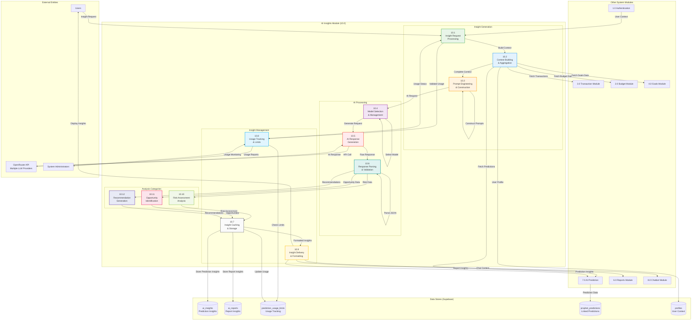

# DFD - AI Insights Module (10.0): BudgetMe Financial Management System

## Overview

The AI Insights Module (Process 10.0) serves as the intelligent analysis layer of the BudgetMe system, transforming raw financial data and Prophet predictions into actionable, personalized insights through Large Language Model (LLM) processing. Implemented in `src/services/database/aiInsightsService.ts` and integrated across prediction and reporting components, this module leverages the OpenRouter API to access multiple AI providers for generating context-aware financial guidance.

### Core Responsibilities

- **Insight Generation**: Transform prediction data and financial context into human-readable insights and recommendations
- **Risk Assessment**: Identify financial risks including overspending patterns, income volatility, and budget stress
- **Opportunity Detection**: Discover savings opportunities, investment potential, and spending optimization areas
- **Recommendation Engine**: Generate personalized, actionable financial advice based on user behavior patterns
- **Report Enhancement**: Augment financial reports (spending, income-expense, savings, trends, goals) with AI-generated analysis
- **Caching & Performance**: Intelligent caching with configurable expiration (30 min for predictions, 7 days for reports)
- **Usage Management**: Subscription-tier based limits (free: 5/month, premium: unlimited)

### Technology Stack

| Component | Technology | Purpose |
|-----------|------------|---------|
| AI Provider | OpenRouter API | Multi-model access gateway |
| Default Model | openai/gpt-oss-120b:free | Cost-efficient insight generation |
| Premium Model | anthropic/claude-3.5-sonnet | Advanced financial analysis |
| Data Storage | Supabase PostgreSQL | Insight caching and usage tracking |
| Service Layer | TypeScript | `aiInsightsService.ts` orchestration |

### Integration Architecture

```
┌─────────────────┐     ┌─────────────────┐     ┌─────────────────┐
│  AI Prediction  │────▶│   AI Insights   │────▶│    Reports      │
│   Module (7.0)  │     │  Module (10.0)  │     │  Module (6.0)   │
└─────────────────┘     └────────┬────────┘     └─────────────────┘
                                 │
                                 ▼
                        ┌─────────────────┐
                        │  OpenRouter API │
                        │  (Multi-Model)  │
                        └─────────────────┘
```

## Database Schema (Actual Supabase Tables)

### Primary Tables
| Table | Description | Key Columns |
|-------|-------------|-------------|
| `ai_insights` | Stores AI-generated insights linked to predictions | id, user_id, prediction_id, insights, ai_service, model_used, confidence_level, generated_at, expires_at |
| `ai_reports` | Stores AI-generated insights for financial reports | id, user_id, report_type, timeframe, insights, recommendations, summary, ai_service, ai_model, generation_time_ms, confidence_level |

### Supporting Tables
| Table | Description |
|-------|-------------|
| `prediction_usage_limits` | Tracks AI insights usage limits per user |
| `prophet_predictions` | Linked predictions that trigger insight generation |

## AI Insights Module Data Flow Diagram



## Process Specifications

### 10.1 Insight Request Processing
**Purpose**: Handle incoming requests for AI-generated financial insights.

**Input Data Flows**:
- Insight generation requests from users
- Prediction context from AI Prediction module
- Report context from Reports module
- User authentication and permissions

**Processing Logic**:
1. Validate user authentication and authorization
2. Check usage limits against subscription level
3. Determine insight type (prediction vs. report)
4. Check for cached valid insights
5. Route to appropriate generation pipeline
6. Track request for analytics

**Output Data Flows**:
- Validated insight requests
- Usage limit status
- Cached insight responses (if available)
- Request routing decisions

**Business Rules**:
- Free users: 5 insight generations per month
- Premium users: Unlimited insight generations
- Rate limit: 1 insight request per minute
- Cached insights valid for 30 minutes (predictions) or 7 days (reports)

### 10.2 Context Building & Aggregation
**Purpose**: Build comprehensive financial context for AI analysis.

**Input Data Flows**:
- User financial profile data
- Transaction history and patterns
- Budget performance metrics
- Goal progress information
- Prediction results from Prophet

**Processing Logic**:
1. Aggregate transaction data by category and time period
2. Calculate spending trends and patterns
3. Assess budget performance and variances
4. Evaluate goal progress and achievement likelihood
5. Include prediction confidence metrics
6. Build user financial profile summary
7. Apply privacy protection and data anonymization

**Output Data Flows**:
- Aggregated financial context
- Spending pattern analysis
- Budget performance summary
- Goal achievement assessment
- Privacy-protected data package

**Business Rules**:
- Context limited to 4000 tokens for optimal AI processing
- Minimum 7 transactions required for meaningful analysis
- Personal identifiable information excluded
- Financial amounts aggregated for privacy

### 10.3 Prompt Engineering & Construction
**Purpose**: Construct optimized prompts for AI insight generation.

**Input Data Flows**:
- Aggregated financial context
- Insight type requirements
- User preferences and history
- System prompt templates

**Processing Logic**:
1. Select appropriate prompt template based on insight type
2. Inject user-specific financial context
3. Customize prompts for specific analysis categories
4. Optimize token usage for cost efficiency
5. Apply prompt best practices for financial advice
6. Include appropriate disclaimers and safety guidelines

**Output Data Flows**:
- Optimized AI prompts
- Token usage estimates
- Prompt metadata for tracking
- Category-specific prompt variations

**Business Rules**:
- Prompts must include financial advice disclaimers
- Maximum prompt length: 2000 tokens
- Separate prompts for each insight category
- Prompts avoid specific investment advice

### 10.4 Model Selection & Management
**Purpose**: Select and manage AI models for optimal insight generation.

**Input Data Flows**:
- Query complexity analysis
- User subscription level
- Model availability status
- Cost optimization parameters

**Processing Logic**:
1. Analyze query complexity and requirements
2. Select appropriate model (default: openai/gpt-oss-120b:free)
3. Validate model availability via OpenRouter
4. Configure model parameters (temperature, max_tokens)
5. Implement fallback model selection
6. Track model performance and costs

**Output Data Flows**:
- Selected model configuration
- API request parameters
- Cost estimates
- Fallback options

**Business Rules**:
- Default model: openai/gpt-oss-120b:free
- Premium model: anthropic/claude-3.5-sonnet
- Automatic fallback on model unavailability
- Cost tracking per user and request

### 10.5 AI Response Generation
**Purpose**: Generate AI responses using OpenRouter API.

**Input Data Flows**:
- Constructed prompts
- Model configuration
- API authentication
- Request parameters

**Processing Logic**:
1. Construct OpenRouter API request
2. Send request with appropriate timeout (30 seconds)
3. Handle streaming responses if applicable
4. Implement retry logic for transient failures
5. Process API response metadata
6. Track generation time and token usage

**Output Data Flows**:
- Raw AI responses
- Token usage statistics
- Generation time metrics
- API response metadata

**Business Rules**:
- 30-second timeout per request
- Maximum 3 retry attempts
- 500 token maximum per response
- Graceful degradation on API failure

### 10.6 Response Parsing & Validation
**Purpose**: Parse and validate AI responses for structured insight extraction.

**Input Data Flows**:
- Raw AI responses
- Expected response format schemas
- Validation rules
- Fallback content templates

**Processing Logic**:
1. Parse JSON-formatted responses
2. Validate response structure and content
3. Extract insight categories (risk, opportunity, recommendations)
4. Validate financial accuracy where applicable
5. Apply content safety filters
6. Generate fallback insights if parsing fails

**Output Data Flows**:
- Parsed insight objects
- Validation status
- Extracted categories
- Fallback insights when needed

**Business Rules**:
- All responses must be valid JSON
- Financial advice must include disclaimers
- Inappropriate content filtered automatically
- Fallback insights provided on parse failure

### 10.7 Insight Caching & Storage
**Purpose**: Cache and store generated insights for performance and retrieval.

**Input Data Flows**:
- Validated insights
- User and request identifiers
- Cache configuration
- Storage parameters

**Processing Logic**:
1. Generate cache keys based on user and parameters
2. Store insights to appropriate Supabase table (ai_insights or ai_reports)
3. Set expiration times (30 min for predictions, 7 days for reports)
4. Link insights to source predictions when applicable
5. Track access counts and last accessed timestamps
6. Implement cache invalidation on data changes

**Output Data Flows**:
- Stored insight records
- Cache confirmation
- Storage metadata
- Access tracking updates

**Business Rules**:
- Prediction insights expire after 30 minutes
- Report insights expire after 7 days
- Cache invalidated by new transaction data
- Maximum 10 cached insights per user

### 10.8 Usage Tracking & Limits
**Purpose**: Track insight generation usage and enforce subscription limits.

**Input Data Flows**:
- Insight generation requests
- User subscription information
- Usage history
- Limit configurations

**Processing Logic**:
1. Query current usage from prediction_usage_limits table
2. Validate against subscription limits
3. Increment usage counters on generation
4. Handle limit exceeded scenarios
5. Reset usage counters on billing cycle
6. Generate usage reports for administrators

**Output Data Flows**:
- Usage validation results
- Remaining request counts
- Limit exceeded notifications
- Usage analytics data

**Business Rules**:
- Usage tracked per calendar month
- Free tier: 5 AI insights per month
- Premium tier: Unlimited insights
- Rate limit: 1 request per minute

### 10.9 Insight Delivery & Formatting
**Purpose**: Format and deliver insights to requesting modules and users.

**Input Data Flows**:
- Cached or generated insights
- Delivery format requirements
- User preferences
- Target module specifications

**Processing Logic**:
1. Format insights for target consumption
2. Apply user-specific formatting preferences
3. Create visualization-ready data structures
4. Include metadata and confidence scores
5. Format for prediction, report, or chatbot consumption
6. Apply responsive formatting for mobile

**Output Data Flows**:
- Formatted insight packages
- Visualization data
- Module-specific formats
- Display-ready content

**Business Rules**:
- Insights include confidence scores
- All amounts formatted to user's currency
- Key insights highlighted for attention
- Mobile-optimized formatting supported

### 10.10 Risk Assessment Analysis
**Purpose**: Generate risk assessments from AI analysis.

**Input Data Flows**:
- Parsed AI responses
- Financial context data
- Risk assessment templates
- Historical risk patterns

**Processing Logic**:
1. Extract risk factors from AI response
2. Categorize risks by severity (low, medium, high)
3. Identify mitigation strategies
4. Assess impact on financial goals
5. Generate risk summary narratives
6. Provide actionable risk mitigation steps

**Output Data Flows**:
- Risk assessment objects
- Severity classifications
- Mitigation recommendations
- Risk impact analysis

**Business Rules**:
- Risk levels: low, medium, high, critical
- High risks trigger immediate attention flags
- Mitigation suggestions always provided
- Risk assessment linked to specific financial areas

### 10.11 Opportunity Identification
**Purpose**: Identify financial opportunities from AI analysis.

**Input Data Flows**:
- Parsed AI responses
- Spending pattern analysis
- Budget performance data
- Goal progress information

**Processing Logic**:
1. Extract opportunity areas from AI response
2. Categorize by financial impact potential
3. Assess feasibility based on user context
4. Prioritize opportunities by ROI
5. Generate actionable opportunity descriptions
6. Link opportunities to specific actions

**Output Data Flows**:
- Opportunity objects
- Priority rankings
- Feasibility assessments
- Action recommendations

**Business Rules**:
- Opportunities ranked by potential impact
- Feasibility assessed against user capacity
- Opportunities linked to specific features
- Time-sensitive opportunities highlighted

### 10.12 Recommendation Generation
**Purpose**: Generate personalized financial recommendations.

**Input Data Flows**:
- AI response recommendations
- User financial profile
- Goal and budget context
- Historical recommendation effectiveness

**Processing Logic**:
1. Extract recommendations from AI response
2. Personalize based on user context
3. Prioritize by impact and feasibility
4. Include specific action steps
5. Track recommendation acceptance rates
6. Learn from user feedback

**Output Data Flows**:
- Personalized recommendations
- Action step details
- Priority rankings
- Tracking data for learning

**Business Rules**:
- Maximum 5 recommendations per insight
- Recommendations include specific actions
- Effectiveness tracked over time
- User feedback incorporated for improvement

## Data Store Specifications (Supabase Schema)

### ai_insights Table
```sql
CREATE TABLE ai_insights (
    id UUID PRIMARY KEY DEFAULT gen_random_uuid(),
    user_id UUID REFERENCES auth.users(id),
    prediction_id UUID REFERENCES prophet_predictions(id),
    ai_service TEXT DEFAULT 'openrouter',
    model_used TEXT DEFAULT 'openai/gpt-oss-120b:free',
    insights JSONB NOT NULL,
    risk_assessment JSONB,
    recommendations JSONB,
    opportunity_areas JSONB,
    confidence_level NUMERIC DEFAULT 0.8,
    generation_time_ms INTEGER,
    cache_key TEXT,
    generated_at TIMESTAMPTZ DEFAULT now(),
    expires_at TIMESTAMPTZ DEFAULT (now() + INTERVAL '30 minutes'),
    access_count INTEGER DEFAULT 0,
    last_accessed_at TIMESTAMPTZ
);
```

### ai_reports Table
```sql
CREATE TABLE ai_reports (
    id UUID PRIMARY KEY DEFAULT gen_random_uuid(),
    user_id UUID REFERENCES auth.users(id),
    report_type TEXT CHECK (report_type IN ('spending', 'income-expense', 'savings', 'trends', 'goals', 'predictions')),
    timeframe TEXT CHECK (timeframe IN ('week', 'month', 'quarter', 'year', 'custom')),
    insights JSONB NOT NULL,
    recommendations JSONB,
    summary TEXT,
    ai_service TEXT DEFAULT 'openrouter',
    ai_model TEXT DEFAULT 'anthropic/claude-3.5-sonnet',
    generation_time_ms INTEGER,
    token_usage JSONB,
    confidence_level NUMERIC DEFAULT 0.8,
    generated_at TIMESTAMPTZ DEFAULT now(),
    expires_at TIMESTAMPTZ DEFAULT (now() + INTERVAL '7 days'),
    access_count INTEGER DEFAULT 0,
    last_accessed_at TIMESTAMPTZ,
    created_at TIMESTAMPTZ DEFAULT now(),
    updated_at TIMESTAMPTZ DEFAULT now()
);
```

### prediction_usage_limits Table
```sql
CREATE TABLE prediction_usage_limits (
    id UUID PRIMARY KEY DEFAULT gen_random_uuid(),
    user_id UUID REFERENCES auth.users(id) UNIQUE,
    monthly_limit INTEGER DEFAULT 5,
    current_usage INTEGER DEFAULT 0,
    last_reset_at TIMESTAMPTZ DEFAULT now(),
    subscription_tier TEXT DEFAULT 'free'
);
```

## Integration Points

### AI Prediction Module Integration
- Receives prediction data for insight generation
- Stores insights linked to prediction_id
- Provides insights to prediction display components
- Shares usage tracking infrastructure

### Reports Module Integration
- Generates insights for financial reports
- Stores report-specific insights in ai_reports
- Provides insights for dashboard widgets
- Supports multiple report types and timeframes

### Chatbot Module Integration
- Provides financial context for chat responses
- Supplies cached insights for conversation context
- Supports real-time insight generation for queries
- Shares user financial profile data

### Authentication Integration
- Validates user permissions for insight access
- Tracks usage by authenticated user
- Enforces subscription-based feature access
- Provides user context for personalization

## Performance Optimization

### Caching Strategy
- 30-minute cache for prediction insights
- 7-day cache for report insights
- Cache invalidation on significant data changes
- Access counting for cache optimization

### Token Optimization
- Context compression for token efficiency
- Prompt engineering for minimal token usage
- Response length limits for cost control
- Batch processing where applicable

### API Optimization
- Connection pooling for OpenRouter
- Retry logic with exponential backoff
- Fallback insights for API failures
- Cost tracking per request

## Security and Privacy

### Data Protection
- Financial data anonymized for AI processing
- No personal identifiers sent to AI providers
- Encrypted storage for cached insights
- Secure API communication with OpenRouter

### Access Control
- User-based insight isolation
- Subscription-based feature gating
- Rate limiting for abuse prevention
- Audit logging for access tracking

### Compliance
- GDPR compliance for data handling
- Financial advice disclaimers included
- Data retention policies enforced
- User consent for AI processing
