# DFD - AI Prediction Module (7.0): BudgetMe Financial Management System

## Overview

The AI Prediction Module (Process 7.0) delivers sophisticated financial forecasting and predictive analytics through a hybrid architecture combining **Facebook Prophet** for time-series forecasting and **LLM-based analysis** for contextual insights. Implemented in `src/components/predictions/` (frontend) and `prediction_api/` (Python Flask backend), this module transforms historical financial data into actionable predictions and personalized recommendations.

### Core Responsibilities

- **Time-Series Forecasting**: Prophet-based predictions for income, expenses, and savings trends (30/90/180/365 day horizons)
- **Spending Predictions**: Category-level spending forecasts with seasonality and trend decomposition
- **Goal Achievement Forecasting**: Probability-based timeline predictions for financial goals
- **AI Insights Generation**: LLM-powered analysis of predictions with risk assessment and opportunity identification
- **Budget Impact Analysis**: Predictive budget utilization and potential overspending alerts
- **Usage Management**: Subscription-tier based usage limits (free: 3/month, premium: unlimited)

### Technology Stack

| Component | Technology | Purpose |
|-----------|------------|---------|
| Forecasting Engine | Facebook Prophet | Time-series predictions with seasonality handling |
| API Backend | Python Flask | Prediction API serving and model management |
| AI Insights | OpenRouter API | LLM-powered analysis and recommendation generation |
| Data Storage | Supabase PostgreSQL | Prediction caching and usage tracking |
| Frontend | React + TypeScript | Interactive prediction visualization |

### Key Database Tables

| Table | Purpose |
|-------|---------|
| `prediction_requests` | User prediction requests with parameters and processing status |
| `prophet_predictions` | Cached Prophet model outputs with accuracy metrics |
| `ai_insights` | AI-generated insights linked to predictions |
| `prediction_usage_limits` | Per-user usage tracking with subscription tier enforcement |

## AI Prediction Module Data Flow Diagram

```mermaid
graph TB
    subgraph "External Entities"
        USER[Users]
        AI_PROVIDERS[OpenRouter API<br/>AI Service Providers]
        ADMIN[System Administrators]
    end
    
    subgraph "AI Prediction Module (7.0)"
        subgraph "Data Preparation"
            COLLECT[7.1<br/>Data Collection<br/>& Aggregation]
            VALIDATE[7.2<br/>Data Validation<br/>& Preprocessing]
            TRANSFORM[7.3<br/>Data Transformation<br/>& Feature Engineering]
        end
        
        subgraph "Prophet Forecasting Engine"
            TRAIN[7.4<br/>Model Training<br/>Process]
            FORECAST[7.5<br/>Prediction Generation<br/>Process]
            VALIDATE_MODEL[7.6<br/>Model Validation<br/>& Accuracy Check]
        end
        
        subgraph "AI Insights Generation"
            CONTEXT[7.7<br/>Context Building<br/>Process]
            INSIGHTS[7.8<br/>AI Insights<br/>Generation]
            INTERPRET[7.9<br/>Result Interpretation<br/>& Formatting]
        end
        
        subgraph "Prediction Management"
            CACHE[7.10<br/>Prediction Caching<br/>& Storage]
            USAGE[7.11<br/>Usage Tracking<br/>& Limits]
            EXPORT[7.12<br/>Export & Sharing<br/>Process]
        end
    end
    
    subgraph "Other System Modules"
        AUTH[1.0 Authentication]
        TRANS[3.0 Transaction Module]
        BUDGET[2.0 Budget Module]
        GOALS[4.0 Goals Module]
        REPORTS[6.0 Reports Module]
        CHATBOT[8.0 Chatbot Module]
    end
    
    subgraph "Data Stores (Supabase)"
        D1[(transactions<br/>accounts)]
        D2[(budgets<br/>budget_alerts)]
        D3[(profiles<br/>user_settings)]
        D4[(prophet_predictions)]
        D5[(prediction_requests)]
        D6[(prediction_usage_limits)]
        D7[(ai_insights<br/>ai_reports)]
    end
    
    %% User Interactions
    USER -->|Prediction Request| COLLECT
    USER -->|Timeframe Selection| COLLECT
    USER -->|Export Request| EXPORT
    AUTH -->|User Context| COLLECT
    
    %% Data Collection Flow
    COLLECT -->|Fetch Transactions| TRANS
    TRANS -->|Transaction Data| D1
    COLLECT -->|Fetch Budget Data| BUDGET
    BUDGET -->|Budget Information| D2
    COLLECT -->|Fetch Goals Data| GOALS
    GOALS -->|Goal Information| COLLECT
    COLLECT -->|User Profile Data| AUTH
    AUTH -->|Profile Info| D3
    
    %% Data Processing Pipeline
    COLLECT -->|Raw Financial Data| VALIDATE
    VALIDATE -->|Data Quality Check| VALIDATE
    VALIDATE -->|Clean Data| TRANSFORM
    TRANSFORM -->|Feature Engineering| TRANSFORM
    TRANSFORM -->|Prophet Format Data| TRAIN
    
    %% Prophet Model Processing
    TRAIN -->|Training Data| D5
    TRAIN -->|Trained Model| FORECAST
    FORECAST -->|Generate Predictions| FORECAST
    FORECAST -->|Prediction Results| VALIDATE_MODEL
    VALIDATE_MODEL -->|Accuracy Metrics| VALIDATE_MODEL
    VALIDATE_MODEL -->|Validated Predictions| CONTEXT
    
    %% AI Insights Generation
    CONTEXT -->|Analysis Context| INSIGHTS
    INSIGHTS -->|AI Analysis Request| AI_PROVIDERS
    AI_PROVIDERS -->|AI Response| INSIGHTS
    INSIGHTS -->|Generated Insights| INTERPRET
    INTERPRET -->|Formatted Insights| D7
    
    %% Prediction Management
    VALIDATE_MODEL -->|Store Predictions| CACHE
    CACHE -->|Cached Data| D4
    COLLECT -->|Track Usage| USAGE
    USAGE -->|Usage Data| D6
    CACHE -->|Prediction Results| USER
    INTERPRET -->|AI Insights| USER
    
    %% Export and Sharing
    EXPORT -->|Export Data| D4
    EXPORT -->|Export Package| USER
    EXPORT -->|Share with Reports| REPORTS
    
    %% Integration with Other Modules
    REPORTS -->|Analytics Request| D4
    CHATBOT -->|Context Request| D4
    CHATBOT -->|Insight Request| D7
    
    %% Administrative Functions
    ADMIN -->|Model Management| TRAIN
    ADMIN -->|Usage Monitoring| USAGE
    USAGE -->|Usage Reports| ADMIN
    
    style COLLECT fill:#e8f5e8,stroke:#4caf50,stroke-width:2px
    style VALIDATE fill:#e3f2fd,stroke:#2196f3,stroke-width:2px
    style TRANSFORM fill:#fff3e0,stroke:#ff9800,stroke-width:2px
    style TRAIN fill:#f3e5f5,stroke:#9c27b0,stroke-width:2px
    style FORECAST fill:#ffebee,stroke:#f44336,stroke-width:2px
    style VALIDATE_MODEL fill:#e0f2f1,stroke:#009688,stroke-width:2px
    style CONTEXT fill:#fafafa,stroke:#757575,stroke-width:2px
    style INSIGHTS fill:#e1f5fe,stroke:#03a9f4,stroke-width:2px
    style INTERPRET fill:#fff8e1,stroke:#ffc107,stroke-width:2px
    style CACHE fill:#f1f8e9,stroke:#8bc34a,stroke-width:2px
    style USAGE fill:#fce4ec,stroke:#e91e63,stroke-width:2px
    style EXPORT fill:#e8eaf6,stroke:#673ab7,stroke-width:2px
```

## Process Specifications

### 7.1 Data Collection & Aggregation Process
**Purpose**: Collect and aggregate all necessary financial data for prediction generation.

**Input Data Flows**:
- Prediction generation requests from users
- Timeframe selection parameters
- User authentication and context
- Data retrieval triggers

**Processing Logic**:
1. Validate user permissions and usage limits
2. Retrieve historical transaction data (minimum 7 days)
3. Collect budget information and allocations
4. Gather goal data and progress metrics
5. Fetch user financial profile and preferences
6. Aggregate data by time periods and categories
7. Ensure sufficient data volume for accurate predictions

**Output Data Flows**:
- Aggregated financial dataset
- Data quality assessment results
- Collection status updates
- Error notifications for insufficient data

**Business Rules**:
- Minimum 7 transactions required for basic predictions
- Optimal performance with 90+ days of data
- Data collection limited by user subscription level
- Real-time data preferred over cached data

### 7.2 Data Validation & Preprocessing Process
**Purpose**: Ensure data quality and prepare data for machine learning algorithms.

**Input Data Flows**:
- Raw aggregated financial data
- Data quality parameters
- Validation rules and thresholds
- User-specific data preferences

**Processing Logic**:
1. Check for data completeness and consistency
2. Identify and handle missing values
3. Detect and manage statistical outliers
4. Validate transaction categorization accuracy
5. Ensure chronological data ordering
6. Flag data quality issues for user review
7. Apply data cleaning and normalization

**Output Data Flows**:
- Validated and cleaned dataset
- Data quality report
- Outlier detection results
- Preprocessing status updates

**Business Rules**:
- Outliers beyond 3 standard deviations flagged for review
- Missing data interpolated using statistical methods
- Data quality score must exceed 70% for predictions
- Invalid transactions excluded from analysis

### 7.3 Data Transformation & Feature Engineering Process
**Purpose**: Transform financial data into format suitable for Prophet forecasting model.

**Input Data Flows**:
- Validated financial data
- Feature engineering parameters
- Seasonality detection settings
- Custom transformation rules

**Processing Logic**:
1. Convert data to Prophet required format (ds, y columns)
2. Create time-series aggregations by category
3. Engineer seasonal features (paydays, holidays)
4. Add external regressors (economic indicators)
5. Generate category-specific datasets
6. Apply logarithmic transformations where appropriate
7. Create training and validation splits

**Output Data Flows**:
- Prophet-formatted datasets
- Feature engineering report
- Seasonality detection results
- Transformed data validation

**Business Rules**:
- Daily aggregation for transaction amounts
- Weekly and monthly seasonality detection
- Holiday effects incorporated for spending categories
- Minimum 30 data points per category for reliable forecasting

### 7.4 Model Training Process
**Purpose**: Train Facebook Prophet models for financial forecasting.

**Input Data Flows**:
- Prophet-formatted training data
- Model configuration parameters
- Seasonality and holiday settings
- Training optimization parameters

**Processing Logic**:
1. Configure Prophet model parameters
2. Set yearly, weekly, and daily seasonality
3. Add holiday effects and economic events
4. Train individual models per spending category
5. Optimize hyperparameters for financial data
6. Validate model convergence and stability
7. Store trained models for prediction generation

**Output Data Flows**:
- Trained Prophet models
- Model training metrics
- Parameter optimization results
- Model validation reports

**Business Rules**:
- Separate models trained for each major spending category
- Model retraining triggered by significant data changes
- Training timeout after 5 minutes to prevent hanging
- Model performance tracked and logged

### 7.5 Prediction Generation Process
**Purpose**: Generate financial forecasts using trained Prophet models.

**Input Data Flows**:
- Trained Prophet models
- Prediction timeframe parameters
- Future period configuration
- Confidence interval settings

**Processing Logic**:
1. Load appropriate trained models
2. Generate future time period dataframe
3. Create predictions with confidence intervals
4. Calculate category-specific forecasts
5. Aggregate individual predictions to total forecast
6. Generate trend and seasonality components
7. Format predictions for user consumption

**Output Data Flows**:
- Financial forecast predictions
- Confidence intervals (80% default)
- Trend and seasonality analysis
- Category-specific predictions

**Business Rules**:
- Predictions generated for 30, 90, 180, and 365-day periods
- 80% confidence intervals provided by default
- Category predictions must sum to total prediction
- Uncertainty increases with longer prediction horizons

### 7.6 Model Validation & Accuracy Check Process
**Purpose**: Validate model accuracy and provide performance metrics.

**Input Data Flows**:
- Generated predictions
- Historical actual data for comparison
- Validation methodology parameters
- Accuracy threshold settings

**Processing Logic**:
1. Perform cross-validation on historical data
2. Calculate accuracy metrics (MAPE, MAE, RMSE)
3. Compare predictions against actual outcomes
4. Assess model performance by category
5. Generate model confidence scores
6. Identify prediction accuracy trends
7. Flag models requiring retraining

**Output Data Flows**:
- Model accuracy reports
- Performance metrics
- Confidence scores
- Retraining recommendations

**Business Rules**:
- MAPE (Mean Absolute Percentage Error) target: <15%
- Model confidence decreases with longer prediction periods
- Accuracy tracking updated with each new prediction
- Models with MAPE >25% flagged for review

### 7.7 Context Building Process
**Purpose**: Build comprehensive context for AI insights generation.

**Input Data Flows**:
- Validated predictions from Prophet
- User financial profile data
- Historical spending patterns
- Goal and budget information

**Processing Logic**:
1. Aggregate prediction results by category
2. Calculate variance from historical patterns
3. Assess goal achievement likelihood
4. Identify spending anomalies and trends
5. Build narrative context for AI analysis
6. Prepare structured data for LLM input
7. Include relevant financial benchmarks

**Output Data Flows**:
- Structured analysis context
- Financial pattern summaries
- Goal achievement assessments
- Anomaly detection results

**Business Rules**:
- Context limited to 4000 tokens for optimal AI processing
- Include only relevant financial data points
- Anonymize sensitive personal information
- Focus on actionable insights and recommendations

### 7.8 AI Insights Generation Process
**Purpose**: Generate intelligent financial insights using large language models.

**Input Data Flows**:
- Structured analysis context
- AI model selection parameters
- Insight generation prompts
- User preference settings

**Processing Logic**:
1. Select appropriate AI model (openai/gpt-oss-20b:free)
2. Construct specialized prompts for each insight type
3. Generate 5 parallel insight categories:
   - Trend analysis insights
   - Category spending insights
   - Risk assessment insights
   - Opportunity identification
   - Goal achievement recommendations
4. Process AI responses and validate JSON format
5. Implement fallback generation for API failures

**Output Data Flows**:
- AI-generated financial insights
- Insight confidence scores
- Processing status updates
- Fallback insights when needed

**Business Rules**:
- Maximum 500 tokens per insight response
- 30-second timeout per AI request
- Fallback to local insights if API unavailable
- Insights must be actionable and personalized

### 7.9 Result Interpretation & Formatting Process
**Purpose**: Format and present prediction results and insights to users.

**Input Data Flows**:
- Raw prediction data from Prophet
- AI-generated insights
- User presentation preferences
- Visualization parameters

**Processing Logic**:
1. Format predictions for frontend consumption
2. Create visualization-ready data structures
3. Combine Prophet predictions with AI insights
4. Generate summary statistics and key metrics
5. Apply user-specific formatting preferences
6. Create export-ready data packages
7. Validate output data integrity

**Output Data Flows**:
- Formatted prediction results
- Visualization data packages
- Summary insights and recommendations
- Export-ready reports

**Business Rules**:
- All financial amounts formatted to user's currency
- Predictions rounded to nearest currency unit
- Confidence intervals clearly labeled
- Key insights highlighted for user attention

### 7.10 Prediction Caching & Storage Process
**Purpose**: Cache prediction results for performance and usage management.

**Input Data Flows**:
- Formatted prediction results
- Cache configuration settings
- Expiration time parameters
- Storage optimization rules

**Processing Logic**:
1. Generate unique cache keys based on user and parameters
2. Compress prediction data for efficient storage
3. Set appropriate expiration times (24-48 hours)
4. Implement cache invalidation rules
5. Handle cache cleanup and maintenance
6. Monitor cache hit rates and performance
7. Provide cached results for repeat requests

**Output Data Flows**:
- Cached prediction data
- Cache performance metrics
- Storage optimization reports
- Quick retrieval for cached results

**Business Rules**:
- Cache expires after 24 hours for daily predictions
- Longer-term predictions cached for 48 hours
- Cache invalidated by new transaction data
- Maximum cache size per user: 10MB

### 7.11 Usage Tracking & Limits Process
**Purpose**: Monitor and control prediction usage based on user subscription levels.

**Input Data Flows**:
- Prediction generation requests
- User subscription information
- Usage limit configurations
- Billing period data

**Processing Logic**:
1. Track prediction requests per user
2. Validate against subscription limits
3. Monitor API usage costs
4. Implement rate limiting and throttling
5. Generate usage analytics and reports
6. Handle limit exceeded scenarios
7. Provide usage status to users

**Output Data Flows**:
- Usage tracking updates
- Limit validation results
- Usage analytics reports
- Billing and cost data

**Business Rules**:
- Free users: 5 predictions per month
- Premium users: Unlimited predictions
- Rate limit: 1 prediction per minute per user
- Usage resets on billing cycle

### 7.12 Export & Sharing Process
**Purpose**: Enable users to export and share prediction results.

**Input Data Flows**:
- Export requests from users
- Cached prediction data
- Export format preferences
- Sharing permission settings

**Processing Logic**:
1. Retrieve prediction data from cache
2. Format data according to export type (PDF, CSV, JSON)
3. Generate shareable reports with visualizations
4. Apply privacy settings and data masking
5. Create secure sharing links
6. Track export usage and downloads
7. Implement export expiration and cleanup

**Output Data Flows**:
- Exported prediction files
- Shareable report links
- Export confirmation notifications
- Download tracking data

**Business Rules**:
- Export data includes predictions and insights
- Shareable links expire after 7 days
- Personal financial details masked in shared reports
- Export limit: 10 exports per month for free users

## Data Store Specifications (Actual Supabase Tables)

### D1 - prediction_requests
| Column | Type | Description |
|--------|------|-------------|
| `id` | UUID PK | Unique request identifier |
| `user_id` | UUID FK | References auth.users(id) |
| `request_type` | TEXT | "spending", "income", "savings", "goal_achievement" |
| `timeframe` | TEXT | "30_days", "90_days", "180_days", "365_days" |
| `parameters` | JSONB | Request parameters (categories, filters) |
| `status` | TEXT | "pending", "processing", "completed", "failed" |
| `processing_time_ms` | INTEGER | Time to process request |
| `error_message` | TEXT | Error details if failed |
| `created_at` | TIMESTAMPTZ | Request timestamp |
| `completed_at` | TIMESTAMPTZ | Completion timestamp |

### D2 - prophet_predictions
| Column | Type | Description |
|--------|------|-------------|
| `id` | UUID PK | Unique prediction identifier |
| `user_id` | UUID FK | References auth.users(id) |
| `request_id` | UUID FK | References prediction_requests(id) |
| `prediction_type` | TEXT | "expense", "income", "savings", "category" |
| `category_id` | UUID FK | References expense_categories(id), optional |
| `forecast_data` | JSONB | Prophet model output (ds, yhat, yhat_lower, yhat_upper) |
| `trend_data` | JSONB | Trend decomposition data |
| `seasonality_data` | JSONB | Seasonality patterns |
| `accuracy_metrics` | JSONB | MAE, MAPE, RMSE scores |
| `confidence_level` | NUMERIC | Overall confidence (0-1) |
| `cache_key` | TEXT | Unique cache identifier |
| `generated_at` | TIMESTAMPTZ | Prediction generation timestamp |
| `expires_at` | TIMESTAMPTZ | Cache expiration (default: 30 minutes) |

### D3 - ai_insights
| Column | Type | Description |
|--------|------|-------------|
| `id` | UUID PK | Unique insight identifier |
| `user_id` | UUID FK | References auth.users(id) |
| `prediction_id` | UUID FK | References prophet_predictions(id) |
| `insights` | JSONB | AI-generated insights array |
| `risk_assessment` | JSONB | Risk factors and severity |
| `opportunities` | JSONB | Identified savings/investment opportunities |
| `recommendations` | JSONB | Actionable recommendations |
| `ai_service` | TEXT | AI provider (default: "openrouter") |
| `model_used` | TEXT | Model identifier |
| `generation_time_ms` | INTEGER | Time to generate insights |
| `confidence_level` | NUMERIC | Insight confidence (0-1) |
| `generated_at` | TIMESTAMPTZ | Insight generation timestamp |
| `expires_at` | TIMESTAMPTZ | Cache expiration timestamp |

### D4 - prediction_usage_limits
| Column | Type | Description |
|--------|------|-------------|
| `id` | UUID PK | Unique record identifier |
| `user_id` | UUID FK UK | References auth.users(id), unique |
| `monthly_limit` | INTEGER | Maximum predictions per month (default: 5) |
| `current_usage` | INTEGER | Current month's usage count |
| `last_reset_at` | TIMESTAMPTZ | Last monthly reset timestamp |
| `subscription_tier` | TEXT | "free", "premium", "enterprise" |

### D5 - transactions (Source Data)
| Column | Type | Description |
|--------|------|-------------|
| `id` | UUID PK | Transaction identifier |
| `user_id` | UUID FK | User reference |
| `amount` | NUMERIC | Transaction amount |
| `transaction_date` | DATE | Transaction date for time-series |
| `expense_category_id` | UUID FK | Category for categorical predictions |
| Used as training data for Prophet models |

### D6 - profiles (User Context)
| Column | Type | Description |
|--------|------|-------------|
| `id` | UUID PK,FK | References auth.users(id) |
| `currency` | TEXT | Preferred currency for predictions |
| `timezone` | TEXT | User timezone for date handling |
| `preferences` | JSONB | Prediction preferences and settings |

### D7 - budgets / goals (Context Data)
| Table | Purpose |
|-------|---------|
| `budgets` | Budget data for spending limit predictions |
| `goals` | Goal data for achievement timeline predictions |
| `accounts` | Account balances for net worth projections |

## Integration Points

### External AI Service Integration
- OpenRouter API for multiple LLM access
- Fallback mechanisms for service unavailability
- Cost optimization and model selection
- Response validation and error handling

### Real-time Data Integration
- Live transaction feed processing
- Budget and goal data synchronization
- User profile updates and preferences
- Cache invalidation triggers

### Frontend Integration
- Interactive prediction visualization
- Real-time loading states and progress
- Error handling and user feedback
- Mobile-optimized prediction displays

## Performance Optimization

### Model Training Optimization
- Efficient Prophet model training algorithms
- Parallel processing for multiple categories
- Model caching and reuse strategies
- Background training for improved response times

### Prediction Caching Strategy
- Intelligent cache key generation
- Compression for large prediction datasets
- Cache warming for frequent users
- Distributed caching for scalability

### API Response Optimization
- Asynchronous AI insight generation
- Streaming responses for large datasets
- Connection pooling for external APIs
- Request batching and optimization

## Security and Privacy

### Data Protection
- Encryption of cached prediction data
- Anonymization for AI processing
- Secure API communication with external services
- Privacy-preserving analytics and reporting

### Access Control
- User-based prediction access isolation
- Subscription-based feature gating
- Rate limiting and abuse prevention
- Audit logging for prediction access

### Compliance
- GDPR compliance for EU users
- Data retention policies for predictions
- User consent for AI processing
- Right to deletion for prediction data