# DFD - Admin Management Module (9.0): BudgetMe Financial Management System

## Overview

The Admin Management Module (Process 9.0) serves as the centralized control center for the BudgetMe Financial Management System, implemented in `src/components/admin/` with supporting database functions in `sql-refactored/08-admin-schema.sql`. This module provides comprehensive system administration, user management, monitoring, and configuration capabilities for BudgetMe administrators.

### Core Responsibilities

- **User Administration**: Complete user lifecycle management including creation, modification, suspension, and deletion of user accounts
- **Role & Permission Control**: Hierarchical role-based access control (RBAC) with support for user, moderator, admin, and super_admin roles
- **System Monitoring**: Real-time health monitoring, performance analytics, and usage statistics across all system modules
- **Security Management**: Security policy enforcement, anomaly detection, and incident response coordination
- **Data Operations**: Backup management, data archival, cleanup procedures, and migration support
- **Configuration Management**: System-wide settings, feature flags, and environment configuration
- **Audit & Compliance**: Comprehensive audit logging, compliance reporting, and regulatory adherence

### Database Functions (Supabase)

The Admin module leverages several PostgreSQL functions:
- `is_admin_user(UUID)` - Validates admin privileges for a user
- `add_admin_user(UUID)` - Grants admin role to a specified user
- `remove_admin_user(UUID)` - Revokes admin role from a user
- `log_admin_activity(...)` - Records administrative actions for audit trail
- `get_admin_setting(TEXT)` / `set_admin_setting(TEXT, JSONB)` - Configuration management
- `manage_user_role(UUID, TEXT)` - Role assignment and modification
- `create_admin_notification(...)` - System notification creation

## Admin Management Module Data Flow Diagram

```mermaid
graph TB
    subgraph "External Entities"
        ADMIN[System Administrators]
        SUPPORT[Support Staff]
        MONITORING[External Monitoring<br/>Services]
        EMAIL[Email Service]
    end
    
    subgraph "Admin Management Module (9.0)"
        subgraph "User Management"
            USER_ADMIN[9.1<br/>User Account<br/>Management]
            ROLE_MGMT[9.2<br/>Role & Permission<br/>Management]
            SUSPENSION[9.3<br/>Account Suspension<br/>& Recovery]
        end
        
        subgraph "System Monitoring"
            HEALTH[9.4<br/>System Health<br/>Monitoring]
            PERFORMANCE[9.5<br/>Performance<br/>Analytics]
            USAGE[9.6<br/>Usage Statistics<br/>& Analytics]
            ALERTS[9.7<br/>Alert<br/>Management]
        end
        
        subgraph "Data Management"
            BACKUP[9.8<br/>Backup<br/>Management]
            CLEANUP[9.9<br/>Data Cleanup<br/>& Archival]
            MIGRATION[9.10<br/>Data Migration<br/>& Import]
        end
        
        subgraph "Configuration"
            CONFIG[9.11<br/>System<br/>Configuration]
            FEATURE[9.12<br/>Feature<br/>Management]
            SECURITY[9.13<br/>Security<br/>Management]
            REPORTS[9.14<br/>Admin<br/>Reporting]
        end
    end
    
    subgraph "All System Modules"
        AUTH[1.0 Authentication]
        BUDGET[2.0 Budget Module]
        TRANS[3.0 Transaction Module]
        GOALS[4.0 Goals Module]
        FAMILY[5.0 Family Module]
        REPORTS_MOD[6.0 Reports Module]
        AI_PREDICT[7.0 AI Prediction]
        CHATBOT[8.0 Chatbot]
    end
    
    subgraph "Data Stores (Supabase)"
        D1[(admin_settings<br/>admin_notifications)]
        D2[(feature_flags)]
        D3[(admin_actions<br/>system_activity_log)]
        D4[(admin_anomalies)]
        D5[(profiles<br/>user_roles)]
        D6[(backup_logs)]
    end
    
    %% Admin Authentication
    ADMIN -->|Admin Login| AUTH
    AUTH -->|Admin Context| USER_ADMIN
    
    %% User Management
    ADMIN -->|User Management Commands| USER_ADMIN
    USER_ADMIN -->|Update User Records| AUTH
    USER_ADMIN -->|Manage Roles| ROLE_MGMT
    ROLE_MGMT -->|Permission Updates| D1
    USER_ADMIN -->|Account Actions| SUSPENSION
    SUSPENSION -->|Account Status Changes| AUTH
    
    %% System Monitoring
    AUTH -->|System Metrics| HEALTH
    BUDGET -->|Module Health| HEALTH
    TRANS -->|Module Health| HEALTH
    GOALS -->|Module Health| HEALTH
    FAMILY -->|Module Health| HEALTH
    REPORTS_MOD -->|Module Health| HEALTH
    AI_PREDICT -->|Module Health| HEALTH
    CHATBOT -->|Module Health| HEALTH
    
    HEALTH -->|Health Data| D4
    PERFORMANCE -->|Performance Metrics| D4
    USAGE -->|Usage Statistics| D5
    ALERTS -->|System Alerts| EMAIL
    ALERTS -->|Alert Notifications| ADMIN
    
    %% Data Management
    ADMIN -->|Backup Commands| BACKUP
    BACKUP -->|System Backups| D6
    CLEANUP -->|Archive Old Data| D3
    MIGRATION -->|Data Migration| D1
    
    %% Configuration Management
    ADMIN -->|Configuration Changes| CONFIG
    CONFIG -->|System Settings| D2
    FEATURE -->|Feature Toggles| D2
    SECURITY -->|Security Policies| D2
    
    %% Admin Reporting
    ADMIN -->|Report Requests| REPORTS
    REPORTS -->|Admin Analytics| D5
    REPORTS -->|System Reports| ADMIN
    
    %% External Monitoring
    MONITORING -->|External Health Checks| HEALTH
    HEALTH -->|System Status| MONITORING
    
    style USER_ADMIN fill:#e8f5e8,stroke:#4caf50,stroke-width:2px
    style HEALTH fill:#e3f2fd,stroke:#2196f3,stroke-width:2px
    style PERFORMANCE fill:#fff3e0,stroke:#ff9800,stroke-width:2px
    style CONFIG fill:#f3e5f5,stroke:#9c27b0,stroke-width:2px
    style BACKUP fill:#e0f2f1,stroke:#009688,stroke-width:2px
    style SECURITY fill:#ffebee,stroke:#f44336,stroke-width:2px
    style REPORTS fill:#e1f5fe,stroke:#03a9f4,stroke-width:2px
    style ALERTS fill:#fff8e1,stroke:#ffc107,stroke-width:2px
```

## Key Processes

### 9.1 User Account Management
- **Purpose**: Manage user accounts, profiles, and account lifecycle
- **Inputs**: User management commands, account creation/modification requests
- **Processing**: Create/update/delete user accounts, manage profile data, handle account issues
- **Outputs**: Account status updates, user profile changes, account management confirmations

### 9.2 Role & Permission Management
- **Purpose**: Manage system roles and user permissions
- **Inputs**: Role definitions, permission assignments, access control updates
- **Processing**: Define roles, assign permissions, update access controls, validate assignments
- **Outputs**: Updated permissions, role assignments, access control enforcement

### 9.3 Account Suspension & Recovery
- **Purpose**: Handle account suspension, deactivation, and recovery processes
- **Inputs**: Suspension requests, recovery requests, violation reports
- **Processing**: Suspend/activate accounts, manage recovery workflows, track violations
- **Outputs**: Account status changes, recovery confirmations, violation logs

### 9.4 System Health Monitoring
- **Purpose**: Monitor overall system health and module performance
- **Inputs**: Module health data, system metrics, performance indicators
- **Processing**: Aggregate health data, detect issues, generate health reports
- **Outputs**: System health status, issue alerts, health dashboards

### 9.5 Performance Analytics
- **Purpose**: Analyze system performance and optimization opportunities
- **Inputs**: Performance metrics, response times, resource utilization data
- **Processing**: Calculate performance metrics, identify bottlenecks, generate optimization recommendations
- **Outputs**: Performance reports, optimization suggestions, resource utilization analysis

### 9.6 Usage Statistics & Analytics
- **Purpose**: Track system usage patterns and user behavior analytics
- **Inputs**: User activity data, feature usage statistics, system utilization metrics
- **Processing**: Aggregate usage data, analyze patterns, generate insights
- **Outputs**: Usage reports, behavior analytics, system utilization summaries

### 9.7 Alert Management
- **Purpose**: Manage system alerts and notification workflows
- **Inputs**: System alerts, threshold configurations, notification preferences
- **Processing**: Process alerts, determine severity, route notifications, track resolution
- **Outputs**: Alert notifications, escalation workflows, resolution tracking

### 9.8 Backup Management
- **Purpose**: Manage system backups and data recovery procedures
- **Inputs**: Backup schedules, backup configurations, recovery requests
- **Processing**: Execute backups, manage backup storage, handle recovery procedures
- **Outputs**: Backup confirmations, recovery results, backup status reports

### 9.9 Data Cleanup & Archival
- **Purpose**: Manage data retention, cleanup, and archival processes
- **Inputs**: Retention policies, cleanup schedules, archival requests
- **Processing**: Identify old data, execute cleanup procedures, archive historical data
- **Outputs**: Cleanup confirmations, archival reports, storage optimization

### 9.10 Data Migration & Import
- **Purpose**: Handle data migration and bulk import operations
- **Inputs**: Migration requests, data import files, migration configurations
- **Processing**: Validate data, execute migrations, handle import procedures
- **Outputs**: Migration results, import confirmations, data validation reports

### 9.11 System Configuration
- **Purpose**: Manage system-wide configuration settings
- **Inputs**: Configuration changes, system parameters, environment settings
- **Processing**: Update configurations, validate settings, apply changes
- **Outputs**: Configuration confirmations, setting updates, system parameter changes

### 9.12 Feature Management
- **Purpose**: Manage feature flags and system capabilities
- **Inputs**: Feature toggle requests, capability configurations, rollout parameters
- **Processing**: Enable/disable features, manage rollouts, track feature usage
- **Outputs**: Feature status updates, rollout confirmations, usage tracking

### 9.13 Security Management
- **Purpose**: Manage system security policies and procedures
- **Inputs**: Security policy updates, threat assessments, security incidents
- **Processing**: Update security policies, handle incidents, manage security configurations
- **Outputs**: Security policy updates, incident reports, security status confirmations

### 9.14 Admin Reporting
- **Purpose**: Generate administrative reports and analytics
- **Inputs**: Report requests, administrative data, analytics parameters
- **Processing**: Aggregate admin data, generate reports, provide analytics
- **Outputs**: Administrative reports, system analytics, compliance documentation

## Data Store Specifications

### D1 - Admin Settings & Notifications (admin_settings, admin_notifications)

**admin_settings**:
| Column | Type | Description |
|--------|------|-------------|
| `id` | UUID PK | Unique setting identifier |
| `setting_key` | TEXT UK | Configuration key name (e.g., "maintenance_mode", "max_users") |
| `setting_value` | JSONB | Configuration value with type-safe structure |
| `category` | TEXT | Setting category (system, security, performance, feature) |
| `created_by` | UUID FK | Administrator who created the setting |
| `updated_at` | TIMESTAMPTZ | Last modification timestamp |

**admin_notifications**:
| Column | Type | Description |
|--------|------|-------------|
| `id` | UUID PK | Unique notification identifier |
| `title` | TEXT | Notification title |
| `message` | TEXT | Notification content |
| `priority` | TEXT | Priority level (low, medium, high, critical) |
| `target_roles` | TEXT[] | Roles that should receive the notification |
| `created_by` | UUID FK | Administrator who created the notification |
| `expires_at` | TIMESTAMPTZ | When the notification should be dismissed |

### D2 - Feature Flags (feature_flags)

| Column | Type | Description |
|--------|------|-------------|
| `id` | UUID PK | Unique flag identifier |
| `flag_name` | TEXT UK | Feature flag name (e.g., "ai_predictions", "family_sharing") |
| `is_enabled` | BOOLEAN | Whether the feature is currently enabled |
| `rollout_percentage` | INTEGER | Percentage of users (0-100) with access to the feature |
| `conditions` | JSONB | Additional conditions for feature access (user roles, regions) |
| `created_by` | UUID FK | Administrator who created the flag |
| `updated_at` | TIMESTAMPTZ | Last modification timestamp |

### D3 - Admin Actions & Activity Log (admin_actions, system_activity_log)

**admin_actions**:
| Column | Type | Description |
|--------|------|-------------|
| `id` | UUID PK | Unique action identifier |
| `admin_id` | UUID FK | Administrator who performed the action |
| `action_type` | TEXT | Type of action (create, update, delete, approve, reject) |
| `target_module` | TEXT | Affected module (authentication, budget, transactions, etc.) |
| `target_id` | UUID | Identifier of the affected record |
| `previous_values` | JSONB | State before the action |
| `new_values` | JSONB | State after the action |
| `success` | BOOLEAN | Whether the action completed successfully |
| `created_at` | TIMESTAMPTZ | Action timestamp |

**system_activity_log**:
| Column | Type | Description |
|--------|------|-------------|
| `id` | UUID PK | Unique log entry identifier |
| `user_id` | UUID FK | User who triggered the activity |
| `activity_type` | TEXT | Classification of activity |
| `activity_description` | TEXT | Human-readable description |
| `ip_address` | INET | Source IP address |
| `user_agent` | TEXT | Browser/client identification |
| `severity` | TEXT | Log level (info, warning, error, critical) |
| `metadata` | JSONB | Additional context data |
| `created_at` | TIMESTAMPTZ | Activity timestamp |

### D4 - Admin Anomalies (admin_anomalies)

| Column | Type | Description |
|--------|------|-------------|
| `id` | UUID PK | Unique anomaly identifier |
| `user_id` | UUID FK | User associated with the anomaly |
| `anomaly_type` | TEXT | Type (spending_spike, income_drop, unusual_pattern, security_threat) |
| `severity` | TEXT | Severity level (low, medium, high, critical) |
| `data_source` | TEXT | Origin of the anomaly detection |
| `details` | JSONB | Detailed anomaly information |
| `resolution_status` | TEXT | Status (open, investigating, resolved, dismissed) |
| `assigned_admin` | UUID FK | Administrator handling the anomaly |
| `created_at` | TIMESTAMPTZ | Detection timestamp |
| `resolved_at` | TIMESTAMPTZ | Resolution timestamp |

### D5 - User Profiles & Roles (profiles, user_roles)

**profiles** (user data for admin management):
- User profile information for administrative oversight
- Account status and verification state
- User preferences and settings

**user_roles**:
| Column | Type | Description |
|--------|------|-------------|
| `id` | UUID PK | Unique role assignment identifier |
| `user_id` | UUID FK | User receiving the role |
| `role` | TEXT | Role name (user, moderator, admin, super_admin) |
| `granted_by` | UUID FK | Administrator who granted the role |
| `granted_at` | TIMESTAMPTZ | When the role was assigned |
| `expires_at` | TIMESTAMPTZ | Role expiration (nullable for permanent) |
| `is_active` | BOOLEAN | Whether the role is currently effective |

### D6 - Backup Logs (backup_logs)

| Column | Type | Description |
|--------|------|-------------|
| `id` | UUID PK | Unique backup identifier |
| `backup_type` | TEXT | Type (full, incremental, differential) |
| `status` | TEXT | Status (pending, running, completed, failed) |
| `backup_size_bytes` | BIGINT | Size of the backup in bytes |
| `backup_location` | TEXT | Storage location/path |
| `checksum` | TEXT | Integrity verification hash |
| `created_by` | UUID FK | Administrator who initiated the backup |
| `started_at` | TIMESTAMPTZ | Backup start time |
| `completed_at` | TIMESTAMPTZ | Backup completion time |
| `error_message` | TEXT | Error details if backup failed |

## Integration Points

- **All System Modules**: Health monitoring and performance tracking
- **Authentication Module**: User management and role administration
- **Database Systems**: Backup, recovery, and data management
- **External Monitoring**: System health and performance monitoring
- **Email Service**: Alert notifications and administrative communications

## Business Rules

- Admin access requires multi-factor authentication
- Critical system changes require approval workflow
- All administrative actions logged for audit
- System backups executed daily with 30-day retention
- Performance alerts triggered for 95th percentile thresholds
- User data retention follows privacy regulations
- Feature rollouts use gradual deployment strategies
- Security incidents require immediate escalation