# DFD - Admin Management Module (9.0): BudgetMe Financial Management System

## Overview
This Data Flow Diagram details the Admin Management Module (Process 9.0) located at `src/components/admin/`. This module provides comprehensive system administration, user management, monitoring, and configuration capabilities for BudgetMe administrators.

## Admin Management Module Data Flow Diagram

```mermaid
graph TB
    subgraph "External Entities"
        ADMIN[System Administrators]
        SUPPORT[Support Staff]
        MONITORING[External Monitoring<br/>Services]
        EMAIL[Email Service]
    end
    
    subgraph "Admin Management Module (9.0)"
        subgraph "User Management"
            USER_ADMIN[9.1<br/>User Account<br/>Management]
            ROLE_MGMT[9.2<br/>Role & Permission<br/>Management]
            SUSPENSION[9.3<br/>Account Suspension<br/>& Recovery]
        end
        
        subgraph "System Monitoring"
            HEALTH[9.4<br/>System Health<br/>Monitoring]
            PERFORMANCE[9.5<br/>Performance<br/>Analytics]
            USAGE[9.6<br/>Usage Statistics<br/>& Analytics]
            ALERTS[9.7<br/>Alert<br/>Management]
        end
        
        subgraph "Data Management"
            BACKUP[9.8<br/>Backup<br/>Management]
            CLEANUP[9.9<br/>Data Cleanup<br/>& Archival]
            MIGRATION[9.10<br/>Data Migration<br/>& Import]
        end
        
        subgraph "Configuration"
            CONFIG[9.11<br/>System<br/>Configuration]
            FEATURE[9.12<br/>Feature<br/>Management]
            SECURITY[9.13<br/>Security<br/>Management]
            REPORTS[9.14<br/>Admin<br/>Reporting]
        end
    end
    
    subgraph "All System Modules"
        AUTH[1.0 Authentication]
        BUDGET[2.0 Budget Module]
        TRANS[3.0 Transaction Module]
        GOALS[4.0 Goals Module]
        FAMILY[5.0 Family Module]
        REPORTS_MOD[6.0 Reports Module]
        AI_PREDICT[7.0 AI Prediction]
        CHATBOT[8.0 Chatbot]
    end
    
    subgraph "Data Stores"
        D1[(D1<br/>Admin Database)]
        D2[(D2<br/>System Config)]
        D3[(D3<br/>Audit Logs)]
        D4[(D4<br/>Performance Metrics)]
        D5[(D5<br/>User Analytics)]
        D6[(D6<br/>System Backups)]
    end
    
    %% Admin Authentication
    ADMIN -->|Admin Login| AUTH
    AUTH -->|Admin Context| USER_ADMIN
    
    %% User Management
    ADMIN -->|User Management Commands| USER_ADMIN
    USER_ADMIN -->|Update User Records| AUTH
    USER_ADMIN -->|Manage Roles| ROLE_MGMT
    ROLE_MGMT -->|Permission Updates| D1
    USER_ADMIN -->|Account Actions| SUSPENSION
    SUSPENSION -->|Account Status Changes| AUTH
    
    %% System Monitoring
    AUTH -->|System Metrics| HEALTH
    BUDGET -->|Module Health| HEALTH
    TRANS -->|Module Health| HEALTH
    GOALS -->|Module Health| HEALTH
    FAMILY -->|Module Health| HEALTH
    REPORTS_MOD -->|Module Health| HEALTH
    AI_PREDICT -->|Module Health| HEALTH
    CHATBOT -->|Module Health| HEALTH
    
    HEALTH -->|Health Data| D4
    PERFORMANCE -->|Performance Metrics| D4
    USAGE -->|Usage Statistics| D5
    ALERTS -->|System Alerts| EMAIL
    ALERTS -->|Alert Notifications| ADMIN
    
    %% Data Management
    ADMIN -->|Backup Commands| BACKUP
    BACKUP -->|System Backups| D6
    CLEANUP -->|Archive Old Data| D3
    MIGRATION -->|Data Migration| D1
    
    %% Configuration Management
    ADMIN -->|Configuration Changes| CONFIG
    CONFIG -->|System Settings| D2
    FEATURE -->|Feature Toggles| D2
    SECURITY -->|Security Policies| D2
    
    %% Admin Reporting
    ADMIN -->|Report Requests| REPORTS
    REPORTS -->|Admin Analytics| D5
    REPORTS -->|System Reports| ADMIN
    
    %% External Monitoring
    MONITORING -->|External Health Checks| HEALTH
    HEALTH -->|System Status| MONITORING
    
    style USER_ADMIN fill:#e8f5e8,stroke:#4caf50,stroke-width:2px
    style HEALTH fill:#e3f2fd,stroke:#2196f3,stroke-width:2px
    style PERFORMANCE fill:#fff3e0,stroke:#ff9800,stroke-width:2px
    style CONFIG fill:#f3e5f5,stroke:#9c27b0,stroke-width:2px
    style BACKUP fill:#e0f2f1,stroke:#009688,stroke-width:2px
    style SECURITY fill:#ffebee,stroke:#f44336,stroke-width:2px
    style REPORTS fill:#e1f5fe,stroke:#03a9f4,stroke-width:2px
    style ALERTS fill:#fff8e1,stroke:#ffc107,stroke-width:2px
```

## Key Processes

### 9.1 User Account Management
- **Purpose**: Manage user accounts, profiles, and account lifecycle
- **Inputs**: User management commands, account creation/modification requests
- **Processing**: Create/update/delete user accounts, manage profile data, handle account issues
- **Outputs**: Account status updates, user profile changes, account management confirmations

### 9.2 Role & Permission Management
- **Purpose**: Manage system roles and user permissions
- **Inputs**: Role definitions, permission assignments, access control updates
- **Processing**: Define roles, assign permissions, update access controls, validate assignments
- **Outputs**: Updated permissions, role assignments, access control enforcement

### 9.3 Account Suspension & Recovery
- **Purpose**: Handle account suspension, deactivation, and recovery processes
- **Inputs**: Suspension requests, recovery requests, violation reports
- **Processing**: Suspend/activate accounts, manage recovery workflows, track violations
- **Outputs**: Account status changes, recovery confirmations, violation logs

### 9.4 System Health Monitoring
- **Purpose**: Monitor overall system health and module performance
- **Inputs**: Module health data, system metrics, performance indicators
- **Processing**: Aggregate health data, detect issues, generate health reports
- **Outputs**: System health status, issue alerts, health dashboards

### 9.5 Performance Analytics
- **Purpose**: Analyze system performance and optimization opportunities
- **Inputs**: Performance metrics, response times, resource utilization data
- **Processing**: Calculate performance metrics, identify bottlenecks, generate optimization recommendations
- **Outputs**: Performance reports, optimization suggestions, resource utilization analysis

### 9.6 Usage Statistics & Analytics
- **Purpose**: Track system usage patterns and user behavior analytics
- **Inputs**: User activity data, feature usage statistics, system utilization metrics
- **Processing**: Aggregate usage data, analyze patterns, generate insights
- **Outputs**: Usage reports, behavior analytics, system utilization summaries

### 9.7 Alert Management
- **Purpose**: Manage system alerts and notification workflows
- **Inputs**: System alerts, threshold configurations, notification preferences
- **Processing**: Process alerts, determine severity, route notifications, track resolution
- **Outputs**: Alert notifications, escalation workflows, resolution tracking

### 9.8 Backup Management
- **Purpose**: Manage system backups and data recovery procedures
- **Inputs**: Backup schedules, backup configurations, recovery requests
- **Processing**: Execute backups, manage backup storage, handle recovery procedures
- **Outputs**: Backup confirmations, recovery results, backup status reports

### 9.9 Data Cleanup & Archival
- **Purpose**: Manage data retention, cleanup, and archival processes
- **Inputs**: Retention policies, cleanup schedules, archival requests
- **Processing**: Identify old data, execute cleanup procedures, archive historical data
- **Outputs**: Cleanup confirmations, archival reports, storage optimization

### 9.10 Data Migration & Import
- **Purpose**: Handle data migration and bulk import operations
- **Inputs**: Migration requests, data import files, migration configurations
- **Processing**: Validate data, execute migrations, handle import procedures
- **Outputs**: Migration results, import confirmations, data validation reports

### 9.11 System Configuration
- **Purpose**: Manage system-wide configuration settings
- **Inputs**: Configuration changes, system parameters, environment settings
- **Processing**: Update configurations, validate settings, apply changes
- **Outputs**: Configuration confirmations, setting updates, system parameter changes

### 9.12 Feature Management
- **Purpose**: Manage feature flags and system capabilities
- **Inputs**: Feature toggle requests, capability configurations, rollout parameters
- **Processing**: Enable/disable features, manage rollouts, track feature usage
- **Outputs**: Feature status updates, rollout confirmations, usage tracking

### 9.13 Security Management
- **Purpose**: Manage system security policies and procedures
- **Inputs**: Security policy updates, threat assessments, security incidents
- **Processing**: Update security policies, handle incidents, manage security configurations
- **Outputs**: Security policy updates, incident reports, security status confirmations

### 9.14 Admin Reporting
- **Purpose**: Generate administrative reports and analytics
- **Inputs**: Report requests, administrative data, analytics parameters
- **Processing**: Aggregate admin data, generate reports, provide analytics
- **Outputs**: Administrative reports, system analytics, compliance documentation

## Data Store Specifications

### D1 - Admin Database
- Administrative user accounts and roles
- System administration logs and history
- Administrative configuration settings
- User management and permission records

### D2 - System Config
- System-wide configuration parameters
- Feature flags and capability settings
- Security policies and procedures
- Environment and deployment settings

### D3 - Audit Logs
- System activity and change logs
- Security event logs and monitoring
- Administrative action tracking
- Compliance and regulatory audit trails

### D4 - Performance Metrics
- System performance measurements
- Module-specific performance data
- Resource utilization statistics
- Performance trend analysis data

### D5 - User Analytics
- User behavior and usage patterns
- System adoption and engagement metrics
- Feature usage statistics
- User satisfaction and feedback data

### D6 - System Backups
- System backup files and archives
- Backup metadata and recovery information
- Backup schedules and execution logs
- Disaster recovery procedures and data

## Integration Points

- **All System Modules**: Health monitoring and performance tracking
- **Authentication Module**: User management and role administration
- **Database Systems**: Backup, recovery, and data management
- **External Monitoring**: System health and performance monitoring
- **Email Service**: Alert notifications and administrative communications

## Business Rules

- Admin access requires multi-factor authentication
- Critical system changes require approval workflow
- All administrative actions logged for audit
- System backups executed daily with 30-day retention
- Performance alerts triggered for 95th percentile thresholds
- User data retention follows privacy regulations
- Feature rollouts use gradual deployment strategies
- Security incidents require immediate escalation