# DFD - Authentication Module (1.0): BudgetMe Financial Management System

## Overview
This Data Flow Diagram details the Authentication Module (Process 1.0) of the BudgetMe system. The Authentication Module is responsible for user registration, login, session management, email verification, password reset, and role-based access control. It serves as the security gateway for all system access.

## Authentication Module Data Flow Diagram

```mermaid
graph TB
    subgraph "External Entities"
        USER[Users]
        EMAIL_SERVICE[Email Service Provider]
        MOBILE[Mobile Devices]
        WEB[Web Browsers]
    end
    
    subgraph "Authentication Module (1.0)"
        subgraph "Registration Process"
            REG[1.1<br/>User Registration<br/>Process]
            VERIFY[1.2<br/>Email Verification<br/>Process]
        end
        
        subgraph "Login Process"
            LOGIN[1.3<br/>User Login<br/>Process]
            SESSION[1.4<br/>Session Management<br/>Process]
        end
        
        subgraph "Security Process"
            RESET[1.5<br/>Password Reset<br/>Process]
            ROLE[1.6<br/>Role Management<br/>Process]
            AUDIT[1.7<br/>Security Audit<br/>Process]
        end
    end
    
    subgraph "Other System Modules"
        BUDGET[2.0 Budget Module]
        TRANS[3.0 Transaction Module]
        GOALS[4.0 Goals Module]
        FAMILY[5.0 Family Module]
        REPORTS[6.0 Reports Module]
        PREDICT[7.0 Prediction Module]
        CHATBOT[8.0 Chatbot Module]
        ADMIN[9.0 Admin Module]
    end
    
    subgraph "Data Stores"
        D1[(D1<br/>User Database)]
        D2[(D2<br/>Session Store)]
        D3[(D3<br/>Security Audit Log)]
        D4[(D4<br/>Email Verification Store)]
    end
    
    %% User Registration Flow
    USER -->|Registration Data| REG
    REG -->|Store User Data| D1
    REG -->|Generate Verification| VERIFY
    VERIFY -->|Store Verification Token| D4
    VERIFY -->|Send Verification Email| EMAIL_SERVICE
    EMAIL_SERVICE -->|Email Delivery Status| VERIFY
    USER -->|Verification Click| VERIFY
    VERIFY -->|Update User Status| D1
    VERIFY -->|Registration Confirmation| USER
    
    %% Login Flow
    USER -->|Login Credentials| LOGIN
    LOGIN -->|Validate Credentials| D1
    LOGIN -->|Create Session| SESSION
    SESSION -->|Store Session Data| D2
    SESSION -->|Return Auth Token| USER
    LOGIN -->|Log Login Event| AUDIT
    AUDIT -->|Store Audit Record| D3
    
    %% Session Management
    USER -->|API Requests with Token| SESSION
    MOBILE -->|Mobile App Requests| SESSION
    WEB -->|Web App Requests| SESSION
    SESSION -->|Validate Session| D2
    SESSION -->|Refresh Token| USER
    SESSION -->|Session Expired| USER
    
    %% Password Reset Flow
    USER -->|Reset Request| RESET
    RESET -->|Validate User| D1
    RESET -->|Generate Reset Token| RESET
    RESET -->|Send Reset Email| EMAIL_SERVICE
    EMAIL_SERVICE -->|Delivery Confirmation| RESET
    USER -->|New Password + Token| RESET
    RESET -->|Update Password| D1
    RESET -->|Log Password Change| AUDIT
    RESET -->|Reset Confirmation| USER
    
    %% Role Management
    ADMIN -->|Role Assignment| ROLE
    ROLE -->|Update User Role| D1
    ROLE -->|Log Role Change| AUDIT
    ROLE -->|Role Updated Notification| USER
    
    %% Inter-module Authentication
    SESSION -->|User Context| BUDGET
    SESSION -->|User Context| TRANS
    SESSION -->|User Context| GOALS
    SESSION -->|User Context| FAMILY
    SESSION -->|User Context| REPORTS
    SESSION -->|User Context| PREDICT
    SESSION -->|User Context| CHATBOT
    SESSION -->|Admin Context| ADMIN
    
    %% Security Notifications
    AUDIT -->|Security Alerts| EMAIL_SERVICE
    AUDIT -->|Suspicious Activity| USER
    
    style REG fill:#e8f5e8,stroke:#4caf50,stroke-width:2px
    style VERIFY fill:#e3f2fd,stroke:#2196f3,stroke-width:2px
    style LOGIN fill:#fff3e0,stroke:#ff9800,stroke-width:2px
    style SESSION fill:#f3e5f5,stroke:#9c27b0,stroke-width:2px
    style RESET fill:#ffebee,stroke:#f44336,stroke-width:2px
    style ROLE fill:#e0f2f1,stroke:#009688,stroke-width:2px
    style AUDIT fill:#fafafa,stroke:#757575,stroke-width:2px
```

## Process Specifications

### 1.1 User Registration Process
**Purpose**: Handle new user account creation with validation and security measures.

**Input Data Flows**:
- Registration form data (email, password, name, preferences)
- Terms of service acceptance
- Privacy policy acknowledgment

**Processing Logic**:
1. Validate email format and uniqueness
2. Enforce password strength requirements
3. Check for prohibited usernames/emails
4. Generate unique user ID
5. Hash password using bcrypt
6. Create user record with pending verification status
7. Trigger email verification process

**Output Data Flows**:
- User record stored in User Database
- Verification token generation
- Registration confirmation to user
- Error messages for validation failures

**Business Rules**:
- Email must be unique across the system
- Password must meet security criteria (8+ chars, mixed case, numbers, symbols)
- User account starts in "pending verification" status
- Registration logs recorded for audit

### 1.2 Email Verification Process
**Purpose**: Verify user email addresses and activate accounts.

**Input Data Flows**:
- Verification token from user click
- Email delivery status from email service
- Resend verification requests

**Processing Logic**:
1. Generate cryptographically secure verification token
2. Set token expiration (24 hours)
3. Compose verification email with secure link
4. Track email delivery status
5. Validate token on user click
6. Update user status to "verified"
7. Handle token expiration and resend logic

**Output Data Flows**:
- Verification email sent via email service
- User account status update
- Verification confirmation page
- Token storage for validation

**Business Rules**:
- Verification tokens expire after 24 hours
- Maximum 3 verification email resends per hour
- Account cannot access full features until verified
- Expired tokens require new verification request

### 1.3 User Login Process
**Purpose**: Authenticate users and validate credentials securely.

**Input Data Flows**:
- Login credentials (email/username and password)
- Device information and user agent
- Two-factor authentication codes (if enabled)

**Processing Logic**:
1. Validate user exists and is active
2. Check account verification status
3. Compare password hash using bcrypt
4. Implement rate limiting for failed attempts
5. Lock account after 5 failed attempts (30-minute lockout)
6. Generate secure session token
7. Record login event for audit

**Output Data Flows**:
- Authentication token (JWT)
- User profile data
- Login success/failure response
- Security audit log entry

**Business Rules**:
- Account locked after 5 consecutive failed login attempts
- Lockout duration: 30 minutes (increases with repeated lockouts)
- Session tokens expire after 24 hours
- Concurrent session limit: 5 active sessions per user

### 1.4 Session Management Process
**Purpose**: Manage user sessions, token validation, and access control.

**Input Data Flows**:
- API requests with authentication tokens
- Session refresh requests
- Logout requests
- Device and browser information

**Processing Logic**:
1. Validate JWT token signature and expiration
2. Check session exists in session store
3. Refresh token if near expiration (< 2 hours remaining)
4. Validate user permissions for requested resource
5. Update session last activity timestamp
6. Handle concurrent session management
7. Process session termination on logout

**Output Data Flows**:
- Session validation results
- Refreshed authentication tokens
- User context for other modules
- Session activity logs

**Business Rules**:
- Sessions automatically expire after 24 hours of inactivity
- Token refresh triggered when < 2 hours remaining
- Maximum 5 concurrent sessions per user
- Session data includes user ID, role, permissions, and device info

### 1.5 Password Reset Process
**Purpose**: Secure password reset functionality with email verification.

**Input Data Flows**:
- Password reset requests (email address)
- Reset tokens from email links
- New password submissions

**Processing Logic**:
1. Validate user exists by email
2. Generate secure reset token (256-bit random)
3. Set token expiration (1 hour)
4. Send reset email with secure link
5. Validate reset token on submission
6. Enforce password strength requirements
7. Update password hash and invalidate all sessions

**Output Data Flows**:
- Password reset email sent
- Password update confirmation
- Session invalidation notifications
- Security audit log entries

**Business Rules**:
- Reset tokens expire after 1 hour
- Only one active reset token per user
- New password cannot match last 5 passwords
- All existing sessions invalidated after password change

### 1.6 Role Management Process
**Purpose**: Manage user roles and permissions within the system.

**Input Data Flows**:
- Role assignment requests from administrators
- Permission modification requests
- Role-based access control queries

**Processing Logic**:
1. Validate administrator privileges for role changes
2. Check role hierarchy and permissions
3. Update user role in database
4. Propagate role changes to active sessions
5. Notify user of role changes via email
6. Log all role modifications for audit

**Output Data Flows**:
- Updated user role information
- Role change notifications
- Permission updates to other modules
- Audit trail entries

**Business Rules**:
- Only administrators can modify user roles
- Role changes take effect immediately
- Users notified of role changes via email
- Complete audit trail maintained for role modifications

### 1.7 Security Audit Process
**Purpose**: Monitor and log all security-related events and activities.

**Input Data Flows**:
- Login/logout events
- Failed authentication attempts
- Password changes and resets
- Role modifications
- Suspicious activity indicators

**Processing Logic**:
1. Capture comprehensive event details
2. Classify events by security risk level
3. Detect patterns indicating potential threats
4. Generate security alerts for high-risk events
5. Maintain detailed audit logs
6. Trigger notifications for critical security events

**Output Data Flows**:
- Security audit log entries
- Real-time security alerts
- Compliance reports
- Threat detection notifications

**Business Rules**:
- All authentication events must be logged
- High-risk events trigger immediate alerts
- Audit logs retained for minimum 1 year
- Automated threat detection and response

## Data Store Specifications

### D1 - User Database
**Structure**:
- User ID (Primary Key)
- Email (Unique)
- Password Hash
- Full Name
- Account Status (pending, verified, suspended)
- Role (user, admin)
- Created Date
- Last Login
- Login Attempts Count
- Account Locked Until
- Password History (last 5 hashes)

**Access Patterns**:
- Read: Authentication, profile retrieval
- Write: Registration, profile updates, password changes
- Update: Status changes, role modifications

### D2 - Session Store
**Structure**:
- Session ID (Primary Key)
- User ID (Foreign Key)
- JWT Token Hash
- Created Date
- Last Activity
- Expires At
- Device Information
- IP Address

**Access Patterns**:
- Read: Session validation, user activity tracking
- Write: Session creation, activity updates
- Delete: Session termination, cleanup

### D3 - Security Audit Log
**Structure**:
- Log ID (Primary Key)
- User ID (Foreign Key, nullable)
- Event Type
- Event Description
- IP Address
- User Agent
- Timestamp
- Risk Level
- Additional Metadata (JSON)

**Access Patterns**:
- Write: All security events
- Read: Audit reports, threat analysis
- Archive: Historical compliance data

### D4 - Email Verification Store
**Structure**:
- Token ID (Primary Key)
- User ID (Foreign Key)
- Token Hash
- Token Type (verification, reset)
- Created Date
- Expires At
- Used At (nullable)
- Email Address

**Access Patterns**:
- Write: Token generation
- Read: Token validation
- Update: Token usage tracking
- Delete: Expired token cleanup

## Security Considerations

### Data Protection
- All passwords hashed using bcrypt with salt rounds ≥ 12
- JWT tokens signed with RS256 algorithm
- Sensitive data encrypted at rest
- PII data handling compliance (GDPR, CCPA)

### Access Control
- Role-based access control (RBAC) implementation
- Principle of least privilege enforced
- Session-based authorization for all API endpoints
- Administrative functions require elevated permissions

### Threat Mitigation
- Rate limiting on authentication endpoints
- Account lockout mechanisms for brute force protection
- CSRF token validation for state-changing operations
- SQL injection prevention through parameterized queries

### Compliance
- Audit logging for all authentication events
- Data retention policies for security logs
- Privacy controls for user data access
- Regular security assessment and penetration testing

## Integration Points

### Email Service Integration
- SMTP/API integration for email delivery
- Template management for verification and notification emails
- Delivery status tracking and retry mechanisms
- Bounce handling and email validation

### Frontend Integration
- RESTful API endpoints for all authentication functions
- WebSocket connections for real-time notifications
- Mobile app compatibility with token-based authentication
- Progressive web app support

### System Module Integration
- Secure context passing to all system modules
- Centralized permission checking service
- Event-driven notifications for security events
- Single sign-on (SSO) capabilities for future integration