# DFD - Budget Management Module (2.0): BudgetMe Financial Management System

## Overview

The Budget Management Module (Process 2.0) is a core financial planning component of the BudgetMe system, implemented in `src/components/budget/` with data persistence through Supabase PostgreSQL. This module provides comprehensive budget lifecycle management from creation to period rollover, with real-time spending analysis and family budget coordination.

### Core Responsibilities

- **Budget Creation**: Define spending limits by category with flexible period configurations (weekly, monthly, quarterly, yearly)
- **Spending Tracking**: Real-time monitoring of expenditures against budget allocations with percentage-based progress
- **Alert Management**: Automated threshold-based notifications (50%, 75%, 90%, 100%) when spending approaches or exceeds limits
- **Category Management**: Organization of budget items using income and expense categories with customizable icons and colors
- **Family Budgets**: Collaborative budget creation and sharing within family groups with permission-based access control
- **Period Rollover**: Automated transition between budget periods with optional carryover of unused allocations
- **Analysis & Insights**: Budget performance analytics integrated with AI prediction module for trend forecasting

### Key Database Tables

| Table | Purpose |
|-------|---------|
| `budgets` | Budget definitions with amounts, periods, and category associations |
| `budget_alerts` | Threshold-based alert configurations and trigger history |
| `income_categories` / `expense_categories` | User and system-defined categorization for budget items |
| `transactions` | Transaction records linked to budget tracking |
| `accounts` | Financial accounts for budget balance calculations |

## Budget Management Module Data Flow Diagram

```mermaid
graph TB
    subgraph "External Entities"
        USER[Users]
        FAMILY_USERS[Family Members]
        EMAIL[Email Service]
    end
    
    subgraph "Budget Management Module (2.0)"
        subgraph "Budget Creation & Setup"
            CREATE[2.1<br/>Budget Creation<br/>Process]
            TEMPLATE[2.2<br/>Budget Template<br/>Process]
            CATEGORY[2.3<br/>Category Management<br/>Process]
        end
        
        subgraph "Budget Monitoring"
            TRACK[2.4<br/>Spending Tracking<br/>Process]
            ALERT[2.5<br/>Budget Alert<br/>Process]
            ANALYSIS[2.6<br/>Budget Analysis<br/>Process]
        end
        
        subgraph "Budget Management"
            EDIT[2.7<br/>Budget Modification<br/>Process]
            SHARE[2.8<br/>Family Budget<br/>Sharing Process]
            ROLLOVER[2.9<br/>Period Rollover<br/>Process]
        end
    end
    
    subgraph "Other System Modules"
        AUTH[1.0 Authentication]
        TRANS[3.0 Transaction Module]
        FAMILY[5.0 Family Module]
        REPORTS[6.0 Reports Module]
        PREDICT[7.0 AI Prediction]
        CHATBOT[8.0 Chatbot]
    end
    
    subgraph "Data Stores (Supabase)"
        D1[(budgets)]
        D2[(income_categories<br/>expense_categories)]
        D3[(transactions)]
        D4[(budget_alerts)]
        D5[(accounts)]
    end
    
    %% Budget Creation Flow
    USER -->|Budget Creation Request| CREATE
    AUTH -->|User Context| CREATE
    CREATE -->|Budget Template Request| TEMPLATE
    TEMPLATE -->|Load Previous Budgets| D1
    TEMPLATE -->|Template Data| CREATE
    CREATE -->|Category Setup| CATEGORY
    CATEGORY -->|Category Rules| D2
    CREATE -->|Store New Budget| D1
    CREATE -->|Budget Created Confirmation| USER
    
    %% Category Management
    USER -->|Category Modification| CATEGORY
    CATEGORY -->|Update Categories| D2
    CATEGORY -->|Category Changes| USER
    
    %% Spending Tracking
    TRANS -->|Transaction Data| TRACK
    TRACK -->|Budget Lookup| D1
    TRACK -->|Category Mapping| D2
    TRACK -->|Update Spending| D1
    TRACK -->|Calculate Remaining| TRACK
    TRACK -->|Spending Update| USER
    
    %% Alert System
    TRACK -->|Spending Thresholds| ALERT
    ALERT -->|Alert Rules| D4
    ALERT -->|Generate Alert| EMAIL
    ALERT -->|Store Alert| D4
    ALERT -->|Budget Warning| USER
    
    %% Budget Analysis
    USER -->|Analysis Request| ANALYSIS
    ANALYSIS -->|Historical Budgets| D1
    ANALYSIS -->|Transaction History| D3
    ANALYSIS -->|Account Balances| D5
    ANALYSIS -->|Analysis Results| USER
    ANALYSIS -->|Provide Insights| REPORTS
    
    %% Budget Modification
    USER -->|Budget Changes| EDIT
    EDIT -->|Validate Changes| D1
    EDIT -->|Update Budget| D1
    EDIT -->|Log Changes| D1
    EDIT -->|Change Notification| USER
    
    %% Family Budget Sharing
    FAMILY_USERS -->|Share Budget Request| SHARE
    FAMILY -->|Family Context| SHARE
    SHARE -->|Access Control| D1
    SHARE -->|Shared Budget Data| FAMILY_USERS
    SHARE -->|Family Notifications| EMAIL
    
    %% Period Rollover
    ROLLOVER -->|Period Check| D1
    ROLLOVER -->|Create New Period| D1
    ROLLOVER -->|Copy Previous Settings| D1
    ROLLOVER -->|Rollover Complete| USER
    
    %% Integration with Other Modules
    PREDICT -->|Budget Predictions| ANALYSIS
    CHATBOT -->|Budget Context| D1
    REPORTS -->|Budget Data| D1
    
    style CREATE fill:#e8f5e8,stroke:#4caf50,stroke-width:2px
    style TEMPLATE fill:#e3f2fd,stroke:#2196f3,stroke-width:2px
    style CATEGORY fill:#fff3e0,stroke:#ff9800,stroke-width:2px
    style TRACK fill:#f3e5f5,stroke:#9c27b0,stroke-width:2px
    style ALERT fill:#ffebee,stroke:#f44336,stroke-width:2px
    style ANALYSIS fill:#e0f2f1,stroke:#009688,stroke-width:2px
    style EDIT fill:#fafafa,stroke:#757575,stroke-width:2px
    style SHARE fill:#e1f5fe,stroke:#03a9f4,stroke-width:2px
    style ROLLOVER fill:#fff8e1,stroke:#ffc107,stroke-width:2px
```

## Process Specifications

### 2.1 Budget Creation Process
**Purpose**: Handle creation of new budgets with category allocation and time period setup.

**Input Data Flows**:
- Budget creation requests from users
- Budget parameters (name, period, total amount)
- Category allocation preferences
- Template selection (optional)

**Processing Logic**:
1. Validate user authentication and permissions
2. Apply budget template if selected
3. Set up category allocations and limits
4. Configure time period (monthly, quarterly, yearly)
5. Set up automatic rollover rules
6. Initialize tracking mechanisms
7. Create budget record with initial state

**Output Data Flows**:
- New budget stored in Budget Database
- Category configurations saved
- Budget creation confirmation to user
- Initial budget dashboard data

**Business Rules**:
- Total category allocations cannot exceed budget total
- Budget period must be valid (future start date)
- Each user can have maximum 10 active budgets
- Budget names must be unique per user

### 2.2 Budget Template Process
**Purpose**: Provide pre-configured budget templates for quick setup.

**Input Data Flows**:
- Template selection requests
- Template customization parameters
- User income and spending pattern data

**Processing Logic**:
1. Load available budget templates
2. Customize template based on user profile
3. Apply percentage-based allocations
4. Suggest category splits based on income
5. Adjust for user spending history
6. Generate personalized template

**Output Data Flows**:
- Customized template data
- Category allocation suggestions
- Template application confirmation
- Template usage analytics

**Business Rules**:
- Templates based on proven budgeting methods (50/30/20, Zero-based, etc.)
- Customization preserves template integrity
- Templates adapt to user income levels
- Popular templates promoted to new users

### 2.3 Category Management Process
**Purpose**: Manage budget categories, subcategories, and allocation rules.

**Input Data Flows**:
- Category creation/modification requests
- Category hierarchy changes
- Allocation rule updates
- Category spending limits

**Processing Logic**:
1. Validate category names and hierarchy
2. Set up parent-child category relationships
3. Configure allocation rules and limits
4. Set up automatic categorization rules
5. Define spending alerts per category
6. Update existing budget allocations

**Output Data Flows**:
- Updated category structure
- Modified allocation rules
- Category change notifications
- Updated budget calculations

**Business Rules**:
- Category names must be unique within user scope
- Subcategory totals cannot exceed parent allocation
- Deleted categories require reallocation of funds
- System categories (Income, Savings) cannot be deleted

### 2.4 Spending Tracking Process
**Purpose**: Real-time tracking of spending against budget allocations.

**Input Data Flows**:
- Transaction data from Transaction Module
- Category assignments from transactions
- Manual spending entries
- Budget adjustment requests

**Processing Logic**:
1. Receive transaction data in real-time
2. Map transactions to budget categories
3. Calculate spending against allocations
4. Update remaining budget amounts
5. Track spending velocity and trends
6. Generate spending projections
7. Identify over/under spending patterns

**Output Data Flows**:
- Updated spending totals per category
- Remaining budget calculations
- Spending trend data
- Over-budget alerts triggers

**Business Rules**:
- Spending updates must be real-time
- Negative balances trigger immediate alerts
- Historical spending preserved for analysis
- Spending velocity calculated daily

### 2.5 Budget Alert Process
**Purpose**: Generate and manage budget-related alerts and notifications.

**Input Data Flows**:
- Spending threshold breaches
- Budget overage situations
- Alert configuration changes
- Time-based alert triggers

**Processing Logic**:
1. Monitor spending against thresholds
2. Detect threshold breaches (50%, 75%, 90%, 100%)
3. Generate appropriate alert messages
4. Schedule alert delivery based on preferences
5. Track alert delivery and acknowledgment
6. Escalate critical budget overages

**Output Data Flows**:
- Budget alert notifications
- Email alerts to users
- Mobile push notifications
- Alert history records

**Business Rules**:
- Alerts triggered at 50%, 75%, 90%, and 100% thresholds
- No more than one alert per category per day
- Critical alerts (>100%) sent immediately
- Users can customize alert preferences

### 2.6 Budget Analysis Process
**Purpose**: Provide detailed analysis and insights on budget performance.

**Input Data Flows**:
- Budget performance requests
- Historical spending data
- Comparative analysis requests
- Trend analysis parameters

**Processing Logic**:
1. Analyze spending patterns vs. budget
2. Calculate variance percentages by category
3. Identify spending trends and anomalies
4. Compare against previous periods
5. Generate performance insights
6. Provide optimization recommendations

**Output Data Flows**:
- Budget performance reports
- Variance analysis results
- Spending trend insights
- Optimization recommendations

**Business Rules**:
- Analysis covers minimum 3 months of data
- Variance calculations use statistical methods
- Recommendations based on successful patterns
- Analysis updated daily with new transactions

### 2.7 Budget Modification Process
**Purpose**: Handle updates and modifications to existing budgets.

**Input Data Flows**:
- Budget modification requests
- Category reallocation requests
- Budget period adjustments
- Emergency budget changes

**Processing Logic**:
1. Validate modification permissions
2. Check impact on existing spending
3. Recalculate category allocations
4. Update spending limits and thresholds
5. Preserve audit trail of changes
6. Notify affected family members

**Output Data Flows**:
- Updated budget configuration
- Recalculated allocations
- Change notifications
- Audit trail records

**Business Rules**:
- Budget modifications require confirmation
- Changes affect only future spending tracking
- Historical data remains unchanged
- Family budgets require approval from primary holder

### 2.8 Family Budget Sharing Process
**Purpose**: Enable family budget sharing and collaborative management.

**Input Data Flows**:
- Family budget sharing requests
- Permission level assignments
- Shared budget contributions
- Family member access requests

**Processing Logic**:
1. Set up family budget permissions
2. Configure viewing and editing rights
3. Enable shared spending tracking
4. Coordinate family member contributions
5. Manage family budget approval workflows
6. Synchronize family spending data

**Output Data Flows**:
- Shared budget access granted
- Family budget dashboards
- Contribution tracking updates
- Family notification messages

**Business Rules**:
- Primary budget holder controls permissions
- Family members can view but not delete budgets
- Shared spending requires category assignment
- Budget sharing requires family group membership

### 2.9 Period Rollover Process
**Purpose**: Automate budget period transitions and rollover handling.

**Input Data Flows**:
- Period end notifications
- Rollover configuration settings
- Unused budget amount handling
- New period start parameters

**Processing Logic**:
1. Detect budget period expiration
2. Calculate final spending totals
3. Handle unused budget amounts (rollover/forfeit)
4. Create new period budget based on rules
5. Archive previous period data
6. Initialize new period tracking

**Output Data Flows**:
- Period closure confirmations
- New period budget creation
- Rollover amount allocations
- Period transition notifications

**Business Rules**:
- Automatic rollover on period end
- Unused amounts can rollover or forfeit based on settings
- Historical periods preserved for 2 years
- New period inherits previous period's structure

## Data Store Specifications (Actual Supabase Tables)

### D1 - budgets
| Column | Type | Description |
|--------|------|-------------|
| `id` | UUID PK | Unique budget identifier |
| `user_id` | UUID FK | References auth.users(id) |
| `name` | TEXT | Budget display name |
| `amount` | NUMERIC | Total budget amount for period |
| `period` | TEXT | "weekly", "monthly", "quarterly", "yearly" |
| `start_date` | DATE | Budget period start date |
| `end_date` | DATE | Budget period end date |
| `category_id` | UUID FK | References expense_categories(id) |
| `spent_amount` | NUMERIC | Current spending against budget |
| `family_id` | UUID FK | References families(id) for shared budgets |
| `rollover_enabled` | BOOLEAN | Whether unused amounts carry forward |
| `is_active` | BOOLEAN | Whether budget is currently active |
| `created_at` | TIMESTAMPTZ | Budget creation timestamp |
| `updated_at` | TIMESTAMPTZ | Last modification timestamp |

### D2 - budget_alerts
| Column | Type | Description |
|--------|------|-------------|
| `id` | UUID PK | Unique alert identifier |
| `budget_id` | UUID FK | References budgets(id) |
| `user_id` | UUID FK | References auth.users(id) |
| `threshold_percentage` | INTEGER | Alert trigger threshold (50, 75, 90, 100) |
| `alert_type` | TEXT | "warning", "danger", "exceeded" |
| `triggered_at` | TIMESTAMPTZ | When alert was triggered |
| `acknowledged_at` | TIMESTAMPTZ | When user dismissed alert |
| `notification_sent` | BOOLEAN | Whether email notification was sent |
| `created_at` | TIMESTAMPTZ | Alert creation timestamp |

### D3 - income_categories
| Column | Type | Description |
|--------|------|-------------|
| `id` | UUID PK | Unique category identifier |
| `user_id` | UUID FK | References auth.users(id), NULL for system |
| `name` | TEXT | Category display name |
| `icon` | TEXT | Icon identifier |
| `color` | TEXT | Hex color code |
| `is_system` | BOOLEAN | Whether system-provided |
| `sort_order` | INTEGER | Display ordering |
| `created_at` | TIMESTAMPTZ | Creation timestamp |

### D4 - expense_categories
| Column | Type | Description |
|--------|------|-------------|
| `id` | UUID PK | Unique category identifier |
| `user_id` | UUID FK | References auth.users(id), NULL for system |
| `name` | TEXT | Category display name |
| `icon` | TEXT | Icon identifier |
| `color` | TEXT | Hex color code |
| `is_system` | BOOLEAN | Whether system-provided |
| `parent_id` | UUID FK | References expense_categories(id) for hierarchy |
| `sort_order` | INTEGER | Display ordering |
| `created_at` | TIMESTAMPTZ | Creation timestamp |

### D5 - transactions (Budget Tracking)
| Column | Type | Description |
| `id` | UUID PK | Transaction identifier |
| `expense_category_id` | UUID FK | Category for budget tracking |
| `amount` | NUMERIC | Transaction amount |
| `transaction_date` | DATE | Date for period matching |
| `budget_id` | UUID FK | References budgets(id) for budget tracking |
| `description` | TEXT | Brief description of transaction |
| `payment_method` | TEXT | Method used for transaction (e.g. credit card, cash) |
| `receipt_available` | BOOLEAN | Whether receipt is available for transaction |
| `created_at` | TIMESTAMPTZ | Transaction creation timestamp |
| `updated_at` | TIMESTAMPTZ | Last modification timestamp |
|--------|------|-------------|
## Integration Points

### Transaction Module Integration
- Real-time transaction feed for spending tracking
- Category mapping and assignment
- Transaction validation against budget rules
- Spending velocity calculations

### Family Module Integration
- Shared budget access control
- Family member permission management
- Collaborative spending tracking
- Family budget notifications

### AI Prediction Integration
- Historical budget data for forecasting
- Spending pattern analysis
- Budget optimization recommendations
- Predictive budget alerts

### Reporting Integration
- Budget performance analytics
- Variance reporting and insights
- Trend analysis and visualization
- Export functionality for budget data

## Security and Privacy

### Access Control
- User-based budget isolation
- Family sharing permission validation
- Role-based modification rights
- Audit trail for all changes

### Data Protection
- Encrypted storage of financial data
- Secure transmission of budget information
- Privacy controls for shared budgets
- Data retention policies for historical budgets

## Performance Considerations

### Real-time Processing
- Efficient spending calculation algorithms
- Cached budget summaries for quick access
- Optimized database queries for large datasets
- Background processing for complex analytics

### Scalability
- Horizontal scaling for high user volumes
- Database partitioning by user and time period
- Caching strategies for frequently accessed data
- Asynchronous processing for non-critical operations