# DFD - Chatbot Module (8.0): BudgetSense AI Assistant

## Overview

The Chatbot Module (Process 8.0) implements the **BudgetSense AI Assistant**, a sophisticated conversational financial advisor built in `src/components/chatbot/`. Powered by multiple Large Language Models (LLMs) through the OpenRouter API, BudgetSense provides personalized financial guidance, spending analysis, budget recommendations, and goal achievement strategies through natural language interaction.

### Core Responsibilities

- **Conversational Interface**: Natural language financial Q&A with context-aware responses
- **Financial Context**: Integration with user transactions, budgets, and goals for personalized advice
- **Multi-Model Support**: Access to multiple LLMs (GPT-4, Claude, Llama) via OpenRouter for optimal responses
- **Session Management**: Persistent conversation history with context building across sessions
- **Usage Tracking**: Token usage monitoring with subscription-tier limits (free/premium)
- **Help Integration**: Feature-specific help and tutorial guidance within chat interface
- **Engagement System**: Proactive tooltips and suggestions to encourage financial wellness

### Key Database Tables

| Table | Purpose |
|-------|---------|
| `chat_sessions` | Conversation session metadata with status and context |
| `chat_messages` | Individual messages with role, content, model used, and token counts |
| `user_chat_preferences` | User preferences for model selection and financial context inclusion |
| `prediction_usage_limits` | Token/request usage tracking with tier-based limits |

### AI Integration

BudgetSense leverages the **OpenRouter API** to access multiple AI models:
- **Primary**: OpenAI GPT-4 for complex financial analysis
- **Fallback**: Claude 3 for nuanced conversation handling
- **Efficient**: Llama 3 for quick responses and cost optimization

## Chatbot Module Data Flow Diagram

```mermaid
graph TB
    subgraph "External Entities"
        USER[Users]
        UNAUTH_USER[Unauthenticated Users]
        AI_PROVIDERS[OpenRouter API<br/>Multiple LLM Providers]
        MOBILE[Mobile Devices]
        WEB[Web Browsers]
    end
    
    subgraph "Chatbot Module (8.0) - BudgetSense"
        subgraph "User Interface Layer"
            FLOAT[8.1<br/>Floating Chatbot<br/>Interface]
            WINDOW[8.2<br/>Chat Window<br/>Management]
            BUBBLE[8.3<br/>Message Bubble<br/>Rendering]
            TOOLTIP[8.4<br/>Engagement Tooltip<br/>System]
        end
        
        subgraph "Conversation Management"
            SESSION[8.5<br/>Conversation Session<br/>Management]
            HISTORY[8.6<br/>Message History<br/>Processing]
            CONTEXT[8.7<br/>Context Building<br/>& Maintenance]
        end
        
        subgraph "AI Processing Engine"
            ROUTING[8.8<br/>Message Routing<br/>& Classification]
            MODEL[8.9<br/>AI Model Selection<br/>& Management]
            GENERATION[8.10<br/>Response Generation<br/>Process]
            VALIDATION[8.11<br/>Response Validation<br/>& Formatting]
        end
        
        subgraph "Financial Intelligence"
            FINANCE[8.12<br/>Financial Context<br/>Integration]
            ADVICE[8.13<br/>Personalized Advice<br/>Generation]
            FEATURES[8.14<br/>Feature Guidance<br/>& Help System]
        end
        
        subgraph "Usage & Security"
            LIMITS[8.15<br/>Usage Limits<br/>& Authentication]
            PRIVACY[8.16<br/>Privacy Protection<br/>& Data Masking]
            ANALYTICS[8.17<br/>Conversation Analytics<br/>& Insights]
        end
    end
    
    subgraph "Other System Modules"
        AUTH[1.0 Authentication]
        BUDGET[2.0 Budget Module]
        TRANS[3.0 Transaction Module]
        GOALS[4.0 Goals Module]
        PREDICT[7.0 AI Prediction]
        REPORTS[6.0 Reports Module]
    end
    
    subgraph "Data Stores (Supabase)"
        D1[(chat_sessions<br/>chat_messages)]
        D2[(transactions<br/>budgets<br/>goals)]
        D3[(user_chat_preferences)]
        D4[(system_activity_log)]
        D5[(profiles<br/>user_settings)]
        D6[(ai_insights<br/>ai_reports)]
    end
    
    %% User Interaction Flows
    USER -->|Chat Messages| FLOAT
    UNAUTH_USER -->|Limited Chat Messages| FLOAT
    MOBILE -->|Mobile Chat Requests| FLOAT
    WEB -->|Web Chat Requests| FLOAT
    
    %% Interface Management
    FLOAT -->|Show/Hide Chat| WINDOW
    FLOAT -->|Tooltip Triggers| TOOLTIP
    WINDOW -->|Message Display| BUBBLE
    WINDOW -->|User Input| SESSION
    TOOLTIP -->|Engagement Prompts| USER
    
    %% Session and Authentication
    SESSION -->|Auth Check| AUTH
    AUTH -->|User Context| LIMITS
    LIMITS -->|Usage Validation| SESSION
    SESSION -->|Store Conversation| HISTORY
    HISTORY -->|Message Storage| D1
    
    %% Context Building
    SESSION -->|Build Context| CONTEXT
    CONTEXT -->|Financial Data Request| FINANCE
    FINANCE -->|Budget Context| BUDGET
    FINANCE -->|Transaction Context| TRANS
    FINANCE -->|Goals Context| GOALS
    FINANCE -->|Prediction Context| PREDICT
    FINANCE -->|Aggregated Context| D2
    CONTEXT -->|Complete Context| ROUTING
    
    %% Message Processing
    ROUTING -->|Classify Message| ROUTING
    ROUTING -->|Route to AI| MODEL
    ROUTING -->|Route to Help| FEATURES
    FEATURES -->|Feature Info| D6
    FEATURES -->|Help Response| BUBBLE
    
    %% AI Model Management
    MODEL -->|Model Selection| D5
    MODEL -->|Generate Request| GENERATION
    GENERATION -->|API Call| AI_PROVIDERS
    AI_PROVIDERS -->|AI Response| GENERATION
    GENERATION -->|Raw Response| VALIDATION
    VALIDATION -->|Validated Response| ADVICE
    
    %% Financial Advice Generation
    ADVICE -->|Personalize Response| FINANCE
    ADVICE -->|Apply Context| D2
    ADVICE -->|Financial Advice| BUBBLE
    ADVICE -->|Store Advice| D1
    
    %% Privacy and Security
    CONTEXT -->|Mask Sensitive Data| PRIVACY
    PRIVACY -->|Protected Context| GENERATION
    VALIDATION -->|Content Filtering| PRIVACY
    
    %% Usage Tracking
    SESSION -->|Track Usage| ANALYTICS
    LIMITS -->|Update Limits| D4
    ANALYTICS -->|Usage Data| D4
    ANALYTICS -->|Conversation Insights| REPORTS
    
    %% Response Delivery
    BUBBLE -->|Formatted Response| USER
    BUBBLE -->|Mobile Response| MOBILE
    BUBBLE -->|Web Response| WEB
    
    style FLOAT fill:#e8f5e8,stroke:#4caf50,stroke-width:2px
    style WINDOW fill:#e3f2fd,stroke:#2196f3,stroke-width:2px
    style BUBBLE fill:#fff3e0,stroke:#ff9800,stroke-width:2px
    style TOOLTIP fill:#f3e5f5,stroke:#9c27b0,stroke-width:2px
    style SESSION fill:#ffebee,stroke:#f44336,stroke-width:2px
    style HISTORY fill:#e0f2f1,stroke:#009688,stroke-width:2px
    style CONTEXT fill:#fafafa,stroke:#757575,stroke-width:2px
    style ROUTING fill:#e1f5fe,stroke:#03a9f4,stroke-width:2px
    style MODEL fill:#fff8e1,stroke:#ffc107,stroke-width:2px
    style GENERATION fill:#f1f8e9,stroke:#8bc34a,stroke-width:2px
    style VALIDATION fill:#fce4ec,stroke:#e91e63,stroke-width:2px
    style FINANCE fill:#e8eaf6,stroke:#673ab7,stroke-width:2px
    style ADVICE fill:#efebe9,stroke:#795548,stroke-width:2px
    style FEATURES fill:#e0f7fa,stroke:#00bcd4,stroke-width:2px
    style LIMITS fill:#fff3e0,stroke:#ff9800,stroke-width:2px
    style PRIVACY fill:#ffebee,stroke:#f44336,stroke-width:2px
    style ANALYTICS fill:#f3e5f5,stroke:#9c27b0,stroke-width:2px
```

## Process Specifications

### 8.1 Floating Chatbot Interface Process
**Purpose**: Manage the always-accessible floating chatbot interface and user engagement.

**Input Data Flows**:
- User chat activation requests
- Mobile and web interface interactions
- Tooltip engagement triggers
- Authentication status updates

**Processing Logic**:
1. Display floating action button for easy access
2. Handle chat window show/hide animations
3. Manage minimize/maximize functionality
4. Trigger engagement tooltips at intervals
5. Handle responsive design for different devices
6. Coordinate with authentication system
7. Manage visual states and accessibility

**Output Data Flows**:
- Chat window visibility controls
- Engagement tooltip displays
- Interface state updates
- Accessibility notifications

**Business Rules**:
- Floating button always visible except on landing page
- Tooltip auto-shows every 7 seconds when chat closed
- Mobile-optimized interface for small screens
- Accessibility compliance with WCAG guidelines

### 8.2 Chat Window Management Process
**Purpose**: Control the main chat interface, message display, and user interactions.

**Input Data Flows**:
- Chat window open/close commands
- Message display requests
- User input submissions
- Conversation state changes

**Processing Logic**:
1. Manage chat window layout and responsiveness
2. Handle message input field and submission
3. Display conversation history with proper formatting
4. Implement auto-scroll for new messages
5. Manage loading states during AI processing
6. Handle error states and retry mechanisms
7. Coordinate with message bubble rendering

**Output Data Flows**:
- Formatted message displays
- User input collection
- Loading state indicators
- Error handling notifications

**Business Rules**:
- Maximum window height: 600px on desktop
- Auto-scroll to newest messages
- Message input limited to 500 characters
- Conversation state preserved during minimization

### 8.3 Message Bubble Rendering Process
**Purpose**: Render individual messages with appropriate formatting and interactive elements.

**Input Data Flows**:
- User and assistant messages
- Message metadata (timestamps, model info)
- Rich content (code, tables, buttons)
- Formatting and styling parameters

**Processing Logic**:
1. Render messages with role-specific styling
2. Format timestamps and metadata display
3. Handle rich content rendering (code blocks, tables)
4. Implement action buttons for special messages
5. Apply syntax highlighting for code content
6. Manage message spacing and alignment
7. Handle message state indicators (delivered, error)

**Output Data Flows**:
- Styled message bubbles
- Interactive content elements
- Action button functionality
- Visual feedback indicators

**Business Rules**:
- User messages aligned right, assistant messages left
- Code blocks with syntax highlighting
- Tables responsive to container width
- Action buttons for specific message types only

### 8.4 Engagement Tooltip System Process
**Purpose**: Manage proactive user engagement through contextual tooltips and hints.

**Input Data Flows**:
- Engagement timing triggers
- User activity monitoring
- Tooltip content configuration
- Hover and interaction states

**Processing Logic**:
1. Monitor user activity and engagement patterns
2. Trigger tooltips at appropriate intervals
3. Display contextual hints and suggestions
4. Handle hover states and user interactions
5. Manage tooltip positioning and visibility
6. Track engagement effectiveness
7. Coordinate with main chat interface

**Output Data Flows**:
- Contextual tooltip displays
- Engagement prompts and hints
- User interaction feedback
- Engagement analytics data

**Business Rules**:
- Tooltips appear every 7 seconds when chat is closed
- Hide on user interaction or hover
- Maximum 5-second display duration
- Contextual content based on user status

### 8.5 Conversation Session Management Process
**Purpose**: Manage chat sessions, authentication, and conversation state.

**Input Data Flows**:
- User authentication status
- Session creation/termination requests
- Message submission events
- Usage limit validations

**Processing Logic**:
1. Initialize conversation sessions for users
2. Validate user authentication and permissions
3. Manage conversation state and continuity
4. Handle session timeouts and cleanup
5. Coordinate with usage limit enforcement
6. Manage conversation history storage
7. Handle cross-device session synchronization

**Output Data Flows**:
- Active session confirmations
- Authentication requirement notifications
- Session state updates
- Usage limit status

**Business Rules**:
- Unauthenticated users limited to 3 messages
- Authenticated users have unlimited access
- Sessions timeout after 30 minutes of inactivity
- Conversation history persists across sessions

### 8.6 Message History Processing Process
**Purpose**: Store, retrieve, and manage conversation message history.

**Input Data Flows**:
- New messages from users and assistant
- Message retrieval requests
- History cleanup commands
- Storage configuration parameters

**Processing Logic**:
1. Store messages with timestamps and metadata
2. Maintain conversation thread continuity
3. Implement message history limits (10 messages)
4. Handle message editing and deletion
5. Provide conversation search capabilities
6. Manage history cleanup and archival
7. Synchronize history across devices

**Output Data Flows**:
- Stored conversation history
- Retrieved message threads
- History cleanup confirmations
- Search results

**Business Rules**:
- Maximum 10 messages stored per conversation
- History cleared on explicit user request
- Messages stored locally in browser
- No server-side message persistence

### 8.7 Context Building & Maintenance Process
**Purpose**: Build and maintain conversational context for coherent AI interactions.

**Input Data Flows**:
- Current conversation history
- User financial data requests
- System feature information
- Previous context states

**Processing Logic**:
1. Aggregate conversation history for context
2. Build financial context from user data
3. Maintain conversation thread coherence
4. Apply context compression for token limits
5. Inject relevant system information
6. Handle context reset and cleanup
7. Optimize context for AI model consumption

**Output Data Flows**:
- Compiled conversation context
- Financial data summaries
- System information integration
- Context optimization results

**Business Rules**:
- Context limited to 4000 tokens for AI processing
- Financial data anonymized for privacy
- System information injected contextually
- Context rebuilt for each AI request

### 8.8 Message Routing & Classification Process
**Purpose**: Classify user messages and route them to appropriate processing systems.

**Input Data Flows**:
- User message content
- Message classification parameters
- Routing rules and patterns
- System feature mapping

**Processing Logic**:
1. Analyze message content and intent
2. Classify message type (question, request, command)
3. Identify financial topics and categories
4. Route to appropriate processing system
5. Determine if AI processing required
6. Handle feature-specific routing
7. Apply message priority and urgency

**Output Data Flows**:
- Classified message types
- Routing decisions
- Processing system assignments
- Priority classifications

**Business Rules**:
- Financial questions routed to AI processing
- Feature questions routed to help system
- General questions routed to AI with context
- Emergency topics receive priority processing

### 8.9 AI Model Selection & Management Process
**Purpose**: Select and manage AI models for optimal response generation.

**Input Data Flows**:
- Model selection criteria
- User subscription level
- Query complexity analysis
- Model performance metrics

**Processing Logic**:
1. Analyze query complexity and requirements
2. Select appropriate AI model for request
3. Validate user access to premium models
4. Manage model configuration and parameters
5. Handle model failover and fallback
6. Track model performance and costs
7. Optimize model selection based on usage

**Output Data Flows**:
- Selected model configurations
- Model access validations
- Performance tracking data
- Cost optimization metrics

**Business Rules**:
- Free users limited to basic models (gpt-oss-20b)
- Authenticated users access premium models
- Model selection based on query complexity
- Automatic fallback for model failures

### 8.10 Response Generation Process
**Purpose**: Generate AI responses using selected language models through OpenRouter API.

**Input Data Flows**:
- Processed user messages
- Selected model configurations
- Conversation context
- Response parameters

**Processing Logic**:
1. Construct API requests with context
2. Send requests to OpenRouter API
3. Handle API responses and errors
4. Implement retry logic for failures
5. Process streaming responses
6. Apply response filtering and validation
7. Handle timeout and error scenarios

**Output Data Flows**:
- Generated AI responses
- API response metadata
- Error handling results
- Performance metrics

**Business Rules**:
- Maximum 500 tokens per response
- 30-second timeout for API requests
- Maximum 3 retry attempts for failures
- Graceful degradation for API unavailability

### 8.11 Response Validation & Formatting Process
**Purpose**: Validate AI responses and format them for user consumption.

**Input Data Flows**:
- Raw AI responses
- Validation rules and patterns
- Formatting configuration
- Content filtering parameters

**Processing Logic**:
1. Validate response format and content
2. Apply content filtering and safety checks
3. Format responses for display
4. Handle special content types (code, tables)
5. Apply markdown and rich text processing
6. Validate financial accuracy where applicable
7. Add response metadata and attributions

**Output Data Flows**:
- Validated and formatted responses
- Content safety confirmations
- Formatting metadata
- Display-ready content

**Business Rules**:
- All responses filtered for inappropriate content
- Financial advice includes appropriate disclaimers
- Code blocks properly formatted with syntax highlighting
- Responses attributed to AI model used

### 8.12 Financial Context Integration Process
**Purpose**: Integrate user financial data to provide personalized conversational context.

**Input Data Flows**:
- User financial data requests
- Budget and transaction summaries
- Goal progress information
- Prediction and insight data

**Processing Logic**:
1. Aggregate user financial data
2. Summarize budget and spending patterns
3. Include goal progress and achievements
4. Integrate prediction insights where relevant
5. Apply privacy protection and data masking
6. Format financial context for AI consumption
7. Cache context for conversation efficiency

**Output Data Flows**:
- Aggregated financial context
- Privacy-protected data summaries
- Contextual financial insights
- Cached context data

**Business Rules**:
- Personal financial data anonymized
- Only relevant financial context included
- Data aggregated to protect privacy
- Context updated with each conversation

### 8.13 Personalized Advice Generation Process
**Purpose**: Generate personalized financial advice based on user context and AI responses.

**Input Data Flows**:
- AI-generated responses
- User financial context
- Personalization parameters
- Advice templates and guidelines

**Processing Logic**:
1. Apply user context to AI responses
2. Personalize advice based on financial situation
3. Include specific recommendations and actions
4. Reference user's actual financial data
5. Provide actionable steps and guidance
6. Include relevant feature recommendations
7. Validate advice for accuracy and safety

**Output Data Flows**:
- Personalized financial advice
- Actionable recommendations
- Feature usage suggestions
- Customized guidance

**Business Rules**:
- Advice based on user's actual financial data
- Recommendations include specific actions
- Financial guidance includes appropriate disclaimers
- Advice promotes responsible financial behavior

### 8.14 Feature Guidance & Help System Process
**Purpose**: Provide guidance and help for BudgetMe features and functionality.

**Input Data Flows**:
- Feature-related questions
- Help content requests
- System functionality queries
- User guidance needs

**Processing Logic**:
1. Identify feature-specific questions
2. Retrieve relevant help content
3. Provide step-by-step guidance
4. Include feature demonstrations
5. Link to relevant system sections
6. Track help effectiveness
7. Update help content based on usage

**Output Data Flows**:
- Feature guidance responses
- Step-by-step instructions
- System navigation help
- Help effectiveness metrics

**Business Rules**:
- Help content updated with system changes
- Guidance includes visual aids where possible
- Responses link to actual system features
- Help tracking for content improvement

### 8.15 Usage Limits & Authentication Process
**Purpose**: Enforce usage limits and authentication requirements for chatbot access.

**Input Data Flows**:
- User authentication status
- Usage tracking data
- Limit configuration parameters
- Subscription level information

**Processing Logic**:
1. Validate user authentication status
2. Track message usage per user
3. Enforce subscription-based limits
4. Handle limit exceeded scenarios
5. Provide upgrade prompts for limits
6. Reset usage counters periodically
7. Handle grace periods and exceptions

**Output Data Flows**:
- Usage validation results
- Limit enforcement actions
- Upgrade prompts and notifications
- Usage tracking updates

**Business Rules**:
- Unauthenticated users: 3 messages maximum
- Authenticated users: unlimited access
- Usage resets daily for free users
- Premium features require authentication

### 8.16 Privacy Protection & Data Masking Process
**Purpose**: Protect user privacy and mask sensitive financial information.

**Input Data Flows**:
- User financial data
- Conversation content
- Privacy configuration settings
- Data sensitivity classifications

**Processing Logic**:
1. Identify sensitive financial information
2. Apply data masking and anonymization
3. Remove personally identifiable information
4. Aggregate data to protect privacy
5. Implement data retention policies
6. Handle data deletion requests
7. Ensure compliance with privacy regulations

**Output Data Flows**:
- Privacy-protected data
- Masked financial information
- Anonymized conversation content
- Compliance confirmations

**Business Rules**:
- No personal financial details stored on servers
- All sensitive data masked before AI processing
- Conversation history stored locally only
- Compliance with GDPR and privacy regulations

### 8.17 Conversation Analytics & Insights Process
**Purpose**: Analyze conversation patterns and generate insights for system improvement.

**Input Data Flows**:
- Conversation interaction data
- Usage patterns and trends
- User satisfaction metrics
- Feature usage statistics

**Processing Logic**:
1. Analyze conversation patterns and topics
2. Track user engagement and satisfaction
3. Identify common questions and issues
4. Generate usage insights and trends
5. Monitor chatbot performance metrics
6. Provide feedback for system improvements
7. Create analytics reports for stakeholders

**Output Data Flows**:
- Conversation analytics reports
- Usage pattern insights
- Performance metrics
- Improvement recommendations

**Business Rules**:
- Analytics aggregated and anonymized
- No personal conversation content in reports
- Insights used for system improvement only
- Analytics comply with privacy regulations

## Data Store Specifications (Actual Supabase Tables)

### D1 - chat_sessions
| Column | Type | Description |
|--------|------|-------------|
| `id` | UUID PK | Unique session identifier |
| `user_id` | UUID FK | References auth.users(id) |
| `session_type` | TEXT | "general", "financial_advice", "help", "prediction" |
| `status` | TEXT | "active", "ended", "expired" |
| `message_count` | INTEGER | Number of messages in session |
| `context` | JSONB | Conversation context and state |
| `started_at` | TIMESTAMPTZ | Session start timestamp |
| `ended_at` | TIMESTAMPTZ | Session end timestamp |
| `last_activity_at` | TIMESTAMPTZ | Last message timestamp |

### D2 - chat_messages
| Column | Type | Description |
|--------|------|-------------|
| `id` | UUID PK | Unique message identifier |
| `session_id` | UUID FK | References chat_sessions(id) |
| `user_id` | UUID FK | References auth.users(id) |
| `role` | TEXT | "user", "assistant", "system" |
| `content` | TEXT | Message content |
| `model_used` | TEXT | AI model identifier (e.g., "openai/gpt-4") |
| `prompt_tokens` | INTEGER | Input tokens consumed |
| `completion_tokens` | INTEGER | Output tokens generated |
| `metadata` | JSONB | Additional message metadata |
| `created_at` | TIMESTAMPTZ | Message timestamp |

### D3 - user_chat_preferences
| Column | Type | Description |
|--------|------|-------------|
| `id` | UUID PK | Unique preference identifier |
| `user_id` | UUID FK UK | References auth.users(id), unique |
| `preferred_model` | TEXT | User's preferred AI model |
| `include_financial_context` | BOOLEAN | Whether to include budget/transaction data |
| `custom_instructions` | TEXT | User-defined system prompt additions |
| `response_style` | TEXT | "concise", "detailed", "friendly" |
| `created_at` | TIMESTAMPTZ | Preference creation timestamp |
| `updated_at` | TIMESTAMPTZ | Last modification timestamp |

### D4 - prediction_usage_limits (Shared with AI Prediction)
| Column | Type | Description |
|--------|------|-------------|
| `id` | UUID PK | Unique record identifier |
| `user_id` | UUID FK UK | References auth.users(id), unique |
| `monthly_limit` | INTEGER | Maximum requests per month (default: 5 free, unlimited premium) |
| `current_usage` | INTEGER | Current month's usage count |
| `last_reset_at` | TIMESTAMPTZ | Last monthly reset timestamp |
| `subscription_tier` | TEXT | "free", "premium", "enterprise" |

### D5 - profiles (User Context)
| Column | Type | Description |
|--------|------|-------------|
| `id` | UUID PK,FK | References auth.users(id) |
| `full_name` | TEXT | User's display name for personalization |
| `currency` | TEXT | Preferred currency for financial context |
| `timezone` | TEXT | User timezone for contextual responses |
| `preferences` | JSONB | Application preferences including chat settings |

### D6 - ai_insights (Feature Help & Insights)
| Column | Type | Description |
|--------|------|-------------|
| `id` | UUID PK | Unique insight identifier |
| `user_id` | UUID FK | References auth.users(id) |
| `prediction_id` | UUID FK | References prophet_predictions(id) |
| `insights` | JSONB | AI-generated insights content |
| `ai_service` | TEXT | Service provider (e.g., "openrouter") |
| `model_used` | TEXT | Model identifier |
| `confidence_level` | NUMERIC | Confidence score (0-1) |
| `generated_at` | TIMESTAMPTZ | Insight generation timestamp |
| `expires_at` | TIMESTAMPTZ | Cache expiration timestamp |

## Integration Points

### Authentication System Integration
- User authentication status validation
- Subscription level and feature access
- Session management and continuity
- Usage tracking and limit enforcement

### Financial Data Integration
- Real-time budget and spending data
- Goal progress and achievement status
- Transaction patterns and insights
- AI prediction results and recommendations

### External AI Service Integration
- OpenRouter API for multiple LLM access
- Model selection and configuration
- Response generation and processing
- Error handling and fallback mechanisms

### Frontend Interface Integration
- Responsive chat interface components
- Mobile and web platform compatibility
- Real-time message updates
- Accessibility and usability features

## Performance Optimization

### Response Time Optimization
- Efficient context building algorithms
- Cached financial data summaries
- Streaming responses for better UX
- Background processing for non-critical tasks

### Memory Management
- Limited conversation history storage
- Context compression for token efficiency
- Garbage collection for expired sessions
- Optimized data structures for messaging

### API Optimization
- Connection pooling for external APIs
- Request batching where appropriate
- Intelligent retry mechanisms
- Cost optimization for AI model usage

## Security and Privacy

### Data Protection
- Local storage only for conversations
- Encryption for sensitive data transmission
- Data masking for AI processing
- Secure API communication

### Access Control
- Authentication-based feature access
- Usage limits and rate limiting
- Content filtering and safety measures
- Audit logging for security events

### Compliance
- GDPR compliance for EU users
- Privacy-by-design implementation
- Data minimization principles
- User consent and control mechanisms