# DFD - Family Management Module (5.0): BudgetMe Financial Management System

## Overview
This Data Flow Diagram details the Family Management Module (Process 5.0) located at `src/components/family/`. This module enables collaborative family financial management with shared budgets, goals, and transaction visibility while maintaining privacy controls and permission management.

## Family Management Module Data Flow Diagram

```mermaid
graph TB
    subgraph "External Entities"
        FAMILY_CREATOR[Family Creator]
        FAMILY_MEMBERS[Family Members]
        INVITED_USERS[Invited Users]
        EMAIL[Email Service]
    end
    
    subgraph "Family Management Module (5.0)"
        subgraph "Family Group Management"
            CREATE_FAM[5.1<br/>Family Group<br/>Creation]
            INVITE[5.2<br/>Member Invitation<br/>Process]
            JOIN[5.3<br/>Family Join<br/>Process]
            PERMISSIONS[5.4<br/>Permission<br/>Management]
        end
        
        subgraph "Collaborative Features"
            SHARED_BUDGET[5.5<br/>Shared Budget<br/>Management]
            SHARED_GOALS[5.6<br/>Shared Goal<br/>Coordination]
            SHARED_TRANS[5.7<br/>Shared Transaction<br/>Visibility]
            COMMUNICATION[5.8<br/>Family<br/>Communication]
        end
        
        subgraph "Family Administration"
            ADMIN[5.9<br/>Family<br/>Administration]
            SETTINGS[5.10<br/>Family Settings<br/>Management]
            PRIVACY[5.11<br/>Privacy<br/>Controls]
            REPORTS[5.12<br/>Family<br/>Reporting]
        end
    end
    
    subgraph "Other Modules"
        AUTH[1.0 Authentication]
        BUDGET[2.0 Budget Module]
        GOALS[4.0 Goals Module]
        TRANS[3.0 Transaction Module]
        REPORTS_MOD[6.0 Reports Module]
    end
    
    subgraph "Data Stores"
        D1[(D1<br/>Family Groups)]
        D2[(D2<br/>Family Members)]
        D3[(D3<br/>Invitations)]
        D4[(D4<br/>Permissions)]
        D5[(D5<br/>Family Settings)]
        D6[(D6<br/>Shared Resources)]
    end
    
    %% Family Creation Flow
    FAMILY_CREATOR -->|Create Family Request| CREATE_FAM
    AUTH -->|User Context| CREATE_FAM
    CREATE_FAM -->|Store Family Group| D1
    CREATE_FAM -->|Set Creator Permissions| D4
    CREATE_FAM -->|Family Created| FAMILY_CREATOR
    
    %% Invitation Process
    FAMILY_CREATOR -->|Send Invitations| INVITE
    INVITE -->|Generate Invite Code| D3
    INVITE -->|Send Invite Email| EMAIL
    EMAIL -->|Deliver Invitation| INVITED_USERS
    INVITED_USERS -->|Accept Invitation| JOIN
    JOIN -->|Validate Invite Code| D3
    JOIN -->|Add Family Member| D2
    JOIN -->|Set Member Permissions| D4
    JOIN -->|Join Confirmation| FAMILY_MEMBERS
    
    %% Permission Management
    FAMILY_CREATOR -->|Manage Permissions| PERMISSIONS
    PERMISSIONS -->|Update Permissions| D4
    PERMISSIONS -->|Apply Access Controls| D1
    PERMISSIONS -->|Permission Changes| FAMILY_MEMBERS
    
    %% Shared Features
    FAMILY_MEMBERS -->|Access Shared Budgets| SHARED_BUDGET
    SHARED_BUDGET -->|Budget Permissions| D4
    SHARED_BUDGET -->|Coordinate with Budget Module| BUDGET
    BUDGET -->|Shared Budget Data| D6
    
    FAMILY_MEMBERS -->|Access Shared Goals| SHARED_GOALS
    SHARED_GOALS -->|Goal Permissions| D4
    SHARED_GOALS -->|Coordinate with Goals Module| GOALS
    GOALS -->|Shared Goal Data| D6
    
    FAMILY_MEMBERS -->|View Shared Transactions| SHARED_TRANS
    SHARED_TRANS -->|Transaction Permissions| D4
    SHARED_TRANS -->|Coordinate with Transaction Module| TRANS
    TRANS -->|Shared Transaction Data| D6
    
    %% Family Administration
    FAMILY_CREATOR -->|Administer Family| ADMIN
    ADMIN -->|Manage Members| D2
    ADMIN -->|Update Settings| D5
    ADMIN -->|Generate Reports| REPORTS
    REPORTS -->|Family Analytics| REPORTS_MOD
    
    %% Privacy Controls
    FAMILY_MEMBERS -->|Set Privacy Preferences| PRIVACY
    PRIVACY -->|Update Privacy Settings| D5
    PRIVACY -->|Apply Data Filters| D6
    
    style CREATE_FAM fill:#e8f5e8,stroke:#4caf50,stroke-width:2px
    style INVITE fill:#e3f2fd,stroke:#2196f3,stroke-width:2px
    style JOIN fill:#fff3e0,stroke:#ff9800,stroke-width:2px
    style PERMISSIONS fill:#f3e5f5,stroke:#9c27b0,stroke-width:2px
    style SHARED_BUDGET fill:#e0f2f1,stroke:#009688,stroke-width:2px
    style SHARED_GOALS fill:#fafafa,stroke:#757575,stroke-width:2px
    style SHARED_TRANS fill:#e1f5fe,stroke:#03a9f4,stroke-width:2px
    style ADMIN fill:#fff8e1,stroke:#ffc107,stroke-width:2px
```

## Key Processes

### 5.1 Family Group Creation
- **Purpose**: Create new family groups for collaborative financial management
- **Inputs**: Family name, description, initial settings, creator information
- **Processing**: Validate family parameters, create group, set creator as admin
- **Outputs**: New family group, admin permissions, creation confirmation

### 5.2 Member Invitation Process
- **Purpose**: Invite users to join family groups
- **Inputs**: Email addresses, invitation messages, permission levels
- **Processing**: Generate invite codes, send email invitations, track delivery
- **Outputs**: Invitation records, email notifications, invite tracking

### 5.3 Family Join Process
- **Purpose**: Handle users joining family groups via invitations
- **Inputs**: Invite codes, user acceptance, profile information
- **Processing**: Validate invitations, add members, set permissions, send confirmations
- **Outputs**: New family memberships, permission assignments, join confirmations

### 5.4 Permission Management
- **Purpose**: Manage family member permissions and access levels
- **Inputs**: Permission updates, role assignments, access control changes
- **Processing**: Validate permissions, update access controls, apply security rules
- **Outputs**: Updated permissions, access control enforcement, change notifications

### 5.5 Shared Budget Management
- **Purpose**: Enable collaborative budget management within families
- **Inputs**: Shared budget requests, contribution allocations, spending permissions
- **Processing**: Create shared budgets, manage contributions, coordinate spending
- **Outputs**: Shared budget access, contribution tracking, spending coordination

### 5.6 Shared Goal Coordination
- **Purpose**: Facilitate family collaboration on shared financial goals
- **Inputs**: Shared goal proposals, contribution commitments, progress tracking
- **Processing**: Create shared goals, coordinate contributions, track family progress
- **Outputs**: Shared goal access, contribution coordination, progress updates

### 5.7 Shared Transaction Visibility
- **Purpose**: Provide controlled visibility into family member transactions
- **Inputs**: Transaction sharing preferences, privacy settings, viewing permissions
- **Processing**: Filter transactions by permissions, apply privacy controls, aggregate data
- **Outputs**: Filtered transaction views, family spending summaries, privacy-compliant data

### 5.8 Family Communication
- **Purpose**: Enable family communication about financial matters
- **Inputs**: Messages, notifications, announcements, discussion topics
- **Processing**: Route communications, manage notifications, moderate content
- **Outputs**: Family messages, notifications, communication logs

### 5.9 Family Administration
- **Purpose**: Administrative functions for family group management
- **Inputs**: Admin commands, member management, group settings
- **Processing**: Execute admin functions, manage memberships, update configurations
- **Outputs**: Admin action results, membership updates, configuration changes

### 5.10 Family Settings Management
- **Purpose**: Manage family-wide settings and preferences
- **Inputs**: Setting updates, preference changes, configuration modifications
- **Processing**: Validate settings, apply configurations, coordinate with modules
- **Outputs**: Updated settings, configuration confirmations, change notifications

### 5.11 Privacy Controls
- **Purpose**: Manage privacy settings and data sharing within families
- **Inputs**: Privacy preferences, sharing controls, visibility settings
- **Processing**: Apply privacy filters, enforce sharing rules, protect sensitive data
- **Outputs**: Privacy-compliant data access, controlled sharing, protection confirmations

### 5.12 Family Reporting
- **Purpose**: Generate family-wide financial reports and analytics
- **Inputs**: Report requests, data aggregation parameters, privacy filters
- **Processing**: Aggregate family data, apply privacy controls, generate insights
- **Outputs**: Family reports, aggregated analytics, privacy-compliant summaries

## Data Store Specifications

### D1 - Family Groups
- Family group records and metadata
- Group settings and configurations
- Administrative information
- Group status and activity tracking

### D2 - Family Members
- Member profile information
- Membership status and roles
- Join dates and activity history
- Member preferences and settings

### D3 - Invitations
- Invitation records and codes
- Invitation status and expiration
- Delivery tracking and responses
- Invitation history and analytics

### D4 - Permissions
- Role-based permission definitions
- Member access levels
- Feature-specific permissions
- Permission change history

### D5 - Family Settings
- Family-wide configuration settings
- Privacy and sharing preferences
- Communication settings
- Notification preferences

### D6 - Shared Resources
- Shared budget data
- Shared goal information
- Shared transaction summaries
- Collaborative planning data

## Integration Points

- **Budget Module**: Shared budget creation and management
- **Goals Module**: Family goal coordination and tracking
- **Transaction Module**: Shared transaction visibility and categorization
- **Reports Module**: Family financial reporting and analytics
- **Authentication**: Family member authentication and role validation
- **Email Service**: Invitation delivery and family notifications

## Business Rules

- Maximum 8 members per family group
- Family creator has permanent admin privileges
- Invitation codes expire after 7 days
- Shared budgets require approval from family admin
- Privacy settings override family sharing preferences
- Family members can leave groups voluntarily (except creator)
- Shared resources require minimum 2 active members